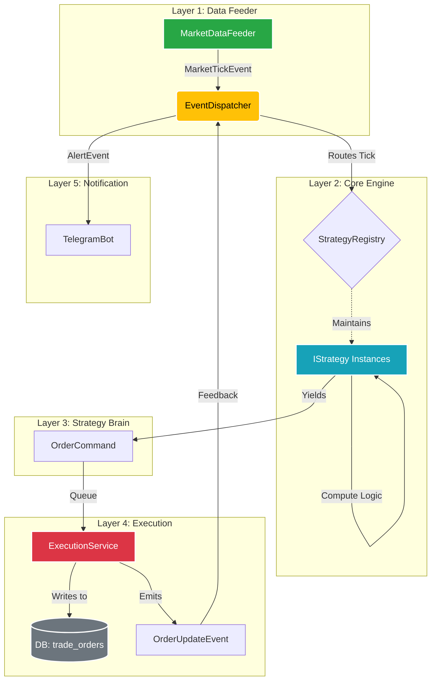

# PM Trader Agent

> **Agent 快速定向（必读）**: 当前主线是**天气温度策略**，不是下方的 PMM/ARB 框架。
> 天气策略代码: `weather_dashboard/`（FastAPI + SQLite 后端）+ `frontend/strategy_dashboard/`（React 前端）。
> 启动看板: `scripts/weather_dashboard/run_stack.sh`。详见 `CLAUDE.md`。

---

一个面向 Polymarket 的量化交易研究仓库，当前聚焦三条业务线：

- `src/strategies/pmm/`: Personal Market Maker（做市策略、回测、实盘/仿真引擎）
- `src/strategies/arb/`: YES/NO 价差套利机器人骨架
- `src/strategies/rule_lawyer/`: 研究筛选流水线（Gamma/CLOB 同步、LLM 规则解析、候选评分）

旧版 `agents/` 框架已移除，仓库现在以策略研究和回测工程为核心。

## 目录结构

```text
.
├── src/
│   ├── platform/              # 公共基础设施（clients/storage）
│   ├── interfaces/
│   │   ├── cli/               # 对外命令入口（预留）
│   │   └── web/               # 对外 Web 入口（统一策略看板 BFF）
│   ├── strategies/            # 策略实现 + 全局策略目录（manifest + runbook + params）
│   └── workflows/
│       ├── backtest/          # 回测跨域编排（预留）
│       ├── pap/               # PAP 跨域编排（预留）
│       └── research/          # Research 跨域编排（规则审计 / 市场情报 / 综合分析）
├── scripts/python/
│   ├── pmm_backtest.py        # 回测总入口
│   ├── strategy_catalog.py    # 策略目录管理入口
│   ├── generate_backtest_scenarios.py
│   ├── pmm_orderbook_capture.py
│   └── pmm_find_smart_wallets.py
├── scripts/ops/
│   ├── polymarket_profile_audit.py
│   ├── polymarket_market_rule_audit.py
│   ├── polymarket_market_comments.py
│   ├── polymarket_market_intel.py
│   └── rule_lawyer_market_analysis.py
├── skills/                    # AI 入口包装层，不承载核心业务实现
│   ├── polymarket-profile-audit/
│   ├── polymarket-market-rule-audit/
│   ├── polymarket-market-intel/
│   └── polymarket-research-orchestrator/
├── tests/pmm_tests/           # PMM 单元测试
├── tests/research_tests/      # research 单元测试
└── .env.example
```

## 统一架构全景图 (Unified Engine Architecture)

新版核心系统基于 `asyncio` 事件驱动架构，分为五层。所有策略只需实现 `IStrategy` 接口，剩下的全部交由引擎流转：



## 快速开始

### 1) 安装

```bash
python3 -m venv .venv
source .venv/bin/activate
pip install -r requirements.txt
```

### 2) 环境变量

```bash
cp .env.example .env
```

运行实例主库使用 `STRATEGY_RUNTIME_DB_PATH`（默认 `runtime/strategy_runtime.db`）。
`PMM_INSTANCE_DB_PATH` 仅保留兼容读取，已弃用（deprecated）。
Research 主库默认 `RESEARCH_DB_PATH=runtime/db/research.db`（兼容旧 `research.db` 自动迁移/回退）。

### 3) PMM 回测

```bash
# 生成场景
python scripts/python/pmm_backtest.py generate \
  --catalog src/strategies/pmm/backtest/case_catalog.json \
  --out-dir src/strategies/pmm/backtest/scenarios

# 跑全部场景
python scripts/python/pmm_backtest.py run-all \
  --scenarios-dir src/strategies/pmm/backtest/scenarios \
  --out-dir src/strategies/pmm/backtest/.artifacts/results_all

# 结果绘图
python scripts/python/pmm_backtest.py plot-all \
  --results-dir src/strategies/pmm/backtest/.artifacts/results_all
```

### 4) PMM 实时采集（生成可复用回测数据）

```bash
python scripts/python/pmm_orderbook_capture.py capture \
  --tokens "YES_TOKEN_ID,NO_TOKEN_ID" \
  --duration 120 \
  --out-scenario src/strategies/pmm/backtest/.artifacts/recorded/live_sample.json
```

### 5) PM_ARB 本地仿真

```bash
export PM_ARB_MARKET_DATA_SOURCE=mock
export PM_ARB_MOCK_SCENARIO=toggle
export PM_ARB_DRY_RUN=1
python -m src.strategies.arb.main
```

### 6) PM Research 运行

```bash
# 初始化研究库
python -m src.strategies.rule_lawyer.cli init-db

# 拉取 Gamma 市场/事件
python -m src.strategies.rule_lawyer.cli sync --active true --pages 3 --page-size 100

# 拉取价格与订单簿
python -m src.strategies.rule_lawyer.cli enrich --limit 300 --top-n 20

# 规则解析（需配置 LLM_*）
python -m src.strategies.rule_lawyer.cli parse --llm --batch 100

# Telegram 通知测试（需配置 TELEGRAM_BOT_TOKEN/TELEGRAM_CHAT_ID）
python -m src.strategies.rule_lawyer.cli notify-telegram "Hello from pm_agent"
```

### 7.5) Telegram Research Bot（独立 bot）

```bash
export TG_RESEARCH_BOT_TOKEN="..."
export TG_RESEARCH_ALLOWED_CHAT_IDS="5589339017"

python scripts/ops/telegram_research_bot.py
```

支持：

- `/full <url|slug|condition_id>`：直接返回本地完整研究摘要
- `/prompt <url|slug|condition_id>`：返回可手动粘贴给 ChatGPT 客户端的 handoff prompt
- 直接发送一个 Polymarket 链接：按 `TG_RESEARCH_DEFAULT_MODE` 处理（默认 `full`）

### 7) Polymarket 研究分析入口

```bash
# 账户历史审计
python scripts/ops/polymarket_profile_audit.py --target @cqk

# 市场规则审计
python scripts/ops/polymarket_market_rule_audit.py \
  --target-market "https://polymarket.com/event/..."

# 市场情报（评论 + holders + smart wallets）
python scripts/ops/polymarket_market_intel.py \
  --target-market "https://polymarket.com/event/..."

# 完整分析（规则门控 + 市场情报）
python scripts/ops/rule_lawyer_market_analysis.py \
  --target-market "https://polymarket.com/event/..."
```

### 8) 统一策略看板（BFF）

```bash
PYTHONPATH=. .venv/bin/python -m src.interfaces.web.strategy_dashboard_server \
  --host 127.0.0.1 \
  --port 8011 \
  --artifacts-dir src/strategies/pmm/backtest/.artifacts \
  --runtime-dir runtime
```

健康检查：`http://127.0.0.1:8011/api/v1/health`

## 测试

```bash
pytest tests/pmm_tests -q
pytest tests/research_tests -q
```

## 文档

- PMM 文档导航：`docs/pmm/README.md`
- 策略目录（全局）：`src/strategies/README.md`
- Polymarket Research 架构：`docs/POLYMARKET_RESEARCH_ARCHITECTURE.md`
- Polymarket Research 能力说明：`docs/POLYMARKET_RESEARCH_CAPABILITIES.md`
- Polymarket Research 实施计划：`docs/POLYMARKET_RESEARCH_IMPLEMENTATION_PLAN.md`
- Polymarket Research 改造记录：`docs/POLYMARKET_RESEARCH_REFACTOR_LOG.md`
- 统一运维手册：`docs/OPS_RUNBOOK.md`
- Weather Edge 执行架构：`docs/WEATHER_EXECUTION_ARCHITECTURE.md`
- PMM paper 运维手册：`docs/pmm/PAPER_RUNBOOK.md`
- 架构说明：`docs/pmm/ARCHITECTURE.md`
- 回测方法：`docs/pmm/BACKTEST_SCENARIO_METHOD.md`
- RESEARCH 整合说明：`docs/RESEARCH_INTEGRATION.md`
- RESEARCH 原文档：`docs/research/RESEARCH_README.md`
- 统一策略看板计划：`docs/STRATEGY_DASHBOARD_PLAN.md`

## License

MIT (`LICENSE.md`)
