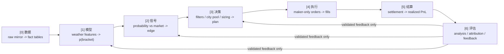

# 天气策略主线骨架

Status: design-draft
Updated: 2026-06-09 Phase 2 spine pass
Source of truth: no
Superseded by / Used by: WEATHER_DOCS_INDEX.md; WEATHER_STRATEGY_QUANT_DESIGN.md; WEATHER_DATA_CANONICAL_SOURCES.md; WEATHER_SYSTEM_CONTRACT.md

本文定义天气策略项目的主线分层，用来约束文档、脚本、数据和分析结论的归属。它不是替代 `WEATHER_STRATEGY_QUANT_DESIGN.md` 的量化血缘链，而是把原有工程血缘链映射到更高层的策略生命周期，避免评估层继续按日期和一次性脚本发散。

## 一句话主线

一条天气交易决策的生命周期：



治理重点是 `[6] 评估层`。`[0]-[5]` 已经有相对清晰的工程血缘；混乱主要来自日期快照、一次性脚本、实验 JSON 和后验结论平铺在同一目录里。

## 与量化血缘链的关系

`WEATHER_STRATEGY_QUANT_DESIGN.md` 里的核心血缘链仍然有效：

```text
MarketData -> Signal -> TradePlan -> Order -> Fill -> Position -> Settlement
```

本文的 `[0]-[6]` 是业务生命周期视图；原血缘链是工程落库和可追溯视图。二者对应关系如下：

| 主线层 | 工程血缘锚点 | 当前真相源 / 参考 |
|---|---|---|
| `[0] 数据` | MarketData, dashboard ingest, fact tables | `WEATHER_DATA_CANONICAL_SOURCES.md`, `WEATHER_DATA_PIPELINE.md`, `fact_trades`, `fact_signal_candidates` |
| `[1] 模型` | model output fields on Signal | `WEATHER_PROBABILITY_MODEL_REVIEW.md`, `WEATHER_EDGE_ENGINE_CURRENT_STATE_2026-06-06.md`, `analysis/model_vs_market.md` |
| `[2] 信号` | Signal / candidate opportunity | `fact_signal_candidates`, `WEATHER_SIGNAL_CANDIDATES_DESIGN.md` |
| `[3] 决策` | TradePlan / strategy config | `WEATHER_STRATEGY_ENTRYPOINT.md`, `WEATHER_CITY_POOL_DECISIONS.md`, strategy instance configs |
| `[4] 执行` | Order / Fill | N100 `pm_agent` live JSONL, `orders`, `fills`, CLOB recovery scripts |
| `[5] 结算` | Settlement / realized PnL | `settlements`, `pnl_usd_at_fill`, `weather_clob_fill_coverage_gate.py` |
| `[6] 评估` | Run Registry / Metrics / research docs | `docs/analysis/*.md` living docs, `WEATHER_ANALYSIS_CONTRACT.md` |

约束：任何新分析不能绕开这条血缘自造口径。填成交质量、漏单、滑点、反事实时优先用 `fact_signal_candidates`；填 realized PnL 时优先用 `fact_trades`；发布 `live_real` 前必须通过 CLOB coverage gate。

## 七层边界

### [0] 数据层

职责：把 N100 raw 行情、天气、live lineage 同步并重建为本机 `runtime/weather.db` 的事实表。

真相源：N100 `weather-predict` 的行情/天气/paper/settlement cache，加 N100 `pm_agent` 的 live execution lineage。本机 DB 是衍生物，可删可重建。

当前治理动作：`build_weather_fact_trades.py`、`build_weather_signal_candidates.py` 这类脚本属于 ETL/ingest，不属于评估层。后续 Phase 3 再从 `scripts/analysis/` 移到 `scripts/etl/` 或 `weather_dashboard/ingest/`。

### [1] 模型层

职责：把天气特征和 forecast source 转为每个 bracket 的概率。

当前结论入口：`docs/analysis/model_vs_market.md`。目前 global model probability alpha 未确认，不能单独作为 live gate；若要重新启用模型影响 live，必须证明相对市场/entry price 的超额，而不是只证明高概率 side 更常赢。

### [2] 信号层

职责：把模型概率与市场价格比较，产生 side、edge、candidate opportunity。

当前结论入口：`docs/analysis/market_structure_edge.md`、`docs/analysis/side_alpha.md`。这里要区分模型 alpha 和 market-structure / favorite-longshot / BUY_NO base-rate，不允许把后者包装成模型预测力。

### [3] 决策层

职责：city pool、side allowlist、entry band、sizing、risk cap 等门控，把 candidate 变成 plan。

当前事实入口：`WEATHER_STRATEGY_ENTRYPOINT.md` 和 `WEATHER_CITY_POOL_DECISIONS.md`。任何 `[6] -> [3]` 回写必须经过预注册目标指标、holdout/forward 验证和回滚条件，不能只靠后验 PnL 排名。

### [4] 执行层

职责：maker-only / post-only order submission、fill recovery、成交质量、可成交 edge。

当前结论入口：`docs/analysis/execution_quality.md`。执行层不是单纯“下没下单”，还要回答成交的那批是否被逆向选择、扣 spread/queue 后还有没有 edge。

### [5] 结算层

职责：用 settlement 结果把 fill 转成 realized PnL，并分清 settled、quasi-settled、open mark、cashflow。

当前结论入口：`docs/analysis/live_performance.md` 和 `docs/analysis/account_reconcile.md`。账户余额和 CLOB fill 对账必须走 `weather-live-account-reconcile` 口径。

### [6] 评估层

职责：回答 edge 是否真实、是否可成交、是否可放大、是否应该回写 `[1][2][3]`。

当前结构：每个问题一篇 living doc，不再把当前口径散落在日期快照里。

| Living doc | 主层 | 问题 |
|---|---:|---|
| `analysis/model_vs_market.md` | [1] | 模型相对市场是否有 alpha |
| `analysis/market_structure_edge.md` | [2] | 是否存在 model-free 的市场结构 edge |
| `analysis/execution_quality.md` | [4] | 扣点差、队列和逆向选择后是否仍可成交 |
| `analysis/entry_timing.md` | [3] | 入场窗口、T-window、forecast timing 是否影响决策 |
| `analysis/side_alpha.md` | [2] | BUY_NO / BUY_YES 和 side band 的真实差异 |
| `analysis/city_selection.md` | [3] | 城市池、city-day basket 和地域选择 |
| `analysis/sizing_entry_band.md` | [3] | 仓位和入场价格带 |
| `analysis/blender_shadow.md` | [1] | blender / edge engine 作为 shadow 或 sizing signal 的价值 |
| `analysis/live_performance.md` | [5][6] | live 策略绩效曲线与归因 |
| `analysis/account_reconcile.md` | [5] | 钱包、CLOB、DB/fact fill 对账 |
| `analysis/data_integrity.md` | [0] | snapshot、side flip、fact coverage 和数据完整性 |

## 防发散纪律

1. **先定层，再定文件状态。** 每个文件先归到 `[0]-[6]`；然后再在 `WEATHER_DOCS_INDEX.md` 标为 `current-source`、`current-reference`、`design-draft`、`snapshot` 或 `superseded`。
2. **评估层按问题维护。** 新结论更新对应 living doc；日期文件只保留为 evidence snapshot。当前口径不再默认来自 `docs/analysis/YYYY-MM/`。
3. **JSON 不承载结论。** `docs/analysis/**/*.json` 只作为可重建产物或临时证据，后续迁出 git；结论写入 Markdown living doc。
4. **回写决策要前瞻。** city pool、entry band、ban list、sizing 的修改必须有 target metric、denominator、holdout/forward、kill condition。
5. **工程血缘不降级。** 不因为整理目录而绕开 `signal_id -> plan_id -> execution_id -> fill_id -> settlement`，也不把 replay/heuristic 当成 live fill 真相。

## Phase 2 完成标准

- 本文成为 `[0]-[6]` 的总骨架。
- `docs/analysis/` 下 11 篇 living doc 存在，并各自声明主线层、当前结论、证据快照、live action gate。
- `WEATHER_DOCS_INDEX.md` 能从“模型与 Edge Engine / 评估层 Living Docs”直接跳到这些入口。
- 不移动历史快照、不搬脚本、不删除 tracked JSON；这些属于 Phase 3。
