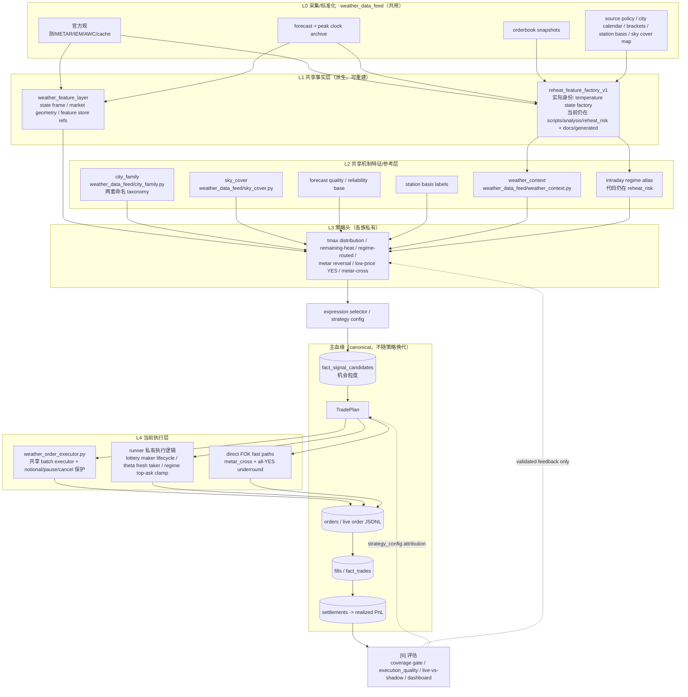

# 天气策略主线骨架

Status: current-reference
Updated: 2026-07-28 first-seen pre-signal extension pointer
Source of truth: yes for architecture orientation; field/schema contracts still defer to WEATHER_SYSTEM_CONTRACT
Superseded by / Used by: WEATHER_DOCS_INDEX.md; WEATHER_STRATEGY_QUANT_DESIGN.md; WEATHER_DATA_CANONICAL_SOURCES.md; WEATHER_SYSTEM_CONTRACT.md; WEATHER_FEATURE_LAYERING_PLAN.md

本文记录天气策略的**当前真实架构**，不是目标草案。它把策略/特征/执行资产挂回同一条量化血缘：

```text
signal candidate -> plan -> order -> fill -> settlement
```

这条主血缘由 `fact_signal_candidates`、trade plan、live/paper order JSONL、`fact_trades`、settlements 和 dashboard rebuild 支撑。换策略方向只动上层特征和策略头，不重做 order/fill/PnL/看板血缘。

first-seen 的目标形态是这条主血缘的上游扩展，不是另一套策略系统：

```text
immutable raw capture
  -> weather_information_event
  -> weather_state_checkpoint + feature_frame_ref
  -> fact_signal_candidates
  -> plan -> order -> fill -> settlement
```

事件、checkpoint 和 event-grain candidate 已完成 canonical 数据/信号落地及
archive-known 历史回放；准确字段、grain、PIT 时钟和实施边界见
[WEATHER_FIRST_SEEN_INFORMATION_LINEAGE.md](WEATHER_FIRST_SEEN_INFORMATION_LINEAGE.md)。
只有新 collector 保存的 `collector_exact` 可用于精确到达时延研究；历史
`changed_since_last`、TAF capture time 或 provider issue time 不能补造成
canonical exact first-seen。

## 当前总图



## 节点分类

### 主血缘节点

已存在，当前不重做：

| 节点 | 当前真相源 |
|---|---|
| `fact_signal_candidates` | `runtime/weather.db` rebuild |
| TradePlan | strategy runner plan JSONL / `strategy_config` |
| orders / live lineage | `runtime/weather_edge_v1/**/live_orders.jsonl` and executor outputs |
| fills / `fact_trades` | dashboard legacy migration + CLOB fill recovery |
| settlements / realized PnL | `settlements`, `pnl_usd_at_fill`, CLOB coverage gate |

`order_events` 子表尚未落地。它仍是可取的 additive 设计，但需要走 fact rebuild/schema 流程，不能在本轮整理里偷建。

### 派生节点

| 节点 | 派生自 | 当前状态 |
|---|---|---|
| `reheat_feature_factory_v1` / temperature state rows | L0 mirror + `runtime/weather.db` + orderbooks + forecast peak backfill | 在用；路径/名字未迁移，仍是 Phase D 待办 |
| `weather_context` labels | temperature/weather state rows | 已在 `weather_data_feed`，共享 |
| intraday regime atlas | factory rows | 共享机制图谱；代码位置仍在 `scripts/analysis/reheat_risk` |
| `CITY_FAMILY` / city climate labels | static reference taxonomy | 已收口到 `weather_data_feed.city_family`；保留 `CURRENT_BRACKET_NO_V1` 与 `ATLAS_V1` 两套语义 |
| `SKY_CODE` / sky cover numeric map | METAR/IEM sky strings | 已收口到 `weather_data_feed.sky_cover`；parser/fetch 逻辑尚未统一 |
| `weather_feature_layer` | L0 snapshot/cache + runner telemetry rows | Phase 1-6C 已落地：state builder、market geometry、side quote helper、offline store、research rewire、zero-notional shadow refs、HeadA tiny-live telemetry-only refs；live decision-input 未迁移 |
| forecast quality / reliability | forecast/history layers | 共享 soft label，不是独立 live 策略 |
| station basis | official/source basis layer | 共享 source/basis label，live 行为仍以具体 runner/entrypoint 为准 |

### 新增节点（本轮已落地）

| 节点 | 说明 |
|---|---|
| `weather_data_feed/city_family.py` | Phase B-4 调整版；集中管理两套已存在 city-family taxonomy |
| `tests/pmm_tests/test_weather_city_family.py` | 固定两套 taxonomy 只在 `Beijing` 上分叉，防止误合并 |
| `weather_data_feed/sky_cover.py` | Phase B-5 子项；集中管理已存在且一致的 METAR sky-cover numeric map |
| `tests/pmm_tests/test_weather_sky_cover.py` | 固定 sky-cover legacy mapping |
| `weather_feature_layer/` | 独立 feature-layer 包；当前包含 state/regime/bias/market/store/runtime-ref helper |
| `weather_feature_layer.store` | 离线 feature frame store：`rows.jsonl` / `index.json` / `manifest.json` + `feature_frame_ref` |
| `weather_feature_layer.runtime_refs` | runner-safe telemetry ref helper；失败只写 error，不改变 shadow/live 决策 |
| `docs/analysis/2026-07/2026-07-05-feature-layering-plan-review-v1.md` | 对 `WEATHER_FEATURE_LAYERING_PLAN.md` 的批判性审阅和执行边界 |

### 未落地/放弃按原文执行

| 计划项 | 当前处理 |
|---|---|
| 单一 `CITY_FAMILY` map | 不按原文执行；已改为一个模块下两套命名 taxonomy，避免行为漂移 |
| station-basis 直连 CLOB 收编 | 原计划误判：`weather_station_basis_exec.py` live placement 是未实现硬 gate，不是 active direct ClobClient |
| METAR parser/fetch 统一 | `SKY_CODE` 已收口，但 parser、cache、source-events、latency 逻辑未收编；需要逐 caller parity |
| `order_events` canonical 子表 | 未落地；需要独立 schema + rebuild + dashboard/coverage 流程 |
| metar-cross fast path 收编 | 未落地；触碰真实下单/私钥路径前必须显式确认并实测 latency |
| factory 全量迁到 `runtime/weather_feature_store/` | 部分落地：offline feature store helper 已有，runner telemetry refs 已有；canonical fact rebuild / generated artifact 搬迁未做 |
| live decision-input 统一迁到 feature layer | 未落地；当前只完成 research/zero-notional/tiny-live telemetry ref，真实 selector/size/quote/order 输入仍在各策略私有实现 |
| stable adapter 全面替代 research import | 部分落地：`regime_routed_no_stable.py` 已自包含；tmax live bridge 仍直接 import P0-P4 research modules，后续只能逐 parity 迁 |
| first-seen information-event lineage | 数据/信号实现与历史 raw replay 已完成：统一 event header → PIT checkpoint → `fact_signal_candidates` v2；zero-notional forward 入口已具备，是否可运行由当次 manifest/controller 与 JRS probe 动态决定；不新增并行 feature/opportunity fact，不接执行 |

## 七层边界

| 层 | 职责 | 当前入口 |
|---|---|---|
| `[0] 数据` | 同步 market/weather/live lineage 并 rebuild fact tables | `WEATHER_DATA_CANONICAL_SOURCES.md`, `WEATHER_DATA_PIPELINE.md`, `weather_data_feed/` |
| `[1] 事实/机制特征` | temperature state、weather context、regime、forecast reliability | `WEATHER_TEMPERATURE_CONTEXT_FEATURE_LAYER.md`, `weather_data_feed/weather_context.py`, `weather_data_feed/city_family.py`, `weather_data_feed/sky_cover.py` |
| `[2] 信号/表达` | `P(win)-price`、expression selector、strategy head | `fact_signal_candidates`, strategy docs/registry |
| `[3] 决策` | city pool、entry band、sizing、risk cap | production contract、共享 execution profile 与 runner config；`WEATHER_CITY_POOL_DECISIONS.md` 只作历史决策账 |
| `[4] 执行` | maker/taker/FOK、notional guard、fresh book、cancel/fill recovery | `weather_order_executor.py`, runner-specific execution logic, `analysis/execution_quality.md` |
| `[5] 结算` | settlement -> realized/open/MTM PnL | `fact_trades`, `settlements`, account reconcile |
| `[6] 评估` | live/shadow 对比、coverage gate、attribution、回写判断 | `WEATHER_ANALYSIS_CONTRACT.md`, living docs, dashboard |

## 执行层当前口径

执行统一是方向，不是已完成事实：

| 形态 | 当前实现 | 状态 |
|---|---|---|
| low-price YES maker-first + dynamic lifecycle | `low_price_yes_lottery_tiny_live.py` 私有 maker lifecycle + common executor | live tiny probe |
| TP20 maker -> cancel -> taker fallback | `low_price_yes_take_profit_exit_v1.py` | disabled |
| regime routed top-ask clamp | `regime_routed_no_tiny_live.py` | live tiny probe |
| current YES fresh taker | `weather_theta_current_yes_tiny_live.py` | live tiny probe |
| FOK latency | `weather_metar_cross_prev_no_shadow.py`; `all_yes_underround_fok_executor_v0.py` | metar-cross live tiny probe / all-YES research |

未来若抽 `execution_styles.py` / `order_gateway.py`，必须按 runner 做离线 parity replay；任何真实下单通道收编都另走显式确认、notional 上限、暂停开关和 latency 验收。

## 防发散纪律

1. 先定层，再定文件状态；冲突时以 `WEATHER_DOCS_INDEX.md` 的 current-source/current-reference 标注为准。
2. 新共享数据逻辑进 `weather_data_feed/`，但要保留版本化语义，不强行合并历史不同口径。
3. 研究脚本互相 import 可以作为短期现实；live/shadow runner 依赖研究脚本才是优先收口对象。
4. JSON/CSV 产物只作 evidence 或可重建派生，不承载当前结论；当前结论写入 living docs。
5. 不因为整理目录而绕开 `signal_id -> plan_id -> execution_id -> fill_id -> settlement`。
6. dormant 资产保留；暂时不用不等于可删。
