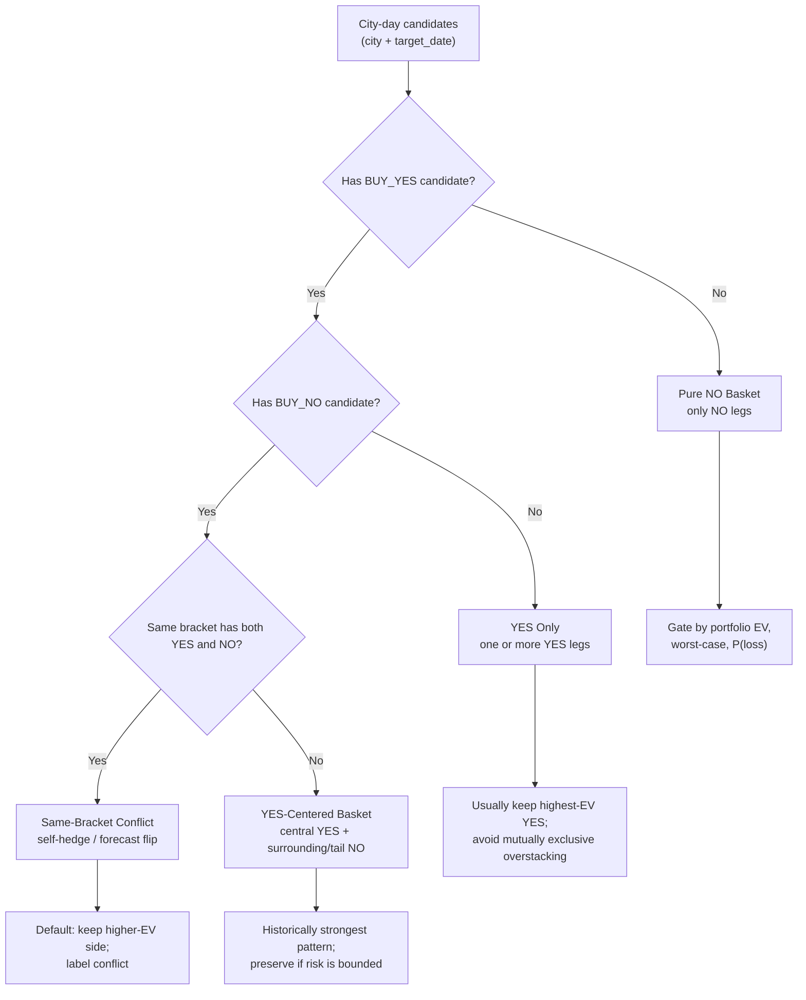

# Weather City-Day Portfolio Optimizer Design

Last updated: 2026-05-24

> **与相关文档的区别**
> - 本文档：同一城市同一日期内，多个 bracket 的 YES/NO **组合优化**（利用同城同日 bracket 强相关，找出比逐腿独立决策更优的多腿 portfolio）
> - [`WEATHER_LEDGER_POSITION_ANALYSIS.md`](WEATHER_LEDGER_POSITION_ANALYSIS.md)：单腿 sizing 策略模拟（信号集固定，比较仓位管理方式）
> - [`WEATHER_SHADOW_PORTFOLIO_TRACKING.md`](WEATHER_SHADOW_PORTFOLIO_TRACKING.md)：信号过滤规则对比（哪套 filter 长期优于 baseline）

## 1. Purpose

当前天气策略的 planner 是逐 signal 独立决策:

```text
signal edge passes filters -> place one $5 order
```

但天气 market 的同城同日 bracket 是强相关组合。一个 city-day 里同时出现多个
YES / NO 不是噪音，历史和 live fill 都显示主要收益来自:

```text
一个 YES 命中 + 周边或尾部 NO 同时命中
```

本设计的目标是先做一个离线复盘工具，把同城同日候选信号转成 portfolio
payoff，回答:

- 多个高价 NO 中，哪个更值得买？
- 哪些纯 NO basket 只是小赢大亏？
- 同 bracket YES/NO 是套利、模型翻转，还是无效自对冲？
- 如果加简单组合约束，历史 paper 和 live fill 会怎么变？

V1 不直接改 live 下单，只产出可复盘报告和候选规则。

## 2. Scope

### In Scope

- 按 `(target_date, city)` 聚合候选订单。
- 为每个候选 YES/NO 构建 payoff vector。
- 枚举或贪心选择简单组合。
- 输出 baseline vs candidate portfolio 的 PnL、ROI、worst-case、loss
  probability、组合类型归因。
- 同时支持 paper ledger 和 live CLOB fills 的复盘。

### Out Of Scope For V1

- 不做复杂凸优化或机器学习优化器。
- 不估计真实挂单成交概率。
- 不自动平仓或修改 live execution。
- 不用当前小样本直接定最终 live 参数。

## 3. Primary Data Sources

Paper baseline:

```text
runtime/weather_edge_v1/market_data/research/t24_paper_ledger_trades.csv
```

Live realized fills:

```text
runtime/weather.db
orders.venue = 'polymarket_clob'
fills.status = 'filled'
joined to settlements
```

Optional replay / broader research:

```text
runtime/weather_edge_v1/market_data/research/t24_paper_snapshot_replay_trades.csv
```

Important: `live_*_orders.jsonl` is only order submission/error lineage. It is
not fill/PnL truth unless matched to rows in `runtime/weather.db.fills`.

## 4. Core Model

### 4.1 Temperature Distribution

For each city-day, the optimizer needs an estimated probability distribution
over final brackets:

```text
P(final_bracket = b)
```

V1 can start with the probabilities already implied by existing signal rows:

- `model_p_yes` / `model_prob` for YES bracket probability.
- For NO, derive `P(NO wins) = 1 - P(bracket)`.
- If multiple rows disagree for the same bracket, keep the latest row or use a
  simple model priority rule (`ecmwf` vs `gfs`) and record the choice.

This does not need to be perfect on day one. The key is to make every decision
traceable.

### 4.2 Payoff Vector

Each candidate order becomes a payoff vector over possible final brackets.

For `$5` notional at price `p`:

```text
shares = 5 / p

BUY_YES on bracket b:
  payoff(final=b)  = shares * (1 - p)
  payoff(final!=b) = -5

BUY_NO on bracket b:
  payoff(final=b)  = -5
  payoff(final!=b) = shares * (1 - p)
```

Portfolio payoff is the row-wise sum:

```text
portfolio_payoff(final=t) = sum(order_payoff_i(final=t))
```

Then compute:

```text
expected_pnl = sum(P(final=t) * portfolio_payoff(final=t))
worst_case_pnl = min(portfolio_payoff)
loss_probability = sum(P(final=t) where portfolio_payoff(final=t) < 0)
large_loss_probability = sum(P(final=t) where portfolio_payoff(final=t) <= -X)
```

## 5. V1 Portfolio Rules

V1 should compare the existing baseline with a small set of interpretable
candidate rules.

### 5.0 City-Day Classification

Before optimizing, classify each `(target_date, city)` into a human-readable
setup type. This makes review easier and prevents mixing unrelated cases.



Initial setup tags:

| Tag | Description | V1 Treatment |
|---|---|---|
| `pure_no_basket` | only BUY_NO legs in the city-day | First optimization target |
| `yes_centered_basket` | at least one BUY_YES and at least one BUY_NO, no same-bracket conflict | Preserve and study; historically strongest |
| `same_bracket_conflict` | same city/date/bracket has both BUY_YES and BUY_NO | Report separately; default keep higher-EV side |
| `yes_only` | only BUY_YES legs | Keep simple; avoid multi-YES overstacking |
| `weak_or_no_trade` | portfolio EV/risk fails thresholds | Candidate rejection |

The first implementation should print these tags in every group-level output.
The goal is for a daily review to read like:

```text
2026-05-22 Warsaw
type = yes_centered_basket
baseline = BUY_YES 23 + BUY_NO 21
reason = central YES plus tail NO, positive EV, bounded worst-case
```

### 5.1 Baseline

```text
include every accepted signal
sizing = $5 notional
```

This matches current live sizing logic and is the control group.

### 5.2 Same-Bracket Opposite-Side Gate

For the same `(target_date, city, bracket)`, avoid holding both `BUY_YES` and
`BUY_NO` unless one of these explicit cases applies:

1. **Arbitrage lock**

```text
yes_price + no_price < 1 - fee_buffer - slippage_buffer
```

V1 can set this to strict mode and simply reject same-bracket opposite sides
because current data does not prove this is being used as an intentional
arbitrage.

2. **Forecast flip / rebalance**

Different snapshots may reverse direction. V1 should not simulate automatic
closing. It should label these as `forecast_flip_conflict` and report them
separately.

Default V1 behavior:

```text
same bracket YES/NO -> keep the side with higher standalone EV
tie -> keep latest signal
record dropped leg as same_bracket_conflict
```

### 5.3 Pure NO Basket Gate

Pure NO baskets are risky because high-price NO has asymmetric payoff:

```text
NO at 0.70 wins about +$2.14 on $5 cost
NO at 0.70 loses -$5 when that bracket hits
```

V1 should allow pure NO baskets only when portfolio-level risk is acceptable:

```text
expected_pnl > 0
worst_case_pnl >= -max_city_day_loss
loss_probability <= max_loss_probability
```

Initial test thresholds:

```text
max_city_day_loss = -7.50
max_loss_probability = 0.35
min_expected_pnl = 0.50
max_no_legs = 2
```

These are research defaults, not live defaults.

### 5.3.1 Pure NO Branch Is The First V1 Research Target

The first practical optimization should focus on `pure_no_basket` city-days.
Reason:

- It is the simplest branch: no YES/NO interaction or same-bracket conflict.
- Recent paper/live analysis shows pure NO baskets are much weaker than
  `yes_centered_basket`.
- The failure mode is easy to explain: high-price NO legs often win small and
  lose full notional when the final bracket hits.
- A simple gate can reduce tail losses without touching the historically
  strongest YES-centered pattern.

V1 pure NO branch should compare:

```text
baseline_pure_no:
  keep all NO legs passing current signal filters

pure_no_top1_ev:
  keep only the highest standalone-EV NO leg

pure_no_top2_ev:
  keep up to two highest standalone-EV NO legs

pure_no_portfolio_gate:
  enumerate up to max_no_legs and keep best feasible basket
```

Metrics to report for each branch:

```text
groups
trades selected
gross notional
pnl
roi
worst city-day loss
average city-day PnL
P(city-day loss)
P(city-day loss <= -$5)
opportunity cost versus baseline
```

Promotion rule for this branch should be conservative:

```text
promote only if it improves both:
  pure_no_basket PnL/risk
  total strategy PnL/risk

and does not reduce yes_centered_basket exposure.
```

This is an analysis/paper-shadow optimization first. It should not affect live
execution until it survives paper replay and real CLOB fill comparison.

### 5.4 YES-Centered Basket

This is the historically strong pattern:

```text
one central BUY_YES + one or more surrounding/remote BUY_NO
```

V1 should prefer combinations where:

- the YES bracket has positive standalone EV;
- the NO legs are not betting against the same highest-probability bracket;
- expected PnL is positive;
- worst-case loss is bounded;
- at least one high-probability final bracket has strongly positive payoff.

This captures cases like:

```text
BUY_YES 25
BUY_NO 24
BUY_NO 26
```

or:

```text
BUY_YES center
BUY_NO far tail
```

depending on the model distribution and market prices.

## 6. Selection Algorithm

Keep V1 simple and explainable.

### Step 1: Build Candidate Set

For each `(target_date, city)`:

```text
candidates = accepted baseline rows for that city-day
```

Optional filters for the first report:

```text
city_pool = t1_trading
0.25 <= entry_price < 0.75
```

### Step 2: Score Individual Legs

For each candidate:

```text
standalone_ev = sum(P(final=t) * payoff_i(final=t))
standalone_worst = min(payoff_i)
```

For NO specifically:

```text
NO model_prob = 1 - P(bracket)
NO edge = NO model_prob - no_price
```

This answers "which high-price NO is more likely right?" directly: the better
NO is the one where `P(bracket)` is lower relative to the NO price.

### Step 3: Enumerate Small Portfolios

V1 can enumerate combinations up to a small size:

```text
max_legs = 3
```

For each combination:

```text
cost
expected_pnl
worst_case_pnl
loss_probability
large_loss_probability
payoff_by_final_bracket
classification
```

If a city-day has too many candidates, first keep the top N by standalone EV:

```text
max_candidates_per_city_day = 8
```

### Step 4: Choose Best Feasible Portfolio

Feasible means:

```text
cost <= max_city_day_notional
worst_case_pnl >= max_city_day_loss
loss_probability <= max_loss_probability
no same-bracket opposite side unless allowed
```

Objective:

```text
maximize expected_pnl
tie-breaker 1: higher worst_case_pnl
tie-breaker 2: lower number of legs
tie-breaker 3: lower gross notional
```

Initial research defaults:

```text
max_city_day_notional = 15.00
max_city_day_loss = -10.00
max_loss_probability = 0.40
max_legs = 3
```

## 7. Classification Tags

Every selected and baseline city-day should get a classification:

| Tag | Meaning |
|---|---|
| `yes_win_plus_no_wins` | At settlement, at least one YES and one NO won |
| `no_wins_only` | Only NO legs won |
| `yes_win_only` | Only YES legs won |
| `all_lose` | No leg won |
| `same_bracket_conflict` | Same bracket has both YES and NO |
| `pure_no_basket` | Portfolio contains only NO legs |
| `yes_centered_basket` | Portfolio contains at least one YES and one NO |
| `forecast_flip_conflict` | Opposite side appeared across snapshots |

These tags are for attribution. The optimizer must report PnL by tag.

## 8. Output

Suggested first output directory:

```text
runtime/weather_edge_v1/market_data/research/city_day_portfolio/
```

Files:

```text
city_day_portfolio_summary.json
city_day_portfolio_groups.csv
city_day_portfolio_trades.csv
city_day_portfolio_top_winners.csv
city_day_portfolio_top_losers.csv
city_day_portfolio_conflicts.csv
```

Minimum summary fields:

```json
{
  "generated_at": "...",
  "source": "paper_ledger",
  "date_range": ["2026-05-08", "2026-05-22"],
  "baseline": {
    "city_days": 118,
    "trades": 225,
    "cost_usd": 1125.0,
    "pnl_usd": 113.78,
    "roi": 0.1011
  },
  "candidate": {
    "portfolio_id": "city_day_optimizer_v1",
    "city_days": 118,
    "selected_trades": 0,
    "cost_usd": 0,
    "pnl_usd": 0,
    "roi": 0
  },
  "by_classification": {}
}
```

## 9. First Backtest Questions

V1 should answer these before any live change:

1. Does pure NO basket gating reduce losses without killing too much upside?
2. Which pure NO branch works best: top-1 EV, top-2 EV, or full portfolio gate?
3. Does blocking same-bracket YES/NO improve paper and live fill PnL?
4. Does the optimizer preserve the strong `YES + NO winners` pattern?
5. Is the result robust on:
   - paper current-like T1 25-75;
   - all settled paper ledger;
   - real live CLOB fills;
   - T2 as research-only out-of-sample?
6. How concentrated is improvement by city/date? If one city explains most of
   the improvement, do not promote.

## 10. Promotion Path

### Phase 0: Analysis Only

Build script and reports. No production effect.

```text
scripts/analysis/weather_city_day_portfolio.py
```

### Phase 1: Shadow Portfolio

Run daily after data sync and settlement refresh. Track candidate vs baseline
for at least 1-2 weeks.

### Phase 2: Paper Planner Gate

If stable, let the paper planner tag:

```text
portfolio_decision = selected | rejected_same_bracket_conflict | rejected_pure_no_risk
```

Still no live impact.

### Phase 3: Live Planner Gate

Only after paper/live fill comparison remains positive:

```text
live planner groups accepted signals by city-day
optimizer selects portfolio
executor only sees selected plans
```

Keep hard live boundaries:

```text
max_order_notional
max_city_day_notional
pause switch
doctor/dry-run check
traceable logs
```

## 11. Non-Goals And Risks

- This is not a final optimal trading engine.
- Small samples can overfit quickly, especially low-price YES.
- The model distribution may be stale intraday; use latest snapshot context.
- CLOB fills are partial; live realized PnL must use `fills`, not submitted
  orders.
- Better EV can still increase drawdown if city-day exposure is not capped.

V1 success means the report makes better decisions obvious in review. It does
not need to be mathematically elegant.
