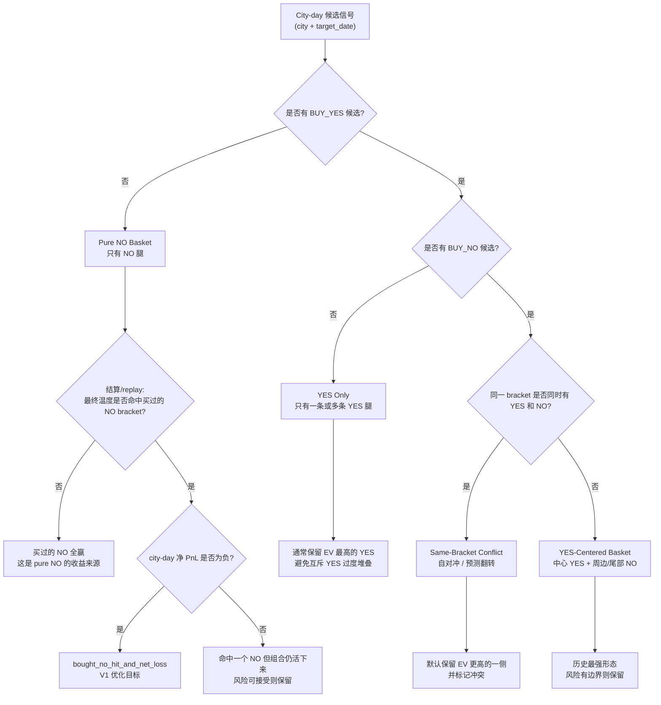

# 天气 City-Day 组合优化器设计

Status: design-draft。本文是组合优化器设计草案；当前算法研究结论以 [WEATHER_EDGE_ENGINE_CURRENT_STATE_2026-06-06.md](WEATHER_EDGE_ENGINE_CURRENT_STATE_2026-06-06.md) 和对应 docs/analysis/2026-06/ 快照为准。

最后更新: 2026-05-25

> **与相关文档的区别**
> - 本文档：同一城市同一日期内，多个 bracket 的 YES/NO **组合优化**。核心是利用同城同日 bracket 的强相关关系，找出比逐腿独立决策更好的多腿组合。
> - [`WEATHER_LEDGER_POSITION_ANALYSIS.md`](WEATHER_LEDGER_POSITION_ANALYSIS.md)：单腿 sizing 策略模拟，信号集固定，只比较仓位管理方式。
> - [`WEATHER_SHADOW_PORTFOLIO_TRACKING.md`](WEATHER_SHADOW_PORTFOLIO_TRACKING.md)：信号过滤规则对比，判断哪套 filter 长期优于 baseline。

## 1. 目标

当前天气策略的 planner 是逐 signal 独立决策:

```text
signal edge passes filters -> place one $5 order
```

但天气 market 的同城同日 bracket 不是彼此独立的。一个 city-day 里同时出现多个 YES / NO，不一定是噪音；历史 paper 和 live fill 都显示，主要收益常来自:

```text
一个 YES 命中 + 周边或尾部 NO 同时命中
```

本设计的目标是先做一个可复跑的离线复盘工具，把同城同日候选信号转成 portfolio payoff，回答:

- 多个高价 NO 中，哪些应该保留，哪些是坏腿？
- 纯 NO basket 中，哪些是“多个 NO 可以一起赢”，哪些是“命中一个 NO 后整组亏”？
- 同 bracket 同时出现 YES/NO 时，是套利、模型翻转，还是无效自对冲？
- 如果加简单组合约束，历史 paper 和真实 live fill 会怎么变？

V1 不直接改 live 下单，只产出可复跑报告和候选规则。

## 2. 范围

### V1 包含

- 按 `(target_date, city)` 聚合候选订单。
- 为每个候选 YES/NO 构建 payoff vector。
- 对小规模组合做枚举或贪心选择。
- 输出 baseline vs candidate portfolio 的 PnL、ROI、worst-case、loss probability 和组合类型归因。
- 同时支持 paper ledger 和 live CLOB fills 复盘。

### V1 不包含

- 不做复杂凸优化或机器学习优化器。
- 不估计真实挂单成交概率。
- 不自动平仓，不修改 live execution。
- 不用当前小样本直接决定最终 live 参数。

## 3. 主要数据源

Paper 基准数据:

```text
runtime/weather_edge_v1/market_data/research/t24_paper_ledger_trades.csv
```

真实 live 成交数据:

```text
runtime/weather.db
orders.venue = 'polymarket_clob'
fills.status = 'filled'
joined to settlements
```

可选 replay / 更大研究样本:

```text
runtime/weather_edge_v1/market_data/research/t24_paper_snapshot_replay_trades.csv
```

注意：`live_*_orders.jsonl` 只记录订单提交和错误血缘。除非能匹配到 `runtime/weather.db.fills` 里的成交行，否则它不是 fill/PnL truth。

## 4. 核心模型

### 4.1 温度分布

对每个 city-day，optimizer 需要一个最终温度 bracket 的概率分布:

```text
P(final_bracket = b)
```

V1 可以先使用现有 signal row 已经给出的概率:

- `model_p_yes` / `model_prob` 表示某个 YES bracket 的概率。
- 对 NO，使用 `P(NO wins) = 1 - P(bracket)`。
- 如果同一个 bracket 有多条 row 且概率不一致，先保留最新 row，或使用简单模型优先级规则，例如 `ecmwf` 优先于 `gfs`，并把选择记录下来。

第一版不需要追求完美概率。关键是每个决策都能追溯。

### 4.2 收益向量

每个候选订单都可以转成“最终温度落在不同 bracket 时分别赚/亏多少”的 payoff vector。

以 `$5` notional、价格 `p` 为例:

```text
shares = 5 / p

BUY_YES on bracket b:
  payoff(final=b)  = shares * (1 - p)
  payoff(final!=b) = -5

BUY_NO on bracket b:
  payoff(final=b)  = -5
  payoff(final!=b) = shares * (1 - p)
```

组合 payoff 是每条腿 payoff 的逐状态相加:

```text
portfolio_payoff(final=t) = sum(order_payoff_i(final=t))
```

然后计算:

```text
expected_pnl = sum(P(final=t) * portfolio_payoff(final=t))
worst_case_pnl = min(portfolio_payoff)
loss_probability = sum(P(final=t) where portfolio_payoff(final=t) < 0)
large_loss_probability = sum(P(final=t) where portfolio_payoff(final=t) <= -X)
```

## 5. V1 组合规则

V1 要把现有 baseline 和少数几个可解释 candidate rule 做对比。重点不是做复杂优化，而是让每天复盘时能看清楚“为什么这组应该下/不下”。

### 5.0 City-Day 分类

优化前先把每个 `(target_date, city)` 分类成人能读懂的 setup type。这样可以避免把不同问题混在一起，例如把 pure NO 的坏场景误解成整个 pure NO 分支都不好。



初始分类标签:

| Tag | 含义 | V1 处理 |
|---|---|---|
| `pure_no_basket` | 这个 city-day 里只有 `BUY_NO` 腿 | 第一个优化分支，但不能盲目全砍 |
| `bought_no_hit_and_net_loss` | pure NO basket 中，最终温度打中某个被买 NO 的 bracket，且 city-day 整体净亏 | V1 真正要减少的失败模式 |
| `yes_centered_basket` | 至少一个 `BUY_YES` 和至少一个 `BUY_NO`，且没有同 bracket 冲突 | 保留并重点研究；历史上最强 |
| `same_bracket_conflict` | 同城市/日期/bracket 同时有 `BUY_YES` 和 `BUY_NO` | 单独报告；默认保留更高 EV 的一侧 |
| `yes_only` | 只有 `BUY_YES` 腿 | 简单处理，避免互斥 YES 过度堆叠 |
| `weak_or_no_trade` | portfolio EV/risk 没过阈值 | 候选拒绝 |

第一版输出里，每个 group-level row 都应该打印这些标签。目标是让每日复盘能读成这样:

```text
2026-05-22 Warsaw
type = yes_centered_basket
baseline = BUY_YES 23 + BUY_NO 21
reason = central YES plus tail NO, positive EV, bounded worst-case
```

### 5.1 基准策略

```text
include every accepted signal
sizing = $5 notional
```

这对应当前 live sizing 逻辑，是所有 candidate rule 的对照组。

### 5.2 同 Bracket 反向持仓过滤

对同一个 `(target_date, city, bracket)`，默认不要同时持有 `BUY_YES` 和 `BUY_NO`，除非明确属于以下情况。

1. **套利锁定**

```text
yes_price + no_price < 1 - fee_buffer - slippage_buffer
```

V1 可以先用 strict mode，直接拒绝 same-bracket opposite side。当前数据还不能证明这是有意做套利。

2. **预测翻转 / 再平衡**

不同 snapshot 可能出现模型方向翻转。V1 不模拟自动平仓，但应把它标为 `forecast_flip_conflict`，并单独报告。

默认 V1 行为:

```text
same bracket YES/NO -> keep the side with higher standalone EV
tie -> keep latest signal
record dropped leg as same_bracket_conflict
```

### 5.3 Pure NO Basket 过滤

Pure NO basket 的风险来自高价 NO 的不对称 payoff:

```text
NO at 0.70 wins about +$2.14 on $5 cost
NO at 0.70 loses -$5 when that bracket hits
```

也就是说，单条 NO 经常是“小赢大亏”。但这不代表 pure NO basket 必然差，因为同一个 city-day 中，多个 NO 在最终温度没有落入这些 bracket 时可以同时赢。

所以 V1 的核心不是“砍掉 pure NO”，而是减少这个失败模式:

```text
买了多个 NO；
真实温度落进其中一个被买 NO 的 bracket；
那条 NO 亏满；
其他 NO 赢的钱不够覆盖亏损；
整个 city-day 净亏。
```

这个失败模式统一命名为:

```text
bought_no_hit_and_net_loss
```

初始 research threshold:

```text
max_city_day_loss = -7.50
max_loss_probability = 0.35
min_expected_pnl = 0.50
max_no_legs = 2
```

这些是研究默认值，不是 live 默认值。

### 5.3.1 Pure NO 是第一个 V1 研究分支

第一个实际优化分支聚焦 `pure_no_basket` city-day。原因:

- 这是最简单的分支：没有 YES/NO 交互，也没有 same-bracket conflict。
- 失败模式容易解释：高价 NO 赢时小赚，命中时亏满；多腿情况下可能出现“命中一个 NO 后整组仍亏”。
- 这个分支可以先做 paper-shadow，不影响历史上最强的 YES-centered pattern。

V1 pure NO branch 需要比较:

```text
baseline_pure_no:
  keep all NO legs passing current signal filters

pure_no_top1_ev:
  keep only the highest standalone-EV NO leg

pure_no_top2_ev:
  keep up to two highest standalone-EV NO legs

pure_no_portfolio_gate:
  enumerate up to max_no_legs and keep best feasible basket
```

每个分支至少报告:

```text
groups
trades selected
gross notional
pnl
roi
worst city-day loss
average city-day PnL
P(city-day loss)
P(city-day loss <= -$5)
groups_with_bought_no_hit
groups_with_bought_no_hit_and_net_loss
bought_no_hit_net_loss_pnl_usd
opportunity cost versus baseline
```

推广规则必须保守:

```text
promote only if it improves both:
  pure_no_basket PnL/risk
  total strategy PnL/risk

并且不能减少 yes_centered_basket exposure。
```

这是 analysis / paper-shadow 优化。只有通过 paper replay 和真实 CLOB fill 对比后，才考虑进入 live planner。

### 5.3.2 当前 V1 Pure NO 分支判断

本节记录截至本次分析时，V1 Pure NO gate 到底有没有帮助。

这里的“支持/不支持”不是说数据能不能用，而是指:

```text
如果把这个分支规则套回这段历史数据，它是否比原来的 baseline 多赚钱、
少犯错，并且没有明显增加尾部风险。
```

人话版结论:

```text
1. “NO 赢得少、输一笔亏满”这个数学结构没错。
2. 但这不等于“所有只买 NO 的篮子都差”。
3. 过去这段数据里，很多 pure NO basket 赚钱，是因为同一天可以买多个错误温度档的 NO；
   只要真实温度不落在这些档位里，多个 NO 可以一起赢。
4. 所以现在不应该全局砍 pure NO，也不应该简单只留 top1/top2。
5. 当前可做的是：只在 T1 + 25c-75c 这个更接近 live 的价格窗口里，把 gate 当
   shadow 规则继续观察；live 暂时不改。
```

这也解释了为什么“NO payout 小”与“pure NO 全量仍赚钱”不矛盾:

```text
单条 NO:
  赢的时候可能只赚 $1-$4；
  输的时候可能亏 $5。

多条 NO basket:
  如果最终温度没有落进这些被买 NO 的 bracket，多个 NO 可以同时赢；
  如果最终温度只落进其中一个 bracket，通常只有那一条 NO 输，其他 NO 还可能赢。

因此 pure NO 的问题不是“必然差”，而是“需要避免买到太多模型其实没把握的 NO，
同时不要错砍那些能一起赢的 NO 篮子”。
```

当前操作口径:

```text
live execution: 不改。
paper baseline: 不改。
V1 optimizer: 不做全局 pure NO 减仓；只继续跟踪 T1 + 25c-75c 的 gate。
下一步研究: 从“只留 top1/top2”改成“坏 NO leg 过滤”，保留能一起赢的多腿 NO basket。
```

当前真正要优化的问题是:

```text
bought_no_hit_and_net_loss
```

含义:

```text
一个 city-day 买了多个 NO；
最后真实温度落进其中一个被买 NO 的 bracket；
这条 NO 亏满；
其他 NO 虽然赢了，但赢的钱不够覆盖亏损；
整个 city-day 净亏。
```

这正是 Pure NO basket 的主要痛点。用当前数据复算:

| 数据口径 | Baseline Pure NO PnL | bought NO 被命中且净亏的城市日 | 这些城市日合计亏损 |
|---|---:|---:|---:|
| `paper_ledger_all_settled` | +$337.55 | 80 | -$273.83 |
| `paper_ledger_t1_trading` | +$31.13 | 18 | -$52.17 |
| `paper_ledger_t1_trading_25_75` | +$53.46 | 39 | -$131.33 |
| `paper_ledger_t2_research` | +$306.42 | 62 | -$221.66 |
| `live_clob_fills` | +$3.97 | 7 | -$21.65 |

因此研究方向不是证明 pure NO 是否整体赚钱，而是:

```text
保留那些“最终没落进所买 bracket 时能一起赢”的 NO basket；
过滤那些“一旦落进其中一个 bracket，其他 NO 赢的钱也救不回来”的坏 basket。
```

离线报告可复跑:

```bash
python3 scripts/analysis/weather_city_day_portfolio.py
```

输出目录:

```text
runtime/weather_edge_v1/market_data/research/city_day_portfolio/
```

本次判断使用的数据:

| 数据口径 | 日期范围 | 已结算交易数 | Pure NO 城市日 | 为什么看这个口径 |
|---|---:|---:|---:|---|
| `paper_ledger_all_settled` | 2026-05-08 到 2026-05-24 | 939 | 185 | 全量 paper，用来检查规则是不是全局有效；但它混了 T1/T2 和旧过滤条件 |
| `paper_ledger_t1_trading` | 2026-05-08 到 2026-05-24 | 401 | 39 | 只看生产交易池 T1 |
| `paper_ledger_t1_trading_25_75` | 2026-05-08 到 2026-05-24 | 261 | 78 | 最接近当前实盘过滤: T1 且 `0.25 <= entry_price < 0.75` |
| `paper_ledger_t2_research` | 2026-05-13 到 2026-05-24 | 538 | 146 | T2 研究池，用来防止只在 T1 过拟合 |
| `live_clob_fills` | 2026-05-16 到 2026-05-22 | 63 | 16 | 真实 CLOB 成交，必须用 filled rows 结算，不看未成交订单 |

数据新鲜度:

- `t24_paper_ledger_summary.json` 生成于 `2026-05-25T15:07:34Z`。
- V1 branch report 在本次分析中生成于 `2026-05-25T15:07:53Z`。
- Live 只使用 `orders.venue = polymarket_clob`、`fills.status = filled`，并且能 join 到 `runtime/weather.db` 里已结算 settlement 的行。
- `live_*_orders.jsonl` 里只提交但没成交的订单不算 PnL truth。
- 2026-05-25 的 Tokyo / Paris 已经进入原始 `paper_orders.jsonl`，但本次已结算回测没有纳入它们，因为本机镜像里还没有 `Tokyo_2026-05-25.json` / `Paris_2026-05-25.json` 结算文件。Paris 的 `settle_utc=2026-05-25T21:00:00Z`，在本次复盘时间点还未到期。

先校正一个容易混淆的口径:

- `pure_no_basket` 是**事前持仓形态**：这个 city-day 里实际下的腿全是 `BUY_NO`，没有 `BUY_YES`。
- `只有 NO 中` 是**事后结算形态**：结算后只有 NO leg 赢。这个分类里可以包含 YES leg，只是 YES leg 最后输了。
- 因此，之前按 `multi groups` 统计出来的 `只有 NO 中` 亏损，不能直接等同于“事前只买 NO 的 basket 亏损”。它回答的是“如果一个多腿组合最后只有 NO 赢、YES 没赢，这类结算结果表现如何”，不是“只买 NO 的策略表现如何”。

之前出现过一次口径漂移：把“事后只有 NO leg 赢”的结算分类，当成了“事前只买 NO”的持仓分类。这个错误会导致结论看起来互相打架。

正确读法是:

```text
事前 pure NO city-day:
  这个 city-day 下单时只有 BUY_NO，没有 BUY_YES。

事后 no_wins_only:
  结算后只有 NO leg 赢；这个组合事前可能同时买过 YES，只是 YES 最后输了。
```

所以更准确的结论是:

```text
“YES 中 + NO 中”是最强形态；
“事后只有 NO 中”的多腿组合在 $5 归一口径下很弱；
但“事前只买 NO”的 pure NO basket 并不是全量亏损，它在全量/T2 里仍然赚钱。
```

V1 Pure NO 分支对比。下表默认使用实际 paper/live size；$5 归一方向基本一致:

| 数据口径 | Baseline Pure NO PnL / ROI | Top1 EV 相对 baseline | Top2 EV 相对 baseline | Portfolio gate 相对 baseline | 结论 |
|---|---:|---:|---:|---:|---|
| `paper_ledger_all_settled` | +$337.55 / 16.13% | -$176.68 | -$101.94 | -$146.79 | 不支持全局套用 |
| `paper_ledger_t1_trading` | +$31.13 / 7.80% | +$1.87 | +$14.00 | +$23.75 | T1 内有正收益 |
| `paper_ledger_t1_trading_25_75` | +$53.46 / 6.97% | +$6.48 | +$14.00 | +$31.25 | 当前最值得 shadow 的切片 |
| `paper_ledger_t2_research` | +$306.42 / 18.09% | -$178.55 | -$115.94 | -$170.54 | 不支持在 T2 套用 |
| `live_clob_fills` | +$3.97 / 3.64% | -$7.68 | +$0.00 | -$0.28 | live 成交暂未确认 |

这里“不支持全局套用”的具体原因:

- 全量 paper 中，portfolio gate 会从 333 条 Pure NO 交易砍到 251 条，少下注 `$463.21`，但实际 PnL 从 `$337.55` 降到 `$190.76`，等于少赚 `$146.79`。
- T2 中同样明显变差：270 条砍到 197 条，少下注 `$409.46`，但 PnL 从 `$306.42` 降到 `$135.88`，少赚 `$170.54`。
- 这些少赚不是平均噪音，主要来自若干本来应该保留的多腿 NO basket。例如 2026-05-20 的 Istanbul、Ankara、Moscow、Lucknow 这些 T2 城市日，baseline 多腿 NO 大赚；gate 只保留 1-2 条后错过了主要利润。
- gate 的风险指标也不是单向变好。全量 paper 的亏损城市日比例从 `43.24%` 降到 `37.30%`，但 `loss <= -$5` 的城市日比例从 `9.19%` 升到 `13.51%`。也就是说它减少了一些小亏，但保留组合更集中，大亏频率反而上升。

当前最有用的发现是：这个 gate 在“当前实盘更接近的 T1 25c-75c 价格窗口”里是正向的。如果只在这个切片套用:

```text
Pure NO PnL:        $53.46  -> $84.71    (+$31.25)
Pure NO ROI:        6.97%   -> 12.36%
Pure NO trades:     123     -> 108
Pure NO notional:   $766.54 -> $685.29   (-$81.25)
Total slice PnL:    $147.32 -> $178.57   (+$31.25)
Total slice ROI:    10.28%  -> 13.21%
P(city-day loss):   50.00%  -> 39.74%
P(loss <= -$5):     7.69%   -> 11.54%
Worst city-day:     unchanged at -$7.45
```

为什么这个切片看起来有效:

- T1 25c-75c 里，gate 砍掉 15 条 Pure NO，少下注 `$81.25`，但多赚 `$31.25`。这说明它砍掉的主要是这个切片里表现较差的 NO leg。
- 这个改善集中在少数城市日，例如 2026-05-22 Beijing、2026-05-12 Beijing、2026-05-10/13/15 Paris；同时也有回撤例子，例如 2026-05-12 London 和 2026-05-11 Paris。
- 因此它目前只能作为 T1 当前价格窗口的 shadow gate 继续追踪，不能说已经找到了全市场通用规则。

当前执行建议:

- 不改 live execution。
- 每天继续复跑 `scripts/analysis/weather_city_day_portfolio.py`，重点看 `paper_ledger_t1_trading_25_75` 和 `live_clob_fills` 两个口径。
- 只有当后续 settled paper 和 live fills 都连续确认 `pure_no_portfolio_gate` 比 baseline 更好，再考虑进入 paper planner gate。

### 5.3.3 当前候选优化方向：先做可解释诊断，再做过滤

针对 `bought_no_hit_and_net_loss`，不要一上来把某个阈值当最终策略。这个问题的核心是解释清楚每个 multi-leg pure NO basket:

```text
为什么它事前看起来能买；
如果某个被买 NO bracket 命中，整组会亏多少；
实际结算时到底命中了哪条；
如果删掉某一条腿，结果会不会明显更好。
```

因此 V1 的第一产物应该是每日复盘报告，而不是数学上优雅的 optimizer。脚本已经输出:

```text
runtime/weather_edge_v1/market_data/research/city_day_portfolio/city_day_portfolio_pure_no_diagnostics.csv
```

关键字段:

| 字段 | 含义 |
|---|---|
| `sum_bought_no_model_p_yes` | 事前模型认为“最终温度落进这些被买 NO bracket”的合计概率 |
| `min_no_edge` | 这组 NO 中安全边际最差的一条腿 |
| `worst_bought_no_hit_bracket` | 如果这个 bracket 被命中，组合 hit-state PnL 最差 |
| `worst_bought_no_hit_pnl_usd` | 最差 hit-state 下的组合 PnL |
| `actual_hit_bought_no_brackets` | 事后真实命中的被买 NO bracket |
| `is_bought_no_hit_and_net_loss` | 是否发生“命中被买 NO 且整组净亏” |
| `best_drop_one_leg` | 事后诊断：如果只删一条，删哪条实际 PnL 最好 |
| `best_drop_one_delta_pnl_usd` | 事后 drop-one 相对原 basket 改善多少 |
| `legs_detail` | 每条腿的价格、模型概率、edge、实际 PnL |

这个报告用于复盘和形成规则，不直接等于生产过滤条件。

一个可解释的候选过滤方向是：只过滤“模型自己也觉得容易被打中”的 multi-leg pure NO basket。

候选规则:

```text
只作用于 multi-leg pure NO basket；单腿 NO 暂不处理。

sum_p_hit = sum(model_p_yes of bought NO brackets)
min_edge_no = min((1 - model_p_yes) - entry_price)

保留条件:
  sum_p_hit <= 0.20
  min_edge_no >= 0.15

否则跳过这个 multi-leg pure NO basket。
```

人话解释:

```text
如果模型认为“真实温度落进我们买 NO 的这些 bracket”的合计概率已经超过 20%，
这组 NO 就不是在押“这些温度都不太可能”，而是在买一组有较高命中风险的高价 NO。

如果其中最差的一条 NO edge 低于 15%，说明这组里至少有一条腿的安全边际不够。
这类腿一旦被命中，通常就是整组亏损来源。
```

注意：`0.20 / 0.15` 只是当前样本上的候选切分点，用来生成 shadow 对比和复盘排序。它不是 live 参数，也不应该在没做 walk-forward 前写死进 planner。

当前回测结果:

| 数据口径 | Baseline Pure NO PnL | Hit Probability Filter PnL | PnL 改善 | hit-loss 城市日 | hit-loss 合计亏损 |
|---|---:|---:|---:|---:|---:|
| `paper_ledger_t1_trading` | +$31.13 | +$48.60 | +$17.47 | 18 -> 9 | -$52.17 -> -$28.05 |
| `paper_ledger_t1_trading_25_75` | +$53.46 | +$76.98 | +$23.52 | 39 -> 21 | -$131.33 -> -$88.73 |
| `live_clob_fills` | +$3.97 | +$13.41 | +$9.44 | 7 -> 4 | -$21.65 -> -$11.81 |
| `paper_ledger_all_settled` | +$337.55 | +$118.92 | -$218.63 | 80 -> 41 | -$273.83 -> -$179.65 |
| `paper_ledger_t2_research` | +$306.42 | +$70.32 | -$236.10 | 62 -> 32 | -$221.66 -> -$151.60 |

判断:

- 这个规则对当前最相关的 `T1 + 25c-75c` 有意义：Pure NO PnL 提升 `$23.52`，hit-loss 城市日减半。
- live fills 小样本也同向：Pure NO PnL 提升 `$9.44`，hit-loss 从 7 个降到 4 个。
- 它不适合全量/T2：T2 中大量多腿 NO basket 虽然 hit-risk 高，但历史上依然靠多腿结构大赚；全局套用会错砍 upside。
- 因此当前策略方向是：只在 `t1_trading`，尤其 `t1_trading_25_75`，把 `pure_no_hit_probability_filter` 作为 shadow 报告候选；不进入 live。

每天复盘时，优先看三类组合:

```text
明显可保留:
  sum_bought_no_model_p_yes 低；
  min_no_edge 高；
  worst_bought_no_hit_pnl_usd 不太差；
  实际结算没有命中被买 NO，或命中后仍能活下来。

明显应拒绝:
  sum_bought_no_model_p_yes 高；
  min_no_edge 低；
  worst_bought_no_hit_pnl_usd 为负；
  best_drop_one_delta_pnl_usd 显示亏损主要来自单条坏腿。

需要人工看:
  事前指标一般，但 basket 历史能靠多腿结构大赚；
  这类不要用硬阈值直接砍，先积累更多样本。
```

按当前 `T1 + 25c-75c` 样本，三类 bucket 的实际表现:

| Bucket | 当前判定条件 | groups | 实际 PnL | ROI | hit-loss groups | 解释 |
|---|---|---:|---:|---:|---:|---|
| `clear_keep_candidate` | `sum_p_hit <= 0.20` 且 `min_no_edge >= 0.15` | 22 | +$47.88 | +15.8% | 9 | 净收益最强，应该优先保留 |
| `hard_reject_candidate` | `sum_p_hit > 0.25` 且 `min_no_edge < 0.15` | 15 | -$16.12 | -8.7% | 13 | 当前最明确的拒绝/修正对象 |
| `gray_review` | 其他 mixed signal | 6 | -$7.40 | -9.6% | 5 | 样本太小，不建议直接硬阈值；优先做删腿修正实验 |

对应策略版本:

```text
保守 V1:
  拒绝 hard_reject_candidate；
  clear_keep_candidate 和 gray_review 暂时保留；
  当前样本 Pure NO multi PnL: $24.36 -> $40.48，改善 +$16.12。

激进 V1:
  只保留 clear_keep_candidate；
  hard_reject_candidate 和 gray_review 都跳过；
  当前样本 Pure NO multi PnL: $24.36 -> $47.88，改善 +$23.52。

推荐当前推进:
  paper/shadow 先同时报告两版；
  真正进入 planner 的第一候选只考虑“保守 V1”；
  gray_review 不直接 live 拒绝，先做 drop-one repair 实验。
```

这里的策略目标不是追求完美分类，而是让 planner 先避开最明显的坏 basket，同时不把能赚钱的多腿 NO 结构误杀。

### 5.3.4 正好两条 NO，且两条都 >60c

这个 slice 是为了回答一个更具体的问题:

```text
如果一个 pure NO city-day 只买了 2 条 NO，
并且两条 NO 的入场价都大于 60c，
是不是大概率出现“命中一条 NO 后整组亏”？
```

结论要分口径看:

| 数据口径 | groups | PnL | ROI | hit-loss groups | 判断 |
|---|---:|---:|---:|---:|---|
| `paper_ledger_t1_trading` | 10 | -$9.57 | -6.9% | 7/10 | T1 全价格里偏坏 |
| `paper_ledger_t1_trading_25_75` | 21 | +$16.21 | +5.7% | 12/21 | 不是硬拒绝规则 |
| `paper_ledger_t2_research` | 37 | +$76.98 | +15.0% | 15/37 | T2 里明显不能拒绝 |
| `paper_ledger_all_settled` | 47 | +$67.41 | +10.3% | 22/47 | 全量仍为正 |
| `live_clob_fills` | 5 | +$6.65 | +14.9% | 2/5 | live 样本太小，只能观察 |

为什么 `T1 + 25c-75c` 里 hit-loss 过半但 PnL 仍为正:

```text
12 个 hit-loss city-day 合计亏损不大；
9 个 no-hit city-day 两条 NO 同时赢，贡献了主要正收益。
```

典型 no-hit 赚钱例子:

| 日期 | 城市 | PnL | 两条 NO |
|---|---|---:|---|
| 2026-05-11 | LA | +$7.10 | 68-69 @ 67.0c, 70-71 @ 62.0c |
| 2026-05-13 | Chicago | +$6.90 | 62-63 @ 60.5c, 64+ @ 70.5c |
| 2026-05-22 | NYC | +$6.60 | 64-65 @ 71.5c, 66-67 @ 62.5c |

典型 hit-loss 亏损例子:

| 日期 | 城市 | PnL | 两条 NO |
|---|---|---:|---|
| 2026-05-11 | Austin | -$4.30 | 82-83 @ 69.0c, 80-81 @ 74.0c |
| 2026-05-17 | Beijing | -$4.30 | 20 @ 68.5c, 19 @ 74.5c |
| 2026-05-23 | Austin | -$4.20 | 82-83 @ 69.5c, 84-85 @ 72.5c |

因此，“正好 2 条且都 >60c”不是一个可以直接 live 拒绝的规则。它能提示风险，但还不够分清:

```text
该拒绝的是“模型认为这两个 bracket 合计命中概率不低、且 edge 不厚”的 2-leg NO；
不该拒绝的是“两个 bracket 都确实偏离最终温度、可以一起赢”的 2-leg NO。
```

5/25 Tokyo / Paris 的处理:

- Tokyo 2026-05-25 在原始 paper ledger 里有两条 NO：25 @ 74.5c、26 @ 58.0c。它不是“两条都 >60c”，而且还没有 `Tokyo_2026-05-25.json` 结算文件。
- Paris 2026-05-25 在原始 paper ledger 里有两条 NO：32 @ 48.5c、33 @ 72.5c。它也不是“两条都 >60c”，并且 `settle_utc=2026-05-25T21:00:00Z`，本次复盘时还未到期。
- Live DB 里能看到 Tokyo 的 5/25 fill/simulated fill，但没有 Paris 5/25 fill；两者都不能进入已结算 PnL 表。

### 5.3.5 相邻 bracket 的双 NO

进一步收窄到更像真实问题的 slice:

```text
pure_no_basket；
正好 2 条 BUY_NO；
两个 bracket 相邻。
```

这里的“相邻”按 bracket 顺序理解:

```text
25 和 26 是相邻；
80-81 和 82-83 是相邻；
24 和 25+ 也按相邻处理。
```

先看不加价格条件的结果:

| 数据口径 | groups | PnL | ROI | hit-loss groups | 如果整组拒绝 |
|---|---:|---:|---:|---:|---|
| `paper_ledger_t1_trading` | 20 | -$11.32 | -4.3% | 15/20 | +$11.32 |
| `paper_ledger_t1_trading_25_75` | 41 | +$22.01 | +4.2% | 27/41 | -$22.01 |
| `paper_ledger_t2_research` | 63 | +$60.93 | +7.4% | 38/63 | -$60.93 |
| `paper_ledger_all_settled` | 83 | +$49.61 | +4.6% | 53/83 | -$49.61 |
| `live_clob_fills` | 11 | -$9.85 | -11.1% | 7/11 | +$9.85 |

再看 `相邻 + 两条价格都 >60c`:

| 数据口径 | groups | PnL | ROI | hit-loss groups | 如果整组拒绝 |
|---|---:|---:|---:|---:|---|
| `paper_ledger_t1_trading` | 10 | -$9.57 | -6.9% | 7/10 | +$9.57 |
| `paper_ledger_t1_trading_25_75` | 21 | +$16.21 | +5.7% | 12/21 | -$16.21 |
| `paper_ledger_t2_research` | 35 | +$85.33 | +17.6% | 13/35 | -$85.33 |
| `paper_ledger_all_settled` | 45 | +$75.76 | +12.1% | 20/45 | -$75.76 |
| `live_clob_fills` | 5 | +$6.65 | +14.9% | 2/5 | -$6.65 |

所以，“相邻”确实比“只是两条 NO”更接近失败模式，但仍不能单独作为硬拒绝规则。原因:

- `T1 全价格` 和 `live_clob_fills` 里，相邻双 NO 是负收益，说明这个形态值得重点盯。
- `T1 25c-75c` 仍然是正收益，说明当前实盘过滤窗口里，一刀切会错杀能一起赢的 NO basket。
- `T2` 和全量更明显为正，说明这个规则不能跨池推广。

按 `review_bucket` 拆 `T1 + 25c-75c` 的相邻双 NO:

| Bucket | groups | PnL | ROI | hit-loss groups | 解释 |
|---|---:|---:|---:|---:|---|
| `clear_keep_candidate` | 20 | +$45.53 | +17.2% | 9/20 | 虽然相邻，但模型命中概率低、edge 厚，应该保留 |
| `gray_review` | 6 | -$7.40 | -9.6% | 5/6 | 明显需要继续观察或做删腿修正 |
| `hard_reject_candidate` | 15 | -$16.12 | -8.7% | 13/15 | 当前最像应该拒绝/修正的相邻双 NO |

按 `live_clob_fills` 拆:

| Bucket | groups | PnL | ROI | hit-loss groups | 解释 |
|---|---:|---:|---:|---:|---|
| `clear_keep_candidate` | 7 | -$0.40 | -0.7% | 4/7 | live 小样本里不强，继续观察 |
| `gray_review` | 1 | -$3.99 | -63.7% | 1/1 | 单例，不能推广，但方向偏坏 |
| `hard_reject_candidate` | 3 | -$5.45 | -23.6% | 2/3 | 与 T1 paper 同向偏坏 |

当前更合理的策略方向:

```text
不要写成:
  if exactly_2_no and adjacent: reject

而是写成:
  if exactly_2_no and adjacent and review_bucket in {hard_reject_candidate, gray_review}:
      shadow reject 或 shadow drop-one repair
  else:
      保留，尤其 clear_keep_candidate
```

这比单纯 `>60c` 更贴近真实失败模式，因为它同时抓住了:

```text
两个 NO 相邻，最终温度容易落在其中一个；
模型合计命中概率偏高；
至少一条腿 edge 不够厚；
一旦命中，整组容易 bought_no_hit_and_net_loss。
```

下一步要验证:

```text
1. 每日复跑，看 2026-05-23 之后 settled paper 是否继续同向。
2. 把 live fills 单独积累到至少 30-50 个 pure NO multi city-day。
3. 对阈值做 walk-forward，不要只固定 0.20 / 0.15。
4. 如果只在少数城市有效，需要转成 city-specific 或直接不推广。
5. 基于 diagnostics 做“删腿修正”实验：先判断是否由单条坏腿主导，而不是整组跳过。
```

### 5.4 YES-Centered Basket（YES 中心组合）

这是历史上最强的形态:

```text
一个中心 BUY_YES + 一个或多个周边/尾部 BUY_NO
```

V1 应优先保留满足这些条件的组合:

- YES bracket 有正 standalone EV。
- NO legs 不是在押反同一个最高概率 bracket。
- expected PnL 为正。
- worst-case loss 有上限。
- 至少一个高概率最终状态下，组合 payoff 明显为正。

例如:

```text
BUY_YES 25
BUY_NO 24
BUY_NO 26
```

或者:

```text
BUY_YES 中心档
BUY_NO 远端尾部档
```

具体取决于模型分布和市场价格。

## 6. 选择算法

V1 保持简单、可解释。

### 步骤 1: 构建候选集

对每个 `(target_date, city)`:

```text
candidates = accepted baseline rows for that city-day
```

第一版报告可选过滤:

```text
city_pool = t1_trading
0.25 <= entry_price < 0.75
```

### 步骤 2: 给单腿打分

对每个候选腿:

```text
standalone_ev = sum(P(final=t) * payoff_i(final=t))
standalone_worst = min(payoff_i)
```

对 NO:

```text
NO model_prob = 1 - P(bracket)
NO edge = NO model_prob - no_price
```

这个指标直接回答“哪个高价 NO 更可能是对的”：更好的 NO 是 `P(bracket)` 相对 NO 价格更低的那条。

### 步骤 3: 枚举小组合

V1 可以枚举小规模组合:

```text
max_legs = 3
```

每个组合计算:

```text
cost
expected_pnl
worst_case_pnl
loss_probability
large_loss_probability
payoff_by_final_bracket
classification
```

如果某个 city-day 候选过多，先按 standalone EV 保留前 N 条:

```text
max_candidates_per_city_day = 8
```

### 步骤 4: 选择最佳可行组合

可行条件:

```text
cost <= max_city_day_notional
worst_case_pnl >= max_city_day_loss
loss_probability <= max_loss_probability
no same-bracket opposite side unless allowed
```

优化目标:

```text
最大化 expected_pnl
平局规则 1: 更高的 worst_case_pnl
平局规则 2: 更少的腿数
平局规则 3: 更低的 gross notional
```

初始研究默认值:

```text
max_city_day_notional = 15.00
max_city_day_loss = -10.00
max_loss_probability = 0.40
max_legs = 3
```

## 7. 分类标签

每个 baseline 和 selected city-day 都应打分类标签:

| Tag | 含义 |
|---|---|
| `yes_win_plus_no_wins` | 结算时至少一个 YES 和至少一个 NO 赢 |
| `no_wins_only` | 只有 NO 腿赢 |
| `yes_win_only` | 只有 YES 腿赢 |
| `all_lose` | 没有任何腿赢 |
| `same_bracket_conflict` | 同 bracket 同时有 YES 和 NO |
| `pure_no_basket` | portfolio 里只有 NO 腿 |
| `bought_no_hit_and_net_loss` | 买过的 NO bracket 被最终温度命中，且 city-day 净亏 |
| `yes_centered_basket` | portfolio 至少有一个 YES 和一个 NO |
| `forecast_flip_conflict` | 不同 snapshot 出现反向信号 |

这些标签用于归因。optimizer 必须按 tag 报告 PnL。

## 8. 输出

建议第一版输出目录:

```text
runtime/weather_edge_v1/market_data/research/city_day_portfolio/
```

文件:

```text
city_day_portfolio_summary.json
city_day_portfolio_groups.csv
city_day_portfolio_trades.csv
city_day_portfolio_top_winners.csv
city_day_portfolio_top_losers.csv
city_day_portfolio_conflicts.csv
city_day_portfolio_pure_no_diagnostics.csv
```

summary 至少包含:

```json
{
  "generated_at": "...",
  "source": "paper_ledger",
  "date_range": ["2026-05-08", "2026-05-24"],
  "baseline": {
    "city_days": 118,
    "trades": 225,
    "cost_usd": 1125.0,
    "pnl_usd": 113.78,
    "roi": 0.1011
  },
  "candidate": {
    "portfolio_id": "city_day_optimizer_v1",
    "city_days": 118,
    "selected_trades": 0,
    "cost_usd": 0,
    "pnl_usd": 0,
    "roi": 0
  },
  "by_classification": {}
}
```

## 9. 第一轮回测必须回答的问题

V1 在任何 live 改动前，必须回答:

1. Pure NO 的 `bought_no_hit_and_net_loss` 是否能减少，同时不杀掉太多上行收益？
2. 哪个 pure NO 分支最好：top-1 EV、top-2 EV、完整 portfolio gate，还是专门的 hit-loss guard？
3. 阻止同 bracket YES/NO 是否改善 paper 和 live fill PnL？
4. optimizer 是否保留了强势的 `YES + NO winners` 形态？
5. 结果在这些口径上是否稳健：
   - 当前更接近实盘的 T1 25-75；
   - 全部已结算 paper ledger；
   - 真实 live CLOB fills；
   - T2 research-only out-of-sample。
6. 优化是否过度集中在某个城市/日期？如果一个城市解释了大部分改善，不推广。

## 10. 推广路径

### 阶段 0: 只做分析

先构建脚本和报告，不影响生产:

```text
scripts/analysis/weather_city_day_portfolio.py
```

### 阶段 1: Shadow Portfolio（影子组合）

每天数据同步和 settlement refresh 后运行。至少追踪 1-2 周 candidate vs baseline。

### 阶段 2: Paper Planner Gate

如果 shadow 稳定，让 paper planner 打标签:

```text
portfolio_decision = selected | rejected_same_bracket_conflict | rejected_pure_no_risk
```

这一阶段仍然不影响 live。

### 阶段 3: Live Planner Gate

只有当 paper/live fill 对比持续为正时，才进入 live planner:

```text
live planner groups accepted signals by city-day
optimizer selects portfolio
executor only sees selected plans
```

保留 live 硬边界:

```text
max_order_notional
max_city_day_notional
pause switch
doctor/dry-run check
traceable logs
```

## 11. 非目标和风险

- 这不是最终最优交易引擎。
- 小样本很容易过拟合，尤其是低价 YES。
- 模型分布可能在盘中变旧；需要使用最新 snapshot context。
- CLOB fills 可能不完整；live realized PnL 必须使用 `fills`，不能用 submitted orders。
- 更高 EV 仍可能增加 drawdown，尤其在 city-day exposure 没有上限时。

V1 成功的标准是：报告能让每天复盘时看清楚哪些组合明显更好、哪些组合明显该拒绝。它不需要数学上优雅，但必须可解释、可复跑、能对上真实成交和结算。
