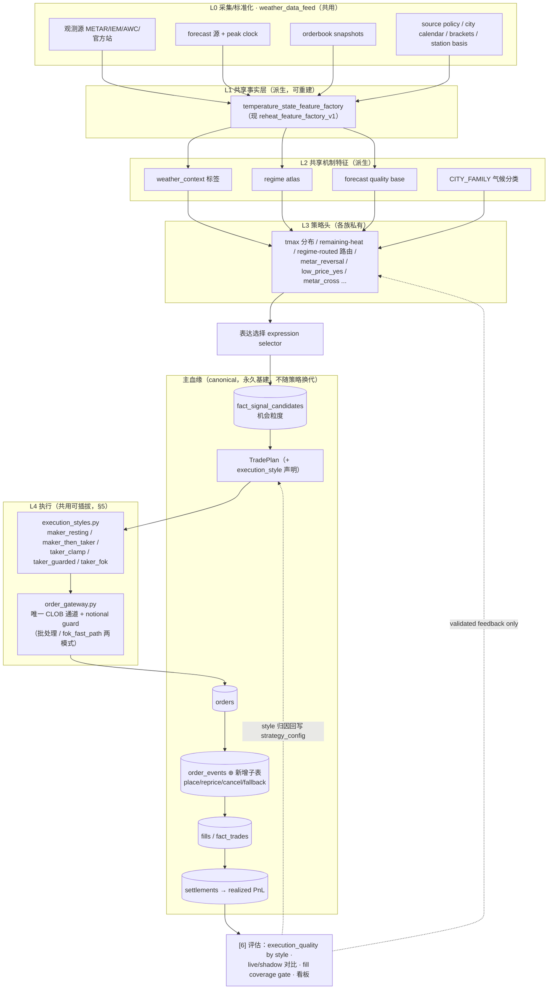

# Weather 特征资产分层与归属整理计划

Status: design-draft
Updated: 2026-07-05 v2 加入执行层可插拔设计 + 总架构图 + 血缘节点分类（§5–§6、P11–P12、Phase E）
Source of truth: no（归属结论落地后回写 WEATHER_ARCHITECTURE_SPINE / STRATEGY_REGISTRY / DOCS_INDEX）
Superseded by / Used by: WEATHER_ARCHITECTURE_SPINE.md; WEATHER_TEMPERATURE_CONTEXT_FEATURE_LAYER.md; WEATHER_STRATEGY_REGISTRY.md; docs/analysis/2026-07/2026-07-05-feature-layering-plan-review-v1.md

> 2026-07-05 Codex review note: 本文是设计草案，不能照单执行。逐条审阅和已落地差异见
> [2026-07-05-feature-layering-plan-review-v1.md](analysis/2026-07/2026-07-05-feature-layering-plan-review-v1.md)；
> 当前真实架构见 [WEATHER_ARCHITECTURE_SPINE.md](WEATHER_ARCHITECTURE_SPINE.md)。
> 已确认的主要修正：`CITY_FAMILY` 不是一套可强行合并的常量，已按两套命名 taxonomy 收口；
> `SKY_CODE` 的相同映射已收口到 `weather_data_feed.sky_cover`，但 METAR parser/fetch 逻辑尚未统一；
> `weather_station_basis_exec.py` 不是 active direct ClobClient 通道。

## 0. 为什么现在整理

研究在多条线上并行推进（forecast 尾部 / METAR reversal / regime atlas / tmax 分布 / 温度动态特征），
很多资产是"研究 A 顺带做的、研究 B 发现能复用"长出来的。结果是：

- **共享层的代码住在某一条策略线的研究目录里**，靠 `import research_xxx_v1` 被其它线复用；
- **共享层的数据产物住在 `docs/analysis/<月份>/generated/` 的带日期目录里**，被 60+ 处硬编码路径消费，
  且仍在被 mutate（当前 git status 里一堆 2026-06 目录下的 CSV 是 modified 状态）；
- 目录分类法是"策略族"（reheat_risk / forecast_quality / side_alpha），但很多资产实际是"层"
  （事实层 / 机制特征层 / 概率头），放错了抽屉。

本文做三件事：**(1) 给一张"谁是共用、谁归谁"的归属图（§1）；(2) 列出发现的不合理点和分阶段整改计划
（§2–§3）；(3) 执行层可插拔统一设计 + 总架构图 + 血缘节点分类（§5–§6）。**
不改任何策略结论，不重做执行/评估血缘（`order → fill → PnL` 链是永久基建，见 CLAUDE.md §1）；
主血缘唯一的变更是 additive 的 `order_events` 子表（§6.2）。

## 1. 分层归属图（按数据域 × 血缘层）

坐标系沿用 SPINE 的 [0]–[6]，但按"数据域"切开，回答"这个东西是共用的还是某条线私有的"。

### L0 采集 / 标准化 —— 全部共用，唯一归属 `weather_data_feed/`

| 资产 | 数据域 | 现状 |
|---|---|---|
| `observation_sources/`（metar / iem / aviationweather / router / aliases） | METAR·官方观测 | ✅ 已在正确位置 |
| `source_policy.py` / `source_registry.py` / `source_basis.py` | 观测源治理·station basis | ✅ |
| `city_calendar.py` / `market_brackets.py` / `snapshot_protocol.py` | 日历·bracket·快照协议 | ✅ |
| `observation_cache.py` / `observation_clock.py` | 观测缓存·时钟 | ✅ |

**规则（已在 CLAUDE.md §2，重申）**：新的共享数据逻辑只进这个包。
现状违例：METAR 解析 / SKY_CODE 映射仍在 6+ 个研究脚本和 4+ 个 ops runner 里各自复制（见 §2-P7）。

### L1 共享事实层（[0]，跨策略族共用）

| 资产 | 实际身份 | 现在住在哪（错位） |
|---|---|---|
| `research_reheat_feature_factory_v1.py` + `reheat_feature_rows.csv` | **全项目共享的日内温度状态底表**（city/date/hour/bracket/outcome 粒度，含 observed path、quotes、forecast peak、METAR core 字段）。TEMPERATURE_CONTEXT_FEATURE_LAYER 文档已承认它"不再只是 reheat 表" | 代码在 `scripts/analysis/reheat_risk/`，产物在 `docs/analysis/2026-06/generated/reheat_feature_factory_v1/`，16+ 脚本硬编码消费 |
| pass_through 专用 factory（`current_bracket_no_pass_through_v1_feature_factory/`） | 同一事实层的第二个平行实现 | REGISTRY 已有待办"两个 feature factory 收敛成一个" |
| forecast peak clock backfill（`runtime/.../forecast_peak_clock_backfill_v1.csv`） | 共享 forecast 时钟事实 | ⚠️ 已知 PIT 污染（2026-07-03 审计：pre-6/21 疑似近实况拼接），修复=Previous Runs API 重建 |
| `fact_signal_candidates` / `fact_trades` / orderbook snapshots | canonical 血缘表 | ✅ 位置正确，不动 |
| observed_max 旧底表 | dormant，保留备用 | ✅ 按 dormant 治理，不删不归档 |

### L2 共享机制特征 / 标签层（[1]，跨策略族共用）

| 资产 | 数据域 | 归属判定 |
|---|---|---|
| `weather_data_feed/weather_context.py`（sky/moisture/warming/wind/peak-clock 标签 + `temperature_context_features`） | 温度动态·机制 | **共用**，位置正确；live runner 与研究已同源消费 ✅ |
| `research_temperature_context_feature_layer_v1.py` | 温度上下文标签物化 | **共用**，但住在 reheat_risk 目录 |
| `research_intraday_weather_regime_atlas_v1.py`（regime atlas） | 天气模式/动态 | **共用机制图谱**（脚本自述"mechanism atlas, not a strategy optimizer"），被 21 处消费、含 tmax live candidate runner；住在 reheat_risk 目录是历史巧合 |
| `CITY_FAMILY` 城市气候分类（europe_cloud_break / continental_dry_hot / humid_low_latitude） | 城市气候参考数据 | **共用参考数据**，现状在 6 个研究脚本里各自硬编码 |
| forecast quality / reliability base（forecast_quality/ 系列） | forecast 可靠性 | **共用软标签层**（REGISTRY 已定性"只作共享可靠性层，非独立 live 策略"） |
| station-basis（source_basis + 相关 eval） | 结算源 basis | **共用**（低价彩票 telemetry、metar_cross、station_basis shadow 都在用） |

### L3 策略头（[1]–[2]，归属各策略族，私有）

| 策略头家族 | 消费哪些共享层 | 私有部分 |
|---|---|---|
| tmax_distribution p0–p6（pre_predict 分布头） | factory rows + atlas regime 特征 + forecast anchor | 分布融合/EV 选表达逻辑 |
| remaining_heat / hazard / peak_forming（reheat_risk） | factory rows + weather_context | 生存/hazard 模型本体 |
| regime_routed NO router v1–v4b | factory + atlas + wind/temperature context | 路由与 score 规则 |
| metar_reversal expression matrix | factory + 实时 METAR（L0） | rich-current collapse 触发形态 |
| low_price_yes 家族（lottery / integrated tail / HeadA） | forecast quality + station basis + book-state | selector、sizing tier、tail 校准 |
| metar_cross_prev_no | L0 观测层 latency 通道 | latency 抢单逻辑 |
| side_alpha / market_structure_edge / entry_timing 等 | canonical 表 | 各自切片逻辑 |

**判定原则**：跨 ≥2 个策略族消费的表/特征/参考数据 → 共享层（L0–L2），归位到共享位置；
只有一条线消费的模型/规则 → 策略头私有，留在该策略族目录，用版本号迭代没问题。

### L4 执行 / 稳定适配层（[3]–[4]）—— 详细设计见 §5

| 资产 | 现状 |
|---|---|
| `execution_pipeline.py` + `execution_policy.py` + `weather_order_executor.py` | ✅ 共享执行基建：plan 契约、报价引擎（mid_price_core_v1/v2、maker_queue_v2）、notional guard、cancel 生命周期、唯一 CLI 下单口 |
| `src/strategies/weather_edge_v1/tools/regime_routed_no_stable.py` | ✅ **正确范式**：live runner 依赖 stable 模块而非研究脚本（2026-07-04 收口） |
| 各 runner 的 maker/taker 执行形态 | ⚠️ 五种执行形态散在各 runner 私有实现里，三个 runner 绕过共享 executor 自建 CLOB client（见 §2-P11/P12、§5） |
| ops runners（tiny_live / shadow / TP exit） | ⚠️ 部分仍直接 import 研究脚本（见 §2-P5） |

## 2. 发现的不合理点（附证据）

按风险排序。P1/P5 涉及"live 路径依赖研究代码"，优先级最高。

- **P1 · 共享事实层住在研究目录 + docs 被当数据仓库。**
  `research_reheat_feature_factory_v1.py` 是全项目底表生成器，却带 `research_` 前缀住在
  `scripts/analysis/reheat_risk/`；产物写进 `docs/analysis/2026-06/generated/`（"2026-06"目录里的数据
  已经覆盖到 7 月还在 mutate，git diff 噪音大，也违反 SPINE 纪律 3"JSON/产物后续迁出 git"）。
  60+ 处硬编码 `docs/analysis/*/generated/*` 路径当输入。

- **P2 · factory 的上游输入是一串带日期的一次性 patch 目录。**
  它读 `m3_observed_max_v6_h10_21_iem_patch_20260617/`、`theta_no_wu_obs_patch_v1/`、
  `theta_no_iem_ext_patch_v7_20260617/`——三个当时救火用的 dated patch 是现在共享底表的 canonical 输入，
  血缘脆、无法从名字判断哪个是现行口径。

- **P3 · 两个 feature factory 平行存在。** pass_through 线有专用 factory 目录，REGISTRY 待办已记录，未执行。

- **P4 · 研究脚本互相 import 成了事实上的库。**
  `research_current_bracket_no_remaining_heat_model_v1` 被 5 个脚本 import、
  `research_regime_routed_no_expression_v1` 被 7+ 处 import、tmax p0→p1→p2→p3 链式 import，
  全靠 `sys.path.insert` + 两种不一致的 import 写法。版本后缀脚本（`_v1`）成了承重墙：
  改"一次性研究脚本"会静默改变别的线和 shadow runner 的行为。

- **P5 · live/shadow runner 直接 import 研究脚本，stable adapter 范式只落了一半。**
  `tmax_distribution_edge_live_candidate_v1.py`（当前在跑的 live candidate runner）sys.path 进
  `scripts/analysis/reheat_risk` import atlas + p0–p3；`regime_routed_no_shadow_v1.py` 同样。
  而 `regime_routed_no_tiny_live.py` 已经收口到 `regime_routed_no_stable`——正确范式存在但不一致。
  另外 `regime_routed_no_tiny_live.py` 还 `import weather_metar_cross_prev_no_shadow as metar`：
  METAR 实时逻辑住在另一条策略的 shadow runner 里被跨策略 import，应归 L0。

- **P6 · CITY_FAMILY 城市气候分类在 6 个脚本里硬编码。** 改一处漏五处；这是共享参考数据，应单一来源。
  Review v1 修正：实测是 5 份硬编码；4 份一致，atlas 的 `Beijing` taxonomy 有真实分叉，不能强行合并为单一 map。见 [feature-layering review v1](analysis/2026-07/2026-07-05-feature-layering-plan-review-v1.md)。

- **P7 · METAR 解析 / SKY_CODE 在研究和 ops 层重复复制。**
  `weather_data_feed.observation_sources` 已有标准实现，但 6+ 研究脚本、4+ ops runner 各自带一份
  SKY_CODE / 解析逻辑，与 CLAUDE.md"新共享数据逻辑只进 weather_data_feed"冲突。

- **P8 · 目录分类法与资产身份错位。** regime atlas（共享机制层）、tmax_distribution（pre_predict 性质的
  分布头）都住在 `reheat_risk/`，只因研究是从那条线顺带长出来的。REGISTRY 的血缘归属标注是对的，
  文件位置没跟上。

- **P9 · 文档意图与代码现实脱节。**
  `WEATHER_TEMPERATURE_CONTEXT_FEATURE_LAYER.md`（current-reference, source of truth for semantics）
  已宣布"factory 提升为 temperature_state_feature_factory"，但代码/路径没动；
  `WEATHER_ARCHITECTURE_SPINE.md` 仍是 design-draft、停在 06-09 Phase 2，Phase 3C/3D
  （generated 产物退出 git）一直没排期——本文 §3 接手这两项。

- **P10 · 已知数据口径债（不是新发现，纳入计划防遗忘）。**
  forecast peak clock backfill PIT 污染（影响 pre-6/21 的 atlas/tmax/metar-reversal 证据）；
  N100 事故后 orderbook 断采不可回填。任何共享层迁移后的 parity 校验要避开这两段污染窗口。
  Review v1 修正：PIT 污染表述已过时；Single Runs PIT backfill rejoin 后不再是旧的无条件污染，但它仍是研究 backfill 层，不是 production-native fact 字段。见 [feature-layering review v1](analysis/2026-07/2026-07-05-feature-layering-plan-review-v1.md)。

- **P11 · 执行形态各自为政，同类逻辑重复实现。**
  当前至少五种执行形态（清单见 §5.1），每种都长在某个 runner 的私有函数里：
  lottery 的 `maker_price_for_buy` + maker lifecycle 状态机、TP20 的 maker→cancel→taker fallback 状态机、
  regime_routed 的 top-ask clamp、theta current YES 的 fresh-book guarded taker、metar_cross 的 FOK。
  maker 定价、TTL/改价/撤单生命周期、taker fallback 判定这几块是明显可共用的，却没有共享实现——
  下一条策略再要 maker-first 就得第四次重写同一个状态机。
  Review v1 修正：高层重复判断成立，但不能直接抽成一个通用 `maker_then_taker` 状态机；lottery BUY lifecycle、TP20 SELL exit 和 FOK latency 语义不同，只能先抽纯 helper，再逐 runner parity。见 [feature-layering review v1](analysis/2026-07/2026-07-05-feature-layering-plan-review-v1.md)。

- **P12 · 三个下单通道绕过共享 executor，直接自建 ClobClient。**
  `weather_metar_cross_prev_no_shadow.py`（FOK live）、`all_yes_underround_fok_executor_v0.py`、
  `weather_station_basis_exec*.py` 各自持有 CLOB client 和签名逻辑，不走 `weather_order_executor.py`。
  后果：notional guard / cancel 生命周期 / order record schema / telegram 通知这些资金安全和血缘落库逻辑
  在这三个通道里是平行实现，审计面翻倍。metar_cross 有 latency 理由用进程内 fast path，
  但 fast path 应该是共享模块的一个模式，不是平行宇宙。
  Review v1 修正：active direct ClobClient 通道只确认 `metar_cross` 和 `all_yes_underround`；`station_basis` live placement 是未实现硬 gate，不应按活跃绕行通道收编。见 [feature-layering review v1](analysis/2026-07/2026-07-05-feature-layering-plan-review-v1.md)。

## 3. 整改计划（分阶段，live 不断、dormant 不删、血缘不动）

硬约束：不中断在跑的 tiny-live/shadow；不归档不删 dormant 资产；不动 `[3]–[6]` 执行/评估血缘；
生产行为变更走 git-first（weather-strategy-deploy 流程）。

### Phase A · 纯文档归位（无运行风险，先做）

1. 本文挂进 `WEATHER_DOCS_INDEX.md`（design-draft）。
2. `WEATHER_STRATEGY_REGISTRY.md` 的"共享 / 基础设施层"表按 §1 扩成 L0–L2 完整清单
   （补 weather_context、atlas、CITY_FAMILY、station basis 的共享定性）。
3. `WEATHER_ARCHITECTURE_SPINE.md` 状态从 design-draft 升级或标注 Phase 3C/3D 由本计划接管。

### Phase B · 共享层代码落位（低风险，逐个可验证）

4. **CITY_FAMILY 单一来源**：抽到 `weather_data_feed`（或 factory 输出列），6 个脚本改 import。
   验证：抽取前后对 6 个脚本产物做 diff（应 bit-identical）。
5. **METAR/SKY_CODE 收口**：研究/ops 里的复制版逐个替换为 `weather_data_feed.observation_sources`；
   与现实现语义不一致的，显式报错暴露差异（不静默兼容）。
6. **METAR 实时逻辑出 shadow runner**：`weather_metar_cross_prev_no_shadow` 里被跨策略 import 的
   fetch/parse 部分抽到 `weather_data_feed`，两个 runner 改依赖包；latency 策略逻辑留在原 runner。

### Phase C · runner 依赖收口（中风险，复制已验证的 stable adapter 范式）

7. `tmax_distribution_edge_live_candidate_v1.py` / `tmax_distribution_edge_shadow_v1.py` /
   `regime_routed_no_shadow_v1.py` 仿照 `regime_routed_no_stable.py`：把 runner 实际用到的
   atlas/p0–p3/expression 函数固化成 `src/strategies/weather_edge_v1/tools/*_stable.py`，
   runner 只 import stable 模块。
   验证：沿用 `replay_regime_routed_no_live_feature_parity_v1.py` 的 parity replay 先例，
   收口前后 shadow journal 逐行 diff 通过才切。

### Phase D · 事实层迁移与产物退 git（大动作，单独排期）

8. factory 更名迁移：`research_reheat_feature_factory_v1.py` →
   `scripts/etl/build_temperature_state_feature_factory.py`（名字对齐 TEMPERATURE_CONTEXT_FEATURE_LAYER
   文档已宣布的语义），输出改到 `runtime/weather_feature_store/`（不进 git）；
   旧路径保留 stub 报错指路（显式失败，不静默 fallback），消费脚本按 §1 优先级分批改。
9. 两个 factory 收敛（P3 待办），pass_through 线改读共享 factory + 参数化差异。
10. factory 上游三个 dated patch 输入（P2）改为 canonical 重建脚本或收编进 `scripts/etl/`，
    结合 forecast peak clock 的 Previous Runs API 重建（P10）一起做，避免迁移两次。
11. `docs/analysis/*/generated/` 冻结为历史证据（只读，不再被脚本写入），SPINE Phase 3C/3D 至此完成。

### Phase E · 执行层统一（可与 C/D 并行，B 之后开始；设计见 §5）

12. **契约先行（纯文档+schema，无运行风险）**：把 §5.2 的 `execution_style` + `style_params` 契约
    写进 `WEATHER_SYSTEM_CONTRACT.md`；现有 plan 上的 `execution_policy`/`quote_mode`/`maker_only`
    字段映射到新枚举，旧字段保留只读兼容并标注删除时机。
13. **maker lifecycle 状态机抽共享模块**：从 `low_price_yes_lottery_tiny_live.py` 和
    `low_price_yes_take_profit_exit_v1.py` 抽出统一状态机（§5.3），落
    `src/strategies/weather_edge_v1/tools/execution_styles.py`；lottery runner 先切，
    验证 = 切换前后 `maker_lifecycle_decisions.jsonl` 逐行 diff（同输入同决策）。
14. **直连通道收编**：metar_cross / all_yes_underround / station_basis 的自建 ClobClient 改为
    共享 `order_gateway`（§5.4）的 `fok_fast_path` 模式；order record 落同一 schema。
    latency 敏感线切换前必须实测 fast path 延迟不劣化，否则不切（显式记录原因）。
15. **order_event 子表进 canonical**：maker 生命周期事件（place/reprice/cancel/fallback）
    从各 runner 私有 JSONL 升级为 `order_events` 落库（§6.2 的唯一主血缘 additive 变更），
    走 weather-fact-rebuild 流程；`execution_quality` living doc 增加按 `execution_style` 归因的标准切片。

### 不做的事

- 不把 dormant（observed_max、Range RV、pre_predict 底表等）当垃圾清理——保留备用。
- 不为迁移写兼容 shim 长期共存：旧路径 stub 只报错指新路径，并标注删除时机。
- 不趁整理改任何策略参数/城市池/口径——本计划是纯结构性搬家，任何行为变化都算事故。

## 4. 归属速查（一句话版）

- **共用（动谁都影响全局）**：`weather_data_feed/` 全部、temperature state factory（现名 reheat factory）、
  weather_context 标签、regime atlas、CITY_FAMILY、forecast quality base、station basis、canonical fact 表、
  maker 执行基建、stable adapters。
- **策略私有（各自迭代互不影响）**：tmax 分布融合头、remaining-heat/hazard 模型、regime-routed 路由规则、
  metar_reversal 触发形态、low_price_yes selector/sizing、metar_cross latency 逻辑、各切片研究脚本。
- **灰色地带的判定法**：第二条策略线开始 import 它的那一刻，它就该升共享层并搬家；
  不搬就会重演 P1/P4/P5。

## 5. 执行层统一：可插拔 execution style 设计

### 5.1 现状盘点：五种执行形态，五份私有实现

| 执行形态 | 现有实现（私有位置） | 使用者 | 状态 |
|---|---|---|---|
| `maker_resting`（post-only 挂单 + TTL/改价/撤单 lifecycle） | `low_price_yes_lottery_tiny_live.py` 的 `maker_price_for_buy` + maker_lifecycle 决策流 | low_price_yes lottery | live |
| `maker_then_taker`（maker 优先 → cancel → taker fallback 状态机） | `low_price_yes_take_profit_exit_v1.py`（`active_maker → canceled_ready_for_taker → taker_fallback`） | TP20 exit（已停用，代码在）；current-YES maker-then-taker plan v0（design-draft，registry [4]） | disabled / draft |
| `taker_topask_clamp`（吃顶档 ask，shares clamp 到 ask size） | `regime_routed_no_tiny_live.py` 的 `clamp_order_shares_to_top_ask` | regime_routed NO | live |
| `taker_fresh_book_guarded`（fresh-book 校验 + cushion 上限 taker） | `weather_theta_current_yes_tiny_live.py` 的 `fresh_taker_quote` | current YES ×2 head | live |
| `taker_fok`（latency 抢单，FOK，直连 CLOB） | `weather_metar_cross_prev_no_shadow.py` 的 `build_live_fok_place_fn`；`all_yes_underround_fok_executor_v0.py` | metar_cross；all-YES underround | live / research |
| （报价引擎）`mid_price_core_v1/v2`、`maker_queue_v2` | `execution_policy.build_execution_quote` | 旧 live 已 shelved，引擎作为基建保留 | dormant 基建 |

共性拆解后，真正需要共用的只有四块：**maker 定价**（bid/ask/tick/max_price → 挂单价）、
**挂单生命周期状态机**（TTL、盘口漂移改价、撤单、fallback 触发）、**taker 保护**（fresh-book 校验、
cushion/clamp）、**下单网关**（签名、place/cancel、order record 落库、notional guard）。
形态之间的差异全部可以参数化，没有一个需要独立实现。

### 5.2 目标形态：plan 声明 style，executor 插拔执行

策略头不再各自实现执行，只在 TradePlan 上声明：

```json
{
  "execution_style": "maker_then_taker",
  "style_params": {
    "maker_price_mode": "join_bid | improve_bid | inside_spread",
    "ttl_seconds": 180,
    "reprice_max_times": 2,
    "reprice_trigger_ticks": 1,
    "fallback_style": "taker_fresh_book_guarded | none",
    "taker_max_cushion": 0.02,
    "order_type": "GTC | FOK",
    "clamp_to_top_size": true
  }
}
```

- 枚举与参数 schema 定义进 `WEATHER_SYSTEM_CONTRACT.md`；`execution_style + style_params`
  同时登记进 `strategy_config`，让 [6] 评估能按 style 归因（回答"这条策略亏在信号还是执行形态"）。
- 现有 plan 字段 `execution_policy` / `quote_mode` / `maker_only` 是这个契约的雏形，
  迁移期间双写，旧字段标注删除时机。
- **纯 maker、纯 taker、maker-then-taker 都是同一状态机的参数特例**：
  纯 maker = `fallback_style: none`；纯 taker = 跳过 maker 阶段；FOK = `order_type: FOK` 且无 lifecycle。

### 5.3 共享模块切分

```text
src/strategies/weather_edge_v1/tools/
  execution_styles.py     # 状态机 + maker 定价 + taker 保护（纯函数/纯状态转移，可离线 replay）
  order_gateway.py        # 唯一 CLOB 通道：签名、place/cancel、order record、notional guard
                          #   模式一：经 weather_order_executor 的 plan JSONL 批处理（现状主路径）
                          #   模式二：fok_fast_path —— 进程内直呼，给 latency 线用，同一 record schema
```

关键约束：`execution_styles.py` 必须是**无 IO 纯逻辑**（输入盘口快照+当前状态 → 输出动作），
这样才能：(a) 被 shadow runner 零成本复用做 would-trade 记录；(b) 用历史盘口离线 replay 验证
（现-YES maker-then-taker plan v0 里的 P1 hard gate"maker 成交集不 toxic"直接用它跑）；
(c) 切换时与旧实现做逐 tick parity diff。

### 5.4 迁移与安全边界

- 收编顺序按风险从低到高：先 lottery（已有 lifecycle journal 可 diff）→ TP exit（disabled，纯代码搬家）
  → regime_routed / theta（taker 逻辑简单）→ 最后 metar_cross fast path（latency 实测通过才切）。
- 资金安全硬边界不变：notional 上限、pause 开关、显式 live 确认全部留在 `order_gateway` 一层，
  收编后这些逻辑从三份平行实现变一份。
- 任何一步切换 = 行为等价搬家；执行行为若要变（比如给 regime_routed 换 maker-first），
  是独立的策略决策，走 shadow-first 流程，不夹在本计划里。

## 6. 总架构图与血缘节点分类

### 6.1 总架构（分层 × 主血缘串联）



### 6.2 节点分类：主血缘 / 派生 / 新增

用户关心的核心问题：这次整理动了血缘的什么。答案是**主血缘只有一个 additive 变更（order_events），
其余全是派生节点归位或代码节点新增**。

**主血缘节点（已存在，本计划不动）**：
`fact_signal_candidates → plan → orders → fills/fact_trades → settlements`、`strategy_config`、
live/shadow journal 对比、fill coverage gate。换策略、搬特征层、统一执行，这条链一律不重做。

**主血缘 additive 新增（唯一一个，Phase E-15）**：
`order_events` 子表——挂在 `orders → fills` 之间的生命周期事件流。它不是新血缘，
是把 lottery 已经在记的 `maker_lifecycle_decisions.jsonl` 从私有 JSONL 升格为 canonical 子节点，
让所有 maker 类策略的挂单/改价/撤单/fallback 都落同一张表。

**派生节点（挂在主血缘上，已存在，本计划只是归位/正名）**：

| 节点 | 派生自 | 本计划动作 |
|---|---|---|
| temperature state factory rows | L0 镜像数据 | 更名+迁 `runtime/` feature store（Phase D-8），身份不变 |
| weather_context / atlas / CITY_FAMILY 标签 | factory rows | 代码归位共享层（Phase B/D），仍是特征派生 |
| forecast quality / station basis 标签 | L0 | 定性为共享软标签层，不动 |
| shadow journals（zero-notional would-trade） | plan 的影子路径 | 不动；execution_styles 纯逻辑化后 shadow 复用度提高 |
| parity replay / 评估报告 | [6] | 不动，作为每次迁移的验收工具 |

**新增节点（本计划新建，全部是代码/配置节点，不新增数据血缘）**：

| 节点 | 层 | 来源 |
|---|---|---|
| `execution_styles.py`（可插拔执行状态机） | L4 代码 | 从 5 个 runner 私有实现收敛（Phase E-13） |
| `order_gateway.py`（唯一 CLOB 通道） | L4 代码 | 从 executor + 3 个直连通道收敛（Phase E-14） |
| `execution_style + style_params` 契约 | 契约 | SYSTEM_CONTRACT 新增枚举（Phase E-12），登记 strategy_config |
| `tools/*_stable.py` 适配器（tmax/regime shadow 线） | L4 代码 | 复制 regime_routed_no_stable 范式（Phase C-7） |
| `runtime/weather_feature_store/` | L1 物理落点 | factory 产物退出 docs/git 的新家（Phase D-8） |
