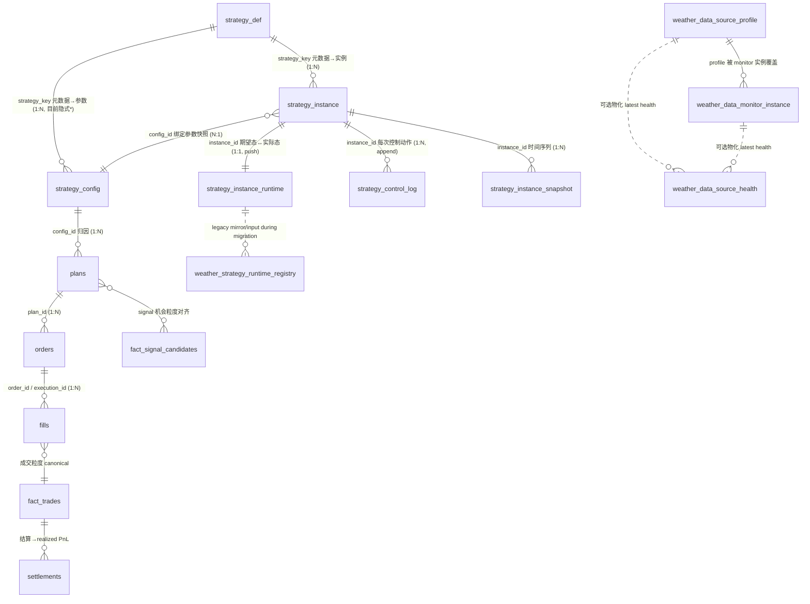

# 天气策略运行时平台 · 产品化设计

Status: historical-design / superseded-for-production-control
Updated: 2026-08-07 controller-only boundary correction
Source of truth: no（目标草案，未实现）；架构口径服从 WEATHER_ARCHITECTURE_SPINE / WEATHER_SYSTEM_CONTRACT
Superseded by / Used by: 取代 `docs/archive/UNIFIED_STRATEGY_PLATFORM_REFACTOR_PLAN.md`（旧 PMM/ARB 版）的目标定位；落地后由 WEATHER_STRATEGY_ENTRYPOINT / WEATHER_STRATEGY_REGISTRY 引用

> **当前边界：** 本文的 DB-first supervisor 与 launcher mutation 方案没有成为生产控制面。当前唯一 desired topology 是
> `src/strategies/runtime/production.yaml`，唯一启停/恢复入口是 `weather_production_ctl.py`。`instances.yaml` 和
> `strategy_instance` 只保留策略 catalog/血缘；`weather_strategy_launcher.py` 只读兼容，`start`、`stop`、
> `reconcile --apply` 均 fail closed。下文 supervisor/pmctl 内容只作历史设计，不得据此操作生产。

> 一句话：把现在"一个策略头 = 一个 600 行 runner + 一个 40 个环境变量的 `start_*.sh` + 一堆 pidfile/tmux"的作坊，
> 收敛成"策略头只实现一个接口 → 单一 supervisor 从 DB 定义的 instance 统一拉起/管控 → 状态与参数统一通过控制面改，且全程可追溯"。
> **主血缘（signal→plan→order→fill→settlement、fact 表）是永久基建，本平台围着它建，不动它。**

---

## 0. 为什么现在要做（现状盘点）

当前天气线的运行时是有机生长出来的，能跑，但已经到了边际维护成本很高的临界点：

| 维度 | 现状 | 痛点 |
|---|---|---|
| 策略头启动 | 历史上每个 head 各有一个 `scripts/ops/start_*.sh`，携带约 40 个 env-var 旋钮；这些 per-head wrapper 已删除 | 加一条策略 = 复制一个大 shell + 一个大 runner；改一个参数 = 改 shell 环境变量，无审计、无类型校验 |
| 运行时管理 | pidfile + `tmux -L weather-jrs` + nohup，散落在 `runtime/weather_edge_v1/<instance>/loop.pid` | 无统一 start/stop/restart；崩溃无自动重启记录；跨实例的全局 notional 上限没有任何一个进程看得见 |
| 策略代码 | 每个 runner（`low_price_yes_lottery_tiny_live.py` 等）各自重写：arg 解析、循环、pidfile、snapshot/book 拉取、shadow telemetry 落盘、plan/order emit、heartbeat JSON | 横切逻辑重复 N 份，改一处要改 N 处；行为不一致（有的写 shadow，有的不写） |
| 状态/元数据 | `weather_strategy_runtime_registry` 是**扫描反射**表：`refresh_weather_strategy_runtime_registry.py` 读本地 artifact 反推状态 | 状态是**被推断**出来的，不是**被设置**的；无法通过接口改状态；`lifecycle_status` 里混进了 `stale` 这种健康信号，三套 enum（lifecycle/execution/health）语义重叠 |
| 数据源配置 | 每城 source 在 `weather_data_feed/source_profiles.json`；拉取频率、`max_obs_age_min`/`max_snapshot_age_min` 陈旧阈值散落在各 `start_*.sh` 和 `observation_clock` | 每城 × feed 的 cadence/陈旧阈值/fallback 策略不是数据，是散落的字面量；**ECMWF 静默 fallback GFS（7/02-05 污染三天信号）这类事故没有一等公民的可观测入口** |
| 策略目录模型 | `src/strategies/<key>/manifest.yaml` + 手写 parser（`registry.py`）→ `StrategyManifest` | 只是**静态 catalog**，与运行时脱节；只有 5 个目录有 manifest；真正在跑的十几个 head 都不在这个模型里 |

> 历史包袱说明：2026-03 曾有一版 "Unified Strategy Platform"（`docs/archive/UNIFIED_STRATEGY_PLATFORM_REFACTOR_PLAN.md`），
> 定义了 `strategies / strategy_instances / strategy_instance_state / strategy_instance_snapshots` 和一个独立
> `runtime/strategy_runtime.db` + BFF server。那是**旧 PMM/ARB 框架**，已不是活跃主线。**本设计复用它的 instance/state/snapshot 词汇，
> 但重新挂到 weather canonical DB（`runtime/weather.db`）上，并针对天气线现实（多 head、shadow/telemetry 模式、notional 上限、数据源 cadence）扩展；不复活那个独立 DB。**

---

## 1. 目标与不变量

### 1.1 目标（本轮四个决策已锁定）

1. **统一策略接口**：每个策略头实现同一个 `StrategyHead` 接口，只负责"决策"，横切逻辑交给 harness。
2. **单一 supervisor 守护进程**：一个常驻进程从 DB 的 instance 定义统一 start/stop/restart/心跳/上限管控，取代 tmux+pidfile+nohup 散落。
3. **DB 优先控制面**：instance 的定义、参数、期望状态是 `runtime/weather.db` 里的行；状态统一通过控制面接口/CLI 改，不再改 shell 重启。
4. **数据源一等公民**：每城 × feed_kind × cadence × source × live_eligible 建成显式领域模型 + 表；静默 fallback 变成可观测、可 gate 的行。

### 1.2 硬不变量（不许被平台化破坏）

- **主血缘不动**：`fact_signal_candidates → plan → orders → fills/fact_trades → settlements`。平台是围绕它的编排层（L4.5/L5），产出仍写回同一批 canonical 表。
- **资金安全硬边界保留**：涉及 live / 私钥 / 余额 / 真实 CLOB 下单 / 删数据 / 远端部署，保留显式确认、暂停开关、notional 上限、可追溯日志（CLAUDE.md §3）。
- **不默认加 gate**：平台只保留"数据质量 / 资金安全 / 执行质量"这类正当边界，不把"追坏例子一条条补洞"的过拟合过滤器制度化。

### 1.3 关键张力及其化解：DB 优先控制面 vs git-first 硬边界

CLAUDE.md §3 规定生产行为变更（city_pools / paper_policy / execution_policy / live_cycle）走 **git-first**、不许直推、要可回溯。本轮选了 **DB 优先控制面**，二者有冲突点。化解方式（本设计的核心承诺）：

- **定义/参数仍以 git 为作者来源**：策略定义与 params 仍写成 git 里的 YAML spec，`sync` 进 DB 作为运行时事实源。DB 行记录 `spec_commit`（git sha）+ `params_hash`，任何运行时状态都能追回到一个已提交的定义。
- **只有"运行时控制动作"是 DB 可变的**：start/stop/pause/enable-live/set-cap/shelve 通过控制面接口改 DB，不改 shell。这就是"状态统一通过接口改"。
- **可追溯用 append-only 控制日志替代"每次改状态都 git commit"**：每一次控制面变更写 `strategy_control_log`（actor/action/from→to/reason/spec_commit/params_hash/ts）。这条 append-only 审计链是 DB-first 与"可追溯"硬边界共存的保证。
- **不可逆动作仍要显式确认**：enable-live 和调高 notional 上限，仍需显式确认 + 健康/coverage preflight，且落审计日志。

> 若你后续更想要**纯 git-first**（放弃 DB 可变、状态改回走 commit）或**纯 DB**（放弃 git 作者来源），这是一个可切换的策略点，在 §7 开放问题里标了出来。

---

## 2. 总体分面（四个平面）

把系统拆成四个正交平面，各有清晰边界和"真相源"。这是整个设计的骨架：

```text
┌─────────────────────────────────────────────────────────────────────┐
│  定义面 Definition   策略"是什么" = StrategyHead 接口 + ParamsSchema  │
│                      真相源: git YAML spec → sync 进 strategy_def 表   │
├─────────────────────────────────────────────────────────────────────┤
│  控制面 Control      期望状态 + 变更 = strategy_instance (desired)    │
│                      真相源: runtime/weather.db（DB 优先），经 pmctl  │
│                      改，全程 append 到 strategy_control_log          │
├─────────────────────────────────────────────────────────────────────┤
│  运行时面 Runtime    实际进程 + 心跳 = supervisor + BaseRunner harness│
│                      真相源: 各 head 由 harness push 的 runtime 行     │
├─────────────────────────────────────────────────────────────────────┤
│  数据源面 Data-Feed  每城×source/station 的配置、run、event、health     │
│                      真相源: git profile/registry → source profile 表 + │
│                      采集器 push 的 run/event/health 行                 │
└─────────────────────────────────────────────────────────────────────┘
                    ↓ 全部产出仍写回 ↓
       主血缘 canonical: fact_signal_candidates → plan → orders → fills → settlements
```

核心思想：**head 只写决策；harness 写横切；supervisor 写编排；控制面写期望；采集器写数据健康。** 每一层职责单一、接口清晰、可独立测试。

---

## 3. 定义面：策略接口 + 元数据模型

### 3.1 `StrategyHead` 接口（每个 head 实现）

head 只实现"决策"，横切（循环、心跳、下单、上限、shadow 落盘、日志）全部由 harness 提供。接口草图：

```python
class StrategyHead(Protocol):
    def describe(self) -> StrategySpec:
        """静态元数据：strategy_key、family、支持的 execution_mode、
        依赖的 feature 字段、依赖的 feed（required_feeds）、ParamsSchema。"""

    def setup(self, ctx: RunContext) -> None:
        """绑定只读 fact 表连接、已校验的 params、feature store refs、
        共享 order executor handle、feed 订阅。harness 已把这些准备好。"""

    def tick(self, ctx: RunContext) -> TickResult:
        """一个决策周期：读 candidates/book → 产出 decisions。
        返回 (shadow_telemetry_rows, accepted_plans, heartbeat_fields)。
        *不*自己 emit order、*不*自己写 pidfile、*不*自己算 cap——harness 干这些。"""

    def on_pause(self) -> None: ...
    def on_resume(self) -> None: ...
    def teardown(self) -> None: ...
```

关键动作：
- **~40 个 env-var 旋钮 → 一个 typed `ParamsSchema`（pydantic）**。`execution_policy`、风控上限、decision window、city pool、source policy 从 shell 字符串变成结构化字段。
- **健康是 head 主动上报，不是被扫描**：`tick` 返回 `heartbeat_fields`（last_data_ts、candidate_rows、blockers），harness 落到 runtime 表。这把 registry 从"扫描反射"翻转成"push 上报"。

### 3.2 `BaseRunner` harness（所有 head 共用，抽一次）

harness 拥有全部横切逻辑，是消灭重复的关键：

- 从控制面加载 instance 配置 + 校验 params；
- 主循环 cadence + 优雅 pause/resume/stop（响应 supervisor 信号）；
- 心跳：每 tick 把 runtime 行 push 进 DB；
- **notional 上限强制**：单单 / 单城单日 / 全局单日，emit 前拦截；
- order emit 走**共享 executor**（`weather_order_executor.py`，已有 batch + notional/pause/cancel 保护）；
- shadow/telemetry 统一落盘 + 写 `weather_strategy_shadow_queue`；
- 结构化日志。

移植后，每个 head 从"600 行 runner"缩到"几十行决策逻辑 + 一个 ParamsSchema"。

### 3.3 元数据模型：`strategy_def` 表（`StrategyManifest` 的头粒度 DB 继任者）

**先说清楚它和现有元数据的关系,别跑两套。** 策略元数据现在已经有一套——`src/strategies/<key>/manifest.yaml` → `schema.py`(`StrategyManifest`) → `registry.py`,字段还更全(`runner_module` / `strategy_module` / `meta`)。但它有两个问题:①**是文件版,不在 DB**;②**粒度停在"包"**。所以有一条三层粒度链,中间那层今天没有元数据的家:

| 粒度 | 谁在管 | 现状 |
|---|---|---|
| **包 package** | `StrategyManifest`(manifest.yaml) | 只有 5 个:`weather_edge_v1` 等 |
| **头/族 head/family** | ❌ 现在没人管 | lottery / tmax / regime… 全挤在 `weather_edge_v1` 一个包下 |
| **实例 instance** | `strategy_instance`(§4.2) | 18 个 |

`strategy_def` 的定位 = **把 `StrategyManifest` 提升成 DB 里、头粒度、从 committed spec 生成的继任者**,同时**取代**文件 manifest,不并排多养一套。仍以 git YAML 为作者来源,sync 进 DB:

```sql
CREATE TABLE strategy_def (
    strategy_key        TEXT PRIMARY KEY,       -- 头粒度 key,如 low_price_yes_lottery
    family              TEXT NOT NULL,
    strategy_group      TEXT NOT NULL DEFAULT 'weather',
    domain              TEXT NOT NULL DEFAULT 'weather',
    head_module         TEXT NOT NULL,          -- import 路径: 实现 StrategyHead 的类
    params_schema_ref   TEXT NOT NULL,          -- ParamsSchema 定位
    capabilities_json   TEXT NOT NULL,          -- 支持哪些 execution_mode: live/shadow/telemetry/...
    required_feeds_json TEXT NOT NULL DEFAULT '[]',  -- 依赖的 feed_kind 列表
    default_params_json TEXT NOT NULL DEFAULT '{}',
    spec_commit         TEXT,                   -- git sha，审计锚点
    is_active           INTEGER NOT NULL DEFAULT 1,
    description         TEXT NOT NULL DEFAULT '',
    updated_at_utc      TEXT NOT NULL
);
```

> **落地状态(2026-07-09):** B1 只建了空壳版(`strategy_key=family` + `spec_commit`,没有 `head_module` / `params_schema_ref` 等),因为这些字段依赖 `StrategyHead` 接口——**它们要到 B3 才有内容,那时 `strategy_def` 才真正取代 manifest、装得下头粒度元数据。** 在此之前它不承载独有信息;详见 §13.4 对 metadata / config / instance 三者关系的说明。

---

## 4. 控制面：instance 期望状态 + 审计（DB 优先）

### 4.1 状态模型统一（消除三套重叠 enum）

现状 `weather_strategy_runtime_registry` 把 `lifecycle_status`（9 值）、`execution_mode`（7 值）、`health_status`（6 值）混在一张表，且 `lifecycle_status=stale` 把健康信号塞进了生命周期字段。重构成**两轴期望 + 两轴运行时**：

| 轴 | 值域 | 谁写 | 语义 |
|---|---|---|---|
| `desired_status`（控制） | `enabled / paused / shelved / blocked` | 操作者经 pmctl | 我想让它处于什么状态 |
| `execution_mode`（控制） | `live / zero_notional_shadow / telemetry / paper / research / monitor / historical` | 操作者经 pmctl | 沿用现有词汇（看板依赖） |
| `process_status`（运行时，派生） | `running / starting / stopped / crashed / stale` | supervisor | 进程实际在不在 |
| `health_status`（运行时，派生） | `healthy / idle / stale / blocked / unknown` | harness push | 数据/决策是否新鲜可用 |

所有状态迁移只经控制面 API；运行时两轴由 push 派生。这样"策略在不在跑"（process）、"想不想让它跑"（desired）、"跑得健不健康"（health）、"以什么资金模式跑"（execution）彻底解耦。

### 4.2 `strategy_instance`（控制面，期望态）

一条运行时实例一行；合并现 registry 的配置列 + 旧平台的 `strategy_instances`：

```sql
CREATE TABLE strategy_instance (
    instance_id           TEXT PRIMARY KEY,
    strategy_key          TEXT NOT NULL REFERENCES strategy_def(strategy_key),
    label                 TEXT NOT NULL,
    family                TEXT NOT NULL,
    desired_status        TEXT NOT NULL,   -- enabled/paused/shelved/blocked
    execution_mode        TEXT NOT NULL,   -- live/zero_notional_shadow/...
    config_id             TEXT REFERENCES strategy_config(config_id),  -- 当前在跑的参数：引用既有 config 表，不在此内联复制
    params_hash           TEXT,            -- instance spec 指纹（B1 已建）；参数真相仍在 strategy_config
    spec_commit           TEXT,            -- 追回定义
    source_subscription_id TEXT,           -- → weather_strategy_source_subscription
    market_data_source    TEXT NOT NULL DEFAULT 'mac-weather-data-feed',
    cap_order_notional    REAL,
    cap_city_day_notional REAL,
    cap_total_day_notional REAL,
    live_enabled          INTEGER NOT NULL DEFAULT 0,  -- 硬 gate，enable-live 才置 1
    host                  TEXT NOT NULL DEFAULT 'mac',
    runtime_dir           TEXT,
    notes                 TEXT,
    created_at_utc        TEXT NOT NULL,
    updated_at_utc        TEXT NOT NULL
);
```

> **instance 是"实体"、config 是"值"(2026-07-09 修正):** 早先草案把 `params_json` 内联进本表,等于在 config 之外又存一份参数——错。参数真相源是既有 `strategy_config`(`config_id=hash(params)`),instance 只用 `config_id` **引用**当前在跑的那份;调参 = 换 `config_id` 指针(control_log 记 `edit_config`),instance_id 不变。`params_hash` 只是 spec 指纹(B1 已建),不是参数存储。三者关系详见 §13.4。
> **落地状态(2026-07-10):** B1.1 已给 `strategy_instance` 补 `config_id` 可空列、schema 迁移和 spec sync 支持；
> 当前 YAML spec 还没有写入明确 `config_id`，所以线上 DB 已有桥接列但实例绑定仍为 NULL。下一步是逐个 instance
> 用确定映射填 YAML，而不是从 `strategy_name` 模糊猜。

### 4.3 `strategy_instance_runtime`（运行时面，实际态，harness/supervisor push）

取代扫描：

```sql
CREATE TABLE strategy_instance_runtime (
    instance_id       TEXT PRIMARY KEY REFERENCES strategy_instance(instance_id),
    process_status    TEXT NOT NULL DEFAULT 'stopped',
    pid               INTEGER,
    supervisor_id     TEXT,
    heartbeat_at_utc  TEXT,
    last_tick_ts_utc  TEXT,
    last_data_ts_utc  TEXT,
    candidate_rows    INTEGER NOT NULL DEFAULT 0,
    plan_rows         INTEGER NOT NULL DEFAULT 0,
    live_order_rows   INTEGER NOT NULL DEFAULT 0,
    shadow_rows       INTEGER NOT NULL DEFAULT 0,
    health_status     TEXT NOT NULL DEFAULT 'unknown',
    blocker_count     INTEGER NOT NULL DEFAULT 0,
    blockers_json     TEXT NOT NULL DEFAULT '[]',
    summary_json      TEXT NOT NULL DEFAULT '{}',
    refreshed_at_utc  TEXT NOT NULL
);
```

> **历史落地状态(2026-07-10):** `strategy_instance_runtime` 建表、additive schema migration、
> `src.strategies.runtime.runtime_state.push_runtime_state()` 写入口、`weather_strategy_launcher.py reconcile`
> 观察/对账入口已完成。`/api/strategy-runtime/overview` 和 detail 已改为读
> `strategy_instance + strategy_instance_runtime`，不再以 `weather_strategy_runtime_registry` 作为主状态源。
> 当前 `reconcile` 只观察并写实际态；旧 `--apply` 启停能力已于 2026-08-07 移除，所有生产 mutation 走 controller。

### 4.4 `strategy_control_log`（append-only 审计，DB-first 的可追溯保证）

```sql
CREATE TABLE strategy_control_log (
    log_id        TEXT PRIMARY KEY,
    instance_id   TEXT NOT NULL,
    actor         TEXT NOT NULL,          -- 谁改的（cli 用户 / dashboard / supervisor）
    action        TEXT NOT NULL,          -- start/stop/pause/resume/enable_live/set_cap/edit_params/shelve/crash
    from_state    TEXT,
    to_state      TEXT,
    reason        TEXT,
    spec_commit   TEXT,
    params_hash   TEXT,
    ts_utc        TEXT NOT NULL
);
```

这张表 = "每次改状态都 git commit" 的等价审计替代物。任何 live 动作、上限调整、参数改动都在这里留痕。

### 4.5 `strategy_instance_snapshot`（可选，时间序列，供看板/回放）

沿用旧平台 `strategy_instance_snapshots` 设计（tick/pnl/equity/open_orders/... 时间序列），落后续阶段。

---

## 5. 运行时面：单一 supervisor 守护进程

一个常驻进程，取代 `tmux -L weather-jrs` + N 个 pidfile + N 个 `start_*.sh`。k8s 式 reconcile：**比对期望态 vs 实际态**。

职责：
1. **Reconcile loop**：读 `strategy_instance`。`desired_status=enabled` 的确保有 runner 子进程活着；`paused/shelved` 的停掉。
2. **子进程隔离**：每个 head 用 BaseRunner harness 跑在独立子进程（一个 head 崩不拖垮别的）。崩溃按 backoff 重启，写 `strategy_control_log`（action=crash）+ runtime 表。
3. **集中守硬边界**：启动 `live` 实例前，校验 `live_enabled=1` + 显式确认 + coverage/健康 preflight；**强制全局 notional 天花板（跨实例）——这是今天任何单个 shell 脚本都看不见的**。
4. **控制面 CLI/API `pmctl`**：`pmctl start|stop|pause|resume|enable-live|set-cap|status|logs <instance>`，写控制表 + 控制日志。**这就是"状态统一通过接口改"。看板调同一套 API。**
5. **心跳聚合**：harness push 各 instance runtime 行，supervisor 是 `process_status` 的写者。

进程模型细节：supervisor + 每实例一子进程，Mac 上（短期生产）用普通 Python supervisor（asyncio / multiprocessing），一次性挂在 tmux/launchd 下常驻。`host` 字段留了多机位。迁移期：现有 `start_*.sh` 先改成 `pmctl start <instance>` 的薄壳，之后删除。

> **历史落地状态(2026-07-10，现已被 controller 取代):** `weather_strategy_launcher.py reconcile` 曾是 supervisor 的第一版入口：
> 它从 DB 读 `strategy_instance.desired_status`，观察 tmux 实际状态，写入
> `strategy_instance_runtime.process_status`。其 `--apply` 直接启停能力已移除；当前 controller/manifest 架构不再沿
> DB desired-status supervisor 路线继续实现。

---

## 6. 数据源面：feed 订阅领域模型（一等公民）

把每城 × feed 的 source/cadence/健康建成显式模型。**这不只是配置整洁——它把"ECMWF 静默 fallback GFS"这类事故变成可观测、可 gate 的行。**

### 6.1 feed 分类

- `feed_kind`：`official_observation`（metar/asos）｜ `high_frequency_observation`（实时源）｜ `forecast` ｜ `orderbook`。
- 每个 (city, feed_kind) 有：source 链（primary/fallback）、cadence（poll 间隔，可 schedule-aware：metar 每小时 :51、forecast 每 N 小时、orderbook 每 60s）、live_eligible、timezone、station/icao、forecast 的 `CITY_MODEL`（ECMWF/GFS）、fallback 策略（显式失败 vs allow）、陈旧阈值（`max_snapshot_age_min`/`max_obs_age_min`——今天是每个脚本的 env var！）。

### 6.2 Claude 初版：`feed_source_profile`（评审对象，不直接落地）

```sql
CREATE TABLE feed_source_profile (
    profile_id           TEXT PRIMARY KEY,   -- city + feed_kind
    city                 TEXT NOT NULL,
    feed_kind            TEXT NOT NULL,
    source_class         TEXT NOT NULL,
    primary_source       TEXT NOT NULL,
    fallback_sources_json TEXT NOT NULL DEFAULT '[]',
    cadence_spec_json    TEXT NOT NULL,      -- {interval_sec} 或 cron-like schedule
    live_eligible        INTEGER NOT NULL DEFAULT 0,
    forecast_model       TEXT,               -- forecast kind: ecmwf_v4 / gfs
    timezone_name        TEXT,
    station_or_icao      TEXT,
    staleness_max_age_min REAL,
    fallback_policy      TEXT NOT NULL DEFAULT 'fail',  -- fail | allow（默认显式失败）
    blocked_reason       TEXT NOT NULL DEFAULT '',
    spec_commit          TEXT,
    updated_at_utc       TEXT NOT NULL
);
```

### 6.3 Claude 初版：`feed_subscription`（评审对象，不直接落地）

```sql
CREATE TABLE feed_subscription (
    subscription_id  TEXT PRIMARY KEY,
    instance_id      TEXT NOT NULL,
    city_pool        TEXT NOT NULL,
    feed_kind        TEXT NOT NULL,
    required         INTEGER NOT NULL DEFAULT 1,
    created_at_utc   TEXT NOT NULL
);
```

supervisor 启动 head 前校验：声明 `required` feed 若对其 city pool 陈旧/blocked，则不启动。**这是把散落在各脚本的 `max_obs_age` gate 收敛成集中的声明式数据质量检查——属于 CLAUDE.md 允许的正当数据质量边界，不是追坏例子的过拟合过滤。**

### 6.4 Claude 初版：`feed_health`（评审对象，不直接落地）

```sql
CREATE TABLE feed_health (
    city          TEXT NOT NULL,
    feed_kind     TEXT NOT NULL,
    last_ts_utc   TEXT,
    age_min       REAL,
    status        TEXT NOT NULL,   -- fresh / stale / fallback_active / blocked
    fallback_used TEXT,            -- 实际用了哪个 fallback source（非空即告警）
    refreshed_at_utc TEXT NOT NULL,
    PRIMARY KEY (city, feed_kind)
);
```

`fallback_used` 非空 = 一行可见告警。**7/02-05 那次 31 城静默 fallback GFS 污染信号，在这个模型下是一行 `fallback_active` + 告警，而不是三天后才发现的静默污染。** 直接呼应记忆 `n100-outage-mac-defacto-production` 与 `forecast-backfill-pit-contamination`。

### 6.5 评审结论：上面这版方向对，但粒度不够

Claude 这版的方向是对的：**profile 是目标配置，health 是实际状态，fallback 必须显性化**。这个抽象能解决 forecast 静默 fallback、source stale、脚本 env-var 分散等老问题。

但如果直接按 §6.2-6.4 落表，会有三个关键缺口：

1. **`profile_id = city + feed_kind` 太粗**。我们当前真实链路里，`Tokyo/high_frequency_observation` 可能是 `jma_amedas:44166`，`Singapore/high_frequency_observation` 是 `singapore_mss:S24`，`Seoul/Busan` 是 `amos_runway`，美国城市是 `noaa_madis_hfmetar`。同一个 city/feed_kind 下还可能同时有 primary、fallback、reference、runway 点位。`city+feed_kind` 一行表达不下。
2. **`feed_health` 只保最新健康，不能复盘交易**。fast-source prev-NO 需要回答“这笔单为什么下”：source 在几点观测、我们几点 detect、METAR 当时最新是哪份、盘口 ask 当时是多少。只有 latest health 不够，必须有 append-only event 表。
3. **跑道/高频/预测/盘口不是同一种事件**。它们可以共享基础字段（city/source/station/time/status/hash），但必须保留 source-specific payload：runway 点位温度、TAF signal、Open-Meteo model spread、orderbook quote 等。否则 dashboard 会“看起来统一”，但研究时丢证据。

因此，实际落地应把数据源面拆成四层：

```text
source catalog       源是什么、需不需要 key、能产什么
source profile       某城市启用哪个 source/station/runway、cadence/staleness/priority
source run/attempt   每轮采集跑了什么、哪些跳过、哪些失败
source event/fact    append-only 观测/预测/盘口事实，策略订单可引用
latest health        从 run/event 物化的最新健康读模型，给 dashboard 快速展示
```

### 6.5.1 最小落地版：先做管理面，不把明细搬进 DB

上面的四层是终局模型；第一版不需要一次建八张表，也不需要把每条观测/预报/盘口明细都搬进 DB。当前文件协议
（`latest.json` + append-only JSONL）已经能承载明细数据，DB 第一阶段应先解决**管理和可观测**。第一版只需要两张正本表，外加一个可选派生读模型：

```text
weather_data_source_profile       正本表: 城市有哪些可用 source/station/runway，它们应该怎么跑
weather_data_monitor_instance     正本表: 某个监控任务实际扫哪些城市/源、频率、输出路径、运行状态
weather_data_source_health        派生读模型/cache: 当前每个 city/source/station 是否新鲜、延迟如何、是否失败
```

这更像策略平台里的 `strategy_def / strategy_instance / runtime`：

| 策略侧 | 数据源侧 | 语义 |
|---|---|---|
| `strategy_def` | `weather_data_source_profile` | 能力/定义：Tokyo 有 JMA AMeDAS 44166，Busan 有 AMOS RKPK，Singapore 有 MSS S24 |
| `strategy_instance` | `weather_data_monitor_instance` | 运行实例：这个 monitor 只扫 Tokyo/Busan/Singapore，60 秒一次，输出到哪个目录 |
| `strategy_instance_runtime` | `weather_data_source_health` | 派生实际状态：最近一次什么时候成功、当前 age、detect lag、是否 stale/auth_required |

**数据明细仍然留在文件里**：

```text
output/source_events/sources.jsonl
output/high_frequency_observations/high_frequency_observations.jsonl
output/runway_observations/runway_observations.jsonl
output/forecast_enrichment/forecast_enrichment.jsonl
output/fast_source_stale_book/events.jsonl / quote_snapshots.jsonl
```

DB 存这些文件的 latest path / journal path / mtime / row_count / latest payload hash / sample JSON 即可。只有当某类查询需要频繁 join
（比如 source→METAR→orderbook 的完整事前回放），再补 `weather_data_source_event_index` 或专门 materialized view。

即使第一版不搬明细，profile 和 monitor instance 也必须把数据类型区分清楚，否则后面会把盘口、预报、METAR、机场源混在一起，管理面也会乱。

核心分类：

| data/feed 类型 | `feed_kind` | 管理对象 | 例子 | 管理字段 |
|---|---|---|---|---|
| 盘口数据 | `orderbook` | market/orderbook monitor | Polymarket CLOB book、paper snapshot | market source、proxy policy、scan interval、snapshot/output path、freshness threshold |
| 预报数据 | `forecast` | forecast enrichment monitor | Open-Meteo multi-model、TAF、vertical profile | model/source list、forecast run cadence、PIT/exact-run policy、output path |
| METAR / WU-like 官方观测 | `official_observation` | source-events monitor | AviationWeather、AWC cache、TGFTP、IEM/Synoptic | station/feed、expected cadence、detect lag stats、fallback chain、raw journal path |
| 实时机场/参考站 | `high_frequency_observation` | high-frequency monitor | JMA AMeDAS、FMI、Singapore MSS、NOAA MADIS HFMETAR、MGM、IMS、AMOS | station/feed、source_kind、scan interval、local active window、latency stats |
| 跑道点位 | `runway_observation` | runway monitor | 韩国 AMOS runway、AMSC AWOS | airport/station/runway、auth ref、scan interval、active window、output path |

第一版 `weather_data_source_profile` 建议字段：

```sql
feed_kind
city
source_key
source_kind
station_or_feed
icao
runway
source_role                 -- primary / fallback / reference / runway / forecast / orderbook
timezone_name
expected_cadence_sec
staleness_max_age_sec
active_window_json
requires_auth
auth_ref                    -- env/secret 名，不存明文
strategy_eligible
live_eligible
observed_median_lag_sec
observed_p95_lag_sec
notes
```

第一版 `weather_data_monitor_instance` 建议字段：

```sql
monitor_instance_id
display_name
feed_kind
sources_json
cities_json
scan_interval_sec
active_window_json
output_dir
latest_path
journal_paths_json
state_path
proxy_policy
auth_refs_json
desired_status             -- enabled / paused / shelved / blocked
host
tmux_session
start_command
summary_json
updated_at_utc
```

第一版 `weather_data_source_health` 不一定要建成物理表。它可以先是 API 读 `monitor_instance.latest_path` / `latest.json` 后动态算出来的 view；只有当 dashboard 查询慢、需要跨天趋势、或需要告警去重时，再物化成 cache 表。若物化，建议字段：

```sql
health_key
profile_id
monitor_instance_id
city
feed_kind
source_key
station_or_feed
runway
status                     -- fresh / stale / auth_required / fetch_failed / no_recent_attempt
latest_observation_ts_utc
latest_detect_ts_utc
latest_fetch_ts_utc
age_sec
detect_lag_sec
source_fetch_latency_sec
latest_payload_hash
latest_path
journal_path
latest_file_mtime_utc
rows_24h
last_error
summary_json
refreshed_at_utc
```

也就是说，**第一版不是数据仓库明细表，而是数据源运行管理表**。真正需要落 DB 的正本是 `profile` 和 `monitor_instance`；
`health` 是从 monitor output 派生出来的读模型，不是新的 truth。Tokyo/JMA 和 Busan/AMOS 是两条 `profile`；
“fast-source prev-NO trial 只监控 Tokyo/Busan/Singapore、60 秒扫一次、输出到 `/Volumes/jrs/.../fast_source_prev_no_trial`”
是一条 `monitor_instance`；当前 Tokyo/JMA 是否新鲜、平均延迟多少，是 API 从 latest output 计算出的 `health`。

### 6.6 修订版表设计：配置层

**A. `weather_data_source_catalog`：source/provider 目录**

一行一个 source adapter，不按城市拆。它回答“这个源是什么、是否需要授权、产物类型是什么”。

```sql
CREATE TABLE weather_data_source_catalog (
    source_key          TEXT PRIMARY KEY,  -- aviationweather_metar / jma_amedas / fmi / amos_runway / open_meteo_multi_model
    provider            TEXT NOT NULL,
    feed_kind           TEXT NOT NULL CHECK (
        feed_kind IN ('official_observation','high_frequency_observation','runway_observation','forecast','orderbook')
    ),
    source_kind         TEXT NOT NULL,     -- metar_api / official_airport_station / runway_air_temperature / forecast_model / clob_book
    requires_auth       INTEGER NOT NULL DEFAULT 0,
    auth_ref            TEXT,              -- env var 名或 secret ref；不存明文 key/cookie
    default_cadence_sec REAL,
    default_timeout_sec REAL,
    capabilities_json   TEXT NOT NULL DEFAULT '{}',
    notes               TEXT NOT NULL DEFAULT '',
    spec_commit         TEXT,
    updated_at_utc      TEXT NOT NULL
);
```

**B. `weather_city_source_profile`：city × source × station/runway 配置**

这是 `weather_data_feed/source_profiles.json`、`high_frequency_observation_sources.py` registry、`runway_sources.py` registry 的 DB 目标形态。粒度必须到 source/station/runway，而不是 city/feed_kind。

```sql
CREATE TABLE weather_city_source_profile (
    profile_id              TEXT PRIMARY KEY,
    city                    TEXT NOT NULL,
    target_unit             TEXT,
    timezone_name           TEXT NOT NULL,
    feed_kind               TEXT NOT NULL,
    source_key              TEXT NOT NULL REFERENCES weather_data_source_catalog(source_key),
    source_role             TEXT NOT NULL CHECK (
        source_role IN ('primary','fallback','reference','runway','forecast','orderbook')
    ),
    priority_rank           INTEGER NOT NULL DEFAULT 0,
    station_or_feed         TEXT,
    icao                    TEXT,
    runway                  TEXT,
    source_kind             TEXT,
    settlement_source_class TEXT,
    mapping_rule            TEXT,
    live_eligible           INTEGER NOT NULL DEFAULT 0,
    strategy_eligible       INTEGER NOT NULL DEFAULT 0, -- 可用于策略，不等于 live 下单
    cadence_spec_json       TEXT NOT NULL DEFAULT '{}',
    active_window_json      TEXT NOT NULL DEFAULT '{}', -- local daytime window 等
    staleness_max_age_sec   REAL,
    fallback_policy         TEXT NOT NULL DEFAULT 'fail',
    blocked_reason          TEXT NOT NULL DEFAULT '',
    notes                   TEXT NOT NULL DEFAULT '',
    spec_commit             TEXT,
    updated_at_utc          TEXT NOT NULL,
    UNIQUE(city, feed_kind, source_key, station_or_feed, runway)
);
```

`strategy_eligible` 和 `live_eligible` 要分开：例如跑道点位/参考站可以用于研究或辅助信号，但不是结算 truth；只有策略明确声明并通过验证后才可进入 live decision。

**C. `weather_strategy_source_subscription`：策略实例订阅源**

不要只写 `feed_kind`，要能指定“需要 official_observation fresh；可选 high_frequency_observation；forecast 必须 exact model；orderbook 必须 fresh CLOB”。

```sql
CREATE TABLE weather_strategy_source_subscription (
    subscription_id       TEXT PRIMARY KEY,
    instance_id           TEXT NOT NULL,
    feed_kind             TEXT NOT NULL,
    source_key            TEXT,             -- NULL = 该 feed_kind 的 profile primary/fallback 链
    city_pool             TEXT NOT NULL DEFAULT 'configured',
    required              INTEGER NOT NULL DEFAULT 1,
    max_age_sec_override  REAL,
    min_quality_status    TEXT NOT NULL DEFAULT 'fresh',
    usage_role            TEXT NOT NULL,    -- decision_input / feature_only / telemetry / audit
    created_at_utc        TEXT NOT NULL
);
```

### 6.7 修订版表设计：运行事实层

**D. `weather_data_source_run`：producer cycle 摘要**

一轮 producer 一行，用来回答“服务有没有跑、跑了哪些源、哪些因为 local window/cadence 被跳过”。

```sql
CREATE TABLE weather_data_source_run (
    run_id                  TEXT PRIMARY KEY,
    producer                TEXT NOT NULL,  -- weather_data_feed_service.high_frequency_observations
    runtime_root            TEXT,
    output_dir              TEXT,
    schema_version          TEXT,
    generated_at_utc        TEXT NOT NULL,
    status                  TEXT NOT NULL,
    requested_sources_json  TEXT NOT NULL DEFAULT '[]',
    requested_cities_json   TEXT NOT NULL DEFAULT '[]',
    rows                    INTEGER NOT NULL DEFAULT 0,
    ok_sources              INTEGER NOT NULL DEFAULT 0,
    empty_sources           INTEGER NOT NULL DEFAULT 0,
    non_ok_sources          INTEGER NOT NULL DEFAULT 0,
    skipped_inactive_count  INTEGER NOT NULL DEFAULT 0,
    skipped_cadence_count   INTEGER NOT NULL DEFAULT 0,
    preserved_rows          INTEGER NOT NULL DEFAULT 0,
    summary_json            TEXT NOT NULL DEFAULT '{}',
    source_path             TEXT,
    created_at_utc          TEXT NOT NULL DEFAULT (strftime('%Y-%m-%dT%H:%M:%SZ', 'now'))
);
```

**E. `weather_data_source_attempt`：每个 source/city 的采集尝试**

一轮 run 里，每个 source/city 一行。`auth_required`、`not_implemented`、`fetch_failed`、`inside_source_min_interval` 都落这里，不要只在 JSON 里。

```sql
CREATE TABLE weather_data_source_attempt (
    attempt_id              TEXT PRIMARY KEY,
    run_id                  TEXT NOT NULL REFERENCES weather_data_source_run(run_id),
    profile_id              TEXT,
    city                    TEXT NOT NULL,
    feed_kind               TEXT NOT NULL,
    source_key              TEXT NOT NULL,
    station_or_feed         TEXT,
    status                  TEXT NOT NULL,  -- ok / empty / fetch_failed / auth_required / skipped_cadence / skipped_inactive
    error                   TEXT,
    fetch_start_utc         TEXT,
    fetch_end_utc           TEXT,
    latency_sec             REAL,
    active_window_status    TEXT,
    cadence_status          TEXT,
    rows_returned           INTEGER NOT NULL DEFAULT 0,
    payload_hash            TEXT,
    created_at_utc          TEXT NOT NULL DEFAULT (strftime('%Y-%m-%dT%H:%M:%SZ', 'now'))
);
```

**F. `weather_data_source_event`：append-only 观测/预测/盘口事实**

这是最关键的一张表。source-events、高频机场站、跑道点位、预测 enrichment 都可以进入这里；source-specific 大字段放 `payload_json`，常用检索字段拉平。

```sql
CREATE TABLE weather_data_source_event (
    event_id                TEXT PRIMARY KEY,
    run_id                  TEXT REFERENCES weather_data_source_run(run_id),
    attempt_id              TEXT REFERENCES weather_data_source_attempt(attempt_id),
    profile_id              TEXT,
    event_type              TEXT NOT NULL CHECK (
        event_type IN ('official_observation','high_frequency_observation','runway_observation','forecast_enrichment','orderbook_quote')
    ),
    city                    TEXT NOT NULL,
    target_date             TEXT,
    feed_kind               TEXT NOT NULL,
    source_key              TEXT NOT NULL,
    source_kind             TEXT,
    station_or_feed         TEXT,
    icao                    TEXT,
    runway                  TEXT,
    observation_ts_utc      TEXT,
    source_report_ts_utc    TEXT,
    local_detect_ts_utc     TEXT,
    fetched_at_utc          TEXT,
    source_age_sec          REAL,
    detected_after_report_sec REAL,
    unit                    TEXT,
    temp_c                  REAL,
    temp_f                  REAL,
    temp_round_c            INTEGER,
    temp_round_f            INTEGER,
    dewpoint_c              REAL,
    pressure_hpa            REAL,
    humidity                REAL,
    wind_speed_kt           REAL,
    wind_dir_deg            REAL,
    point_temp_c            REAL,
    tdz_temp_c              REAL,
    mid_temp_c              REAL,
    end_temp_c              REAL,
    forecast_model          TEXT,
    forecast_issue_ts_utc   TEXT,
    forecast_peak_time_local TEXT,
    forecast_max_temp       REAL,
    market_id               TEXT,
    condition_id            TEXT,
    token_id                TEXT,
    best_bid                REAL,
    best_ask                REAL,
    payload_hash            TEXT NOT NULL,
    raw_payload_hash        TEXT,
    payload_json            TEXT NOT NULL DEFAULT '{}',
    source_path             TEXT,
    created_at_utc          TEXT NOT NULL DEFAULT (strftime('%Y-%m-%dT%H:%M:%SZ', 'now')),
    UNIQUE(event_type, source_key, city, station_or_feed, runway, observation_ts_utc, payload_hash)
);
```

这张表不是替代 `fact_trades`，而是给策略提供**输入证据血缘**。订单表/plan 可以通过 `order_payload` 或后续桥表引用 `event_id`，实现“这笔 Helsinki 17 NO 是因为 FMI 哪条观测触发”的 drilldown。

**G. `weather_data_source_health`：latest health 读模型（可选物化）**

第一版可由 API 从 `weather_data_monitor_instance.latest_path` / latest JSON 动态计算，不必建表。只有当 dashboard 查询慢、需要告警去重、跨天趋势或离线健康统计时，再物化成这张表。主键用 `profile_id` 或 city/source/station/runway，不用 `city+feed_kind`。

```sql
CREATE TABLE weather_data_source_health (
    health_key              TEXT PRIMARY KEY,
    profile_id              TEXT,
    city                    TEXT NOT NULL,
    feed_kind               TEXT NOT NULL,
    source_key              TEXT NOT NULL,
    station_or_feed         TEXT,
    runway                  TEXT,
    status                  TEXT NOT NULL, -- fresh / stale / fallback_active / blocked / auth_required / no_recent_attempt
    latest_event_id         TEXT,
    latest_observation_ts_utc TEXT,
    latest_detect_ts_utc    TEXT,
    latest_run_id           TEXT,
    latest_attempt_id       TEXT,
    age_sec                 REAL,
    staleness_max_age_sec   REAL,
    fallback_used           TEXT,
    source_status           TEXT,
    error                   TEXT,
    rows_24h                INTEGER,
    ok_attempts_24h         INTEGER,
    failed_attempts_24h     INTEGER,
    median_detect_lag_sec_24h REAL,
    summary_json            TEXT NOT NULL DEFAULT '{}',
    refreshed_at_utc        TEXT NOT NULL
);
```

### 6.8 修订版表设计：策略研究/归因层

**H. `weather_source_alignment_feature`：source ↔ METAR/WU/settlement 对齐特征**

fast-source 策略真正要研究的是“快源是否领先下一份 METAR/WU，以及领先后盘口有没有动”。这个不应塞在 source event 表里，应单独 materialize 成 feature。

```sql
CREATE TABLE weather_source_alignment_feature (
    feature_id              TEXT PRIMARY KEY,
    event_id                TEXT NOT NULL REFERENCES weather_data_source_event(event_id),
    city                    TEXT NOT NULL,
    target_date             TEXT NOT NULL,
    source_key              TEXT NOT NULL,
    station_or_feed         TEXT,
    observation_ts_utc      TEXT,
    local_detect_ts_utc     TEXT,
    source_temp_c           REAL,
    source_round_c          INTEGER,
    latest_metar_event_id   TEXT,
    latest_metar_report_ts_utc TEXT,
    latest_metar_detect_ts_utc TEXT,
    latest_metar_temp_c     REAL,
    metar_running_max_round_c INTEGER,
    source_obs_after_latest_metar_sec REAL,
    crossed_prev_max        INTEGER NOT NULL DEFAULT 0,
    t_minus_1_no_bracket_c  INTEGER,
    next_metar_report_ts_utc TEXT,
    next_metar_temp_c       REAL,
    next_metar_round_c      INTEGER,
    next_metar_crossed      INTEGER,
    lead_to_next_metar_sec  REAL,
    basis_temp_c            REAL,
    feature_json            TEXT NOT NULL DEFAULT '{}',
    created_at_utc          TEXT NOT NULL DEFAULT (strftime('%Y-%m-%dT%H:%M:%SZ', 'now')),
    UNIQUE(event_id, latest_metar_event_id)
);
```

这张表是 Tokyo/Singapore/Helsinki 试点的核心：dashboard 可以直接展示 `source obs → detect → latest METAR → next METAR → orderbook` 的时间线，研究脚本也不用每次重新 join JSONL。

### 6.9 与现有 schema / 产物的关系

当前 `weather_dashboard/db/schema_canonical.sql` 已经有：

- `weather_observation_events` / `weather_intraday_state_rows`：适合 WU/IEM-like 历史观测和 intraday state，不足以表达多 source/station/runway 的实时采集健康和交易触发证据；
- `strategy_def / strategy_instance / strategy_instance_runtime / strategy_control_log`：已有第一版；数据源 profile/monitor 表也已有第一版；
- `/api/data-sources`：已有只读接口，但当前主要是 forecast/fact_trades、source alias、snapshot 文件盘点，不是运行时 source health。

所以落地时不要改造 `weather_observation_events` 去承载所有东西。正确路线是：

1. **先建两张管理面正本表**：`weather_data_source_profile / weather_data_monitor_instance`，用 `feed_kind` 区分盘口、预报、METAR、实时机场源和跑道源；`weather_data_source_health` 先作为 API/view 从 latest output 动态计算，必要时再物化：
   - `output/source_events/latest.json` + `sources.jsonl`；
   - `output/high_frequency_observations/latest.json` + `high_frequency_observations.jsonl`；
   - `output/runway_observations/latest.json` + `runway_observations.jsonl`；
   - `output/forecast_enrichment/latest.json` + `forecast_enrichment.jsonl`；
   - `output/fast_source_stale_book/*` / `output/fast_source_prev_no_trial/*` 作为策略/盘口对齐输入。
2. **dashboard 先只读展示**：`/data-sources` 改读 source profile、monitor instance，并动态计算 latest health；明细 drilldown 仍跳到原始 JSONL/sample，不把控制动作放公网。
3. **策略订单归因先用文件指针**：fast-source prev-NO 的 `orders.jsonl` 已经进入 canonical orders/fills；下一步在 plan/order payload 里保留 `source_profile_id`、`monitor_instance_id`、`source_obs_ts_utc`、`payload_hash`、`source_journal_path`，足够回到 JSONL 找原始证据。
4. **最后才拆明细/对齐表和加 supervisor required-feed gate**：等 health materialization 稳定后，再按需要拆 `event_index`、`alignment_feature`、`subscription`，并让 supervisor 用 source health 做启动/交易前数据质量校验。

这保证不会把研究源、结算源、跑道 microclimate、盘口 telemetry 混成一个“看起来统一但没法审计”的表。

---

## 7. 看板集成（概要，详见 §12）

看板现在读 `weather_strategy_runtime_registry`，且**刻意只读**（WEATHER_DASHBOARD.md §0：不下单、不碰资金/不可逆操作），公网部署、读的是**可能滞后的镜像**。因此控制面**不能**直接塞进公网看板。迁移原则：
- **registry 表降级为读模型**：从新的 control + runtime 表物化刷新，保留给 FE 兼容。
- **控制动作与只读看板分面**：pause / enable-live / set-cap 走**本机 ops 控制面**（`pmctl` + 与 supervisor 同机的 localhost-only 控制页），**不放在公网只读看板上**。看板只**展示**控制状态（期望态 vs 实际态 + `strategy_control_log` 时间线），不 mutate。
- **数据源健康面板**：`/data-sources` 从"按文件名间隔现算 cadence"升级为读
  `weather_data_source_profile` + `weather_data_monitor_instance`，再从 latest output 动态计算 health，
  并能 drilldown 到原始 JSONL/sample；静默 fallback 和 source/METAR 对齐异常直接飘红。

完整的看板升级/新增模块、接口、与硬口径一致性见 **§12**；数据模型关联见 **§13**。

---

## 8. 落地分期（每期独立可交付，主血缘全程不动）

| Phase | 内容 | 交付判据 |
|---|---|---|
| **0 · 接口与 harness（零行为变更）** | 从一个 head（建议 `low_price_yes_lottery`）抽出 `BaseRunner`，定义 `StrategyHead` protocol + `ParamsSchema`，把这一个 head 移植过去 | 新旧并行跑 shadow，emit/telemetry **逐笔 parity**（TDD parity test），证明无回归 |
| **1 · 控制面 + 运行时表 + supervisor** | 历史上落过 catalog/runtime 表；生产控制已改由 `production.yaml + weather_production_ctl.py` 承担 | 本行旧 DB-supervisor 路线不再继续；catalog 只作血缘/展示 |
| **2 · 数据源领域模型** | 先落 `weather_data_source_profile / weather_data_monitor_instance`，从 `source_profiles.json`、high-frequency/runway registries 和 runtime output 回填；health 先动态计算，必要时再物化；加集中陈旧/fallback 告警 | 静默 GFS fallback 类事故变成 source health 告警；fast-source monitor 实例、城市源覆盖、输出路径和延迟都能在 dashboard 看见 |
| **3 · 全量移植 head** | 按 family 逐族移植；删各自 `start_*.sh` + 重复的 loop/pidfile/telemetry 代码；registry → 读模型 | `scripts/ops/start_*.sh` 与 bespoke runner 大幅减少；重复横切代码归零 |
| **4 · 看板控制动作 + 数据源面板** | 看板接 `pmctl` 控制动作 + `weather_data_source_health` 面板；下线扫描式 `refresh_weather_strategy_runtime_registry.py` | 从看板可 pause/enable-live/set-cap；数据源健康可视 |

Phase 0/1 只碰一个 head，风险最低；主血缘（fact 表、executor、settlement）全程不动。

---

## 9. 备选方案与取舍（本轮已定的分支，留档）

| 决策点 | 选定 | 备选 | 为什么不选备选 |
|---|---|---|---|
| 启动器进程模型 | 单一 supervisor 守护 | ① 薄 `pmctl` CLI + 共享 BaseRunner，仍多进程自管理 ② 外部编排（systemd/launchd per-instance） | ① 无法做跨实例全局 notional 上限、无统一崩溃重启；② 对个人 Mac 单机过重，且状态仍散在 systemd 外 |
| 事实来源 | DB 优先控制面（定义 git 作者 + spec 锚 + append log） | ① 纯 hybrid（定义+状态都 git）② 纯 DB（放弃 git 作者来源） | ① "改状态要 commit" 不够即时；② 丢失 git 审计，撞 git-first 硬边界 |
| 数据源建模 | source catalog/profile/run/event/health/alignment 分层 | 继续 `source_profiles.json` + 脚本 env var；或只建 `feed_health` latest 表 | 静默 fallback 无可观测入口，cadence/阈值无法集中 gate；只建 latest health 不能复盘交易触发证据 |
| 元数据模型落点 | 挂到 weather.db canonical | 复活独立 `strategy_runtime.db`（旧平台） | 二库分裂、与主血缘脱节，正是旧平台被搁置的原因之一 |

---

## 10. 风险与开放问题

1. **全局 notional 上限需读共享账本**：跨实例天花板要从 `fact_trades` 读当日已用 notional，需定义读路径与刷新频率。
2. **supervisor 单点**：靠 launchd 自动重启 + 心跳文件兜底；supervisor 崩溃期间已 live 的子进程行为要定义（继续跑还是自停）。
3. **DB 成安全关键**：DB-first 后 weather.db 是安全关键路径，需保证 WAL + 备份；`strategy_control_log` 是审计正本。**请确认这套 append-log 审计对你达到"可追溯"硬边界的心理阈值**——若不够，退回 hybrid（状态改也走 git）。
4. **定义-in-git vs DB-first 的最终形态**（§1.3）：目前折中在 spec_commit 锚 + control_log。若你更想纯 git 或纯 DB，这是一个明确的切换点。
5. **live decision-input 迁移边界**：`WEATHER_ARCHITECTURE_SPINE` 记了 feature-layer 尚未全量迁移到 live decision-input；harness 的 `RunContext` 要对齐这条边界，不越界替换 live 输入。

---

## 11. 与现有文档的关系

- 架构定位：本文是 `WEATHER_ARCHITECTURE_SPINE` 的 L4.5/L5 编排层目标草案，不改 [0]–[6] 主血缘节点。
- 字段契约：新表落地时字段口径服从 `WEATHER_SYSTEM_CONTRACT`。
- 部署流程：Phase 1+ 的生产行为变更仍走 `weather-strategy-deploy` skill 的 git-first 流程（§1.3 的化解在此生效）。
- 取代：`docs/archive/UNIFIED_STRATEGY_PLATFORM_REFACTOR_PLAN.md` 的目标定位（旧 PMM/ARB 版），复用其 instance/state/snapshot 词汇但重新挂到 weather canonical DB。

---

## 12. 看板升级与改进计划

### 12.1 现状盘点（看板不是白纸，是已成型的观测面）

看板已重做过一版，当前是**探针生命周期 IA**（`WEATHER_DASHBOARD.md` 为口径 source of truth）。前端 `frontend/strategy_dashboard`，后端 `weather_dashboard/api`。当前路由分三代并存：

| 代 | 路由 | 页/职责 | 数据来源 |
|---|---|---|---|
| **v2（当前）** | `/` 今日总览 | 脉搏：探针健康 / 在险资金 / 已结算 / 最近研究线 | registry + latest_summary.json + fact_trades |
| | `/probes` `/probes/:instance` | 探针在跑：live & shadow 健康、执行质量、参数 | `weather_strategy_runtime_registry`（**扫描**）+ `latest_summary.json` |
| | `/research` `/research/:lineId` | 研究证据登记 + 变体对比 | `docs/analysis/**/generated/*/summary.json` |
| | `/performance` | live_real 持仓 / 在险资金 / 已结算 PnL / 对账 | canonical `fact_trades` |
| | `/lineage/:date` | 单日逐笔 signal→plan→order→fill→settlement | canonical 全链 |
| | `/data-sources` | 预测源 / METAR 观测源 / 盘口快照 | fact_trades + aliases.py + **文件名间隔现算 cadence** |
| | `/glossary` `/archive` | 术语字典 / 归档 | — |
| **旧 weather** | `/weather/runtime` `/weather/strategies` `/weather/live` `/weather/runs` `/weather/compare` … | 上一版天气页，部分仍挂 registry/config | registry / strategy_config |
| **legacy** | `/legacy/*` | 旧 PMM/ARB（dormant 保留不删） | strategy_runtime.db 旧库 |

**两条必须继承的硬约束**（否则升级会破坏现有正确性）：
1. **看板只读、公网部署、读镜像**（`WEATHER_DASHBOARD.md` §0、§3.1）：不能把控制/下单动作放进公网看板。
2. **镜像新鲜度 ≠ 生产健康**（§3.1）：任何"新鲜度"分两层——镜像同步年龄 vs 生产是否断流，永不混。新数据源健康面板必须继承这个双层口径。

### 12.2 关键修正：控制面与只读看板必须分面

§7 早先说"看板调同一套 pmctl API"是错的。正确切分：

```text
┌─────────────────────────────┐        ┌──────────────────────────────────┐
│  公网只读看板 (existing)      │  读取   │  本机 Ops 控制面 (new, local-only) │
│  frontend/strategy_dashboard │ ─────▶ │  pmctl CLI + localhost 控制页       │
│  只 SELECT，展示期望态/实际态  │        │  与 supervisor 同机，写控制表+审计   │
│  /control_log 时间线只读展示   │        │  pause/enable-live/set-cap 在这里    │
└─────────────────────────────┘        └──────────────────────────────────┘
        读镜像 weather.db                       读写生产 weather.db
```

- 控制面 DB = **生产主机（当前 Mac）的 weather.db**；看板若跑在镜像上，看到的控制状态可能滞后——这是 §3.1 的同一条口径，要在 UI 上显式标注 mirror-age。
- 公网看板保持零 mutate，符合既有安全清单（`WEATHER_DASHBOARD_DEPLOY.md` Cloudflare Tunnel + 强制鉴权）。

### 12.3 差距分析（当前模块 → 缺什么）

| 现有模块 | 现在怎么做 | 缺口 | 升级挂到哪张新表 |
|---|---|---|---|
| `/weather/runtime` | 已改读 `strategy_instance`（期望）+ `strategy_instance_runtime`（实际） | 还没有控制日志时间线和常驻 supervisor drift 告警 | 补 `strategy_control_log` 时间线、reconcile drift 告警 |
| `/data-sources` | forecast 从 fact_trades、METAR 从 aliases.py、cadence = 文件名中位间隔 | 无每城×source/station 配置；无 monitor 实例；无 cadence 目标值 vs 实际值对比；**无 fallback/静默降级检测**；无高频/跑道/预测输出路径管理 | 改读 `weather_data_source_profile`（城市源配置）+ `weather_data_monitor_instance`（监控任务），health 从 latest output 动态计算 |
| `/` 今日总览 | 探针健康 + 在险资金脉搏 | 无数据源健康脉搏；无"期望态≠实际态"漂移告警 | 增 `weather_data_source_health` 汇总 + reconcile 漂移卡 |
| `/weather/strategies` `/weather/runtime` | 挂 strategy_config / registry | 与 v2 `/probes` 职责重叠；无 `strategy_def` 目录视图 | 增 `strategy_def` catalog 视图，旧页归档到 `/archive` |
| `/performance` `/lineage` | canonical fact 全链 | 基本够用；缺按 instance 的控制动作归因 | 只加 `strategy_control_log` 关联链接，不动 canonical |
| 控制动作 | **完全没有**（只读） | 无法从任何 UI pause/enable-live/set-cap | 新建本机 ops 控制面（§12.2） |

### 12.4 要新增/升级的模块

**A. 升级 `/probes`（探针面 → 控制状态感知）**
- 列表加两列：**期望态** `desired_status`（enabled/paused/shelved）、**实际态** `process_status`（running/crashed/stale）。二者不一致 = 飘黄"漂移"（如 desired=enabled 但 crashed）。
- 详情页加 **`strategy_control_log` 时间线**（谁在何时 start/enable-live/set-cap/因何 crash），这是 DB-first 审计的可视化出口。
- 健康从 push 来（`strategy_instance_runtime.heartbeat_at_utc`），不再扫目录；缺心跳显式标 `no_heartbeat`。

**B. 升级 `/data-sources`（→ feed 健康矩阵）**
- **每城 × feed_kind × source 矩阵**：行=城市，列=`official_observation / high_frequency_observation / runway_observation / forecast / orderbook`，格子可展开到 source/station/runway；颜色来自动态 health status（fresh/stale/fallback_active/blocked/auth_required）。
- **monitor instance 面板**：展示每个监控任务扫哪些城市/源、scan interval、active window、output_dir、latest_path、journal paths、host/tmux/status。
- **cadence 目标 vs 实际**：`weather_data_source_profile.expected_cadence_sec`（配置目标）对 latest output 算出的 `age_sec`（实际），超 `staleness_max_age_sec` 飘红。
- **静默降级飘红**：动态 health 里的 `fallback_used` 非空一律高亮 + 告警条——直接给 7/02-05 静默 GFS 那类事故一个一等公民入口。
- **source evidence drilldown**：点开一格先展示 latest sample、payload_hash、source_status、原始 JSONL 路径；需要完整回放时再跳到文件或后续 event index。
- 继承 §3.1 双层：分开显示"镜像同步年龄"与"生产 feed 年龄"。

**C. 新增 `strategy_def` catalog 视图（只读）**
- 现在没有任何页展示"定义"层（`/weather/strategies` 是 config 粒度）。加一页列 `strategy_def`：family、支持的 execution_mode、`required_feeds`、`spec_commit`、下挂的 instance 列表。

**D. 新增本机 Ops 控制面（local-only，非公网看板）**
- 载体：`pmctl` CLI 起步；后续可加一个 localhost-only 的轻控制页（与 supervisor 同机）。
- 动作：start/stop/pause/resume/enable-live/set-cap/edit-params/shelve，每个都写 `strategy_control_log`；enable-live 与调高上限强制显式确认 + preflight。
- 全局视图：**跨实例当日已用 notional vs 全局天花板**（今天没有任何界面看得见）。

**E. 今日总览加两块脉搏**
- 数据源健康脉搏（动态 health 汇总：几个城市 stale / 有无 fallback_active）。
- reconcile 漂移告警（有多少 instance 期望态≠实际态）。

**F. 新增订单/成交明细 Blotter（第一版已落地，仍需增强）**

运行时平台不能只展示"实例在不在跑"，还必须有一个一等的**订单/成交明细表**，回答：

- 每一笔真实/纸面订单是什么时候下的、是否成交、成交多少 shares、成交价是多少、cost/fees/PnL 是多少；
- 这笔订单归属于哪个 `strategy_instance` / `strategy_name` / `strategy_config`；
- 它来自哪个 signal / plan / execution policy，目标城市、target_date、bracket、YES/NO side 是什么；
- 未成交/报错/blocked 的订单为什么没成交；
- 结算后 realized PnL，未结算时 open cost / MTM / valuation snapshot 是什么。

现有 API 已有几块分散能力：

| API | 当前能做什么 | 缺口 |
|---|---|---|
| `GET /api/live/book` | 从 `fact_trades` 读 `trade_class='live_real'`，一行一个 real fill，含 `strategy_name/city/target_date/bracket/fill_price/fill_qty/cost/pnl/MTM` | 只看真实成交，不覆盖 submitted/no-fill/error/blocked；按 `strategy_instance` 过滤弱 |
| `GET /api/live/positions` | 从 `signals -> plans -> orders -> fills -> settlements` 读真实 CLOB fill lineage | 口径偏 position，不是完整 order blotter；字段与 `/live/book` 不完全一致 |
| `GET /api/live/book/strategies` | live_real 按 `strategy_name` 汇总 | 只有聚合，没有逐笔 |
| `GET /api/strategies/{config_id}/orders` | 按 config_id 查 order-level lineage，含 signal/plan/order/fill/settlement/PnL | 需要先知道旧 `strategy_config`，不适合运行时实例视角 |
| `GET /api/runs/{run_id}/trades` / `trades/{signal_id}` | run 内交易和单笔纵向血缘 | 适合 drilldown，不适合全局实时 blotter |

第一版已新增统一只读接口：

```text
GET /api/order-blotter
  filters:
    trade_class=live_real|paper|snapshot_replay|live_simulated|all
    strategy_id=
    config_id=
    target_date=
    city=
    status=all|open|settled|unfilled
    limit/offset
```

返回字段以 `fact_trades` 为成交正本，同时从 `orders LEFT JOIN fills WHERE fill_id IS NULL`
补齐 submitted/no-fill 订单。前端页面为 `/weather/orders`，左侧导航显示 `Orders / 订单明细`。

剩余缺口：`strategy_instance` 级过滤还没闭环，因为当前 instance→config 映射仍未逐个落到 YAML；
blocked/error 原因需要进一步从 runner artifact 或 `order_payload/exchange_response` 结构化展开；
date range 和 poly/drilldown links 仍可增强。

看板新增页面建议：

```text
/orders
  顶部: live/paper/shadow/all + open/settled/error + strategy filter + date
  表格: time, strategy, mode, city, target_date, bracket, side,
        order status, fill status, shares, fill price, cost, fees,
        settled/final, realized PnL, MTM, links(drilldown/poly)
```

这页和 `/performance` 的区别：`/performance` 是组合/持仓/PnL 视图；`/orders` 是逐笔订单与成交流水。它应该成为 runtime 平台的核心观测页之一。

### 12.5 后端接口增补

**只读（进公网 API `weather_dashboard/api`）：**
- `GET /api/strategy-runtime/*` 改读新 control+runtime 表（registry 降级为读模型，保 FE 兼容）。
- `GET /api/data-sources` 升级：返回每城×feed×source 矩阵 + monitor instances + 动态 health + cadence 目标/实际 + auth/fallback 状态。
- `GET /api/strategy-defs`、`GET /api/strategy-defs/{key}` — 定义 catalog。
- `GET /api/instances/{id}/control-log` — 审计时间线（只读展示）。
- `GET /api/feed-health` — 数据源健康矩阵。
- `GET /api/data-source-samples` — latest sample / JSONL path / payload hash；第一版不承诺全量明细查询。
- `GET /api/source-alignment` — 后续可选：fast-source 与 METAR/WU/settlement 的对齐特征。
- `GET /api/order-blotter` — 统一订单/成交明细：从 canonical order/fill/fact 表读逐笔流水，支持 strategy/date/status 过滤。

**控制（独立命名空间，local-only，不经 Cloudflare Tunnel 暴露）：**
- `POST /control/instances/{id}/{action}`（start/stop/pause/enable-live/set-cap…），只绑定 localhost、与 supervisor 同机、经鉴权；等价于 `pmctl`。

### 12.6 与看板硬口径的一致性（不许破坏）

- 公网看板保持零 mutate；控制在本机面。
- 动态 source health 与探针健康都必须区分**镜像同步年龄** vs **生产实际年龄**（§3.1），不能用镜像新旧推断生产断流。
- 绩效/PnL 口径不变（`live_real`、`fill_date_bj`、coverage gate、near-binary 归一化）；本轮只加控制/数据源可观测，不碰 canonical PnL 口径。

### 12.7 看板改造分期（对齐 §8）

- 与 Phase 1 同步：`/probes` 接期望态/实际态 + 控制日志时间线（先展示，控制动作随 pmctl 落地）。
- 与 Phase 2 同步：`/data-sources` 升级为 source 健康矩阵 + latest sample/path drilldown + 静默降级飘红。
- 与 Phase 4：本机 ops 控制面 + 今日总览脉搏；旧 `/weather/runtime` 等重叠页归档到 `/archive`。

---

## 13. 数据模型关联（ER）

### 13.1 三层表 + 主血缘的关系全图



### 13.2 关系逐条说明（join key / 基数 / 语义）

| 关系 | join key | 基数 | 语义 / 为什么这么连 |
|---|---|---|---|
| `strategy_def` → `strategy_instance` | `strategy_key` | 1:N | 一个头(元数据)可有多实例（如同一 head 的 shadow / tiny-live / 参数变体） |
| `strategy_def` → `strategy_config` | `strategy_key` | 1:N | 一个头有多份参数变体。**目前隐式**：config 没有 `strategy_key` 列，"哪个头"被塞进 `params.execution_policy`（如 `low_price_yes_lottery_guarded_taker_v1`）；B3 把它提成显式外键。详见 §13.4 |
| `strategy_instance` ↔ `strategy_instance_runtime` | `instance_id` | 1:1 | 期望态与实际态分表：控制面写前者，harness/supervisor push 后者 |
| `strategy_instance` → `strategy_control_log` | `instance_id` | 1:N | append-only 审计；DB-first 可追溯的正本 |
| `strategy_instance` → `strategy_config` | `config_id` | N:1 | **attribution 桥**：instance 绑定一份参数快照 `strategy_config`，让下游 plan 归因不变 |
| `strategy_config` → `plans` → `orders` → `fills` | `config_id`→`plan_id`→`order_id`/`execution_id` | 各 1:N | **既有 canonical 血缘，本轮不动**；平台只在最上游多挂一个 instance 归因 |
| `plans` ↔ `fact_signal_candidates` | signal / 机会键 | 机会粒度对齐 | 机会粒度 canonical，不绕过自算 |
| `fills` → `fact_trades` → `settlements` | 成交键 | canonical | 成交/结算 canonical，PnL 口径不变 |
| `weather_data_source_profile` → `weather_data_monitor_instance` | `feed_kind/source_key/city` via JSON coverage | N:M | profile 是城市源能力；monitor instance 是实际运行任务，声明扫哪些 cities/sources 和输出路径 |
| `weather_data_source_profile` → `weather_data_source_health` | `profile_id` | 可选物化 | 每个城市源的最新健康、新鲜度、延迟和错误；第一版可由 API 动态计算，不必建表 |
| `weather_data_monitor_instance` → `weather_data_source_health` | `monitor_instance_id` | 可选物化 | 一个 monitor 覆盖多个 city/source；health 能回到具体任务；第一版可由 latest output 动态计算 |
| `strategy_instance_runtime` ↔ `weather_strategy_runtime_registry` | 迁移输入 | legacy | registry 不再是 runtime API 主状态源；仅用于迁移期 seed/对照 |

### 13.3 关键建模决策（3 个必须讲清的点）

1. **instance ↔ config 的桥**：`strategy_instance` **不**替代 `strategy_config`，而是**引用**它（`config_id`）。既有 `plans.config_id → orders → fills` 血缘一字不改；平台只是在 config 之上多加一层"运行时实例"的期望态/实际态/审计。这是"围着主血缘建、不动它"的具体落点。
2. **期望态 / 实际态分表**：`strategy_instance`（控制面，人写）与 `strategy_instance_runtime`（运行时面，机器 push）**物理分离**。避免现在 registry 把"想让它 live"和"它其实 stale 了"塞进同一个 `lifecycle_status` 的老问题。
3. **profile / monitor instance 是正本，health 是派生**：`weather_data_source_profile` 是“城市有哪些源、理论怎么跑”，`weather_data_monitor_instance` 是“实际哪个任务在扫哪些城市/源、频率和输出路径是什么”。“当前是否新鲜、延迟和错误是什么”可以先由 API 从 latest output 动态计算；`weather_data_source_health` 只有在 dashboard 性能、告警去重或趋势分析需要时再物化。

### 13.4 元数据 / config / instance 三者关系（与既有量化血缘对齐）

这一节是 2026-07-09 复盘补的,核心结论:**身份/参数/城市这一层,既有量化血缘(`WEATHER_STRATEGY_QUANT_DESIGN.md`)已经建好了,平台只在上面叠"操作者控制面",不重造。**

**三者各管什么(职责划分):**

| | 元数据表 `strategy_def`（=manifest 头粒度继任者） | `strategy_config`（既有） | `strategy_instance`（控制面新增） |
|---|---|---|---|
| 粒度 | 一个头一行 | 一套参数一行 | 一个运行槽一行 |
| 本质 | 定义 / 身份（这策略**是什么**） | **值**（内容寻址 `config_id=hash(params)`） | **实体**（有生命周期，能开/关） |
| 答的问题 | 代码入口 / 族 / 能力 / ParamsSchema | 用**哪套参数**（pool / execution / sizing / entry） | 你 start/stop 的对象、当前指向哪份 config |
| 变化频率 | 极少（改代码才变） | 频繁（调参=新 `config_id`） | 偶尔（开/关/换 config 指针） |

**基数:** `strategy_def` **1—N** `strategy_config`（一个头多份参数）；`strategy_def` **1—N** `strategy_instance`（一个头多个部署）；`strategy_instance` **N—1** `strategy_config`（实例指向当前参数，理论上同一 config 可被 shadow+live 两个实例共用——目前实际还没出现这种情况，但设计支持）。

**目前实际关系(诚实版):元数据表和 config 之间没有正式连接。**
- `strategy_config` 只有 `config_id / name / params / created_at` 四列,**没有 `strategy_key`**,也没有指向 manifest 的任何列。
- "哪个头"这条元数据被**反规范化进 `params.execution_policy`**(如 `regime_routed_no_taker_v1` / `low_price_yes_lottery_guarded_taker_v1`)和 `name` 字符串里,每条 config 自己带一份。
- 文件版 `StrategyManifest`(5 个包)跟这些 config 完全没连上,粒度也对不上。
- → **所以今天要知道"这份 config 属于哪个头",只能去解析 `execution_policy` 字符串。** ER 图里 `strategy_def → strategy_config` 标 `目前隐式*` 就是指这个。**B3 的清理项:给 config 加显式 `strategy_key`,把头名从 `execution_policy` 里提出来。**

**与既有 `runs` / `universes` 的边界(复用,别重建):**
- 换参数 → 新 `config_id`；换城市/市场 → `universes`（既有,1679 行,城市集可冻结/弃用）；换执行层 → `execution_mode` / `execution_policy`；三者组合 = 一个 `runs` 行（既有,1679 行,带 `repro_key` 可复现）。
- **`strategy_instance` ≠ `runs`**:instance 是持久运行槽(一开好几天),run 是有始有终的执行 episode;**一个 instance 一生产出很多 run**。所以 instance 单独存在、引用 `config_id`,而不是往 `runs` 上加两列。
- 平台真正**新增**的、既有血缘里没有的,只有:`desired_status`(操作者期望态)+ `strategy_control_log`(开关审计)。`runs`/`universes` 本轮原样不动;B4 supervisor 起来后,"启动一个 instance 的一段会话"可顺带写一条 `run` 把这层接活。

### 13.5 与现有表的关系一句话总结

- **新增（平台）**：`strategy_def / strategy_instance / strategy_instance_runtime / strategy_control_log / strategy_instance_snapshot`——全部落 `runtime/weather.db`。
- **新增（数据源面 Phase 2 最小版）**：`weather_data_source_profile / weather_data_monitor_instance`——落 `runtime/weather.db`，从 `weather_data_feed_service_runtime/output/*` 和 registry materialize；`weather_data_source_health` 先做 API/view，必要时再物化。`event_index / run / attempt / alignment_feature` 等明细表仅作为后续按需拆分。
- **复用不动（canonical 主血缘）**：`fact_signal_candidates / plans / orders / fills / fact_trades / settlements / strategy_config`。
- **降级为读模型**：`weather_strategy_runtime_registry`（扫描表 → 从新表物化，供看板兼容）、`weather_strategy_shadow_queue`（并入 `strategy_def.is_active` + `strategy_instance` 生命周期后可精简）。
