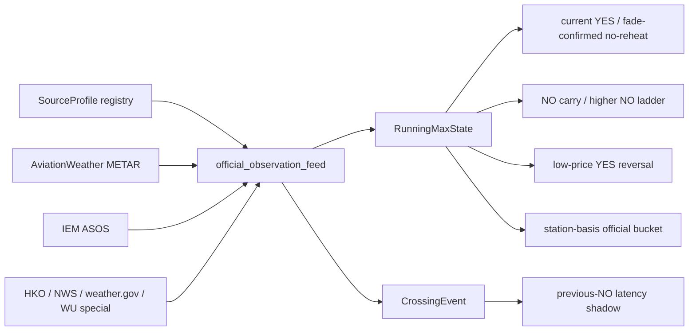

# Official Observation Feed Design v0

Status: implementation-slice-1
Updated: 2026-06-17
Source of truth: no
Used by: WEATHER_DOCS_INDEX.md; future no-reheat / station-basis / METAR-cross consumers

## 一句话

`official_observation_feed` 应该成为天气策略共用的实时官方观测层：专门负责“这个城市今天到底该看哪个官方源、最新观测是什么、是否足够新、是否可靠、有没有刚穿档”的事实生产；NO carry、current YES、YES reversal、station-basis、METAR-cross 都只消费它的状态和事件，不再各自写 METAR/IEM 抓取逻辑。

## 为什么现在要抽

现有代码已经出现重复和边界混乱：

| 位置 | 已有能力 | 问题 |
|---|---|---|
| `scripts/ops/weather_station_basis_shadow.py` | AviationWeather + IEM ASOS 拉取、local-day 过滤、running max/current temp、rules station recheck | 策略脚本兼任数据源库，其他策略开始 import 它 |
| `scripts/ops/weather_theta_current_yes_tiny_live.py` | AviationWeather/IEM 观测、dewpoint/RH/wind/sky 特征、obs age/下一报文 blackout guard | 只服务 current YES，和 station-basis 的实现重复 |
| `src/strategies/weather_edge_v1/tools/official_observation_clock.py` | IANA timezone/DST、观测 age、cadence、pre-update blackout | 这是应该保留并上移的公共时钟模块 |
| `src/strategies/weather_edge_v1/tools/source_probe.py` / `airport_weather_tool.py` | 源发现、AviationWeather/TAF/WU/Open-Meteo/NWS 探测 | 偏诊断/研究，不是实时 feed |
| `scripts/analysis/observed_max/research_settlement_source_registry_v0.py` | settlement source class、官方站/特殊源/blocked city registry | 是 source truth 的雏形，但不是 live runtime config |
| `scripts/ops/weather_metar_cross_prev_no_shadow.py` | 穿档后上一档 NO 的 latency shadow | 已经把 station-basis 脚本当 source 库 import，说明需要拆层 |

开源旁证 `suislanchez/polymarket-kalshi-weather-bot` 用 Open-Meteo GFS ensemble 做概率、NWS observations 做美国城市 observed settlement，并把 NYC 配成 KNYC、Denver 配成 KDEN；这说明市场 bot 往往是“模型 + 简化站点表”，可作为对手行为参考，但不能当 Polymarket 结算真相。

## 设计原则

1. **truth before speed**：最快的源不一定是结算源；live 策略只能使用已确认和市场规则一致的 source profile。
2. **feed 不做交易判断**：feed 只产出官方观测状态、运行最高温、穿档事件、source health；策略头自己决定 current YES / NO carry / reversal / station-basis 表达。
3. **fail closed**：source 不明、规则站点变了、观测 stale、下一条 METAR 黑窗、特殊源未实现时，live consumer 必须 skip。
4. **同源 failover 才允许 live**：AviationWeather 与 IEM ASOS 可互为同站镜像；但 WU/HKO/NWS/weather.gov 之间不能无证明地自动替换。
5. **latency 和 correctness 分开记录**：每条记录同时保存 `obs_ts_utc`、`ingest_ts_utc`、`source_latency_ms`、`source_profile_class`，以后才能判断“快但错”和“慢但真”。

## 建议模块边界

```text
src/strategies/weather_edge_v1/official_observation_feed/
  __init__.py
  models.py              # dataclass / typed payload contract
  source_registry.py     # city -> official source profile, blocked/special/source class
  clients.py             # AviationWeather, IEM ASOS, NWS, HKO, WU/weather.gov clients
  normalizer.py          # raw -> ObservationRecord; unit/round/floor/top-tail mapping
  clock.py               # wrap official_observation_clock; DST/cadence/blackout
  state.py               # RunningMaxState and CrossingEvent generation
  cache.py               # append-only JSONL + latest state read/write
  poller.py              # one-shot and loop pollers, adaptive cadence
  rules_check.py         # market description source/station verification
  cli.py                 # `once`, `loop`, `health`, `dump-state`
```

Runtime output:

```text
runtime/weather_edge_v1/official_observation_feed/
  observations.jsonl       # normalized raw observations, append-only
  running_state.jsonl      # one row per city/date/source update
  crossing_events.jsonl    # emitted once when official running max crosses bracket
  source_health.jsonl      # fetch latency/status/failover telemetry
  latest_state.json        # compact latest city/date state for consumers
```

## 核心数据契约

`SourceProfile`

| 字段 | 含义 |
|---|---|
| `city`, `unit`, `timezone_name` | 策略城市、市场单位、IANA 时区 |
| `settlement_source_class` | `default_wu_station_by_rules` / `official_station_diff_confirmed` / `special_source_confirmed` / `blocked_unresolved_settlement_basis` / `non_wu_source_by_rules` |
| `official_station_or_feed` | ICAO 或特殊 feed，例如 `LFPB`、`WIHH`、`HKO` |
| `mapping_rule` | `round_half_up_whole_c`、`round_half_up_whole_f`、`floor_decimal_c` 等 |
| `primary_source`, `fallback_sources` | live 拉取优先级；fallback 必须同站/同规则 |
| `rules_recheck_required` | station-basis / live 下单前必须为 true |

`ObservationRecord`

| 字段 | 含义 |
|---|---|
| `source_key`, `source_url`, `station_or_feed` | 数据来源和站点 |
| `city`, `target_date`, `obs_ts_utc`, `ingest_ts_utc` | local-day aware 的观测事实 |
| `temp_c`, `dewpoint_c`, `relh`, `wind_kt`, `sky_code`, `raw_text` | 标准化气象字段 |
| `source_latency_ms`, `fetch_status`, `quality_flags` | 延迟/健康/异常 |

`RunningMaxState`

| 字段 | 含义 |
|---|---|
| `running_max_c`, `current_temp_c`, `decline_c` | no-reheat 共同事实 |
| `running_market_value`, `current_market_value` | 按城市 mapping rule 映射到 Polymarket 档 |
| `last_obs_utc`, `obs_age_min`, `cadence_min`, `minutes_to_next_obs` | current-YES 必需 guard |
| `source_profile_class`, `source_verified_at_utc` | 这条 state 是否可用于 live |

`CrossingEvent`

| 字段 | 含义 |
|---|---|
| `previous_running_value`, `new_running_value` | 官方 running max 的档位跳变 |
| `crossed_brackets` | 被新高温打死的上一档或多档 |
| `event_key` | `city|target_date|source|bracket`，保证只发一次 |

## Source policy v0

| 城市类别 | feed 行为 |
|---|---|
| `default_wu_station_by_rules` | 可用 AviationWeather/IEM 同 ICAO 作为实时 METAR 镜像；仍保留 market rules source recheck |
| `official_station_diff_confirmed` | 只用 market description 指向的官方站；策略可以做 station-basis，但必须下单前 recheck rules station |
| `special_source_confirmed` | HongKong 走 HKO daily/live feed 和 floor decimal mapping；未实现实时 HKO 前不得进入 live feed consumer |
| `non_wu_source_by_rules` | Istanbul/TelAviv 等需要 weather.gov/NWS time-series 适配；未实现前只能 research/shadow |
| `blocked_unresolved_settlement_basis` | Moscow/Seoul/Shenzhen 这类不得给 live consumer 输出 `eligible=true` |
| `no_recent_market_or_unknown_rules` | 不进 source-sensitive live/replay，直到规则源识别 |

## METAR / ASOS 报文链路和速度分层

速度型 `刚穿 T -> 抢 T-1 NO` 不能把 `aviationweather` 当成唯一事实源。它只是一个下游分发面；真正要测的是同一条官方观测报文从站点到不同公开镜像的到达时间差。

已确认的公开链路位置：

| 层 | 例子 | 速度判断 | 用途 |
|---|---|---|---|
| 站点/传感器 | US ASOS/AWOS；国际机场 METAR station | 最上游；ASOS 自身可每分钟更新，routine METAR 通常半小时/小时，SPECI 可插入 | source truth 的物理起点 |
| 航空气象交换/国家发布 | FAA/NWS/DOD ASOS 体系；国际 ICAO/WMO/AFTN/METAR 分发 | 理论上最快，但公开 API 不一定可用 | 需要继续找 direct feed / subscription / local official portal |
| NOAA/NWS Aviation Weather Center | `aviationweather.gov/api/data/metar` | 机器 API；全球 METAR；有 rate limit；不保证 10s | 当前 primary，必须测速 |
| AWC cache | `aviationweather.gov/data/cache/metars.cache.csv.gz` | 官方说明 all-current METAR cache once/minute | 可测 API vs cache 是否同层；不应假设能 10s |
| MADIS / OMO | MADIS One Minute ASOS / HFMETAR | 美国 ASOS 可能更接近 1-minute 源；访问/覆盖有限 | Chicago/US cities second-stage candidate，不适合 ZSPD/RJTT 默认 |
| IEM ASOS | IEM ASOS/AWOS/METAR archive | IEM 页面说明 realtime ingest 每 10 分钟同步 | 历史/校验/fallback；不适合 10s 抢单 |
| 第三方 METAR 镜像 | CheckWX、OGIMET、商业天气 API | 可能快也可能慢，取决于上游 | 只做 timing compare；不能替代 settlement source |
| 特殊 settlement 源 | HongKong HKO daily extract 等 | 非 METAR；需独立 realtime client | 未实现前 hard ban |

Source notes from public docs checked 2026-06-17:

- NWS ASOS page: ASOS is a joint NWS/FAA/DOD program, airport-focused, continuously observing real-time weather; it issues hourly and special observations when criteria are met.
- NWS ASOS technical page: ASOS updates observations every minute, detects significant changes, disseminates hourly/special observations, and transmits observations automatically.
- AviationWeather Data API: METAR coverage is worldwide, supports raw/JSON/CSV/XML/etc.; API access is rate-limited and AWC recommends cache files for broad/frequent access.
- AviationWeather cache: all-current METAR CSV/XML cache updates once a minute.
- IEM ASOS download page: IEM archive sources include Unidata IDD, NCEI ISD, and MADIS One Minute ASOS; its processed archive says realtime ingest syncs every 10 minutes.
- MADIS: global observational database that ingests NOAA and non-NOAA data, decodes/normalizes, quality-checks, stores flags, and provides distribution services.

Implication for live candidates:

- Shanghai/ZSPD and Tokyo/RJTT are still first-stage because settlement/rules source matches METAR station, but their fastest public source is not proven. We must compare `aviationweather_metar`, `aviationweather_cache_csv`, `checkwx_html`, and any discovered local official aviation weather endpoint.
- Paris/London/Chicago stay second-stage. Chicago may benefit from US-only MADIS/OMO/ASOS channels; Paris/London need local aviation meteorological source search.
- Seoul/Moscow/Shenzhen/HongKong stay banned until the settlement source and realtime source are reconciled.

## Consumer 关系



## Open-source bot reference

`suislanchez/polymarket-kalshi-weather-bot` 的可借鉴点是工程形态：统一 weather data module、缓存、scan interval、calibration/dashboard；它的天气策略扫描 Polymarket/Kalshi 每 5 分钟，用 Open-Meteo 31-member GFS ensemble 算阈值概率，并用 NWS observations 做 observed settlement。

不能照抄的点也很重要：它的站点表是简化对手模型，例如 NYC=KNYC、Denver=KDEN，而我们的 settlement registry 发现官方/市场规则站可能是 KLGA/KBKF 或其他特殊源。对我们来说，这个 repo 更像“对手可能怎么错”的证据，不是 source layer 的 truth。

## 迁移计划

1. **Phase 0: design only - done**  
   本文档冻结边界，不改变 N100 行为。
2. **Phase 1: extract no-behavior-change code - started**  
   从 `weather_station_basis_shadow.py` 和 `weather_theta_current_yes_tiny_live.py` 抽出 AviationWeather/IEM parser、local-day filtering、running-state summarizer、clock guard；保留原脚本调用结果一致。
3. **Phase 2: registry adapter - started**  
   将 `settlement-source-registry-v0` 转为 generated/runtime sidecar：城市、官方站、source class、mapping rule、blocked reason。
4. **Phase 3: shadow feed daemon**  
   只写 `runtime/weather_edge_v1/official_observation_feed/*.jsonl`，不发单；与 current-YES、station-basis、METAR-cross 现有日志做并行对账。
5. **Phase 4: switch shadow consumers**  
   先让 METAR-cross shadow 和 station-basis shadow 消费 feed；再让 current-YES tiny-live 只读取 feed 状态，但保持 hard guard。
6. **Phase 5: live eligibility gate**  
   只有 source profile confirmed、rules recheck passed、obs clock ok、source latency measured、consumer shadow 对齐后，才允许 live consumer 使用。

## 测试清单

- local-day filtering across UTC boundary, especially Asia/Pacific cities.
- DST correctness: Helsinki/Europe, US summer cities, no `utc_offset` shortcut.
- `asof` discipline: no future observation leakage in replay.
- AviationWeather failed -> IEM fallback only if same station and local-day result valid.
- `pre_update_blackout` and stale obs hard skip.
- HongKong HKO floor mapping; top bracket handling.
- Jakarta WIHH vs WIII; Paris LFPB vs LFPG; London EGLC vs EGLL.
- Moscow/Seoul/Shenzhen blocked emits `eligible=false`.
- CrossingEvent emits exactly once per city/date/bracket.
- Rules station mismatch writes alert and prevents live eligibility.

## 近期最小下一步

先做 Phase 1 + Phase 2：把当前重复的 AviationWeather/IEM/METAR parser 抽出来，并生成一个 read-only `SourceProfile` registry。完成后，不急着让 live 用它；先让 `metar_cross_prev_no_shadow` 停止 import station-basis 策略脚本，改为消费 feed module。这个改动收益最大、风险最小，也能最快验证模块边界是否舒服。

## 2026-06-17 implementation slice 1

本轮已落地的是“公共事实层的骨架”，不是完整 feed daemon：

- 新增 `src/strategies/weather_edge_v1/official_observation_feed/`，先放三个稳定原语：`MarketBracket` parser、`SourceProfile` registry adapter、feed payload dataclass。
- `weather_theta_current_yes_tiny_live.py` 和 `weather_station_basis_shadow.py` 已改为共用 `official_observation_feed.market_brackets`，修复并固化 `74-75` 这种正数区间不能被误读成 `74,-75` 的问题。
- `SourceProfile` 现在默认读取运行层 `source_profiles.json`，并兼容读取 `2026-06-14-settlement-source-registry-v0.json` 作为生成输入，把城市映射成 `primary_source` / `fallback_sources` / `blocked_reason` / `live_eligible`。
- current-YES live runner 另已接入真实 IANA timezone/DST、target-date 必须等于 station local date、obs age、pre-METAR blackout、next-bracket gap 等硬 guard；这些 guard 仍由现有 runner 执行，尚未迁入 feed daemon。

2026-06-17 追加：`SourceProfile` 已从 analysis artifact 提升为运行层 sidecar：

- 运行层文件：`src/strategies/weather_edge_v1/official_observation_feed/source_profiles.json`。
- 生成入口：`scripts/analysis/observed_max/build_official_observation_source_profiles.py`。
- 当前覆盖 52 个城市，全部维护 IANA timezone、unit、configured station、official station/feed、settlement source class、mapping rule、primary/fallback source、rules recheck、blocked reason、coverage counts。
- source class 分布：34 `default_wu_station_by_rules`、7 `official_station_diff_confirmed`、1 `special_source_confirmed`、2 `non_wu_source_by_rules`、1 `default_source_watchlist`、3 `blocked_unresolved_settlement_basis`、4 `no_recent_market_or_unknown_rules`。
- live eligibility：41 城 `live_eligible=true`，均为 AviationWeather METAR primary + IEM ASOS same-station fallback；MexicoCity 有 METAR source 但因 watchlist 不 live eligible；HongKong/HKO、Istanbul/TelAviv non-WU、Moscow/Seoul/Shenzhen unresolved、Boston/Lagos/Minneapolis/Phoenix unknown rules 全部不 live eligible。

这一步的边界也很明确：

- 还没有统一 observation client/cache/poller，所以 AviationWeather/IEM 拉取仍在各策略脚本里。
- 还没有 `latest_state.json` 和 per-city audit jsonl，所以今天排查“为什么没触发”仍要读各 runner 自己的 summary/order/audit。
- 还没有把 METAR-cross shadow 改为消费这个模块；下一步应先迁 shadow consumer，再迁 tiny-live consumer。

下一步顺序：

1. 抽 `ObservationClient` + normalizer：AviationWeather 和 IEM ASOS 同站互备，输出 `ObservationRecord`。
2. 抽 `RunningMaxState` builder：统一 local-day 过滤、mapping rule、obs age、next observation clock。
3. 增加 `cache.py` / `cli.py once`：每 15 分钟写 `observations.jsonl`、`running_state.jsonl`、`source_health.jsonl`、`latest_state.json`。
4. 先让 METAR-cross shadow 只读 feed state；确认完全对齐后，再让 station-basis shadow/current-YES tiny-live 切过去。

## 2026-06-17 implementation slice 2

METAR-cross latency 方向已经进入 shadow measurement 层：

- 新增 `weather_metar_cross_prev_no_shadow.py`：监听官方站 METAR running max 穿档，记录上一档 NO 是否还有 taker ask；只写 shadow ledger，不下单。
- 新增 `weather_source_orderbook_timing_monitor.py`：对比 AviationWeather / CheckWX 等源的更新时间、payload hash、温度变化与 Polymarket orderbook 变化，用来判断瓶颈是源延迟、轮询延迟，还是盘口被更快对手提前打掉。
- METAR-cross 的城市准入现在从 `source_profiles.json` 读取 source class、official station/feed、timezone、live eligibility；同站城市再叠加历史 alignment whitelist，station-diff 城市必须显式 `--include-station-diff`。
- 当前默认仍只适合 shadow：Shanghai/Tokyo 这类 same-station verified 城市可跑；Seoul/Moscow/Shenzhen/HongKong 继续 hard ban；Paris/London/Chicago 等 station-diff 城市只适合第二阶段显式开启并 rules recheck。

这一步仍未完成统一 feed daemon：METAR-cross 现在使用 `SourceProfile` 做准入，但观测拉取仍直接在脚本内请求 AviationWeather。下一步应把它切到 `ObservationRecord` / `RunningMaxState` cache 后再考虑真钱 taker。
