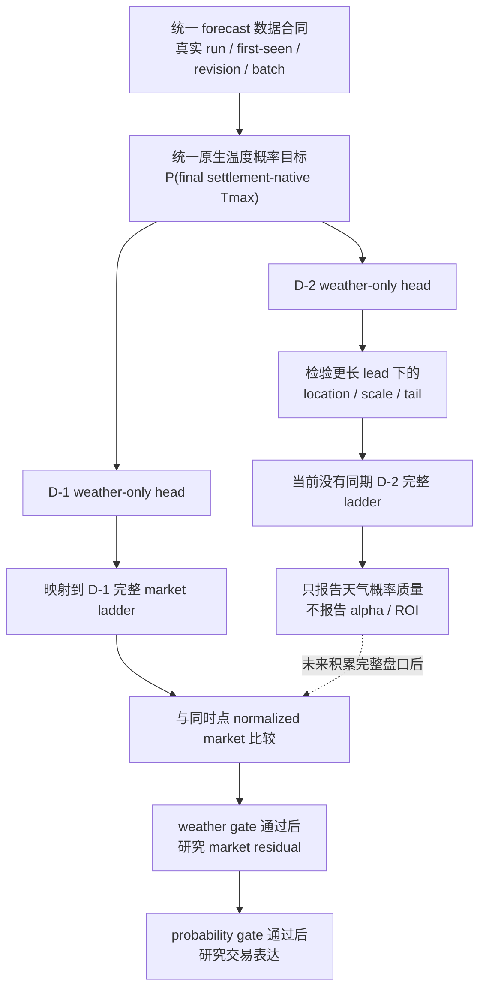

# D-1 / D-2 跨城市 Tmax 概率研究总纲 v1

Status: implementation in progress; no production deployment
Updated: 2026-08-05
Scope: strict first-seen/run-aware forecast contract, weather-only probability, conditional market residual and execution research

## 0. 当前结论与边界

weather-only:
significance=not_tested_on_clean_run-aware_history
calibration=not_tested_on_clean_run-aware_history
pooled_baseline=current pooled Normal retained as negative control
forward=starts only after verified collector deployment and first complete untouched target date

market residual:
baseline=normalized same-checkpoint full ladder
forward=not_run_by_contract_until_weather_only_gate_passes
execution=not_run_by_contract_until_probability_gate_passes

production:
live_action=none
orders_changed=0

D-1 与 D-2 **一起建设底层合同、分别训练与验收、互不阻塞**。D-1 有同期完整 market ladder 时可以在 weather-only 通过后继续研究 market residual；D-2 当前只做 weather accuracy，不输出 market residual、ROI 或 alpha。

## 1. 统一架构



两个数据 grain 严格分开：

1. `forecast batch × city × target_date × horizon × settlement-native rung` 是 weather-only 主分母，不依赖盘口。
2. `decision checkpoint × city × target_date × complete market rung` 是 market residual 子分母，必须有同刻完整 book。

天气模型先预测 settlement-native Tmax 分布，再确定性投影到 Polymarket bracket；不能直接用事后 winner bracket 反推天气分布。

## 2. 分阶段交付与验收

| 阶段 | 实际工作 | D-1 | D-2 | 完成标准 |
|---|---|---:|---:|---|
| 1. Forecast contract | 真实 run 证据、四时钟、两类 revision、batch、multi-model summary | 共用 | 共用 | fixture + one-shot 真实 sample；不能识别 run 时结构化 blocked |
| 2. Ladder contract | rung manifest、native ordering、开放尾档、raw/normalized market mass、book identity | 必须 | 有则保存 | 缺档/one-sided/stale 不丢行，进入 evidence blocker |
| 3. Weather dataset | run-aware forecast + final native Tmax label | 单独建模 | 单独建模 | PIT、settlement、target-date block split 可复跑 |
| 4. Baselines A-C | climatology、pooled Normal negative control、bias-corrected pooled | 评分 | 评分 | 同 rows proper scores |
| 5. Structure D-E | coherent ordinal/survival、partial hierarchy v2 | 单独拟合 | 单独拟合 | 修复过度自信和城市灾难尾 |
| 6. Width/tail F-G | spread、revision、lead/run age、season、physical-width | 优先 | 同步验证 | calibration/tail coverage 改善且非 hard filter |
| 7. Frozen forward | 完全未参与选模的未来 target dates | 首要验收 | 独立积累 | 部署后首个完整 untouched date 才启动 |
| 8. Market residual | market log-prob offset + strongly regularized weather delta | weather gate 后 | 当前不做 | posterior 与 market 同 rows 比较 |
| 9. Trading | YES/NO/contiguous strip、fee、depth、slippage | probability gate 后 | 当前不做 | frozen executable EV |
| 10. Production | collector 采集行为部署 | 共用 | 共用 | git-first；真实部署前取得明确确认 |

## 3. Forecast lineage 合同

append-only forecast row 至少保存：

- identity：`model_key / city / target_date / capture_id / batch_capture_id`；
- clocks：`forecast_run_at_utc / source_fetched_at_utc / detected_at_utc / first_seen_at_utc / available_at_utc`；
- derived clocks：`lead_hours / model_run_age_hours`；
- evidence：`raw_payload_hash / producer_build_identity / forecast_run_evidence`；
- forecast value 与 content hash。

`forecast_run_at_utc` 只接受：

1. provider payload 明确提供的 run/issue timestamp；或
2. 精确 single-run endpoint 的请求参数，且请求成功、无 fallback、request/raw response hash 均保存。

estimated `00Z/06Z/12Z/18Z` 只能用于探测请求候选，不能作为已识别 run 写入研究数据。无法证明时保存 `provider_run_timestamp_unverified` blocker。

两类变化禁止混名：

- provider run transition：`previous_run_ts / previous_run_forecast_max_f / run_to_run_delta_f`；
- same-run content revision：`previous_content_hash / content_revision_delta_f / revision_of_content_id`。

`batch_capture_id` 表示一次采集事件并含采集时钟；`batch_content_hash` 只表示排序无关的模型内容。每个 batch 物化完整 model values、缺失模型、mean/median/q25/q75/min/max/spread/IQR、assigned model 与 consensus 差。

## 4. Full-ladder checkpoint 合同

每个 checkpoint 保存 event/rung manifest、native ordering、唯一 bottom/top 开放档、rung completeness、ladder hash、raw market mass、normalization factor、normalized distribution、每 rung quote source/book status、`feature_book_snapshot_id` 与 checkpoint clock。

市场概率默认只接受同刻 two-sided mid。one-sided、stale、last-trade 或旧 snapshot 不能静默 fallback；支持它们的模型必须建立独立 `model_id` 和明确时钟语义。

## 5. Clean dataset 与双漏斗

Forecast row 必须满足 `first_seen_at_utc <= available_at_utc <= decision_ts_utc`，且 run timestamp 有上述可审计证据。按 `target_date` 整块切分，D-1 与 D-2 不混在同一个 head。

signal funnel 报告：raw forecast versions → real-run identified → batch-complete → settlement-complete → OOF-scoreable → frozen-forward。

evidence funnel 报告：decision checkpoints → native-ladder-complete → market-complete → executable → actual fills。

market 缺失是 evidence coverage gap，不是 weather signal filter。旧 daily cache 与 conservative 12h-lag reconstruction 只可作为 legacy/negative-control 证据，不能静默进入 clean dataset。

## 6. Weather-only 固定比较与 gate

固定比较 A-G：

- A climatology / source-season；
- B 当前 pooled Normal error model（negative control）；
- C bias-corrected pooled；
- D coherent pooled ordinal/survival；
- E partial hierarchy v2；
- F E + revision/spread/lead/run-age/season；
- G F + physical-width features。

partial hierarchy v2 为 `source × lead pooled residual shape + strongly-shrunk city×source center bias + more strongly-shrunk scale correction`。城市低样本不得独立学习整条 tail；city-only 保留为 negative control。历史 0.692°F MAE 改善只决定结构方向，bias、scale、shrinkage 必须在 clean inner train 重新估计。

weather-only gate：

- exact-bracket logloss 与 RPS 点估均不劣于 pooled Normal，且至少一个主指标的 target-date block bootstrap CI 显著改善；
- 固定 calibration bins 下修复已知的严重过度自信，而非只复述“预测 40%、实际 13%”；
- top/bottom tail coverage、winner probability、near-zero winner probability 和 city catastrophe tail 均报告；
- 跨 city、lead、season、target date 稳定；
- forward 至少覆盖预注册的最小日期数，期间不得调 feature、lambda 或 model family。

未满足 gate 时 market residual 明确写 `not_run_by_contract`，不能用 market blend 掩盖 weather-only 失败。

## 7. Conditional market residual 与 execution

weather-only 通过后才比较：

```text
log P_post(i) = log P_market(i) + delta_i(weather features) - log Z
```

`delta=0` 必须严格等于 market；weather residual 强正则。相同 rows、labels、feature-book 时钟和 quotes 比较 M0 market、M1 frozen weather-only、M2 market offset + weather residual、M3 partial-pooled residual。

只有 posterior 在 frozen forward proper score 打败 market，且 executable EV 扣 taker ask、official fee、每腿 1 tick slippage、depth/legging 风险后为正，才进入 shadow candidate。maker 是独立 A/B，不能挽救负 taker alpha。

## 8. 已知现状与下一动作

现有 raw 已有大量 D-1/D-2 forecast versions、first-seen curve 和 D-1 full ladder，但 provider run timestamp 覆盖为 0；D-2 同期 market ladder 为 0。因此目前可以完成合同、parser、fixtures、one-shot probe、builder 与 blocked semantics，但不能把 legacy 历史包装成 clean run-aware A-G 结论。

若 one-shot 证明 provider run 可采，下一步需要部署 collector 才能开始积累真正 frozen forward。部署将使用 `weather-strategy-deploy` 的 git-first 流程，并在改变真实 collector 行为前停下取得明确确认；不修改 live 策略、订单、city pool、sizing 或 execution policy。
