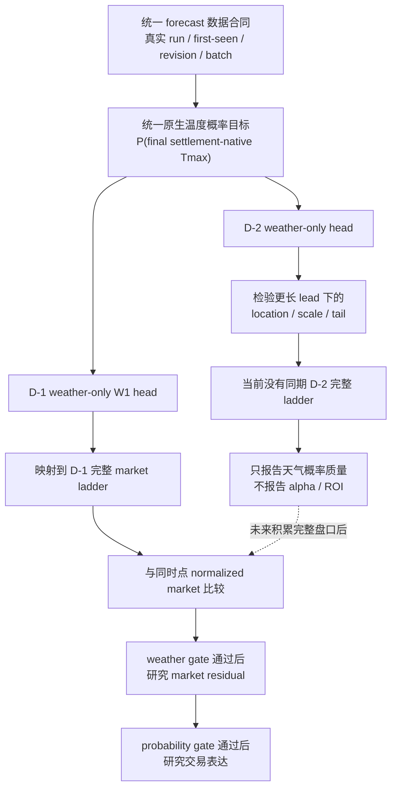
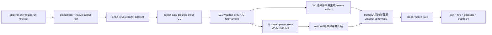

# D-1 / D-2 跨城市 Tmax 概率研究总纲 v1

Status: contract implemented; lineage fix deployed; clean development accumulating; W1 not frozen
Updated: 2026-08-05
Scope: strict first-seen/run-aware forecast contract, weather-only probability, conditional market residual and execution research

## 0. 当前结论与边界

weather-only:
significance=not_tested_on_clean_run-aware_history
calibration=not_tested_on_clean_run-aware_history
pooled_baseline=current pooled Normal retained as negative control
forward=collector_started_2026-08-05; waits_for_settlement_complete_untouched_target_dates

market residual:
baseline=normalized same-checkpoint full ladder
forward=not_run_by_contract_until_weather_only_gate_passes
execution=not_run_by_contract_until_probability_gate_passes

production:
live_action=none
orders_changed=0

D-1 与 D-2 **一起建设底层合同、分别训练与验收、互不阻塞**。D-1 有同期完整 market ladder 时可以在 weather-only 通过后继续研究 market residual；D-2 当前只做 weather accuracy，不输出 market residual、ROI 或 alpha。

## 1. 统一架构



两个数据 grain 严格分开：

1. `forecast batch × city × target_date × horizon × settlement-native rung` 是 weather-only 主分母，不依赖盘口。
2. `decision checkpoint × city × target_date × complete market rung` 是 market residual 子分母，必须有同刻完整 book。

天气模型先预测 settlement-native Tmax 分布，再确定性投影到 Polymarket bracket；不能直接用事后 winner bracket 反推天气分布。

## 2. 分阶段交付与验收

| 阶段 | 实际工作 | D-1 | D-2 | 完成标准 |
|---|---|---:|---:|---|
| 1. Forecast contract | 真实 run 证据、四时钟、两类 revision、batch、multi-model summary | 共用 | 共用 | fixture + one-shot 真实 sample；不能识别 run 时结构化 blocked |
| 2. Ladder contract | rung manifest、native ordering、开放尾档、raw/normalized market mass、book identity | 必须 | 有则保存 | 缺档/one-sided/stale 不丢行，进入 evidence blocker |
| 3. Weather dataset | run-aware forecast + final native Tmax label | 单独建模 | 单独建模 | PIT、settlement、target-date block split 可复跑 |
| 4. Baselines A-C | climatology、pooled Normal negative control、bias-corrected pooled | 评分 | 评分 | 同 rows proper scores |
| 5. Structure D-E | coherent ordinal/survival、partial hierarchy v2 | 单独拟合 | 单独拟合 | 修复过度自信和城市灾难尾 |
| 6. Width/tail F-G | spread、revision、lead/run age、season、physical-width | 优先 | 同步验证 | calibration/tail coverage 改善且非 hard filter |
| 7. Frozen forward | 完全未参与选模的未来 target dates | 首要验收 | 独立积累 | 部署后首个完整 untouched date 才启动 |
| 8. Market residual | market log-prob offset + strongly regularized weather delta | weather gate 后 | 当前不做 | posterior 与 market 同 rows 比较 |
| 9. Trading | YES/NO/contiguous strip、fee、depth、slippage | probability gate 后 | 当前不做 | frozen executable EV |
| 10. Production | collector 采集行为部署 | 共用 | 共用 | 已获确认并 git-first 部署；coverage-only、0 order change |

## 3. Forecast lineage 合同

append-only forecast row 至少保存：

- identity：`model_key / city / target_date / capture_id / batch_capture_id`；
- clocks：`forecast_run_at_utc / source_fetched_at_utc / detected_at_utc / first_seen_at_utc / available_at_utc`；
- derived clocks：`lead_hours / model_run_age_hours`；
- evidence：`raw_payload_hash / producer_build_identity / forecast_run_evidence`；
- forecast value 与 content hash。

`forecast_run_at_utc` 只接受：

1. provider payload 明确提供的 run/issue timestamp；或
2. 精确 single-run endpoint 的请求参数，且请求成功、无 fallback、request/raw response hash 均保存。

estimated `00Z/06Z/12Z/18Z` 只能用于探测请求候选，不能作为已识别 run 写入研究数据。无法证明时保存 `provider_run_timestamp_unverified` blocker。

两类变化禁止混名：

- provider run transition：`previous_run_ts / previous_run_forecast_max_f / run_to_run_delta_f`；
- same-run content revision：`previous_content_hash / content_revision_delta_f / revision_of_content_id`。

`batch_capture_id` 表示一次采集事件并含采集时钟；`batch_content_hash` 只表示排序无关的模型内容。每个 batch 物化完整 model values、缺失模型、mean/median/q25/q75/min/max/spread/IQR、assigned model 与 consensus 差。

## 4. Full-ladder checkpoint 合同

每个 checkpoint 保存 event/rung manifest、native ordering、唯一 bottom/top 开放档、rung completeness、ladder hash、raw market mass、normalization factor、normalized distribution、每 rung quote source/book status、`feature_book_snapshot_id` 与 checkpoint clock。

市场概率默认只接受同刻 two-sided mid。one-sided、stale、last-trade 或旧 snapshot 不能静默 fallback；支持它们的模型必须建立独立 `model_id` 和明确时钟语义。

## 5. Clean dataset 与双漏斗

Forecast row 必须满足 `first_seen_at_utc <= available_at_utc <= decision_ts_utc`，且 run timestamp 有上述可审计证据。按 `target_date` 整块切分，D-1 与 D-2 不混在同一个 head。

signal funnel 报告：raw forecast versions → real-run identified → batch-complete → settlement-complete → OOF-scoreable → frozen-forward。

evidence funnel 报告：decision checkpoints → native-ladder-complete → market-complete → executable → actual fills。

market 缺失是 evidence coverage gap，不是 weather signal filter。旧 daily cache 与 conservative 12h-lag reconstruction 只可作为 legacy/negative-control 证据，不能静默进入 clean dataset。

## 6. Weather-only 固定比较与 gate

固定比较 A-G：

- A climatology / source-season；
- B 当前 pooled Normal error model（negative control）；
- C bias-corrected pooled；
- D coherent pooled ordinal/survival；
- E partial hierarchy v2；
- F E + revision/spread/lead/run-age/season；
- G F + physical-width features。

partial hierarchy v2 为 `source × lead pooled residual shape + strongly-shrunk city×source center bias + more strongly-shrunk scale correction`。城市低样本不得独立学习整条 tail；city-only 保留为 negative control。历史 0.692°F MAE 改善只决定结构方向，bias、scale、shrinkage 必须在 clean inner train 重新估计。

weather-only gate：

- exact-bracket logloss 与 RPS 点估均不劣于 pooled Normal，且至少一个主指标的 target-date block bootstrap CI 显著改善；
- 固定 calibration bins 下修复已知的严重过度自信，而非只复述“预测 40%、实际 13%”；
- top/bottom tail coverage、winner probability、near-zero winner probability 和 city catastrophe tail 均报告；
- 跨 city、lead、season、target date 稳定；
- forward 至少覆盖预注册的最小日期数，期间不得调 feature、lambda 或 model family。

未满足 gate 时 market residual 明确写 `not_run_by_contract`，不能用 market blend 掩盖 weather-only 失败。

## 7. Conditional market residual 与 execution

weather-only 通过后才比较：

```text
log P_post(i) = log P_market(i) + delta_i(weather features) - log Z
```

`delta=0` 必须严格等于 market；weather residual 强正则。相同 rows、labels、feature-book 时钟和 quotes 比较 M0 market、M1 frozen weather-only、M2 market offset + weather residual、M3 partial-pooled residual。

只有 posterior 在 frozen forward proper score 打败 market，且 executable EV 扣 taker ask、official fee、每腿 1 tick slippage、depth/legging 风险后为正，才进入 shadow candidate。maker 是独立 A/B，不能挽救负 taker alpha。

## 8. 已知现状与下一动作

现有 raw 已有大量 D-1/D-2 forecast versions、first-seen curve 和 D-1 full ladder，但 provider run timestamp 覆盖为 0；D-2 同期 market ladder 为 0。因此目前可以完成合同、parser、fixtures、one-shot probe、builder 与 blocked semantics，但不能把 legacy 历史包装成 clean run-aware A-G 结论。

2026-08-05 已取得明确确认并通过 production controller 部署 `weather_forecast_run_capture_v1`。它每 30 分钟精确尝试最近四个 6h run candidate；每个请求独立、不可用即写 blocker，绝不 fallback 到其他 run。首轮已得到 `2026-08-04T12:00Z` 与 `18:00Z` 两个五模型完整 run，`2026-08-05T00:00Z` 为三模型 partial，`06:00Z` 当时尚 unavailable。采集只写 append-only research evidence，不修改 live 策略、订单、city pool、sizing 或 execution policy。

与此同时，legacy 数据上的模型开发没有暂停：5561 条 long-history rows 用于训练，前 18 个 reconstructed target dates 只用于选 overlay，最后 9 个日期作为 legacy holdout。结果见 [D-1 legacy weather-only v2](2026-08-05-d1-legacy-weather-only-v2.md)。该结果用于确定 challenger，不计作本计划的 clean frozen forward。

随后完成 weather-only robust-tail/location ablation：在 600 个开发组合中选出 `87.5% ensemble mean + 12.5% assigned model + full shrunk city/source bias + 1.25× residual scale + 2% climatology tail`。secondary holdout logloss `1.9763→1.8506`、RPS `0.0903→0.0828`、top-1 `21.9%→26.8%`，但 logloss CI 仍跨 0 且仍显著输 market `1.5497`。该参数只[锁定为 W0 legacy reference](2026-08-05-d1-weather-only-clean-forward-freeze-v1.json)，停止继续读取旧 9-date holdout 调参；它不是 W1 或 market residual 的最终冻结模型。

为验证第二阶段的建模形式，同一 legacy 分母又运行了 strongly-regularized market-offset exploratory：开发集只选择 `beta=0.05`，即 posterior 约为 95% market anchor + 5% weather log-probability correction。secondary holdout 上 M0 market logloss=`1.5497`，M2 global offset=`1.5546`，M3 partial offset=`1.5540`；相对 M0 的 paired Δlogloss 分别为 `+0.0049`（95% CI `-0.0052..+0.0149`）与 `+0.0043`（`-0.0097..+0.0175`）。所以当前没有 confirmed market residual，且不进入 execution/ROI；完整结果见 [weather-only robust-tail + market-offset 报告](2026-08-05-d1-weather-only-robust-tail-v1.md)。clean residual gate 仍等待 exact-run frozen forward，而不是被这次 legacy exploratory 解锁。

## 9. Revision × repricing 下一阶段（已启动）

下一阶段分成两条严格隔离的线：

1. weather-only W1：先用 archive-known-available 历史与 collector-exact 的第一段 clean development 训练 `revision + spread + run-age` challenger。主 checkpoint 固定为当地 target 前一日 18:00–24:00 的首个 complete batch，12:00–18:00 仅作 secondary。W1 的 family、feature、lambda 和 tail 先在 target-date block inner validation 选择；结果评审后才生成新的 freeze artifact。
2. market repricing R1：只用 collector-exact 的新 complete run/batch event，比较 event 前最后完整 ladder、event 后第一完整 ladder与 5/10/30/60/90m markout。bootstrap 已存在 run 和 partial→complete 补齐保留为 coverage，但不得进入 latency alpha。

市场时钟与 forecast 时钟分开：同一 `batch_capture_id/forecast_run_at_utc` 在没有新 run 时，weather-only location 不因盘口过了 5–120 分钟而重算；lead/run-age 只允许连续调整 uncertainty。每个 forecast batch 可以对应多个 `feature_book_snapshot_id`，固定比较 event 前、event 后第一份以及 5/10/30/60/90m 完整 ladder。`M0(t)` 永远使用该决策时刻真实可见的 contemporaneous market，后一个 checkpoint 只用于 repricing/efficiency label，禁止事后替换早期决策价。哪个 checkpoint 更有效，只能在相同 city-date、相同 native ladder、相同 settlement label 上按 logloss/RPS/calibration 与 quote freshness/spread/depth判断；不能按单次价格更平滑或事后更接近赢家选择。

正式概率比较仍固定 W0 locked legacy reference、W1 revision challenger、M0 market、M2 global offset、M3 partial offset。冻结顺序固定为 `clean development → W1 weather-only 结果评审 → M2/M3 同分母结果评审 → freeze artifact → untouched forward`。freeze 之前的数据全部标记 development，不能事后改称 forward；freeze 之后最低正式复核分母预注册为 `>=30` 个 untouched settled target dates。market residual 还要求同一 event 的 pre/post complete ladder coverage，并按 target_date block bootstrap；没有 proper-score residual 前不启动 execution EV。

首轮机制挂到稳定 dataset runner `build_d1_d2_run_aware_dataset_v1.py --revision-repricing`，共享实现位于 `weather_model_evaluation/d1_revision_repricing.py`；结果见 [revision × repricing 计划与首轮审计](2026-08-05-d1-forecast-revision-market-repricing-plan-v1.md)。审计同时发现 collector v1 的 revision state 根因：每轮按旧→新 run 轮询，但只保存最后 run，下一轮会产生 backward `previous_run_ts`。截至 `2026-08-05T10:51:41Z`，7,956 raw forecast rows 中有 2,380 个 backward previous-run rows，另外 5,236 个 forward delivery rows 折叠后仅 748 个 unique transition keys（重复 4,488）。原始 run/value/hash 保持可审计，污染范围只在派生 revision lineage；旧行保留并明确排除，不删除、不改写。

修复已改为按 `model×city×target×run` 保存版本，重复旧 run 只比较 same-run content；同时 material-batch runner 折叠重复 poll batch，并用完整 batch 的最后模型 availability 作为时钟。production cutover 已于 `2026-08-05T15:45:11Z` 完成，checkout SHA=`42f6dff511f4658352b1e86c53a4b07030082b5a`。首个真实轮询 returncode=0；cutover 后 1,020 rows、680 rows 带 previous run、backward previous-run=0，state 已保存 `run_history_by_model_city_target`。这批尚未结算，当前阶段是 clean development accumulation，不能评分 alpha，也不是 frozen forward。

## 10. 采集进入训练的闭环

collector 是持续运行的，不存在“全部采完才训练”。每个 target date 结算后，dataset builder 增量物化 clean development；达到每个 horizon 至少 30 个 settled target dates 后，自动把该 horizon 标记为 `ready_for_inner_train`。D-1 先到门槛就先训练，D-2 不阻塞。

为尽早暴露 schema/feature 问题，7/14/21 个 settled dates 时可以自动跑 learning-curve diagnostic，但这些结果不选最终 family/feature/λ；满 30 dates 才做第一次正式 inner-CV tournament 与 W1 freeze 评审。freeze 后再保留至少 30 个新 settled dates 做真正的 untouched forward。



训练固定为三层：

1. `W1 weather-only`：以 W0 为 locked reference，比较 A-G；center 由 ensemble、assigned model、city/source shrinkage 与 revision 估计，width/tail 由 residual dispersion、spread/IQR、revision instability、lead/run age、season 与同 clock physical features 估计。
2. `checkpoint / market efficiency`：同一个 forecast batch 配 pre、post、5/10/30/60/90m 完整 ladder。只用 development dates 选择固定 decision checkpoint；任何后来的 book 只作 markout label，不能替换早期决策价。
3. `market residual`：W1 weather-only 独立验收后，在完全相同 rows 上比较 M0 market、M1 W1、M2 global offset、M3 partial offset。`delta=0` 必须精确回到 M0。

选模只发生在 target-date block inner CV；最终生成带 `training_end_target_date / selected_features / hyperparameters / code_sha / data_hash / freeze_at_utc` 的新 W1 artifact。从该时间点之后才开始真正的 untouched forward，至少累计 30 个 settled target dates，期间不改 family、feature 或 lambda。旧 W0 继续保留为 legacy reference，但不再标成等待 forward 的最终 challenger。

当前 readiness 实跑（2026-08-05）：17,680 raw forecast versions 折叠为 689 个 material batches（D-1=340、D-2=349），其中 278 个 complete；当前 0 个 settlement-complete、0 个 OOF-scoreable，所以 W1 还不能对 clean 数据拟合。状态脚本已输出 D-1/D-2 均为 `clean_development_accumulation`，而不是假装训练成功。
