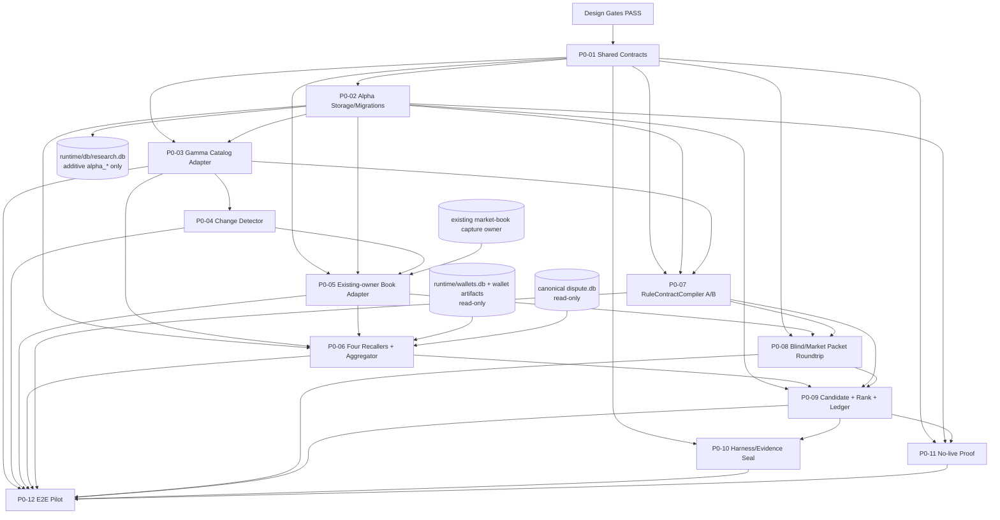

# GPT Pro Review Packet — Polymarket Alpha P0 Integration Design

> `SUPERSEDED_FOR_REVIEW`：本文件是首轮评审快照。GPT Pro提出BF-1～BF-3后，修订版已生成于`GPT_PRO_REVIEW_PACKET_REV2.md`；后续只使用R2，不删除本文件以保留审计。

## 给 GPT Pro 的审阅任务

你现在是本项目的独立 Principal Architecture Reviewer、Quant Research Infrastructure Reviewer 与 Safety Gate Reviewer。

请对下方完整设计交付进行严格评审。当前阶段固定为：

```text
DISCOVERY_AND_INTEGRATION_DESIGN_ONLY
```

当前提议 disposition：

```text
READY_FOR_P0_IMPLEMENTATION
```

项目 owner 已明确允许后续进行较大重构，因为本次目标涉及的历史 Polymarket 研究模块没有作为当前 live 主线运行。但请注意：

- 当前仓库仍包含 weather 生产系统和真实 CLOB 下单能力；
- “允许大重构”不等于授权修改生产配置、迁移 current production DB 或发真实订单；
- P0 冻结为 research infrastructure、manual review roundtrip、simulation/watchlist，必须保持 no-live-order；
- 本轮只评审设计，不实现代码。

### 请重点判断

1. 现有资产盘点是否有明显遗漏或把历史能力误当当前能力；
2. KEEP / ADAPT / REFACTOR / REPLACE / ARCHIVE 是否合理；
3. 是否真正消除了平行 collector、wallet tracker、rule lawyer 和 orchestration owner；
4. canonical market/event/condition/token identity 是否足够严谨；
5. raw lineage、rule revision、Rule A/B、Blind/Market price isolation 是否可重放；
6. `runtime/db/research.db` additive `alpha_*` 方案是否合理，是否会与 weather/wallet/dispute stores 形成双真相；
7. Candidate state machine、ReviewDecision、Prediction Ledger 是否缺少关键状态或约束；
8. P0 DAG、任务 owner、migration、验收证据和回滚是否足以安全实施；
9. no-live-order 证明是否能覆盖同仓中的动态 import、legacy executor、private key 和 exchange POST；
10. 哪些问题属于真正阻断 P0 开工，哪些只是实现期 probe 或后续 production activation gate。

### 请使用以下输出格式

#### A. 总体裁决

只能选择一个：

```text
READY_FOR_P0_IMPLEMENTATION
READY_WITH_BLOCKING_DECISIONS
REWORK_INTEGRATION_DESIGN
```

用不超过 10 句话说明理由。

#### B. Blocking findings

用表格列出：

```text
Finding ID | Severity | Source file/section | Problem | Required decision/fix | Acceptance evidence
```

如果没有，明确写 `NONE`。不要把普通优化建议包装成 blocker。

#### C. Non-blocking design improvements

按优先级列出可在对应 P0 task 内解决的修改，并指向具体 task owner。

#### D. Contract and ownership audit

明确回答：

- shared contract owner 是否唯一；
- migration owner 是否唯一；
- market-book capture owner 是否唯一；
- wallet source 与 normalized Recall owner 是否区分；
- Rule A/B 是否同源；
- harness task state 与 Alpha domain state 是否分离；
- execution 是否从依赖图中不可达。

#### E. P0 DAG and task-contract audit

指出依赖缺失、环、并发冲突、scope overlap、验收证据不足或 rollback 不可执行之处。

#### F. Required document edits

给出可以直接修改文档的清单：

```text
File | Section | Exact change | Blocking/Non-blocking
```

#### G. Final Gate 1 / Gate 2 recommendation

分别给出：

```text
Gate 1: PASS / PASS_WITH_BLOCKING_FIXES / REWORK
Gate 2: PASS / PASS_WITH_BLOCKING_FIXES / REWORK
```

### 评审纪律

- 引用下方具体文件与章节，不做泛泛架构评论；
- 不假设未展示的代码能力存在；
- 不把 stale wallet 数据当当前信号；
- 不建议新建平行系统来绕过集成问题；
- 不因为允许大重构就忽略 migration、rollback、no-live 和生产隔离；
- 如果现有 ADR 已经解决问题，不要重复将其列为“待决策”；
- 如果认为某 ADR 错误，请给出替代方案、迁移影响和回退路径；
- 请把完整评审结果返回给项目 owner，以便原样交回 Codex 修订。

## 评审材料说明

下方按交付顺序完整内嵌八个 authoritative design artifacts。Gate 2 seal 已验证：

- 8 个必交付文件齐全；
- 34 项资产 inventory；
- 12 个统一任务合同；
- targeted suite：58 passed；
- 独立 wallet/history/harness suite：23 passed；
- evidence manifest blocking issues：0；
- 全部 seal SHA-256 校验通过。

---


# Embedded Artifact 1: DISCOVERY_REPORT.md

# Polymarket Alpha P0 Discovery Report

## 结论

- 当前阶段：`DISCOVERY_AND_INTEGRATION_DESIGN_ONLY`
- 设计包版本：`polymarket-alpha-design-pack-v1.0`
- 最终 disposition：`READY_FOR_P0_IMPLEMENTATION`
- Gate 1（Discovery）：`PASS`
- Gate 2（Integration Design）：`PASS`

P0 可以进入实现，但仅限 research infrastructure、simulation 和人工文件回灌；不得自动交易，也不得新建平行的 market collector、wallet tracker、rule lawyer 或 orchestration system。生产启用、扩大现有 CLOB capture owner 的覆盖面、任何带鉴权的 order path，仍是后续独立变更门。

## 1. 输入与审计快照

严格按设计包规定的顺序阅读了 `00_CODEX_ENTRY.md`，随后依次阅读 `01` 至 `08`。设计包 zip SHA-256：

```text
8decb53071d3180ee43695412a6225e35472b1fe93f2cf5c100c1b58e7ff7f2f
```

仓库快照：

```text
repository: /Users/deepsleep/projects/pm_agents
HEAD: e0ad0c6b41bfd949f47fa4e187a497e4c7d793be
snapshot_date: 2026-08-26 Asia/Shanghai
worktree: dirty, 37 pre-existing entries; this review did not modify them
```

本轮只增加 `docs/design/polymarket_alpha_p0/` 下的设计产物，没有执行数据迁移、部署、启停服务、外部写入或订单操作。

## 2. 设计包引用索引

| 顺序 | 文件 | SHA-256 前缀 | 在本设计中的作用 |
|---|---|---|---|
| 00 | `00_CODEX_ENTRY.md` | `aaeaabb` | 阶段、顺序、八项交付与 disposition |
| 01 | `01_SYSTEM_CHARTER.md` | `5e351894` | P0 冻结边界与总体原则 |
| 02 | `02_TARGET_ARCHITECTURE.md` | `dfd14dd` | 目标组件、数据流和职责边界 |
| 03 | `03_MVP_EXECUTION_SPEC.md` | `35666bf` | P0 最短路径、顺序与验收场景 |
| 04 | `04_INTEGRATION_DISCOVERY_SPEC.md` | `d27f59d` | Discovery、资产决策和集成要求 |
| 05 | `05_CONTRACTS.md` | `3582a067` | 共享 envelope、实体和状态合同 |
| 06 | `06_SUBAGENT_TASK_TEMPLATE.md` | `70a6ee21` | 有界工作包统一格式 |
| 07 | `07_REVIEW_GATES.md` | `1b6f7e01` | Gate、evidence seal 与验收 |
| 08 | `08_REFERENCE_INDEX_TEMPLATE.md` | `6b2af808` | 历史资产引用索引格式 |
| manifest | `MANIFEST.json` | `4600251` | 包内容一致性 |

## 3. 当前仓库拓扑

| 区域 | 当前职责 | 结论 |
|---|---|---|
| `src/platform/clients/`、`src/models/market.py` | Gamma/CLOB API 与市场模型 | 可适配为 catalog/orderbook ingress；合同不完整 |
| `src/platform/market_data/` | capture contract、identity、demand/receipt、WS rebuild，以及一套旧 generic WS | 保留严格 capture primitives；替换旧 generic WS 实现 |
| `weather_data_feed_service/market_books*.py` | 当前唯一生产 CLOB book owner，REST 全梯 + 选择性 WS | 继续单一 ownership；P0 只通过 demand/receipt 请求或读取 |
| `src/strategies/rule_lawyer/` | 规则 parser/audit、市场研究、smart-wallet、历史 auto-order | parser/audit 适配；auto-order 隔离出 P0 |
| `src/strategies/dispute_repricing/` 与 `scripts/analysis/dispute_*` | PIT contract corpus、adjudication、独立 dispute mart | 保留 domain mart，以 adapter 接入；不复制成通用规则库 |
| `src/workflows/research/` | market intel/report 工作流 | 适配为 Recall/Evidence 输入；不能冒充标准 ResearchPacket |
| `scripts/copy_trade/`、`runtime/db/research.db` | 旧 wallet/copy-trade research | 只读迁移源；共享库可做 additive `alpha_*` schema host |
| `runtime/wallets.db`、`scripts/analysis/wallet_weather/` | 历史钱包事实及 weather 专项研究 | 历史 provenance/特征源；不能当作当前信号 |
| `src/weather_agent_harness/` | WorkOrder DAG、lease、EvidenceStore、receipt/certification | 作为唯一任务编排和 evidence-seal 基础；不承担候选业务状态机 |
| `runtime/weather.db` | weather canonical facts 与交易血缘 | 保持 weather 专用，不放通用 Alpha P0 表 |
| `weather_dashboard/`、`frontend/` | FastAPI/React 现有展示资产 | P0 只复用最小 read-only watchlist/export；不先做复杂 UI |

## 4. 已验证能力与证据

| 能力 | 证据 | 当前判定 |
|---|---|---|
| Gamma pagination/normalize | `src/platform/clients/gamma.py`；相关测试通过 | 可适配，缺完整 canonical identity/revision |
| CLOB REST book | `src/platform/clients/clob.py` | 可适配，缺通用 paired snapshot 和配置化 target-size |
| 严格 capture lineage | `capture_contract.py`、`identity.py` | 可直接保留 |
| 单一 capture-demand owner | `capture_demand.py`、receipt、`weather_market_books` | 可保留并扩展 adapter；不得另建 collector |
| Rule parsing/audit | rule_lawyer parser/adapter/workflow | 可适配；不是目标 RuleContract |
| PIT dispute corpus | dispute canonical/corpus/clarification | 可保留 domain primitives；Rule B 仍需统一 facade |
| Wallet discovery/profile | `smart_wallets.py`、market-intel workflow | 可适配为 recall-only |
| Append-only evidence/DAG | weather agent harness | 可保留，需加设计包 seal adapter |
| Prediction Ledger | 未找到 | 需要 BUILD |
| Blind/Market roundtrip | 未找到 | 需要 BUILD |
| 目标 Candidate 状态机 | 未找到 | 需要 BUILD |

验证命令及结果：

```text
.venv/bin/python scripts/ops/weather_production_manifest.py --strict
=> canonical weather DB identity healthy; Mac is current production

.venv/bin/python scripts/ops/weather_production_ctl.py health
=> HEALTHY; dispute_repricing/clarification are intentionally paused zero-notional shadow

.venv/bin/pytest -q <market/rule/dispute/wallet/harness targeted suites>
=> 58 passed in 4.11s

PYTHONPATH=. .venv/bin/pytest -q <wallet persistence/history + harness suites>
=> 23 passed in 3.02s
```

## 5. 运行与数据事实

### 5.1 Production identity

- 当前生产主机：Mac。
- canonical weather DB：`/Volumes/jrs/pm_agents/runtime/weather.db`，仓库 `runtime/weather.db` symlink 与其 device/inode 一致；约 16.27 GB，schema version 19。
- 当前 health 总体 `HEALTHY`。`dispute_repricing` 与 clarification session 的 `UNKNOWN` 是 `production.yaml` 中明确 `desired_state: paused`、`actual_notional: 0` 的结果，不是本轮应修复的故障。
- `src/strategies/rule_lawyer/auto_order.py` 存在真实鉴权下单能力，因此 P0 必须证明“不可达”，不能声称仓库全局没有 live capability。

### 5.2 Stores

| Store | 物理事实 | 设计用途 |
|---|---|---|
| canonical `weather.db` | 现有 generic-adjacent 表只含 runs/signals/plans/orders/fills/settlements/fact_*；weather 专用且关键 | 不迁入 Alpha P0；仅借鉴 lineage/adapter |
| `runtime/db/research.db` | 69,632 bytes；只有 `copy_trade_*`；0 wallets/discoveries/signals/reports，1 review（2026-08-05） | 作为 Alpha P0 additive `alpha_*` schema 的逻辑 host；legacy 表只读保留 |
| `runtime/wallets.db` | 44 wallets；46 snapshots（最新 2026-07-09）；181 positions（最新 2026-06-08）；243 topic PnL | 历史只读 provenance；不作为当日 wallet truth |
| `/Volumes/jrs/pm_agents/runtime/dispute_repricing/dispute.db` | schema v2；193 cases、773 fragments、3277 signal candidates、2658 receipts、733 adjudications；0 intents/orders | 保持 domain mart，通过 revision/hash adapter 引用 |

wallet 数据相对 2026-08-26 分别陈旧 48 天、79 天；旧 research review 陈旧 21 天。任何 P0 recall 都必须携带 `observed_at` 和 freshness gate，不能把这些历史记录标成当前 wallet signal。

## 6. 文档—代码—运行态不一致

1. 旧架构文档描述了更宽泛的 PMM/ARB/Rule Lawyer 能力，但 README 和生产配置明确当前主线是 weather；旧文档只能做历史证据。
2. rule_lawyer catalog schema 存在于代码，但当前 `research.db` 没有对应表；不能将“有 schema 文件”等同于“已部署能力”。
3. 现有 rule storage 覆盖 current rule，`market_rule_parses` 的唯一键也不足以表达不可变 rule revision；不满足目标 `rule_hash` 合同。
4. dispute `contract_corpus_sha256` 是 corpus revision，不等于 generic `rule_hash`。
5. weather CLOB WS 是选择性 capture，不是 all-market census；P0 必须由 catalog/change detector 提交 demand。
6. market-intel 和 clarification packet 有 JSON/Markdown 产物，但没有 schema-versioned Blind/Market roundtrip、冻结 hash 或结果兼容性 gate。
7. 两套 wallet store 的 identity/status/schema 不同且陈旧，不能直接合并，也不能延续 legacy `live` 状态。
8. `unified_copy_trade.py` 和 smart-money PMM adapter 可直接形成交易命令，与 P0 冻结的 recall-only/no-auto-trade 边界冲突。
9. dispute mart 的本地相对路径与 canonical JRS 查询曾返回不同计数；所有后续实现与验收必须记录绝对路径、device/inode/schema version，禁止只写 `runtime/...`。

## 7. 未确认项及处理方式

以下均已转成有界 implementation probe，不阻断 P0 编码：

- Gamma 实时字段、分页终止语义和 rate limit：以 fixture + read-only smoke probe 验收，schema drift fail closed。
- 默认 VWAP/depth target size：作为版本化 config，不硬编码进合同；上线前由研究配置审查。
- 将现有 capture owner 扩展到更广 token 集：先在 fixture/offline mode 完成；任何生产配置变化另走 deploy 审批。
- GPT Pro 是人工文件交换边界：P0 不自动调用外部模型，不把其非确定性隐藏成同步函数。

## 8. Discovery Gate 评估

| Gate 条件 | 结果 | 证据 |
|---|---|---|
| 已盘点相关目录、入口、store、runtime | PASS | 本报告、`ASSET_INVENTORY.csv` |
| 已验证关键能力，不靠名称推断 | PASS | 81 个 targeted test passes；DB/runtime 查询 |
| 已记录 docs/code/runtime mismatch | PASS | 第 6 节 |
| 已标出未知项及验证方法 | PASS | 第 7 节及 P0 tasks |
| 不新建平行 owner | PASS | ADR-002/006/007/010 |
| no-live 边界可验证 | PASS | ADR-011 与 acceptance NL-01 |

本设计复用了项目既有统一血缘思想和 append-only evidence 机制，并把新实体接在其上；没有重做 order/fill/PnL 基础设施。

## 9. 历史资产 Reference Index

| Reference ID | 名称 | 路径/仓库 | 原始用途 | 目标映射 | 当前状态 | 核实证据 | 备注 |
|---|---|---|---|---|---|---|---|
| REF-DATA-001 | Gamma/CLOB/capture stack | `src/platform/clients/`、`src/platform/market_data/`、`weather_data_feed_service/` | 市场与盘口数据 | Catalog / Orderbook Sensing | VERIFIED_ACTIVE/PARTIAL | code、fixtures、production manifest/health | single capture owner |
| REF-WALLET-001 | smart-wallet/copy-trade/weather wallet assets | `smart_wallets.py`、`scripts/copy_trade/`、`scripts/analysis/wallet_weather/`、两 wallet DB | 钱包发现/研究 | Wallet Recall | VERIFIED_STALE/PARTIAL | DB counts/timestamps；23 tests | recall-only，Address != Entity |
| REF-RULE-001 | rule_lawyer parser/audit/clarification | `src/strategies/rule_lawyer/` | 规则解析与审阅 | Rule Lawyer A/B | VERIFIED_PARTIAL | parser/adapter fixtures | auto-order excluded |
| REF-DISPUTE-001 | dispute corpus/canonical mart | `src/strategies/dispute_repricing/`、canonical JRS `dispute.db` | dispute/resolution研究 | Dispute Library / Rule Evidence | VERIFIED_PAUSED | absolute DB query；corpus/canonical tests | separate domain mart |
| REF-WEATHER-001 | weather canonical lineage/model/runtime | `src/strategies/weather_*`、canonical JRS `weather.db` | weather模型与实盘血缘 | Model Adapter / lineage reference | VERIFIED_ACTIVE | manifest/health/schema | P0不写该DB |
| REF-ORCH-001 | weather agent harness | `src/weather_agent_harness/` | agent任务和证据编排 | Orchestrator / Evidence Seal | VERIFIED_ACTIVE_RESEARCH | 23 harness/wallet tests | 不管理candidate业务状态 |
| REF-REVIEW-001 | market reporting/intel/clarification packets | `src/workflows/research/`、clarification artifacts | review packet/report | Blind/Market Packet素材 | VERIFIED_PARTIAL | output/code/fixtures | 尚无标准roundtrip |

详细逐项字段、last-used、tests、owner和 disposition 见 `ASSET_INVENTORY.csv`；本索引不是独立能力声明。

## 10. Subagent 产物主审

| Discovery package | 结果 | 主审处理 |
|---|---|---|
| Market data/catalog/orderbook | 完成只读发现；12 targeted tests pass | 接受“现有capture service为唯一owner”；将旧generic WS判为REPLACE而非新增collector |
| Rule/dispute | 完成只读发现；19 fixture tests pass | 接受compiler facade与hash分离；以canonical JRS absolute DB查询覆盖相对路径计数歧义 |
| Wallet/governance | 完成只读发现；23 tests pass | 接受staleness/recall-only/harness ownership；其“canonical owner待定”建议由ADR-002/007/010正式消解 |

三项产物均未修改文件。worker未暴露model/effort和rollout token telemetry，因此其发现证据由主agent独立用路径、DB/runtime查询和targeted tests复核后才纳入；未把缺telemetry的局部 disposition 直接作为最终结论。

## 11. Integration Gate 评估

| Gate 条件 | 结果 | 证据 |
|---|---|---|
| 每个目标模块有 reuse/adapt/build 结论 | PASS | `CURRENT_TO_TARGET_MAPPING.md` |
| canonical identity/shared contracts无未决冲突 | PASS | ADR-002/003/004/009/012 |
| P0 dependencies形成DAG | PASS | `DEPENDENCY_GRAPH.md` cycle/overlap check |
| task scopes/owners不重叠 | PASS | `SUBAGENT_WORK_PACKAGES.md` ownership locks |
| migration/rollback明确 | PASS | `P0_IMPLEMENTATION_PLAN.md`、ADR-002 |
| no-live-order边界可验证 | PASS | ADR-011、A14、SEC task contract |

---

# Embedded Artifact 2: ASSET_INVENTORY.csv

```csv
"asset_id","path","capability","language","entrypoint","data_store","status","verification","tests","last_used","target_module","decision","rationale","risk","owner"
"DATA-GAMMA-001","src/platform/clients/gamma.py","Gamma market/event pagination and normalization","Python","GammaClient markets/events","remote Gamma API","implemented","code and fixtures inspected","gamma normalize and pagination passed","2026-08-26 verified","Market Census","ADAPT","reuse client; add canonical identity, revision, raw provenance","API schema/rate drift","Market Data"
"DATA-MODEL-002","src/models/market.py","market/event models","Python","Market/Event models","in-memory","implemented","field mapping inspected","covered by Gamma suites","2026-08-26 verified","MarketSnapshot","ADAPT","add condition/token mapping, rule hash and observed clocks","implicit outcome order","Shared Contracts"
"DATA-CATALOG-003","src/strategies/rule_lawyer/{schema,storage,pipeline}.py","market catalog and rule sync","Python/SQLite","catalog sync pipeline","runtime/db/research.db intended","code-only/not initialized","DB schema queried","rule-lawyer targeted tests passed","not present in current DB","Catalog Revision Store","REFACTOR","make append-only alpha revisions; preserve legacy tables","current-row overwrite and weak cursor","Market Data"
"DATA-CLOB-004","src/platform/clients/clob.py","REST mid and sorted book","Python","CLOBClient book/mid","remote CLOB/API archive","implemented","code inspected","CLOB sorting passed","2026-08-26 verified","Orderbook Adapter","ADAPT","join market/token identity and emit paired target-size metrics","one-sided/stale book","Market Data"
"DATA-QUERY-005","scripts/research/market_query_tool.py","single-market diagnostic","Python/CLI","market query CLI","files/stdout","implemented","entrypoint inspected","manual diagnostic only","historical","Operator Diagnostics","ADAPT","retain as read-only probe, not collector","could be mistaken for owner","Market Data"
"DATA-CAPTURE-006","src/platform/market_data/{capture_contract,identity}.py","capture ids, clocks and hashes","Python","capture contracts","raw artifacts","implemented","strict contracts inspected","market-data contract suites passed","2026-08-26 production","Raw Capture Contract","KEEP","already provides strong immutable lineage primitives","weather naming leaks","Market Data"
"DATA-DEMAND-007","src/platform/market_data/{capture_demand,capture_receipt}.py","coalesced demand and receipt","Python","demand/receipt API","runtime artifacts","implemented","owner flow inspected","contract tests passed","2026-08-26 production","Capture Request Boundary","KEEP","enforces single writer and auditable request flow","coverage limited by current config","Market Data"
"DATA-WS-008","src/platform/market_data/ws_incremental_book.py","immutable WS book reconstruction","Python","incremental book rebuilder","raw book artifacts","implemented","lineage/depth behavior inspected","book tests passed","2026-08-26 production","Book Reconstruction","KEEP","supports clocks, hash and insufficient-depth semantics","currently weather-wired","Market Data"
"DATA-OWNER-009","weather_data_feed_service/market_books.py","production REST and selective WS capture owner","Python/service","weather_market_books session","JRS raw/cache","active","manifest/process/health verified","production health and book tests passed","2026-08-26","Single Book Owner","ADAPT","retain ownership and expose platform adapter/demand surface","production expansion needs separate deploy approval","Market Data/Operations"
"DATA-HISTORY-010","scripts/analysis/market_book_ladder_history.py","append-only ladder materialization","Python/CLI","history materializer","artifact root","implemented","code/path inspected","history tests passed","2026-08","Orderbook History Adapter","ADAPT","reuse materialization and lineage with generic identity","weather-specific schema","Market Data"
"DATA-LEGACYWS-011","src/platform/market_data/{market_ws,feeder}.py","legacy generic in-memory WS","Python","legacy feeder","memory","superseded","code inspected","no qualifying persistence proof","historical","Market Data Streaming","REPLACE","use existing strict incremental-book owner instead","duplicate connection/owner","Market Data"
"RULE-PARSER-012","src/strategies/rule_lawyer/parser.py","rule parsing","Python","RuleParser","research artifacts","implemented","model/output inspected","rule analysis tests passed","2026-08-26 verified","RuleContractCompiler","ADAPT","reuse extraction behind versioned facade","missing rule revision and gates","Rules"
"RULE-AUDIT-013","src/strategies/rule_lawyer/rule_analysis_adapter.py","rule audit adapter","Python","RuleAudit adapter","JSON/Markdown","implemented","adapter inspected","rule analysis tests passed","2026-08-26 verified","Rule Lawyer A","ADAPT","map ambiguities and clarity to Gate A","not a full RuleContract","Rules"
"RULE-LEGACY-014","src/strategies/rule_lawyer/{nodes,pipeline}.py","legacy research pipeline","Python","pipeline nodes","research.db/files","partial","workflow inspected","targeted suites passed","historical/non-production","Rule Workflow","REFACTOR","retain useful nodes under explicit A/B protocol","price ordering not guaranteed","Rules"
"RULE-COURT-015","src/strategies/rule_lawyer/clarification_*","clarification adjudication packet/court","Python","clarification court","clarification artifacts","paused shadow","production config and code verified","clarification fixture tests passed","paused 2026-08-26","Rule Lawyer B Adapter","ADAPT","reuse typed verdict and quote checks for dispute subset","not general Rule B","Rules"
"DISP-CORPUS-016","src/strategies/dispute_repricing/contract_corpus.py","PIT contract corpus and precedence primitives","Python","contract corpus builder","dispute.db/raw","implemented","code and canonical DB verified","corpus tests passed","2026-08-14 data","Contract Evidence","KEEP","strong domain corpus and content hashing","corpus hash confused with rule hash","Dispute Domain"
"DISP-MART-017","scripts/analysis/dispute_repricing/canonical.py","raw-to-mart dispute lineage","Python/SQLite","canonical materializer","JRS dispute.db","paused but populated","absolute DB queried","canonical/artifact tests passed","2026-08-14 data","Dispute Domain Mart","KEEP","preserve separate domain truth and link by adapter","relative-path identity ambiguity","Dispute Domain"
"DISP-FWD-018","src/strategies/dispute_repricing/forward_shadow.py","zero-notional shadow evaluation","Python","forward shadow runner","dispute artifacts","paused","production desired state verified","trade-intent/artifact tests passed","paused 2026-08-26","Simulation Evidence","ADAPT","reuse no-live evidence patterns only","domain-specific state","Dispute Domain"
"WAL-CLIENT-019","src/platform/clients/{polymarket_data,polymarket_profile}.py","wallet profile/activity access","Python","platform clients","remote Data/Profile API","implemented","call sites inspected","wallet targeted tests passed","2026-08 verified","Wallet Source Adapter","ADAPT","centralize access and provenance","pagination/schema drift","Wallet Recall"
"WAL-SMART-020","src/strategies/rule_lawyer/services/smart_wallets.py","market wallet discovery and profile","Python","discover_market_wallets","none","implemented","I/O and fields inspected","market intel tests exist","2026-03-08","Wallet Recaller","ADAPT","emit RecallHit only, with freshness/version","network-bound and no persistence","Wallet Recall"
"WAL-INTEL-021","src/workflows/research/market_intel_workflow.py","market intel artifacts","Python","run_market_intel_workflow","JSON/Markdown","implemented","outputs inspected","unit tests exist","2026-03-08","Evidence Adapter","ADAPT","source material for EvidenceItem/RecallHit","not schema-versioned packet","Research"
"WAL-DB-022","runtime/wallets.db","historical wallet facts","SQLite","read-only SQL","wallets.db","stale","counts/max timestamps queried","wallet persistence suites passed","2026-07-09 max snapshot","Wallet History Source","ADAPT","retain immutable provenance behind freshness-gated read-only adapter; not canonical P0 store","48-79 day staleness","Wallet Recall"
"WAL-COPY-023","scripts/copy_trade/copy_trade_wallet_research.py","legacy copy-trade research","Python/CLI","copy_trade_wallet_research","research.db copy_trade_*","partial/empty runtime","CLI/schema/DB queried","limited legacy tests","2026-08-05 one review","Wallet Migration Adapter","REFACTOR","read-only source; migrate identities without legacy live states","weak FKs and unused tables","Wallet Recall"
"WAL-WEATHER-024","scripts/analysis/wallet_weather/","weather wallet history and ladder research","Python/CLI","batch collectors/analyzers","artifact roots","implemented","checkpoint/limits inspected","23 wallet/harness tests passed","2026-08-13","Wallet Specialist Features","ADAPT","reuse offline provenance/features via adapter","weather-only and truncation risk","Wallet Recall"
"EXEC-COPY-025","src/strategies/copy_trade/unified_copy_trade.py","wallet signal to market order","Python","strategy command generator","runtime execution","legacy","direct order output inspected","not in P0 tests","2026-03-08","P0 Execution","ARCHIVE","quarantine from P0 dependency graph","violates recall-only/no-auto-trade","Execution"
"EXEC-PMM-026","src/strategies/smart_money_follow_v1/pmm_adapter.py","wallet-driven PMM size/quote","Python","PMM adapter","runtime execution","legacy","direct trade influence inspected","not in P0 tests","2026-05-12","P0 Execution","ARCHIVE","quarantine from P0 dependency graph","violates no-auto-trade","Execution"
"REVIEW-027","src/workflows/research/market_reporting_workflow.py","market research/report pipeline","Python","report workflow","JSON/Markdown","partial","ordering and outputs inspected","research tests partial","historical","Research Packet Builder","REFACTOR","split blind and market packets; freeze blind hash","price leakage","Research"
"ORCH-028","src/weather_agent_harness/orchestration/","WorkOrder DAG, lease, verification, receipt","Python/SQLite/files","orchestrator API","harness store/artifacts","active research infra","contracts/store verified","23 harness/wallet tests passed","2026-08-13","Task Orchestration","ADAPT","extend WorkOrder payload to task contract; one owner","could duplicate business state","Governance"
"GOV-EVIDENCE-029","src/weather_agent_harness/evidence.py","append-only SHA-chain evidence","Python/files","EvidenceStore","evidence artifacts","active research infra","hash-chain behavior verified","harness tests passed","2026-08-13","Evidence Seal","KEEP","strong immutable evidence substrate","seal layout differs from design pack","Governance"
"DATA-WEATHER-030","runtime/weather.db and src/strategies/runtime lineage","weather canonical signal-to-settlement lineage","Python/SQLite","weather runtime","canonical JRS weather.db","active production","manifest/device/inode/schema verified","production and targeted tests passed","2026-08-26","Lineage Reference","KEEP","reuse lineage conventions only; do not add generic tables","critical production coupling","Weather Production"
"OPS-031","scripts/ops/weather_production_{manifest,ctl}.py","production truth and health control","Python/CLI","strict manifest/health","production runtime","active","strict manifest and health run","operational checks passed","2026-08-26","Deployment Gate","KEEP","remains authoritative for any later production change","unmanaged reliability worker warning","Operations"
"EXEC-AUTO-032","src/strategies/rule_lawyer/auto_order.py","authenticated CLOB order POST","Python","auto_order","exchange","implemented but excluded","source inspected","not invoked","historical","P0 Dependency Graph","ARCHIVE","exclude from P0 imports and prove unreachable","real-money side effect","Execution"
"DOC-LEGACY-033","docs historical PMM/ARB/Rule Lawyer architecture","historical design claims","Markdown","documentation","repository","superseded-for-now","compared with README/runtime","n/a","historical","Reference Archive","ARCHIVE","retain as evidence, not current capability","capability overstatement","Architecture"
"UI-034","weather_dashboard and frontend","FastAPI/React read-only display assets","Python/TypeScript","API/UI","weather DB/API","active weather UI","topology inspected","existing UI suites not run in discovery","2026-08","P0 Watchlist View","ADAPT","reuse minimal read-only patterns after ledger","scope creep/production coupling","Product"
```

---

# Embedded Artifact 3: CURRENT_TO_TARGET_MAPPING.md

# Current-to-Target Mapping

## 1. 集成原则

目标架构落在现有 Python 单体和 SQLite/file artifact 基础上。P0 不拆微服务，不增加第二套 collector、wallet tracker、rule engine 或 agent orchestrator。新能力以 `alpha_*` 合同、adapter 和 append-only revision 接入；生产 weather、wallet history、dispute mart 保持物理隔离。

## 2. 能力映射矩阵

| Target capability | Current asset | 决策 | P0 集成形态 | Owner |
|---|---|---|---|---|
| Market Census | Gamma client + market models + rule_lawyer catalog sync | ADAPT/REFACTOR | `AlphaCatalogAdapter` 写 immutable MarketSnapshot revision | Market Data |
| Change Detector | catalog cursor/current-row behavior | BUILD over REFACTOR | 比较相邻 revision 的 lifecycle/rule_hash/price-volume hints；只发 capture demand | Market Data |
| Orderbook Census | `weather_market_books` + capture demand/receipt + REST/WS rebuild | KEEP/ADAPT | 唯一 owner 接收 Alpha demand；P0 消费 receipt/cache，不直连另采 | Market Data/Operations |
| Obvious Mispricing Recaller | 无统一实现；有 rule/market feature fragments | BUILD | pure function over snapshot/book/rule clarity | Recall |
| New/Changed Market Recaller | catalog revisions | BUILD | change event → RecallHit | Recall |
| Controversy Recaller | dispute corpus/case evidence + rule audit | ADAPT | domain adapter 输出 RecallHit，不复制 dispute mart | Recall/Dispute |
| Specialist Wallet Recaller | smart_wallets + wallet_weather artifacts | ADAPT | freshness-gated historical/current source → RecallHit only | Wallet Recall |
| Candidate aggregation | 无 | BUILD | multi-recall merge into CandidateCard; append-only transitions | Research Core |
| Rule Lawyer A | parser + audit adapter | ADAPT | shared `RuleContractCompiler` Gate A | Rules |
| Blind Research Packet | reporting/market-intel artifacts | REFACTOR | schema-versioned price-redacted JSON+MD; freeze SHA | Research |
| GPT Pro blind result ingest | 无 | BUILD | manual filesystem outbox/inbox validator | Research |
| Market Packet | CLOB book adapter + frozen blind result | BUILD | only after blind result accepted; append prices/VWAP/depth | Research |
| GPT Pro market result ingest | 无 | BUILD | manual filesystem result validator | Research |
| Rule Lawyer B | clarification court only covers dispute subset | ADAPT/BUILD | same compiler/hash; domain sub-adapters; pass/risk/block | Rules |
| Basic Ranker | legacy scoring fragments | REFACTOR | deterministic versioned rank from Rule/Evidence/Probability/Book | Decision |
| Watchlist | UI patterns exist, no Alpha ledger | ADAPT after BUILD | read-only CLI/JSON first; optional minimal API view | Product |
| Prediction Ledger | 无 | BUILD | append-only PredictionRecord and decision/event audit | Decision |
| Task orchestration | weather agent harness | ADAPT | design task contract in WorkOrder payload; no business-state ownership | Governance |
| Evidence seal | harness EvidenceStore/receipt | KEEP/ADAPT | emit design-pack manifest, hashes, tests and rollback evidence | Governance |
| Live execution | real auto-order/copy-trade code exists | ARCHIVE from P0 | imports blocked; only `NO_POSITION`/`SIMULATED` states | Security |

## 3. 目标 P0 数据流

```text
Gamma API
  -> existing GammaClient
  -> alpha_market_snapshot_revision + alpha_market_identity
  -> alpha_change_event
  -> four versioned recallers
  -> alpha_recall_hit
  -> alpha_candidate + alpha_candidate_transition
  -> RuleContractCompiler / Gate A
  -> Blind ResearchPacket (no market prices; frozen sha256)
  -> manual GPT Pro blind result import
  -> existing single orderbook owner via demand/receipt
  -> Market ResearchPacket (paired YES/NO book + metrics)
  -> manual GPT Pro market result import
  -> RuleContractCompiler / Gate B using same rule_hash
  -> deterministic ranker
  -> alpha_review_decision
  -> alpha_prediction_record (NO_POSITION or SIMULATED only)
  -> read-only watchlist/export + evidence seal
```

Side inputs:

```text
dispute.db --revision/hash adapter--> Rule/Evidence/Controversy Recall
wallets.db + wallet_weather artifacts --freshness adapter--> Wallet Recall
weather agent harness --WorkOrder/EvidenceStore--> task/evidence governance only
```

## 4. 合同字段映射

### 4.1 Common envelope

| Target field | Current source | Mapping/conflict |
|---|---|---|
| `schema_version` | scattered model/module versions | 必须成为每个 Alpha artifact 的必填字段 |
| `artifact_id` | capture ids/stable ids in several modules | 使用 type + canonical identity + revision/input hashes 生成；禁止各模块私造不兼容算法 |
| `run_id` | runs/harness work order | 统一引用 harness WorkOrder/run；同一 scan/review 可关联多个 artifact |
| `created_at` | 多数模块有时间 | UTC RFC3339；不能替代 source observed clock |
| `source_observed_at` | capture contract 有双时钟，旧 catalog/wallet 不齐 | 无法证明时 fail closed 或标 historical；不得填当前时间冒充 |
| `producer`/`producer_version` | module/prompt version 零散 | 从 build SHA + component config hash 形成 |
| `content_sha256` | capture/evidence/dispute 已有 | 保留；对 canonical serialized payload 计算 |

### 4.2 Market identity and snapshot

| Target | Current | Decision |
|---|---|---|
| `event_id` | Gamma event array/slug | 建 `alpha_event_market` join；不从 title 推断 |
| `market_id` | Gamma market id | primary canonical id |
| `condition_id` | 部分 scripts/models | unique alternate id；缺失时显式 null/pending |
| `yes_token_id`/`no_token_id` | token arrays/outcome labels | 按规范化 outcome label 校验后映射；绝不假定 index 0/1 |
| aliases/slugs | 各脚本各用 slug | `alpha_market_alias` 带 source/effective interval |
| raw rules | model/storage current row | raw revision append-only保留 |
| normalized rules | 无统一合同 | 仅 Unicode NFC、换行和非语义尾空白标准化 |
| `rule_hash` | 缺失；dispute 有 corpus hash | SHA-256(normalized raw rule)，与 corpus hash 分列 |
| lifecycle/times | Gamma model 部分有 | 保留 source raw value、normalized UTC 和 observed clock |

### 4.3 OrderbookSnapshot

| Target | Current | Decision |
|---|---|---|
| paired YES/NO book | token-level REST/WS rows | 由 canonical token map join；同一 capture group 封装 |
| bid/ask/spread/mid | REST/WS 可得 | Decimal 计算；缺边时不可伪造 mid |
| VWAP/depth | WS rebuild 部分支持 requested shares | 配置化 target sizes；同时保存 insufficient-depth flag |
| clocks/provenance | strict capture contract | 直接保留 source/ingest clocks、raw hash、receipt |
| staleness | 当前调用点不统一 | 由 config version 定义；过期/单边结果阻断 market review |

### 4.4 RuleContract

| Target | Current | Decision |
|---|---|---|
| entity/trigger/deadline/timezone/examples/ambiguities/clarity | parser/audit 可部分提供 | 通过一个 compiler facade 适配 |
| typed threshold | 字符串/启发式 | 新 typed union；解析失败进入 `NEEDS_RULE_REVIEW` |
| resolution sources/precedence | dispute corpus 较强，generic 较弱 | generic rule + optional domain corpus composition |
| initial/final semantics | dispute corpus 部分可表达 | 成为显式字段和 Gate 条件 |
| `rule_hash` | 无 | 必须绑定 MarketSnapshot revision |
| `contract_revision_id` | corpus sha 可用作 dispute 维度 | 由 market/rule/parser/corpus hashes 组合；不覆盖任一原 hash |
| Gate A/B | workflow 混合 | 相同 compiler core、相同 rule_hash；A 在 blind 前，B 在 market review 后 |

### 4.5 Recall, Candidate, Research, Decision

| Target | Current | Decision |
|---|---|---|
| RecallHit | WalletSignal/SignalCandidate/各类 JSON 不兼容 | 新共享合同；adapter 只负责转换，原 artifact 保留引用 |
| CandidateCard | 无统一实现 | 新 aggregate；一个 market 可有多个 RecallHit |
| Candidate transitions | legacy statuses 不一致且含 live | 新 append-only `from/to/reason/actor/input_hash`；不复用 legacy status |
| EvidenceItem | market-intel/dispute/harness evidence 不同 | 业务 EvidenceItem 与治理 EvidenceStore 分层；互相引用 hash |
| ResearchPacket | 无 | 新 Blind/Market discriminated union；市场字段在 Blind schema 中禁止出现 |
| ProbabilityEstimate | 零散 | 保存 estimate、range、assumptions、calibration/version；Blind 与 Market 分开 |
| ReviewDecision | clarification verdict/legacy reviews | 新统一 decision；引用所有 input hashes |
| PredictionRecord | 无 | 新 append-only ledger；幂等键覆盖 market/decision/model/version/as-of |

## 5. 存储拓扑

| Store | P0 ownership | 写入规则 |
|---|---|---|
| `runtime/db/research.db` | Alpha Research Core owns new `alpha_*` migrations | additive only；legacy `copy_trade_*` 不改写；单一 migration owner |
| JRS raw market-book artifacts | existing market-book service owns | P0 仅提交 demand、读取 receipt/artifact |
| `runtime/wallets.db` | historical wallet system owns | P0 read-only；adapter 输出带 provenance/freshness 的 RecallHit |
| canonical JRS `dispute.db` | dispute mart owns | P0 read-only adapter；按绝对 identity 连接 |
| canonical JRS `weather.db` | weather runtime owns | Alpha P0 不增表、不写入 |
| harness artifact/evidence root | harness owns | 保存 WorkOrder、tests、manifest、seal；不保存候选 authoritative state |

## 6. 重复实现消除

- 不新建 CLOB websocket/REST collector；旧 `market_ws.py` 被现有 strict capture owner 取代。
- 不把 `wallets.db`、`copy_trade_*` 和 wallet-weather artifacts 合并成第三个 tracker；只做 read-only identity/provenance adapters。
- 不复制 dispute corpus 为 generic rule tables；RuleContract 保存 revision references。
- 不新建 agent scheduler；harness 保持唯一 task owner，Alpha DB 只管理业务状态。
- 不沿用三个不同 stable-id 算法；共享合同包提供 canonical serializer/id factory。
- 不创建新的 execution layer；P0 dependency graph 明确排除所有 order/signing modules。

## 7. Target module layout（实现建议，不是本轮实现）

```text
src/polymarket_alpha/
  contracts/          # shared envelope, ids, validators
  storage/            # one alpha_* migration owner/repositories
  adapters/           # gamma, books, dispute, wallet, harness
  census/             # catalog revision and change detector
  recall/             # four recallers and aggregator
  rules/              # RuleContractCompiler facade and A/B gates
  research/           # packet build/export/import
  decision/           # ranker, review, prediction ledger
  watchlist/          # read-only CLI/export
```

目录是单体内部模块边界，不代表微服务边界。

---

# Embedded Artifact 4: GAP_AND_DECISION_LOG.md

# Gap and Decision Log

## 1. Gap register

| Gap ID | Gap | Severity | Resolution | Task |
|---|---|---:|---|---|
| GAP-001 | 无共享 Alpha envelope/canonical id factory | P0 | BUILD，唯一 shared-contract owner | P0-01 |
| GAP-002 | catalog current-row overwrite，缺 immutable rule/market revision | P0 | additive `alpha_*` revision schema | P0-02/P0-03 |
| GAP-003 | Gamma condition/token/event mapping不完整 | P0 | explicit identity/alias/join tables + label validation | P0-03 |
| GAP-004 | 无标准 change detector | P0 | revision diff consumer；只发 demand | P0-04 |
| GAP-005 | book 数据 token-level、选择性覆盖，缺 paired P0 contract | P0 | existing-owner adapter + demand/receipt | P0-05 |
| GAP-006 | 四类 recall 输出不统一 | P0 | pure versioned RecallHit adapters | P0-06 |
| GAP-007 | Rule parser 不是不可变 RuleContract，A/B 未统一 | P0 | one compiler facade + same-hash gates | P0-07 |
| GAP-008 | Blind/Market packet 和 roundtrip 不存在 | P0 | manual filesystem adapter + schema gates | P0-08 |
| GAP-009 | Candidate 状态机、ReviewDecision、PredictionRecord 不存在 | P0 | append-only ledger/state machine | P0-09 |
| GAP-010 | wallet stores schema冲突且数据陈旧 | P0 | historical read-only adapters + freshness fail-closed | P0-06 |
| GAP-011 | harness seal layout与设计包不一致 | P0 | thin seal adapter，harness仍是治理 owner | P0-10 |
| GAP-012 | real order modules 在同仓可达 | P0/security | import denylist, capability sentinel, DB checks | P0-11 |
| GAP-013 | Decimal/JSON/SQLite 表示未统一 | P0 | Decimal internal，canonical decimal string storage，contract serializer emits validated JSON number/string by field policy | P0-01/P0-02 |
| GAP-014 | canonical dispute DB 相对路径 identity 可歧义 | P0 | absolute path + device/inode/schema evidence gate | P0-07/P0-10 |
| GAP-015 | 默认 VWAP target 与 API rate 未验证 | implementation probe | versioned config + fixture/read-only smoke | P0-03/P0-05 |

## 2. ADR-001 — P0 deployment shape

**Context**：目标功能多，但共享 schema、排序协议和 no-live 证明优先于独立扩缩容。

**Decision**：P0 是现有 Python 仓库内的模块化单体和一个研究 SQLite logical store；不拆微服务。

**Alternatives rejected**：为 census/rule/wallet/research 各建 service；会立即制造 schema、ownership 和部署重复。

**Consequences**：接口仍以版本化 Pydantic/JSON 合同隔离；未来有负载证据后再拆。

**Rollback**：删除 Alpha feature flag/入口即可，既有 production services 不受影响。

## 3. ADR-002 — Storage ownership

**Decision**：`runtime/db/research.db` 承载 additive `alpha_*` 表；`weather.db`、`wallets.db`、canonical `dispute.db` 保持各自 owner。legacy `copy_trade_*` 只读保留。Alpha Storage 包是唯一 migration owner。

**Why**：避免污染 16 GB production weather canonical DB，同时不创建新的平行 research DB；现 research DB 很小且是既有 research namespace。

**Conflict resolved**：不再保留“wallet canonical owner”或“shared ledger owner”待定。Alpha Research Core owns normalized P0 records；Wallet/Dispute 只 owns source facts。

**Migration**：新增 schema version table scoped to Alpha，事务迁移，migration manifest 记录 DB absolute path/device/inode/pre/post hash/count。

**Rollback**：停 feature flag；保留新增表和 artifacts 为 dormant，不删除；通过 version view 回退读路径。

## 4. ADR-003 — Canonical market identity

**Decision**：Gamma `market_id` 为主键，`condition_id` 为唯一 alternate key；event-market 关系显式建表；YES/NO token 依据 outcome label 验证后映射；slug/URL 仅为带 source/effective interval 的 alias。

**Rejected**：以 title、slug 或 token index 作为 identity。

**Consequence**：identity 未完成的 market 可被 catalog 收录，但不得进入 orderbook/research market stage。

**Rollback**：adapter 可关闭；raw revision 与 legacy ids 均保留。

## 5. ADR-004 — Rule versioning and Gate A/B

**Decision**：raw rule immutable 保存；只做非语义 normalization，`rule_hash=sha256(normalized_raw_rule)`。`contract_corpus_sha256` 独立保存。一个 `RuleContractCompiler` core 供 Gate A/B；B 必须引用 A 的 `rule_hash`，若当前 revision 不同则阻断并重新走 A/Blind。

**Rejected**：把 dispute corpus hash 当 rule hash；继续覆盖 current rule；为 B 另建一个 rule lawyer。

**Consequence**：parser/prompt/compiler/corpus 都进入 `contract_revision_id`，可 PIT 重放。

**Rollback**：旧 parser 仍可独立运行，但不能签发 P0 Gate pass。

## 6. ADR-005 — Raw-to-normalized lineage

**Decision**：所有 source fetch 先产生 immutable raw artifact（source clock、ingest clock、request metadata、content hash、capture id），normalized revision 只引用 raw id。Orderbook YES/NO 必须属于同一 capture group，并记录每腿 freshness。

**Rejected**：只存最新 normalized row或在分析时重新请求网络补字段。

**Rollback**：停止 materializer，raw artifacts 仍可由旧 owner消费。

## 7. ADR-006 — Single orderbook owner

**Decision**：现有 `weather_market_books` + capture demand/receipt 继续是唯一 CLOB capture owner。P0 census/change detector只能发 demand，Alpha adapter读取 receipt/artifact并生成 paired snapshot。

**Rejected**：新建 all-market collector、直接在 recaller 内调用 WS、复活 legacy generic feeder。

**Operational boundary**：P0 可用 fixtures/offline cache 实现与验收；扩大生产 token coverage 是后续 `weather-strategy-deploy` 明确审批事项，不阻断编码。

**Rollback**：撤销 Alpha demand producer和consumer；现有 weather capture参数不变。

## 8. ADR-007 — Wallet ownership and semantics

**Decision**：地址标准化为 lowercase `0x...`，但 `Address != Entity`；source identity/provenance 必填。`wallets.db` 和 wallet-weather artifacts 是 historical source，Alpha adapter按 freshness生成 `SPECIALIST_WALLET_ENTRY` RecallHit，永不直接生成 trade intent。旧 copy-trade status 不迁移为 P0 candidate status。

**Rejected**：建立第三个 wallet tracker；把 stale snapshot 当当前信号；复用 legacy `live` status。

**Rollback**：禁用 wallet recaller；其他 recallers与历史源均不受影响。

## 9. ADR-008 — Manual GPT Pro boundary and price isolation

**Decision**：P0 使用 filesystem outbox/inbox。Blind packet schema根本不包含 price/book/market probability字段；导出后冻结 SHA。只有 blind result通过 packet/schema/producer hash校验后才能构建 Market packet。导入幂等且保留原文件 hash。

**Rejected**：自动外部 API 调用；靠 prompt 文本要求“忽略价格”；在同一文件中隐藏字段。

**Rollback**：停止 importer；已冻结 packets和results保留审计。

## 10. ADR-009 — Candidate and Prediction Ledger

**Decision**：Candidate current projection来自append-only transitions；PredictionRecord、ReviewDecision同样append-only。稳定幂等键覆盖 market/revision/decision/model/config/as-of。position enum P0 仅允许 `NO_POSITION` 或 `SIMULATED`，DB CHECK 与 validator 双重限制。

**Rejected**：复用 wallet/copy-trade/live states；update-in-place覆盖历史。

**Rollback**：切换读 view 到上个 schema version；新 records 保留 dormant。

## 11. ADR-010 — Orchestration ownership

**Decision**：weather agent harness 是唯一 task orchestration/evidence owner；扩展 WorkOrder payload承载设计包 task contract，EvidenceStore加 seal manifest adapter。Alpha DB只 owns domain state，不实现 leases/worker scheduling。

**Rejected**：在 Alpha DB 再建 job queue；让 harness成为 candidate state machine。

**Rollback**：用本地 sequential runner提交相同 task functions，domain artifacts格式不变。

## 12. ADR-011 — No-live proof

**Decision**：P0 package的静态 dependency allowlist禁止 `src.platform.execution`、`rule_lawyer.auto_order`、copy-trade executor、signing/private-key modules；CLI无 live flag；运行时注入 sentinel order client（任何调用即失败）；DB position CHECK；evidence seal包括 import graph和sentinel test。

**Rejected**：只在文档写“不会下单”；仅靠环境没有 key。

**Rollback**：如发现可达路径立即停用整个 Alpha entrypoint并标 Gate fail，不降级继续跑。

## 13. ADR-012 — Numeric and time policy

**Decision**：概率、价格、shares、notional在计算域使用 `Decimal`；SQLite canonical存储decimal string并配合格式/check约束，JSON按目标合同的字段类型由canonical serializer输出，禁止float中间计算。全部规范时间为UTC RFC3339，同时保留source raw和source timezone。

**Rollback**：schema version pin到上一 serializer；禁止静默重写历史数值。

## 14. Decision status

| Decision class | Status |
|---|---|
| shared schema owner | RESOLVED — Alpha Storage |
| market-book owner | RESOLVED — existing capture service |
| wallet owner/identity | RESOLVED — source owners + Alpha recall adapter |
| rule A/B owner/version | RESOLVED — one compiler facade |
| task orchestration | RESOLVED — existing harness |
| P0 execution boundary | RESOLVED — no-live hard proof |
| production activation | OUT OF P0 — requires later explicit deploy approval |

没有阻断 P0 实现的 shared schema、overlapping owner 或产品决策；因此 disposition 为 `READY_FOR_P0_IMPLEMENTATION`。

---

# Embedded Artifact 5: P0_IMPLEMENTATION_PLAN.md

# P0 Implementation Plan

## 1. 目标与边界

P0 交付一条可审计、可重放、无自动交易能力的研究最短路径：

```text
Census -> Change/Recall -> Candidate -> Rule A -> Blind packet/result
-> Book snapshot -> Market packet/result -> Rule B -> Rank -> Watchlist/Prediction Ledger
```

P0 不交付：自动下单、真实 position、复杂前端、微服务拆分、全网钱包实时 tracker、第二套 market collector、自动 GPT Pro API、现有生产服务启停或参数变更。

## 2. 实施批次

| Batch | 范围 | Entry criteria | Exit evidence |
|---|---|---|---|
| P0.0 | contracts、migration、no-live scaffold | 本设计 Gate 1/2 PASS | schema snapshot、contract fixtures、import graph |
| P0.1 | catalog/change/book adapters、four recallers、candidate、Rule A | P0.0 pass | deterministic replay、owner receipt、Rule A fixtures |
| P0.2 | Blind/Market roundtrip、Rule B、ranker、ledger、watchlist、seal | P0.1 pass | 端到端 fixture run、failure scenarios、sealed manifest |

## 3. 任务总表

| Task | Deliverable | Depends on | Sole owner | Acceptance evidence | Rollback |
|---|---|---|---|---|---|
| P0-01 | shared Pydantic contracts、canonical serializer/id factory | none | Shared Contracts | golden JSON、schema compatibility、hash determinism | pin previous schema package |
| P0-02 | additive `alpha_*` migrations/repositories | P0-01 | Alpha Storage | empty/legacy DB migrate、idempotence、pre/post manifest | feature flag/read-view rollback; no drop |
| P0-03 | Gamma catalog/raw/revision/identity adapter | P0-01,P0-02 | Market Data Catalog | fixture + read-only smoke、pagination/schema drift tests | disable adapter; raw retained |
| P0-04 | revision change detector and demand producer | P0-03 | Market Change | new/closed/rule/lifecycle diff fixtures | stop producer; revisions intact |
| P0-05 | existing-owner orderbook demand/receipt adapter | P0-01,P0-02,P0-04 | Market Book Adapter | no direct socket proof、paired book/stale/depth tests | remove Alpha consumer/demands |
| P0-06 | four recallers + aggregator + wallet/dispute adapters | P0-02,P0-03,P0-05 | Recall Core | same inputs same hits、multi-hit merge、stale wallet rejection | disable recaller by config version |
| P0-07 | RuleContractCompiler and Gate A/B | P0-01,P0-02,P0-03 | Rules | rule revision/hash fixtures、A/B same-hash/mismatch block | revert compiler version; records retained |
| P0-08 | Blind/Market packet export/import | P0-01,P0-05,P0-07 | Research Packet | redaction structural test、freeze hash、roundtrip/idempotence | stop importer; files retained |
| P0-09 | candidate state machine、ranker、decision/prediction ledger | P0-02,P0-06,P0-07,P0-08 | Decision Ledger | transition matrix、idempotence、NO_POSITION/SIMULATED check | read prior projection/version |
| P0-10 | harness WorkOrder + evidence-seal adapter | P0-01,P0-09 | Governance | DAG/lease/hash-chain/seal verify | sequential runner; domain state intact |
| P0-11 | no-live static/runtime proof | P0-01,P0-02,P0-09 | Security | import denylist、sentinel client、CLI/DB checks | disable Alpha entrypoint |
| P0-12 | end-to-end fixture pilot and operator runbook | P0-03..P0-11 | Integration | acceptance suite A01-A14、sealed run | preserve artifacts, reset feature flag |

任何一个 task 都不得自行修改另一 task owned 的 migration 或 shared contract；变更通过 owner review 合并。

## 4. Schema/migration sequence

1. 只读记录 `runtime/db/research.db` 的绝对路径、device/inode、size、schema、table counts 和 file hash。
2. 在临时复制库上运行 migration：建立 `alpha_schema_migrations`、identity、raw/revision、recall/candidate/transitions、rule、packet/result、decision/prediction 表。
3. 对 legacy `copy_trade_*` 做只读兼容检查；不 rename、不 drop、不把 `live` status 映射进 Alpha。
4. 空库、当前 legacy 库、重复 migration、故障中断四类测试必须通过。
5. 生成 schema SQL、foreign-key check、integrity check、table/index manifest 和 rollback read-view。
6. 合并实现不代表写 current runtime DB。真正对当前 research DB 执行 migration 需要在实施 task 的明确 rollout step 进行，先备份与 hash，再事务提交。

### Proposed `alpha_*` aggregates

```text
alpha_raw_artifact
alpha_event, alpha_market, alpha_event_market, alpha_market_alias
alpha_market_snapshot_revision, alpha_market_token_map, alpha_change_event
alpha_orderbook_snapshot, alpha_orderbook_leg
alpha_recall_hit
alpha_candidate, alpha_candidate_transition
alpha_rule_contract_revision, alpha_rule_gate_decision
alpha_research_packet, alpha_research_result, alpha_evidence_item
alpha_review_decision, alpha_prediction_record
alpha_run_artifact_link
```

表名是 logical proposal；P0-02 可在保持 aggregate/owner不变的前提下细化，但不得把 wallet/dispute/weather source facts复制进来。

## 5. Protocol implementation order

每个 candidate 必须执行以下顺序，状态机拒绝跳步：

1. `RECALLED`
2. `CANDIDATE_MERGED`
3. `RULE_A_PASSED` 或 terminal `RULE_A_BLOCKED`
4. `BLIND_PACKET_FROZEN`
5. `BLIND_RESULT_ACCEPTED`
6. `BOOK_SNAPSHOT_ACCEPTED`
7. `MARKET_PACKET_FROZEN`
8. `MARKET_RESULT_ACCEPTED`
9. `RULE_B_PASSED/RISK/BLOCKED`
10. `RANKED`
11. `WATCHLISTED` 或 `REJECTED`
12. optional `SIMULATION_RECORDED`

`RULE_B_BLOCKED`、rule revision mismatch、stale/one-sided/insufficient book、result schema mismatch 均 fail closed。任何 price 字段出现在 Blind packet，都是构建失败，不是 warning。

## 6. Acceptance scenarios and exact evidence

| ID | Scenario | Expected result | Required evidence |
|---|---|---|---|
| A01 | 同一 Gamma fixtures 重跑两次 | 相同 revisions/ids；无重复 logical rows | DB diff、artifact hashes、idempotence test |
| A02 | event含多 market、outcome顺序交换 | event join正确，YES/NO按 label映射 | golden identity fixture |
| A03 | rule文本变化一字符 | 新 revision/new rule_hash/change event；旧行保留 | before/after query、hashes |
| A04 | market closed/new/lifecycle change | 对应 versioned RecallHit/demand | change detector fixture |
| A05 | 多 recaller命中同 market | 一个 CandidateCard、多 RecallHit provenance | aggregate query/test |
| A06 | stale wallet source | wallet recall拒绝或标 historical，不进入当前 candidate | freshness boundary test |
| A07 | Rule A ambiguous/unparseable | terminal block或needs review；不生成 Blind packet | transition/event log |
| A08 | Blind packet扫描 price/book词和字段 | schema中无市场价格字段，structural redaction pass | JSON schema + adversarial fixture |
| A09 | blind result tampered/wrong version | import拒绝，状态不推进 | file hashes、error receipt、DB unchanged |
| A10 | paired book stale/one-sided/insufficient depth | market stage阻断或明确 risk；不伪造 mid/VWAP | book fixture + gate decision |
| A11 | A后rule revision改变 | B拒绝；candidate回到重审路径 | same-hash invariant test |
| A12 | result重复导入/runner重启 | ledger无重复；transition有幂等 receipt | DB counts/hashes |
| A13 | rank/watchlist/prediction写入 | deterministic score；position仅NO_POSITION/SIMULATED | golden ranking、DB CHECK test |
| A14 | 尝试触达order client/导入禁用模块 | build/test立即失败，无网络订单请求 | static import graph、sentinel trace |

## 7. Test layers

| Layer | Required coverage |
|---|---|
| Unit | canonical serialization/id、Decimal/time、rule normalization、recaller purity、state transitions |
| Contract | every JSON schema version; backward reader for supported versions; reject unknown major |
| Migration | empty DB/current legacy DB/repeat/interruption/foreign-key/integrity |
| Adapter | Gamma/CLOB/wallet/dispute fixtures; schema drift and missing field |
| Protocol | A→Blind→Market→B ordering and forbidden transitions |
| Security | denylisted imports, key-env absence, sentinel order client, P0 CLI surface |
| Replay | fixed raw artifacts produce identical normalized/decision artifacts |
| Integration | full A01-A14 offline fixture run; optional read-only external smoke separately labeled |

Network smoke不能替代 deterministic fixture tests；生产数据也不能成为单测前置条件。

## 8. Evidence seal layout

严格采用 `07_REVIEW_GATES.md` 的外层格式；扩展证据放入其子目录：

```text
<GATE>-evidence-seal/
  README.md
  manifest.json
  hashes.sha256
  commands.log
  test-results/
    test_results.json
    import_graph.json
  sample-artifacts/
    work_order.json
    input_manifest.json
    source_identity.json
    schema_manifest.json
    dependency_graph.json
    outputs/
    decisions/
    evidence_chain.jsonl
    run_receipt.json
  migrations/
    migration_evidence.json
    rollback/
  risk-register.md
  known-limitations.md
```

`manifest.json` 至少包含 gate、run_id、git_commit、generated_at、artifacts、tests、blocking_issues、disposition_requested；`hashes.sha256` 覆盖 seal 内所有证据文件（自身除外）。run receipt 由现有 harness verification/certification 生成或适配，不能由任务自报 success 代替。

## 9. Rollback matrix

| Failure | Immediate action | Data handling | Recovery proof |
|---|---|---|---|
| contract incompatibility | pin previous reader/writer version | 新 artifact保留并标 incompatible | compatibility suite |
| migration failure | rollback transaction，停 Alpha feature | 原 DB/hash不变；备份保留 | pre/post identity + integrity |
| Gamma/schema drift | stop adapter, keep raw response | 不填默认值掩盖 | drift fixture/error receipt |
| capture demand overload | disable Alpha demand producer | existing owner继续原配置 | demand counts/health |
| wallet source stale/truncated | disable wallet recaller | historical refs保留 | freshness/pagination receipt |
| rule A/B mismatch | block candidate and re-run from A | 旧 contract/packet不可覆盖 | transition audit |
| packet/result corruption | quarantine inbox file | frozen packet/result保留 | hash mismatch receipt |
| duplicate ledger writes | stop runner, inspect idempotency key | 不删除重复疑似记录，标 investigation | DB uniqueness/replay |
| any order capability reachable | disable entire Alpha entrypoint | evidence seal marked failed | denylist + sentinel pass |

## 10. P0 completion gate

只有同时满足以下条件才可声明 P0 实现完成：

- A01-A14 全部 PASS；
- targeted legacy regression tests PASS；
- migration、source identities、dirty-worktree SHA 均写入 evidence；
- no shared schema owner overlap、no parallel collector、no second orchestrator；
- Blind/Market packets及导入结果可由 hash完整重放；
- static/runtime no-live proof PASS；
- rollback rehearsal至少覆盖 schema、adapter、packet importer和Alpha entrypoint；
- 未批准任何 production config或live execution change。

---

# Embedded Artifact 6: DEPENDENCY_GRAPH.md

# P0 Dependency Graph

## 1. Authoritative DAG



## 2. Critical path

```text
Design Gates
-> P0-01 Shared Contracts
-> P0-02 Storage
-> P0-03 Catalog
-> P0-04 Change Detector
-> P0-05 Book Adapter
-> P0-06 Recall
-> P0-09 Decision Ledger
-> P0-10 Evidence Seal
-> P0-12 E2E Pilot
```

Rule/packet支路 `P0-07 -> P0-08 -> P0-09` 与 recall支路在 contracts/catalog稳定后可并行，但都必须在 P0-09 前汇合。

## 3. Safe parallel sets

| Wave | Tasks allowed in parallel | Shared lock |
|---|---|---|
| 0 | P0-01 only | contracts exclusive |
| 1 | P0-02 only | migrations exclusive |
| 2 | P0-03 + P0-07 initial compiler fixtures + P0-11 static scaffold | contract version frozen; P0-07不得改schema |
| 3 | P0-04 + P0-05 | market identity revision frozen |
| 4 | P0-06 + P0-08 | adapters read contract only |
| 5 | P0-09 | ledger/state exclusive |
| 6 | P0-10 + P0-11 final | domain schema frozen |
| 7 | P0-12 | integration coordinator exclusive |

## 4. Ownership locks

| Resource | Sole writer during implementation | Other tasks |
|---|---|---|
| shared contract models/JSON schemas | P0-01 | propose change via contract review only |
| `alpha_*` migration files/repository primitives | P0-02 | no direct SQL/schema edits |
| Gamma/raw/catalog adapter | P0-03 | consume public adapter |
| demand producer | P0-04 | no book connection |
| book pairing/metrics adapter | P0-05 | no capture service reconfiguration |
| recall algorithms/aggregation | P0-06 | no ledger migrations |
| rule compiler/A/B | P0-07 | no alternate parser owner |
| packet filesystem protocol | P0-08 | no implicit external calls |
| candidate transitions/ranker/prediction ledger | P0-09 | no harness leases/jobs |
| WorkOrder/evidence seal | P0-10 | no domain-state projection |
| no-live policy/tests | P0-11 | may block any merge |

## 5. External and operational gates

```text
Offline/fixture P0 implementation
    does not require
Production capture expansion or service restart

Any later production demand expansion
    requires
weather production manifest -> deploy review -> explicit approval -> health/rollback

Any future real execution
    is outside this design
    and requires a new design, risk review and explicit authorization
```

## 6. Cycle and overlap check

- No DAG cycle：harness只消费domain completion/evidence，不回写candidate业务状态。
- No collector overlap：P0-04只生产demand；P0-05只消费existing-owner artifacts。
- No wallet tracker overlap：P0-06只读历史/current source adapters并写RecallHit。
- No rule owner overlap：Gate A/B共享P0-07 compiler。
- No migration overlap：只有P0-02可写migration；P0-09只用repository API。
- No execution edge：图中没有order、signing、wallet key或exchange POST节点。

---

# Embedded Artifact 7: SUBAGENT_WORK_PACKAGES.md

# Subagent Work Packages

## 使用规则

- 每个包是单一窄任务、单一执行 turn、单一 owner；worker 不得再派生 subagent。
- worker 必须从列出的输入开始，不做全仓重复扫描，不修改其他包 owned 文件。
- 默认建议实现 worker 使用 `gpt-5.6-terra`/medium；关键 contracts、security 与最终集成由 coordinator 主审。实际模型、effort、tool calls、wall time、input/output/cached tokens 必须写入 completion telemetry；缺 telemetry 视为 `COMPLETE_WITH_LIMITATIONS`。
- 允许的 Completion Status 仅为设计包规定的：`COMPLETE`、`COMPLETE_WITH_LIMITATIONS`、`BLOCKED_BY_DEPENDENCY`、`REWORK_REQUIRED`。
- 所有包都处于 `DISCOVERY_AND_INTEGRATION_DESIGN_ONLY` 之后的 P0 implementation 阶段；本文件本身不授权 production deployment、数据库 current-instance migration 或任何 live order。
- 下文 `design pack NN` 分别指 `01_SYSTEM_CHARTER.md`、`02_TARGET_ARCHITECTURE.md`、`03_MVP_EXECUTION_SPEC.md`、`04_INTEGRATION_DISCOVERY_SPEC.md`、`05_CONTRACTS.md`、`06_SUBAGENT_TASK_TEMPLATE.md`、`07_REVIEW_GATES.md`、`08_REFERENCE_INDEX_TEMPLATE.md`。

---

## P0-01-SHARED_CONTRACTS — Shared contracts

**Task ID**: `P0-01-SHARED_CONTRACTS`

**Objective**: 实现 common envelope、canonical serializer/id、Market/Book/Recall/Candidate/Rule/Packet/Decision/Prediction Pydantic 合同与版本兼容策略。

**Parent Design References**: design pack 03/04/05/08；ADR-003/004/009/012。

**Current Repository Context**: 输入仅限 `src/models/market.py`、`src/platform/market_data/capture_contract.py`、harness contracts及本目录八份设计文档。

**Owned Scope**: `src/polymarket_alpha/contracts/**`、对应 JSON schema fixtures/tests。

**Explicitly Out of Scope**: migrations、network adapters、business algorithms、orders、production config。

**Inputs**: contract field mapping；Decimal/time/id policy；current HEAD and design-pack hash。

**Required Outputs**: versioned models、canonical serializer/hash factory、golden fixtures、compatibility matrix、usage telemetry。

**Acceptance Criteria**: deterministic bytes/hash；unknown major rejected；YES/NO identity explicit；Blind schema无法表示price/book；Prediction position only allowed enum。

**Required Tests**: serialization property tests；Decimal/time boundary；schema golden diff；Blind adversarial fields；id determinism。

**Evidence Required**: test JSON/JUnit、generated schema hashes、changed-file list、model/effort/token/tool telemetry。

**Dependencies**: none。

**Risk and Rollback**: contract churn；通过version pin和兼容reader回退，不改下游owner文件。

**Completion Status**: `BLOCKED_BY_DEPENDENCY` — 等待本轮 Discovery 结束并显式进入 P0 implementation。

---

## P0-02-ALPHA_STORAGE — Alpha storage and migrations

**Task ID**: `P0-02-ALPHA_STORAGE`

**Objective**: 在临时/fixture `research.db` 上实现 additive `alpha_*` schema、repositories和schema manifest。

**Parent Design References**: ADR-002/005/009/012；P0 plan第4节。

**Current Repository Context**: 读取现有 `runtime/db/research.db` schema snapshot、rule_lawyer storage、harness store patterns；不得写 current runtime DB。

**Owned Scope**: `src/polymarket_alpha/storage/**`、migration fixtures/tests。

**Explicitly Out of Scope**: legacy table修改/删除、weather/wallet/dispute DB写入、业务adapter。

**Inputs**: P0-01 released contracts；pre-migration DB manifest。

**Required Outputs**: transactional migrations、repositories、idempotency/uniqueness/FK/CHECK constraints、read-view rollback说明、telemetry。

**Acceptance Criteria**: empty/current-legacy/repeat/interrupted migration pass；legacy counts/hashes unchanged；only Alpha migration owner writes schema。

**Required Tests**: migration matrix、foreign_key_check、integrity_check、concurrent duplicate insert、NO_POSITION/SIMULATED DB CHECK。

**Evidence Required**: pre/post schema SQL、DB identity/count/hash、test report、rollback rehearsal、telemetry。

**Dependencies**: P0-01。

**Risk and Rollback**: migration damage；只在copy上开发，事务回滚，feature flag/read-view pin；不得drop。

**Completion Status**: `BLOCKED_BY_DEPENDENCY` — 等待 P0-01。

---

## P0-03-GAMMA_CATALOG — Gamma catalog adapter

**Task ID**: `P0-03-GAMMA_CATALOG`

**Objective**: 将现有 Gamma client 输出转为 raw artifact、canonical identity和immutable MarketSnapshot revisions。

**Parent Design References**: ADR-003/005；mapping 4.2。

**Current Repository Context**: `src/platform/clients/gamma.py`、`src/models/market.py`及其现有fixtures；复用，不复制HTTP client。

**Owned Scope**: `src/polymarket_alpha/adapters/gamma*`、`census/catalog*`和adapter tests。

**Explicitly Out of Scope**: new collector service、book fetching、rule decisions、production scheduling。

**Inputs**: P0-01/02 APIs；Gamma fixtures；read-only smoke配置。

**Required Outputs**: pagination adapter、raw capture、event-market/token/alias mapping、revision writer、schema-drift receipt、telemetry。

**Acceptance Criteria**: outcome reorder不破坏YES/NO；title不参与主键；同输入幂等；变化保留旧revision；缺关键identity fail closed。

**Required Tests**: pagination termination、duplicate pages、missing/extra fields、token label permutations、one-char rule change、read-only smoke（separate）。

**Evidence Required**: golden raw/normalized hashes、DB queries、smoke receipt/rate metadata、tests、telemetry。

**Dependencies**: P0-01,P0-02。

**Risk and Rollback**: remote schema/rate drift；禁用adapter且保留raw/error receipt。

**Completion Status**: `BLOCKED_BY_DEPENDENCY` — 等待前置任务。

---

## P0-04-CHANGE_DETECTOR — Change detector and capture demand producer

**Task ID**: `P0-04-CHANGE_DETECTOR`

**Objective**: 对相邻MarketSnapshot revisions生成versioned change events和capture demands。

**Parent Design References**: ADR-006；P0 scenarios A03/A04。

**Current Repository Context**: 复用 `capture_demand.py`/receipt合同；禁止使用旧generic feeder。

**Owned Scope**: `src/polymarket_alpha/census/change_detector*`及tests。

**Explicitly Out of Scope**: socket/REST book连接、capture service config、candidate ranking。

**Inputs**: P0-03 revision stream；existing demand API。

**Required Outputs**: new/closed/lifecycle/rule/metadata change classifiers、coalesced demand producer、version manifest、telemetry。

**Acceptance Criteria**: deterministic diffs；no-op revision不发重复logical demand；每个demand可回溯change event。

**Required Tests**: all change types、dedupe/restart、cursor replay、demand coalescing。

**Evidence Required**: fixture matrix、demand/receipt ids、DB/artifact diff、telemetry。

**Dependencies**: P0-03。

**Risk and Rollback**: demand storm；feature flag关闭producer，现有capture owner不变。

**Completion Status**: `BLOCKED_BY_DEPENDENCY` — 等待 P0-03。

---

## P0-05-ORDERBOOK_ADAPTER — Orderbook adapter

**Task ID**: `P0-05-ORDERBOOK_ADAPTER`

**Objective**: 从现有capture owner的receipt/artifact生成paired YES/NO OrderbookSnapshot及target-size metrics。

**Parent Design References**: ADR-005/006；mapping 4.3。

**Current Repository Context**: `weather_data_feed_service/market_books*.py`、capture contract/demand/receipt、`ws_incremental_book.py`、CLOB client；只读复用owner surface。

**Owned Scope**: `src/polymarket_alpha/adapters/orderbook*`、book fixtures/tests。

**Explicitly Out of Scope**: 新socket/client owner、production restart/config、order execution。

**Inputs**: P0-01/02 contracts；P0-04 demands；existing receipts/raw books。

**Required Outputs**: canonical token join、paired capture group、Decimal bid/ask/mid/spread/VWAP/depth、stale/one-sided/insufficient flags、telemetry。

**Acceptance Criteria**: no direct network connection in package；每个normalized field可定位raw hash/clock；缺腿不伪造mid。

**Required Tests**: ladder sort、crossed/empty/one-sided、stale clocks、insufficient target depth、YES/NO permutation、import graph。

**Evidence Required**: paired golden fixtures、receipt links、metrics recomputation、no-direct-socket graph、telemetry。

**Dependencies**: P0-01,P0-02,P0-04。

**Risk and Rollback**: capture load/identity mismatch；关闭Alpha consumer/demand，不动owner。

**Completion Status**: `BLOCKED_BY_DEPENDENCY` — 等待前置任务。

---

## P0-06-RECALL_CORE — Recall core

**Task ID**: `P0-06-RECALL_CORE`

**Objective**: 实现四个versioned recallers和multi-recall CandidateCard aggregator。

**Parent Design References**: ADR-007；design pack 01/05；mapping capability matrix。

**Current Repository Context**: smart_wallets、wallet-weather artifacts、dispute adapters、catalog changes、book snapshots；不得调用copy-trade executors。

**Owned Scope**: `src/polymarket_alpha/recall/**`和tests；只通过P0-02 repository写RecallHit/Candidate。

**Explicitly Out of Scope**: shared migrations、Rule A/B、ranker、orders、wallet tracker。

**Inputs**: P0-03/05 outputs；read-only wallet/dispute source adapters；freshness config。

**Required Outputs**: obvious/new-changed/controversy/specialist-wallet RecallHit producers、reason codes/features/version、dedupe aggregator、telemetry。

**Acceptance Criteria**: pure deterministic output；wallet only recall；stale sources fail closed/historical；one market+many hits=>one candidate。

**Required Tests**: each recaller positive/negative、multi-hit merge、restart/idempotence、wallet staleness/address-vs-entity、dispute source identity。

**Evidence Required**: fixture matrix、provenance queries、no execution imports、tests、telemetry。

**Dependencies**: P0-02,P0-03,P0-05。

**Risk and Rollback**: noisy/stale recall；per-recaller feature flag关闭，records保留。

**Completion Status**: `BLOCKED_BY_DEPENDENCY` — 等待前置任务。

---

## P0-07-RULE_GATES — RuleContractCompiler and gates

**Task ID**: `P0-07-RULE_GATES`

**Objective**: 适配现有parser/audit/dispute corpus，形成唯一RuleContractCompiler及Gate A/B。

**Parent Design References**: ADR-004；design pack 04。

**Current Repository Context**: rule_lawyer parser/adapter、dispute contract corpus、clarification court；保留domain adapters，不复制mart。

**Owned Scope**: `src/polymarket_alpha/rules/**`和rule fixtures/tests。

**Explicitly Out of Scope**: alternate rule service、market packet、DB migration、auto-order。

**Inputs**: P0-01/02 APIs；P0-03 rule revisions；read-only canonical dispute identity。

**Required Outputs**: normalized rule hash、typed contract、compiler revision id、Gate A/B decisions、same-hash invariant、telemetry。

**Acceptance Criteria**: unparseable/ambiguous fail closed；corpus hash不覆盖rule hash；B mismatch blocks；quotes可定位source offsets/hashes。

**Required Tests**: rule corpus variants、timezone/deadline/threshold、initial/final/source precedence、A/B mismatch、backend unavailable。

**Evidence Required**: golden RuleContracts/hashes、absolute dispute DB identity、gate traces、tests、telemetry。

**Dependencies**: P0-01,P0-02,P0-03。

**Risk and Rollback**: parser nondeterminism/version drift；pin compiler/prompt/corpus版本并回退旧reader，不签发新Gate。

**Completion Status**: `BLOCKED_BY_DEPENDENCY` — 等待前置任务。

---

## P0-08-PACKET_ROUNDTRIP — Research packet roundtrip

**Task ID**: `P0-08-PACKET_ROUNDTRIP`

**Objective**: 实现Blind/Market packet导出、人工GPT Pro结果导入、冻结与兼容性校验。

**Parent Design References**: ADR-008；design pack 04/05/08。

**Current Repository Context**: market reporting/market intel artifacts和clarification packet仅作adapter素材；不自动调用外部模型。

**Owned Scope**: `src/polymarket_alpha/research/**`、filesystem fixtures/tests。

**Explicitly Out of Scope**: external API automation、ranker、rule compiler修改、UI。

**Inputs**: P0-01 schemas、P0-05 book、P0-07 Gate A；manual inbox/outbox root。

**Required Outputs**: blind/market builders、canonical JSON+MD、freeze manifest、idempotent importer、quarantine/error receipts、telemetry。

**Acceptance Criteria**: Blind schema structurally无price/book；Market仅在accepted blind result后构建；tamper/version/packet mismatch拒绝且不推进状态。

**Required Tests**: adversarial price leakage、roundtrip、duplicate import、partial write、wrong packet/result/version/hash、filesystem atomic rename。

**Evidence Required**: packet/result hashes、redaction scan/schema proof、import receipts、tests、telemetry。

**Dependencies**: P0-01,P0-05,P0-07。

**Risk and Rollback**: human file error/non-determinism；quarantine并停止importer，冻结原文件。

**Completion Status**: `BLOCKED_BY_DEPENDENCY` — 等待前置任务。

---

## P0-09-DECISION_LEDGER — Candidate, ranker and ledger

**Task ID**: `P0-09-DECISION_LEDGER`

**Objective**: 实现append-only Candidate transitions、deterministic ranker、ReviewDecision和PredictionRecord ledger。

**Parent Design References**: ADR-009；protocol order；design pack 03/04/05。

**Current Repository Context**: 禁止复用wallet/copy-trade/live statuses；使用P0-02 repository、P0-06/07/08 outputs。

**Owned Scope**: `src/polymarket_alpha/decision/**`、candidate projection和tests；不改migrations。

**Explicitly Out of Scope**: execution、position sync、harness job queue、complex portfolio sizing。

**Inputs**: Recall/Candidate、Gate A/B、Blind/Market results、book snapshot、versioned rank config。

**Required Outputs**: transition matrix/enforcer、projection、ranker、decision/prediction writers、watchlist query API、telemetry。

**Acceptance Criteria**: no skipped protocol states；same input deterministic；duplicate import/restart no duplicate prediction；position onlyNO_POSITION/SIMULATED。

**Required Tests**: full transition table/invalid edges、terminal states、rank golden、idempotency/concurrency、projection rebuild。

**Evidence Required**: event/projection reconciliation、golden scores、DB uniqueness/CHECK outputs、tests、telemetry。

**Dependencies**: P0-02,P0-06,P0-07,P0-08。

**Risk and Rollback**: state corruption/score drift；stop writer，rebuild projection from events，pin rank config。

**Completion Status**: `BLOCKED_BY_DEPENDENCY` — 等待前置任务。

---

## P0-10-EVIDENCE_SEAL — WorkOrder and evidence seal

**Task ID**: `P0-10-EVIDENCE_SEAL`

**Objective**: 让现有weather agent harness承载统一task contract，并生成设计包要求的evidence seal。

**Parent Design References**: ADR-010；design pack 06/07/08；P0 plan第8节。

**Current Repository Context**: `src/weather_agent_harness/orchestration/**`、`evidence.py`和已通过的harness tests。

**Owned Scope**: Alpha-to-harness adapter、seal manifest/receipt layout、tests；harness core更改必须最小且后向兼容。

**Explicitly Out of Scope**: candidate state、research DB migrations、new scheduler、subagent tree。

**Inputs**: P0-01 task/evidence contracts；P0-09 completion artifacts。

**Required Outputs**: WorkOrder payload adapter、DAG dependency import、evidence chain/seal/receipt、verification CLI、telemetry。

**Acceptance Criteria**: lease/owner/idempotence继续pass；manifest hash可独立验证；task自报完成不能绕过certification。

**Required Tests**: existing harness regression、tampered/missing evidence、DAG cycle/owner overlap、receipt replay。

**Evidence Required**: sample sealed run、independent verify output、legacy regression、telemetry。

**Dependencies**: P0-01,P0-09。

**Risk and Rollback**: governance coupling；adapter关闭后用sequential runner，domain artifacts不变。

**Completion Status**: `BLOCKED_BY_DEPENDENCY` — 等待前置任务。

---

## P0-11-NO_LIVE — No-live security proof

**Task ID**: `P0-11-NO_LIVE`

**Objective**: 静态和运行时证明Alpha P0无法下单、签名或使用私钥。

**Parent Design References**: ADR-011；design pack frozen no-auto-trade boundary。

**Current Repository Context**: real `auto_order.py`、copy-trade executor和platform execution存在，须按可达性而非仓库存在性验证。

**Owned Scope**: Alpha import policy、security tests、sentinel client、CLI surface audit；可阻断任何P0 merge。

**Explicitly Out of Scope**: 删除/修改legacy execution、exchange smoke、真实凭证测试。

**Inputs**: P0 package import graph、P0-01 contracts、P0-02 DB checks、P0-09 entrypoints。

**Required Outputs**: denylist/allowlist、AST/import graph checker、sentinel order client、env/key surface audit、security receipt、telemetry。

**Acceptance Criteria**: banned import/path/CLI flag均使test失败；order client任何调用立即失败；无私钥env要求；position DB check生效。

**Required Tests**: injected banned imports、monkeypatched order attempt、CLI help snapshot、config scan、DB invalid position insert。

**Evidence Required**: import graph、sentinel trace、CLI/config snapshots、tests、telemetry。

**Dependencies**: P0-01,P0-02,P0-09 final validation；static scaffold可早做。

**Risk and Rollback**: hidden dynamic import；发现即disable整个Alpha entrypoint并Gate fail。

**Completion Status**: `BLOCKED_BY_DEPENDENCY` — 等待前置任务。

---

## P0-12-INTEGRATION_PILOT — Integration pilot

**Task ID**: `P0-12-INTEGRATION_PILOT`

**Objective**: coordinator在固定fixtures上集成P0-01..11，执行A01-A14、回滚演练和完整证据封存。

**Parent Design References**: 全部八份设计包文档；本目录全部产物。

**Current Repository Context**: 使用单次repo/runtime snapshot；复用各task outputs，不重复全仓发现。

**Owned Scope**: integration tests/fixtures、read-only operator CLI/runbook、final seal；跨模块修改回到sole owner审查。

**Explicitly Out of Scope**: production config、current runtime DB migration（除非另有明确rollout授权）、live orders、external model automation。

**Inputs**: 所有依赖包的sealed artifacts和telemetry；fixed raw fixtures；optional separate read-only external smoke。

**Required Outputs**: A01-A14 report、legacy regression、rollback rehearsal、sample watchlist/prediction ledger、sealed receipt、known limitations、aggregate telemetry。

**Acceptance Criteria**: every scenario PASS；dependency/ownership/no-live gates PASS；replay hashes stable；没有未解释schema/data diff。

**Required Tests**: full offline E2E、restart/replay、migration rollback、adapter disable、tamper/no-live、targeted legacy regression。

**Evidence Required**: complete seal layout、commands/results、source identities、DB manifests、hashes、screens/export、worker telemetry review。

**Dependencies**: P0-03 through P0-11 all `COMPLETE` or explicitly accepted limitations that do not weaken P0 gates。

**Risk and Rollback**: integration reveals contract break；不得patch around owner，退回对应owner/version，保留failed run seal。

**Completion Status**: `BLOCKED_BY_DEPENDENCY` — 等待前置任务。

## Coordinator review checklist

- 对每包核验 owned files，没有越界migration/collector/orchestrator/execution。
- 比较实际 model/effort/usage telemetry；异常用量立即熔断，不续用同一worker。
- 重跑而非只接受worker声称的关键 contract/migration/no-live tests。
- 对输出hash、DB identity、absolute source path做独立复核。
- 只有P0-12 coordinator可以签最终 implementation disposition；worker的`COMPLETE`不等于系统完成。

---

# Embedded Artifact 8: RISK_REGISTER.md

# P0 Risk Register

## 评分

- Impact：1（低）至 5（会破坏研究结论、生产稳定性或资金安全）。
- Likelihood：1（罕见）至 5（高概率）。
- Score = Impact × Likelihood。15–25 为 P0 gate risk，8–14 必须有测试/监控，1–7 记录并接受。

## Risks

| Risk ID | Risk | I | L | Score | Detection / trigger | Mitigation | Rollback | Owner | Status |
|---|---|---:|---:|---:|---|---|---|---|---|
| R-001 | P0 新建第二个 CLOB collector，与当前 owner 重复连接/写入 | 5 | 3 | 15 | import graph出现socket/HTTP book client；重复capture ids/负载 | ADR-006；只生产demand、消费receipt；code-owner review | disable Alpha demand/consumer；现有owner不动 | Market Data/Security | gated |
| R-002 | 扩大capture coverage影响production weather服务 | 5 | 2 | 10 | demand spike、latency/health变化 | P0 offline fixtures；生产扩展另走manifest/deploy/approval | 撤Alpha demand producer，恢复原desired config | Operations | deferred activation |
| R-003 | canonical market identity错配，YES/NO token反转 | 5 | 3 | 15 | outcome label/token permutation test失败；condition冲突 | explicit IDs/join/aliases；label validation；禁止index/title key | quarantine market revision，不进入book/research | Shared Contracts/Market Data | gated |
| R-004 | Gamma API schema、pagination或rate limit漂移 | 3 | 4 | 12 | unknown/missing fields、repeated cursor、429/5xx | raw capture、strict adapter、fixture + read-only smoke、bounded retries | stop catalog adapter，保留raw/error receipt | Market Data | monitored |
| R-005 | catalog只保存current row导致PIT/rule history丢失 | 4 | 3 | 12 | old revision缺失、same id content hash变化 | append-only revision+unique hash；legacy current row不作为truth | stop writer，replay immutable raw | Alpha Storage | gated |
| R-006 | `rule_hash`与`contract_corpus_sha256`混淆 | 5 | 3 | 15 | A/B引用不同字段或hash长度虽同但语义不明 | typed distinct fields/ids；compiler invariant tests | Gate block并从A重跑 | Rules | gated |
| R-007 | Rule A/B使用不同parser/revision，产生不可重放结论 | 5 | 3 | 15 | compiler/version/rule hash mismatch | single compiler facade；B same-hash hard gate | block candidate；pin prior compiler | Rules | gated |
| R-008 | Blind packet泄漏market price/orderbook/probability | 5 | 3 | 15 | schema/AST/adversarial scan发现禁用字段 | Blind discriminated schema不含字段；structural redaction；freeze hash | quarantine packet/result，重建Blind stage | Research/Security | gated |
| R-009 | GPT Pro结果文件被篡改、错配或重复导入 | 4 | 3 | 12 | packet/result/version/hash mismatch；duplicate key | atomic outbox/inbox、canonical hash、idempotent import、quarantine | stop importer；状态不推进；原文件保留 | Research | gated |
| R-010 | 外部模型非确定性被误当程序确定性 | 3 | 4 | 12 | 同packet多结果无producer/version；结论覆盖 | 每个result独立artifact；保存model/prompt/as-of；不覆盖 | pin accepted result或重新人工review | Research | monitored |
| R-011 | orderbook stale、one-sided、insufficient depth却生成mid/VWAP | 5 | 3 | 15 | freshness/leg/depth flags失败 | paired group、per-leg clocks、fail closed、明确insufficient | block market stage；等待新receipt | Market Book/Decision | gated |
| R-012 | wallet历史陈旧被当当前smart-money signal | 4 | 4 | 16 | `observed_at`超TTL；当前已知48/79天stale | freshness gate；historical标签；默认不产生current entry | disable wallet recaller | Wallet Recall | gated |
| R-013 | Address 被误当 Entity，多地址/代理钱包合并错误 | 4 | 3 | 12 | source identity冲突、代理钱包变化 | Address!=Entity；identity provenance/alias interval | quarantine entity merge，保留address hits | Wallet Recall/Contracts | monitored |
| R-014 | wallet API pagination/truncation造成偏置 | 3 | 4 | 12 | page upper bound、5500 cap、receipt不完整 | bounded recursive windows、coverage receipt、incomplete flag | 不生成当前RecallHit；仅historical evidence | Wallet Recall | monitored |
| R-015 | 复用legacy `live` status泄漏交易语义 | 5 | 2 | 10 | Alpha enum/schema出现live/position sync | 独立candidate states；DB position CHECK；migration不映射legacy状态 | stop ledger writer，rebuildprojection | Decision/Security | gated |
| R-016 | 同仓real auto-order动态可达 | 5 | 3 | 15 | banned import/dynamic load、sentinel被调用、CLI live flag | static denylist/allowlist、sentinel order client、no key deps | disable整个Alpha entrypoint，Gate fail | Security | gated |
| R-017 | PredictionRecord重复或update-in-place覆盖历史 | 4 | 3 | 12 | same natural key多logical rows；missing transitions | append-only events、stable idempotency key、unique constraint | stop writer；projection from event replay | Decision Ledger | gated |
| R-018 | candidate状态跳过Rule/Blind/Market顺序 | 5 | 3 | 15 | invalid transition attempt | central transition matrix、repository enforcement、protocol tests | reject transition并封存failed receipt | Decision Ledger | gated |
| R-019 | research.db migration损坏legacy copy_trade数据 | 4 | 2 | 8 | pre/post hash/count diff、integrity/FK失败 | copy-first tests、transaction、additive only、backup manifest | transaction rollback/read-view pin；不drop | Alpha Storage | gated |
| R-020 | 将Alpha表写进canonical weather.db造成生产耦合 | 5 | 2 | 10 | DB identity显示weather canonical；migration target不符 | absolute path/device/inode allowlist；ADR-002 | refuse migration；若未提交则rollback transaction | Alpha Storage/Operations | gated |
| R-021 | dispute mart相对路径指向非canonical副本 | 4 | 3 | 12 | counts/schema/device/inode与manifest不符 | absolute JRS identity、schema version和hash进入run evidence | disable dispute adapter，使用fixtures | Dispute/Governance | gated |
| R-022 | harness与Alpha各自实现业务/task状态，形成双真相 | 4 | 3 | 12 | harness出现candidate transitions或Alpha出现leases/jobs | ownership lock：harness task，Alpha domain | disableadapter/sequential runner，保留domain events | Governance/Decision | gated |
| R-023 | stable ID算法在各adapter分叉 | 4 | 3 | 12 | same logical fixture产生不同id | P0-01唯一serializer/id factory；golden hashes | pin shared package；拒绝adapter写入 | Shared Contracts | gated |
| R-024 | float rounding影响probability/price/rank和幂等hash | 4 | 3 | 12 | binary float进入model/SQL；cross-platform hash diff | Decimal internal、canonical formatting、boundary/property tests | pinserializer/config；不改历史记录 | Shared Contracts/Decision | gated |
| R-025 | source clock和ingest clock混用，产生未来数据泄漏 | 5 | 3 | 15 | observed_at缺失/晚于decision as-of | 双时钟合同、PIT gate、缺失fail closed | block artifact/candidate，重放正确as-of | Market Data/Rules | gated |
| R-026 | raw artifact丢失或normalized row无法反查 | 4 | 2 | 8 | missing raw id/hash/path；seal verify失败 | immutable raw-first、FK/hash、retention manifest | stop materializer，restore artifact backup | Market Data/Governance | monitored |
| R-027 | dirty worktree导致实现/证据基线不清 | 3 | 4 | 12 | source SHA与changed files未记录；覆盖用户修改 | 每run记录HEAD/status；新增isolated paths；冲突即停 | revert only owned new changes via patch；不碰用户改动 | Integration | monitored |
| R-028 | 子任务ownership重叠或agent用量异常 | 3 | 3 | 9 | 两包改同migration/contract；telemetry缺失/膨胀 | sole-owner locks、单层worker、coordinator usage review | interrupt worker；coordinator接管；未审产物不合并 | Integration | monitored |
| R-029 | 旧文档/暂停session被误报为当前能力或故障 | 3 | 3 | 9 | 仅凭文档/session名下结论 | manifest/process/DB/runtime证据优先；archive标签 | 撤回结论，刷新单次snapshot | Integration/Operations | accepted control |
| R-030 | watchlist UI scope扩张并直连production DB | 3 | 3 | 9 | UI先于ledger；写API出现 | CLI/JSON read-only first；repository API；no weather DB writes | disable UI route，保留export | Product | deferred |
| R-031 | secrets/private key进入packet、log或evidence seal | 5 | 2 | 10 | secret scan/env dump包含敏感值 | allowlisted metadata、redaction、禁止全env dump、P0不需key | quarantine/delete only generated leaked artifact after explicit security procedure；rotate externally | Security/Governance | gated |
| R-032 | 证据seal由任务自报success，未独立验证 | 4 | 3 | 12 | missing manifest hashes/certification；tamper未发现 | reuse harness hash-chain/verification/receipt；independent verify | status降为FAILED/limitations，保留failed seal | Governance | gated |

## Gate risks and release rule

以下风险任一未有自动化证据即不得通过 P0 implementation gate：

```text
R-001 R-003 R-006 R-007 R-008 R-011 R-012 R-016
R-018 R-020 R-025 R-031 R-032
```

`R-002` 的控制方式是明确不在P0实现过程中修改生产capture配置；这不是“接受无控制风险”，而是把激活动作留在后续独立deploy gate。

## Residual risk accepted for implementation start

- Gamma真实API字段/rate limit仍需只读smoke确认；fixture-first可安全开始。
- target-size VWAP参数尚未选择最终research配置；合同支持版本化配置即可开始。
- GPT Pro人工响应质量不能由软件完全保证；P0通过blind isolation、版本、hash和人工review保留可审计性。
- wallet源当前陈旧；P0可先完成adapter和negative/freshness tests，不能据此发布当前wallet结论。

这些 residual risks 不造成 shared ownership/schema/no-live 决策空缺，因此不阻断 `READY_FOR_P0_IMPLEMENTATION`。

---
