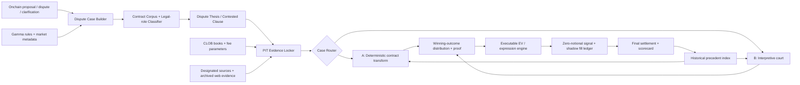

# Polymarket Dispute Repricing

## 当前结论

状态：`dispute-only adjudication-divergence architecture / clarification court worker ready and one-shot verified / zero-notional only / no persistent service or live change`。

2026-08-12 实现更新：forward collector 已把 PM 官方补充说明纳入 PIT 合同层。它从 UMA CTF
Adapter 读取 `getQuestion(questionID)` 与由该 question creator 发布的 `getUpdates`，并把
`binding_request / binding_resolution_rule / platform_description_revision /
generated_summary_nonbinding / onchain_clarification` 分层保存；未来才发布的 update 会从当前快照
排除。clarification 只允许解释原始问题，必须单独判断是否符合 `fundamental intent`，不能静默改写
合同。Gamma 页面出现 `Additional context` 但链上没有对应 creator update，或 Gamma 与 ancillary
不一致时，deterministic verdict 会 fail closed。

最新全量 zero-notional 重抓为 `85/85 snapshots、0 errors、85/85 adapter ancillary parity`；当前
85 宗活跃 corpus 中有 `0` 条 creator bulletin update，因此这批数据验证的是“无补充时不误报”。
历史全量扫描另以 2024-01-01 起的 `2,581` 个首次 dispute unique market 为分母：`2,542` 宗成功
验证链上 question/creator，`298 / 2,542 = 11.72%` 至少有一条 creator-authored update，共
`409` 条；另有 37 宗旧 adapter question identity 未恢复、2 宗 ancillary 没有 bulletin 合同，
均不计入可验证分母。

409 条 update 不能全部叫“补充规则”。透明 regex v1 分层为：315 条实质 adjudication guidance、
82 条纯运营通知（“已注意 dispute、几点决定是否 clarification、届时清 orderbook”）、12 条规则
修订/退款；同一市场可同时出现运营通知和后续实质 guidance。运营通知只能触发 watcher，不能进入
RuleVerdict。规则修订/退款属于最高风险类别：它可能是在修正有误的原始市场，而不只是解释既有
fundamental intent，默认 abstain 并单独审查 precedence/refund。

这 298 宗按主题为 politics/geopolitics 106、entertainment 47、sports/esports 41、speech/social 36、
other 29、business/macro/tech 21、crypto 12、weather 6。主题内发生率最高的是 business/macro/tech
`21/57 = 36.84%`、speech/social `36/102 = 35.29%`、entertainment `47/168 = 27.98%` 与
politics `106/400 = 26.50%`；sports 虽有 41 宗，但因分母大，只有 `3.36%`。这符合策略直觉：
官方补充规则本身更集中在语义、程序和公司行为边界，不是常规比分/stat finality。

按每市场第一条 update 的时点：209 宗在 dispute 后、10 宗在 proposal→dispute、72 宗在 proposal
前、7 宗在 settlement 后。对 233 宗存在 dispute 后 update 的市场，首条 post-dispute update 距
dispute 中位数 `166.7 分钟`，25/75 分位约 `94.4 / 663.3 分钟`；仅 6.9% 在 15 分钟内，58.8%
在 6 小时内。因而它不是只拼 2.8 分钟手速的策略：需要低成本持续监听 bulletin，并在 update
落链时立即保存新合同与 fresh book。forward collector 已增加每 60 秒 lightweight creator-update
fingerprint poll；只有 fingerprint 改变才触发完整 CLOB/规则快照。

注意这仍不是补充规则的独立 alpha 证明：有 update 且 request 已有清晰 binary 裁决的 171 宗中，
proposal flip 只有 `30 / 171 = 17.54%`；没有 update 的相应 raw slice 是 48.49%，但两组主题、P4、
发布时点和选择机制完全不同，不能把差值解释为因果收益。update 更像“运营介入后把裁决锚定/纠错”
的状态变量；具体能否交易必须重建 update first-seen 时的双侧价格、fee 和可成交深度。

已完成第一轮 update-time public-print replay。固定分母为每个首次 dispute market 的第一条
`post-dispute + before-settlement + substantive` creator update：225 宗，其中 124 宗最终有清晰
upheld/flip，112 宗有 update 后 reverse-token public print。**见实质 update 就盲买 reverse 是负
策略**：flip rate `19.64%`、reverse 首笔均价 `25.14¢`，当前 fee fallback 后 edge
`-5.67¢/share`，按 update UTC date block bootstrap 的 95% CI 为
`[-9.89¢, -2.20¢]`。相反，如果事后完美知道 guidance 支持哪一侧，111 宗 winner-token 首笔的
fee-adjusted 剩余空间均值为 `+7.84¢/share`，date-block CI `[+4.72¢, +11.65¢]`。后者只是
perfect-rule-lawyer hindsight ceiling，不是策略回测；但它证明可研究的 alpha 是“解释方向”，不是
“官方发 update”这个事件本身。public print 仍不证明当时有同价 ask/depth。

在这 225 宗上已完成 packet-only clarification court v5。输入只有 PIT title、outcomes、原始
binding rule、proposal outcome 与 creator update；Codex 运行在空临时目录、忽略 repo/user config，
并审计 JSON event trace，任何 shell/file/web/MCP/action item 都整批作废重试，因而模型不可读取
历史价格或最终 UMA settlement。最终市场方向可知的 221 宗中，proof/quote/fundamental-intent gate
放行 34 宗（15.38% coverage），方向 `34/34`；限制到当前主策略的 124 宗清晰 non-P4 request，
放行 30 宗（24.19% coverage），方向 `30/30`，覆盖 26 个独立 update cluster。proposal baseline
在两个分母上分别只有 71.49% 与 81.45%，说明 judge 不是简单复读 proposal。

这不是 untouched 精度证明。初版 court 的两个错误来自同一 Dota update：规则指定 Dotabuff
top-level kills，但 update 又要求排除两个 Roshan kills；模型依字面判 Under，最终 UMA/PM 判 Over。
看过该反例后，v3 起把它提升成通用 constitutional test：update 若新增原规则无法推出的
exclusion/inclusion/counting method/source override/threshold/definition/exception，必须判
`possible_change` 并 abstain；regex blocker 只保留作第二道保险。v5 在全部 221 宗最终方向分母上
没有产生错误的 Outcome0/Outcome1，但这是看过反例后的 development-set precision，只能冻结后去
forward 验证，不能宣传为 100% 胜率。

v5 还修掉了一个会真实买错 token 的协议 bug：旧 card 输出 `Yes/No`，面对 `[Over, Under]` 或
`[Team A, Team B]` 时，模型可能在 rationale 正确判 Under、执行层却把字段 Yes 映射到 outcome 0。
现在 card 只输出 `Outcome0 / Outcome1 / Abstain`，严格对应 Gamma outcomes 数组；两个历史
O/U 2.5 case 已从“正确文字、错误 token”恢复为 `Outcome1 = Under`。v1–v4 card 只留审计，均不
进入 forward scorer。

历史交易表达也按“判断 gate 与 edge gate 分开”重算：LLM confidence 只表示裁决证据质量，绝不
当 payout probability。方向过 gate 后，用独立冻结的 0.95 payout floor，要求
`0.95 - first selected-side public print - fee >= 5¢`，且 print 必须在 update 后 300 秒内。
清晰 non-P4 中仅 5 个独立 cluster 满足，5/5 最终正确，fee-adjusted 事后 edge 均值
`+56.40¢/share`，date-block CI `[+32.24¢, +80.41¢]`。样本极小，且其中是 public print 而非
25-share executable ask，所以只说明“若快速判对，个别市场曾留有很大空间”，不构成可交易回测。

对应 forward policy 已实现为 `official_clarification_court_taker_25share_shadow_v1`：collector loop
启用时每 60 秒轮询
creator bulletin，按当前 contract corpus 生成 court card，card 完成后重新拉正确 outcome 的 fresh
CLOB book；只接受 update→quote ≤300 秒、book age ≤15 秒、25-share ask、真实 fee、0.95 payout
floor 后 edge ≥5¢，并对同一 update cluster 最多留一个候选。客观 P4、规则修订/退款、source metric
重定义、quote 不完整和 corpus revision 全部 fail closed。worker 只写 append-only zero-notional
signals，不具备下单路径。最新 one-shot 有 86 个 tracked corpus，均无 creator update，所以
forward queue 为 0；这轮只验证了无 update 时不会误触发。当前没有 LaunchAgent/tmux 常驻进程，
不能把 tracked state 或可运行脚本称为“正在持续监听”；上线持久 zero-notional collector 仍需独立
受管部署和 freshness 监控。

组合入口已经收成一个 bounded loop；`--clarification-max-new-cards` 限制每轮最多新增的 Codex
court 数量，剩余 packet 延后到下一轮，避免 sibling/update storm 造成无界调用：

```bash
.venv/bin/python scripts/ops/polymarket_dispute_forward.py \
  --loop --skip-source-evidence --clarification-court \
  --clarification-model gpt-5.4 --clarification-max-new-cards 8
```

该命令仍然是 zero-notional，不会提交 CLOB order；本轮只做了 one-shot 验证，没有替用户安装
常驻服务或开启持续 LLM 花费。

用户给出的三个例子已在链上历史复现：GALBOT robot dancer 的 guidance 明确认定“举臂并有节奏
摇摆”属于 dancing，reverse 首笔 97.3¢，fee 后仅余约 2.57¢；Ronaldo guidance 明确认定赛后照片/
视频中可清楚看到脸上泪水，缓存看到的首个 reverse print 已到 99.8¢，只余约 0.19¢；MicroStrategy
两宗 guidance 则强调“announcement 必须发生在标题时间窗，actual purchase time 不重要”，均支持
proposal，winner-token public-print 上界约余 1.86¢ 与 4.76¢。这些 case 同时说明 watcher 要快，
judge 更要能双向输出 proposal/reverse，不能固定站 challenger。

系统同时修正了 UMA binary 与 Gamma outcome 的映射：
`UMA 0 = NO`，但 Gamma outcomes 通常为 `[Yes, No]`，proposal outcome 必须取反索引。修复后，
Wisconsin 两宗表面有 99.9% 上界的 YES 反转其实都是正确的 NO proposal；AP 报道 David Crowley
胜选后，两宗 RuleVerdict 均判 NO，review queue 从 2 回到 0。这个负例证明 scanner 必须先生成
`proposal / reverse` 关系，再研究 edge，不能把低价 challenger token 当福利。

研究拆成两条账：

- `P4 / Too Early bond capture`：方向保留，竞争与规则机械性已完成初查；按用户决策
  暂不深入执行，状态 `dormant-for-now`，不删除、不否定。
- `non-P4 rule-adjudication repricing`：当前主研究。只取每市场第一次 dispute，排除
  Too Early / 50-50 / 未裁决。历史 public-print 只作诊断；当前已启动 fresh CLOB collector、
  规则裁决 gate 与 zero-notional shadow ledger，仍不 live、不改生产。

2026-08-12 再次收窄策略边界：链上 dispute 是唯一交易触发器；普通比赛结果、普通价格
finality 与已经结束市场的全市场扫描不属于主策略。主策略只交易
`naive real-world outcome != contract-adjudicated outcome` 的裁决差异，或在语义边界无法机械证明时，
交易经过校准的 UMA adjudication probability。source adapter 只是证据层，不独立产生交易资格。

同一架构下保留两条分账：

- `deterministic adjudication divergence`：scope/source/deadline/exception 可以复算，输出唯一
  `winning_outcome`；
- `interpretive adjudication asymmetry`：`dance / cry / announce / sell / control` 等定义本身模糊，
  输出经过历史校准的 outcome distribution，而不是伪装成 100% 确定。

旧 Binance/plain-finality policy 只保留为 resolver 精度基准与 negative control；除非 dispute
暴露了 timestamp/source hierarchy 等合约差异，否则不代表未来主策略。

### 2026-08-12 可运行状态

当前真正可晋级的策略不是“见 dispute 就买反向”，而是以下三条独立 RuleVerdict policy：

| policy | 判定 | entry gate | 当前 forward |
|---|---|---|---|
| `binance_verdict_reverse_taker_25share_v1` | 官方 Binance spot/futures 1h candle 的确定性 resolver | RuleVerdict 已验证反向赢家；fresh 25-share ask；实际 fee 后 edge ≥5¢ | 历史 resolver 44/44 与最终裁决一致；0 个当前 eligible |
| `semantic_verified_reverse_shadow_v1` | 规则时区/截止点 + 官方时间线 + 独立报道的人工可审计裁决 | RuleVerdict confidence ≥95%；fresh 25-share ask；实际 fee 后 edge ≥5¢ | 1 个 open shadow position |
| `sports_verified_outcome_taker_25share_v1` | 官方统计 + period/scope 拆分，选择 RuleVerdict 正确的一侧而非固定 reverse | confidence ≥95%；正确 outcome 有 fresh 25-share ask；edge ≥5¢ | 5 个当前 verified sports cases，0 eligible |
| `official_clarification_court_taker_25share_shadow_v1` | creator update 是否闭合 binding predicate，并通过 fundamental-intent 审查 | packet-only Outcome0/1 court；update→quote ≤300s；fresh 25-share ask；0.95 payout floor 后 edge ≥5¢；update cluster cap | 历史 development non-P4 30/30；one-shot 86 tracked、0 update、0 signal；尚未常驻 |

首个 Semantic shadow 是 market `3449325`：`Will Russia target Kyiv by August 10, 2026?`。
规则截止为 Kyiv local time 的 8 月 10 日 23:59（20:59 UTC），官方信息在截止前只有被规则
明确排除的 threat/all-clear，首次指向 Kyiv 的 missile warning 在 21:29:51 UTC。系统因此判
`No`，confidence `0.97`；2026-08-12 02:23:18 UTC 的 25-share ask VWAP 为 `0.91`、
market fee 为 `0`，保守 deterministic edge 为 `9¢/share`。该记录只是 shadow entry，未下单；
`shadow_positions.jsonl` 与 `shadow_markouts.jsonl` 会记录可卖 bid markout 和最终 settlement。
这不是 t0 repricing 样本：collector 在 dispute 后约 `4.9h` 才首次看到该案，只能验证
late-entry / hold-to-resolution 表达。当前 85 个 tracked case 的 dispute 后 5 分钟内 fresh capture
仍为 0；真正的 early repricing forward 证据必须来自 collector 启动后的新 non-P4 dispute。
该 shadow 的 executable-bid markout 为：entry 后约 3m/5m `-11.21%`，15m `-9.89%`，
1h 时 bid 回到 `0.90`、净 PnL `-$0.25 / -1.10%`。这说明 9¢ 的 settlement edge 不能冒充
即时可退出利润；最初 10¢ 左右的 spread 曾吞掉全部 paper edge。market 尚未 closed，最终输赢未定。

第二个已验证 case 是 market `3389260`（OHL Women–Fenerbahçe corners odd/even）。规则只算
90 分钟并排除 extra time；UEFA 官方 full-match corners 是 `3+2=5`，但事件时间线的五次角球
在 `23′/90′/102′/109′/118′`，所以规则窗口内是 2 次，正确结果是 `Even`。两轮 proposal
本来就是 Even，dispute/市场却把 Odd 推到约 95%。这证明 RuleVerdict 必须允许“买 proposal
侧”；但 Even 当前只有 5¢ bid、没有 25-share ask，不能伪造 taker fill，只作为 maker-research
机会保留。44 个历史 Binance verified case 也支持这一分账：8 个 proposal 正确、36 个 reverse
正确；7 个有 proposal-side post-dispute print 的价格都在 99.9¢ 左右，历史上没有 ≥1¢ edge，
而有显著误价的 6 个全是 reverse winner。proposal-side 是稀有补充，不是历史主收益来源。

随后把 rule research 变成了一个先看容量、再花研究成本的实时队列：对每个未判 case 的双侧
25-share ask 计算 `p=1` 时的 fee-adjusted edge 上界；连 5¢ 都不可能达到的 case 不进入
LLM/人工深研。2026-08-12 03:00 UTC 首轮 fresh queue 有 4 个 market，研究后全部退出：

- Venezuela–Israel 是 2026-12-31 截止前就 proposal 的客观 Too Early/P4，不属于本策略；
- BGT–SU Game 2/3 的 Gol.gg 完整 timeline 各只有一个队伍摧毁 inhibitor，正确均为 `No`、
  原 `Yes` proposal 错，但 No 的 25-share ask 是 `0.99`，净 edge 仅约 `0.45¢`；
- Zenit–Rodina 的 RPL 官方 protocol 确认比赛 1:2 完赛；在规则指定的 24 小时等待期后，
  ESPN boxscore 给出 corners `11+3=14`，所以 O/U 13.5 正确为 `Over`、原 `Under`
  proposal 错，但 Over ask `0.98`，净 edge 仅约 `0.90¢`。

另一个未进入 queue 的 Gol.gg market `2203804`（Game 1 Any Player Penta Kill）也已由 resolver
核验：Game 1 的 `2+16=18` 次击杀与完整 timeline 对齐，没有选手在宽松的 60 秒窗口内拿到
5 杀，正确为 proposal-side `No`；No ask `0.95`，按 5% fee 和 99.5% confidence 只有
`4.26¢` edge，冻结的 5¢ 门槛不为它下调。当前 queue 已回到 0，说明“规则上能判对”与
“还有可吃的 taker edge”是两层独立条件；这批 forward 样本里，市场/做市商已经快速把三个
明确错误 proposal 的正确侧推到 98–99¢。

Gol.gg 已有两个可复现 resolver：`sports_golgg_penta_negative_v1` 会先用 game summary
与 timeline 击杀数对账，再用宽松时间窗只证明 negative；
`sports_golgg_both_teams_inhibitors_v1` 读取完整 game timeline 的 blue/red inhibitor event。
足球角球新增 `sports_espn_total_corners_v1`，只在规则允许的 fallback 等待期后读取完成态
boxscore。三者都要求调用方先锁定 event/game id，禁止用模糊队名匹配直接生成 settlement truth。

一个已经排除的错误做法：结构化历史模型可以当 dispute prior/ranker，但不能当 RuleVerdict。
它曾同时给同一场比赛多个互斥 score market 高反转概率；event cluster cap 只能消除重复风险，
不能替代“哪一项规则结果才正确”的外部证据。现在所有策略都要求可审计 RuleVerdict，未验证即 abstain。

全 dispute 混合样本的 `+3.11¢/share` 仅作背景；当前主结论以本文的 non-P4 固定分母
为准，不能把 P4 与规则方向反转混成一个策略。

## 研究目标与标签

目标：在链上 `DisputePrice` 首见时估计：

```text
P(final binary outcome != current proposed outcome | PIT rules/evidence/oracle state)
```

并与同一时点反提案侧的 fresh executable ask 比较。以下概念不能混用：

- `dispute`：有人在 challenge window 内质疑 proposal；
- `oracle request flipped`：该 request 的结算值与 proposal 不同；
- `market reversed`：市场最终二元 outcome 与该时点 proposal 相反；
- `price reversed`：反提案侧的交易价格跨过某个阈值。

第一轮 dispute 会进入新的 proposal round；单个 request 的 `Too Early` 不是市场
最终 50/50，也不能直接作为交易 label。

## Resolution 状态机

```text
proposal #1 -> 2h challenge
  ├─ no dispute -> resolve
  └─ dispute #1 -> proposal #2 -> 2h challenge
       ├─ no dispute -> resolve
       └─ dispute #2 -> debate / UMA vote -> resolve
```

官方当前口径：challenge 2 小时；debate 24–48 小时；UMA vote 约 48 小时；
完整 disputed resolution 通常 4–6 天。clarification 必须上链发布，不能改变问题
的 fundamental intent，但 UMA voter 应考虑它。

## v1 数据与 readiness

运行：

```bash
.venv/bin/python scripts/analysis/dispute_repricing/research_dispute_repricing_v1.py \
  --min-date 2024-01-01T00:00:00+00:00 \
  --cutoff 2026-08-12T02:06:24+00:00
```

来源：UMA 官方列出的 Polygon OOv2 / Managed OOv2 Goldsky subgraph、Polymarket
Gamma market metadata、Data API public trades。artifact：
`runtime/dispute_repricing/dispute_repricing_v1/{summary.json,signals.jsonl}`。

漏斗：

| 层 | 单位 | 数量 |
|---|---|---:|
| 两个 UMA subgraph 的 dispute request | request | 4,008 |
| 可映射且在日期范围内的 Polymarket dispute | dispute event | 2,993 |
| 有最终二元 label | dispute event | 2,816 |
| 首次 dispute 去重后的已结算市场 | market | 2,422 |
| 有 dispute 后反提案侧首笔 public trade | market | 1,720 |

截至 2026-08-10 的 label QA：2,427 个有 Gamma near-binary final price 的可比 market label 与最后有效
oracle binary settlement `0 mismatch`；其余为未 near-binary 或无 Gamma final price。
221 个触及 10,000-row tape 上限的市场已按 dispute→settlement 窗口重取。

## 核心结果

### 发生 dispute 后，最终 proposal 被推翻的频率

- 首次 dispute、按 market 去重：`642 / 2,422 = 26.51%`。
- 有价格覆盖的首次 dispute：最终反转 `547 / 1,720 = 31.80%`；反提案侧首笔
  public-trade 均价 `28.69%`，即 `+3.11pp` probability residual。
- 一份/market 持有至结算的 gross ROI on cost `+10.84%`；按 2026-08-12 fee schedule
  的主题级 fallback 回算约 `+9.77%`，对应 `+2.83¢/share`。这是 print-based development replay，
  不是 executable backtest。
- 以 UTC dispute date 做 block bootstrap，当前 fee 回算后的 edge/share 95% CI
  约 `[+1.21¢, +4.54¢]`。2025-Q2 的小样本为负，2025-Q3 以后点估为正；未有
  untouched frozen forward。

价格切片显示，机会集中在 dispute 后仍被当作 underdog 的反提案侧：

| 首笔价格 | n | 最终胜率 | 均价 | gross edge/share |
|---|---:|---:|---:|---:|
| `<1¢` | 676 | 1.18% | 0.22% | +0.96¢ |
| `1–5¢` | 215 | 10.23% | 2.19% | +8.05¢ |
| `5–20¢` | 198 | 16.16% | 11.17% | +4.99¢ |
| `20–50¢` | 175 | 45.14% | 32.50% | +12.65¢ |
| `50–80¢` | 96 | 66.67% | 64.43% | +2.23¢ |
| `80–95¢` | 92 | 86.96% | 89.09% | -2.13¢ |
| `≥95¢` | 268 | 97.76% | 98.69% | -0.93¢ |

`1–50¢` 是开发样本发现的 challenger band，不是已经确认的 gate。高于 50¢ 后
追价，按当前 fee 回算的组合点估已为负。

### dispute 和 repricing 一般什么时候发生

- 从 proposal 到 dispute：median `16.5 分钟`，p90 `110.55 分钟`；接近两小时
  末端才 dispute 的也不少，scanner 必须使用链上时钟。
- 对最终真的反转、且 dispute 前反提案侧尚未跨阈值的 market：跨 `50¢` median
  `8.7 分钟`（p90 `8.47 小时`）；跨 `75¢` median `16.1 分钟`（p90 `18.60 小时`）；
  跨 `90¢` median `28.8 分钟`（p90 `35.38 小时`）。
- 498 个有 pre-dispute price 的真反转中，277 个在 dispute 前已高于 50¢。
  因此 dispute 经常是确认信号，而非反转起点。
- 只有一轮 dispute、随后第二 proposal 未再被 dispute 的路径，从首次 dispute 到
  final settlement median `3.22 小时`；两轮 dispute / DVM 路径 median
  `146.8 小时`（约 6.1 天），与官方 4–6 天口径大体一致但存在长尾。

### 当前主研究：non-P4 rule-adjudication repricing

固定分母：每个 market 只取第一次 dispute；request 必须有清晰 `binary_flip` 或
`upheld` 裁决；排除 Too Early、Unknown/50-50 与 request 未裁决。signal funnel 为
`2,422` 个首次已结算二元市场 → `988` 个清晰 non-P4 dispute（`417 flip / 571 upheld`）；
evidence funnel 为 `988` → `807` 个有 dispute 后首笔 public trade → `758` 个同时有
dispute 前 public price → `0` 个 fresh executable book / `0` 个策略 fill。

| 历史 public-print 指标 | 结果 |
|---|---:|
| 清晰 non-P4 unique market | 988 |
| 独立 UTC dispute date | 325 |
| Binary flip base rate | 42.21% |
| 有 post-dispute price | 807（81.68%） |
| Priced flip rate / 反向首笔均价 | 42.01% / 38.36¢ |
| Gross edge / ROI on print cost | +3.65¢ / +9.51% |
| 当前 fee 回算 edge / ROI | +3.37¢ / +8.74% |
| Fee-adjusted date-block edge 95% CI | `[+1.33¢, +5.48¢]` |

这里的 `fee-adjusted public-print edge` 定义为：

```text
mean(final_flip_0_or_1 - first_reverse_public_print - modeled_taker_fee)
```

它等价于“对 807 个有价格的清晰 non-P4 首次 dispute，不做任何 case 筛选，假设都能在
反向 token 的 dispute 后第一笔公开成交价买 1 share，并持有至 request 裁决”的组合回放。
`42.01% - 38.36% = 3.65¢` 是 gross edge；再按
`shares × feeRate × price × (1-price)` 回算 taker fee 后是 `3.37¢`。它**不是**我们的
LLM/规则模型 edge，也不是可成交回测：public print 可能是别人极小的一笔成交，不能证明
同一时刻存在可买 ask、25 shares depth，或我们能在该笔成交前完成判断。

2026-08-12 核对官方 fee schedule 后把 Sports fallback rate 从旧脚本的 `3%` 修正为
`5%`。同一 807-market 分母下，整体 fee-adjusted edge 从 `3.394¢` 降至 `3.375¢`
（`-0.019¢/market`），Sports 从 `9.286¢` 降至 `9.226¢`（`-0.060¢/market`）；
研究方向不变。当前仍是主题级 fallback，正式 forward 必须保存每个 market 在决策时的
真实 fee parameters；官方说明 makers 不付 fee、takers 按 market category/parameters 付费。

市场本身信息量很强：首笔反向价格的 Brier / logloss 为 `0.085 / 0.309`，明显好于
同 rows 常数 base-rate 的 `0.244 / 0.680`。所以研究目标不是打败 42% 的无信息基准，
而是用 PIT rules/source/precedent 在同一批 market 上进一步打败已经很强的市场概率。

结构化 expanding-month OOS（2026-01 起，608 cases）中，market Brier `0.08989`，
market+rules model `0.07725`，按 dispute date block bootstrap 的差值 95% CI 为
`[-0.02180, -0.00417]`。但分 track 后只有 Mechanical 明确成立：343 cases 的 Brier
`0.08581 → 0.06533`，差值 CI `[-0.03477, -0.00722]`；Semantic 236 cases 为
`0.08676 → 0.08415`，差值 CI `[-0.01479, +0.00917]`，尚未证明优于市场。
更重要的是该模型只预测“dispute 被 flip 的 prior”，不能决定具体 market outcome；因此它只能
做 case ranking，不能绕过 RuleVerdict gate。历史 mechanical policy 原有 54 个 market-level
候选，按 underlying event 去重后是 52 个 expressions / 44 dates；其 `34.5¢/share` print
结果仍不是 executable evidence。

确定性 Binance resolver 是目前最干净的 Track A 子策略：74 个历史
`financial_timestamp_price` case 中覆盖 44 个，44/44 与最终裁决一致；30 个不支持的规则形态
直接 abstain。冻结的 ≥5¢ policy 在历史仅有 5 markets / 5 dates，首笔 public-print 净收益
均值 `59.07¢/share`、ROI `144.3%`；样本很小且 entry 仍是 public print，所以只进入
zero-notional forward，不能据此下真钱。

时间稳定性不一致：

| dispute 年 | priced n | fee-adjusted edge | date-block 95% CI |
|---|---:|---:|---:|
| 2025 | 199 | +0.45¢ | `[-3.50¢, +4.39¢]` |
| 2026 through Aug 11 | 608 | +4.33¢ | `[+1.91¢, +6.75¢]` |

因此合并历史正 edge 主要来自 2026；当前只能称 `current-regime historical candidate`，
不能说跨 regime 已确认。

价格带是诊断，不是 eligibility gate：

| 反向首笔价格 | n | flip rate | 均价 | fee-adjusted edge | date-block 95% CI |
|---|---:|---:|---:|---:|---:|
| `<5¢` | 329 | 6.38% | 0.97¢ | +5.36¢ | `[+2.85¢, +8.31¢]` |
| `5–20¢` | 111 | 10.81% | 10.79¢ | -0.46¢ | `[-6.13¢, +6.32¢]` |
| `20–50¢` | 72 | 48.61% | 30.23¢ | +17.37¢ | `[+4.96¢, +29.64¢]` |
| `50–80¢` | 44 | 59.09% | 64.82¢ | -6.82¢ | `[-20.88¢, +6.49¢]` |
| `80–100¢` | 251 | 97.61% | 97.25¢ | +0.23¢ | `[-2.30¢, +2.17¢]` |

`<5¢` 的 21 个历史 winner 包含体育 spread/player stat、演讲词、deadline strike、
crypto price/source 和公司指标；`20–50¢` 的 35 个 winner 主要是 sports score/stat、
speech/transcript、经济数据与 event-occurrence 边界。两段都必须靠机制识别，不能直接
变成价格 filter；尤其 public print 不代表同价可买到有意义 depth。

高精度主题诊断显示当前最值得继续标注的两族：

| 高精度主题 slice | priced n | fee-adjusted edge | date-block 95% CI | 当前判断 |
|---|---:|---:|---:|---|
| Sports / esports score & stat | 260 | +9.23¢ | `[+5.91¢, +12.55¢]` | 首要 case-label 方向 |
| Crypto / financial source | 81 | +4.65¢ | `[+0.48¢, +9.36¢]` | 次要机械 source 方向 |
| Speech / social semantic | 64 | +7.37¢ | `[-0.87¢, +16.62¢]` | 样本仍不足 |
| Politics / geopolitics | 220 | -2.78¢ | `[-6.52¢, +1.30¢]` | 不支持盲买反向 |
| Weather / natural | 17 | -2.73¢ | `[-5.87¢, -0.31¢]` | 不作为 rule-repricing 主线 |

theme classifier 是高精度诊断而非完整 taxonomy；`other` 中仍有未召回的体育、金融和
政治标题，以上结果可用于选择 case-review 方向，不能当最终训练 label。

首轮 case review 的机制优先级据此固定为：

1. `sports objective stat/source`：spread、assists、rebounds、kills、rounds、corners、
   halftime 等，重点核对 taken vs awarded、regular time、remake、官方 final stat；历史低价
   winner 包括 player stat、map winner 与 odd/even total。
2. `financial timestamp/release`：指定时点 crypto/stock price、official macro release、
   app/ranking snapshot；历史 winner 包括 Ethereum 4PM ET、TSLA up/down、Japan unemployment。
3. `speech/transcript`：精确词形、speaker attribution、视频/字幕边界；历史点估正但 CI
   尚未过零，只作第二阶段 annotation。
4. `event occurrence / geopolitics`：strike、meeting、announcement、insult 等边界；整体
   politics slice 为负，先作为 negative control，不做“有人 dispute 就反买”。

每个 case 必须标 `rule clause / designated source / proposal-time evidence / clarification /
precedent / final rationale / first executable book`；不以事后赢家故事代替 PIT 标签。

速度上，首笔 public trade 距 dispute median `1.13 分钟`。对真正 binary flip、且此前
尚未跨阈值的市场，跨 50¢ / 75¢ / 90¢ 的 median 分别约 `7.7 / 8.2 / 12.0 分钟`，
p90 约 `6.70 / 7.12 / 12.76 小时`。这给规则研究留的是分钟级而非小时级主窗口，
但仍有可做人工深研和慢速 repricing 的长尾。

### Too Early 有多少，竞争多激烈

这里的固定分母是 **已经发生链上 dispute 的 request**，不是所有 proposal：

- 2024-01-01 至 2026-08-11 共映射到 `2,991` 个 Polymarket dispute event，
  其中 `1,533 / 2,991 = 51.25%` 最终被判 `Too Early`，涉及 `1,435` 个
  unique market、`298` 个独立 UTC 日期。
- 机会主要从 2025-05 后出现；最近 365 天有 `1,382` 次，约 `115 次/月`、
  `3.8 次/日`。2026 年 1–7 月完整月份均值约 `150 次/月`。
- 最近 365 天抢到 `Too Early` dispute 的时延：median `9.08 分钟`、p90
  `70.67 分钟`；`6.29%` 在 1 分钟内、`38.90%` 在 5 分钟内、`62.62%`
  在 15 分钟内、`72.16%` 在 30 分钟内、`86.12%` 在 60 分钟内。
- 最近 365 天共有 `221` 个成功 disputer 地址。Top 1 占 `10.49%`、Top 3
  `23.37%`、Top 5 `30.90%`、Top 10 `42.69%`。因此竞争中等偏快，但并非
  单一地址垄断；规则判断在前 15–60 分钟仍有实际窗口。
- 其中 `146 / 1,382 = 10.56%` 是 proposer 与 disputer 同地址的自我纠错。
  剔除这部分后，外部 disputer 实际拿到 `1,236` 次（约 `103 次/月`），响应
  median `8.59 分钟`；外部 Top 10 地址合计占 `39.97%`。

竞争口径是可观测下界：subgraph 只记录成功上链的 disputer，不记录 reverted、
被抢先或放弃的交易；一个操作者也可能拆成多个钱包。当前结果能回答绝对机会频率、
成功者集中度和反应速度，不能把 `51.49%` 误读为所有 Polymarket proposal 中
有一半过早。

#### Too Early 集中在哪些主题

以下为 title + rules + resolution source 的确定性诊断分类；它不是 UMA voter
逐案撰写的理由：

**2026-only（2026-01-01 至 2026-08-11 UTC）**：共 `1,074` 次 Too Early
request、`1,008` 个 unique market。request 是链上 dispute 次数；unique market
去掉同一市场的重复轮次，但同一比赛的多 outcome ladder 仍会算多个市场。

| 主题 | request | request 占比 | unique market | market 占比 | median proposal→dispute |
|---|---:|---:|---:|---:|---:|
| Sports / esports | 595 | 55.40% | 589 | 58.43% | 8.83 分钟 |
| Politics / geopolitics | 178 | 16.57% | 136 | 13.49% | 22.31 分钟 |
| Entertainment / awards / media | 84 | 7.82% | 82 | 8.13% | 12.95 分钟 |
| Crypto / financial markets | 81 | 7.54% | 79 | 7.84% | 5.77 分钟 |
| Weather / natural events | 75 | 6.98% | 74 | 7.34% | 3.97 分钟 |
| Speech / social media counts | 37 | 3.45% | 28 | 2.78% | 60.10 分钟 |
| Business / macro / technology | 21 | 1.96% | 18 | 1.79% | 6.33 分钟 |
| Other | 3 | 0.28% | 2 | 0.20% | 90.50 分钟 |

2026 的集中度比全历史更高：Sports / esports 从全历史 `47.95%` 升到
`55.40%` request（按 unique market 是 `58.43%`）；Politics 仍稳居第二。
因此当前扫描优先级应是 sports finality，其次 politics deadline/certification；
crypto 与 weather 规模较小，但规则更机械、成功 dispute 的响应也更快。

**全历史（2024-01-01 至 2026-08-11 UTC）**：

| 主题 | request | 占比 | median proposal→dispute |
|---|---:|---:|---:|
| Sports / esports | 735 | 47.95% | 8.87 分钟 |
| Politics / geopolitics | 250 | 16.31% | 21.23 分钟 |
| Weather / natural events | 162 | 10.57% | 3.95 分钟 |
| Entertainment / awards / media | 158 | 10.31% | 26.33 分钟 |
| Crypto / financial markets | 135 | 8.81% | 5.83 分钟 |
| Speech / social media counts | 45 | 2.94% | 56.97 分钟 |
| Business / macro / technology | 35 | 2.28% | 4.90 分钟 |
| Other | 13 | 0.85% | 2.47 分钟 |

Sports 接近一半，而且常成批出现在同一个 race、match、map、set 或 player/team
ladder；request 数不是独立事件数。Weather 与 crypto 规则通常机械，但被抢得最快；
politics、entertainment 和 speech 较慢，却更依赖 source hierarchy 和语义判断。

#### 2026 Weather / natural events 细分

原诊断的 `76` 条中有一条 `Hobart Hurricanes vs Brisbane Heat` 板球赛，因队名
`Hurricanes` 被 weather keyword 误分；修正 sports-source 优先级后，真实分母是
`75 request / 74 unique market / 34 independent measurement window / 29 dispute dates`。
request 明显夸大独立机会：69 个温度 market 实际只来自 30 个 city-date ladder。

| 子类 | request | unique market | 独立窗口 | 占 Weather request | median dispute latency |
|---|---:|---:|---:|---:|---:|
| Daily highest temperature exact bracket | 69 | 69 | 30 city-date | 92.00% | 3.40 分钟 |
| M6.5+ earthquake count window | 4 | 4 | 3 周窗口 | 5.33% | 12.28 分钟 |
| Major space-weather count window | 2 | 1 | 1 周窗口 | 2.67% | 59.57 分钟 |

温度样本按市场数最多的是 London 11、Seoul 10、Istanbul 8、Tel Aviv 6、
Singapore 5、Atlanta / New York City 各 4。最大的六个 ladder（Istanbul 8、
Seoul 7、Tel Aviv 6、Singapore 5、Atlanta 4、London 4）合计贡献 34 / 75 request；
不能把一个 ladder 的逐 bracket dispute 当成 8 次独立发现。

69 个日最高温市场的 proposal 时钟：

| proposal 相对目标城市日期 | request | 判 Too Early 的原因 |
|---|---:|---|
| 目标日期之前 | 5 | Singapore May 2 ladder 在 May 1 下午即 proposal |
| 目标日期 00:00–05:59 | 15 | 当天刚开始，最高温 observation window 显然未完 |
| 目标日期 06:00–17:59 | 7 | 日内仍可能升温 / overshoot |
| 目标日期 18:00–23:59 | 9 | 即使接近午夜，rules 仍要求全天数据 final |
| 目标日期之后、但指定源尚未 final | 33 | local midnight 不是 WU / NOAA source finality |

其中 `57 / 69` proposal 是 NO，`12 / 69` 是 YES。也就是说，DVM 的 P4
不是在说 proposal 的方向最终必错；它是在说 proposal timestamp 不满足 rules 的
resolution eligibility。特别是 `33 / 69` 已跨 local midnight 仍判 Too Early，scanner
不能只比较 calendar end，必须等待 rules 指定的 Wunderground / NOAA `finalized for all
hours` 状态。source 切片也显示竞争差异：Wunderground 51 条 median `2.80 分钟`，
`74.51%` 在 5 分钟内被抢；NOAA weather.gov 18 条 median `84.58 分钟`，但只来自少量
批量 ladder，不能把慢速点估直接外推。

非温度案例同样高度机械：earthquake rules 写明 timeframe 未结束不得 resolve，末日地震还
要留 24 小时 magnitude revision；space-weather 的 `exactly 2` 虽允许在第二次 qualifying
event 出现时立即 YES，但在周窗口未结束前不能提前报 NO，因为第三次事件仍会改变 exact count。

竞争层面，75 条的 overall median `3.97 分钟`、p90 `87.79 分钟`；`54.67%` 在 5 分钟内、
`68.00%` 在 15 分钟内、`76.00%` 在 60 分钟内。共有 24 个成功 disputer，Top 1 / Top 3 /
Top 5 分别占 `17.33% / 42.67% / 61.33%`，没有 proposer 自我 dispute。75 条链上 bond
均为 `500,000,000` raw units（该 USDC currency 的 6 decimals 下为 500 units）。

对 repricing 策略最重要的是：**P4 成立不等于应该买 proposal 的反方向**。74 个 unique
market 中最终真正反向结算只有 3 个；有 post-dispute public print 的首轮 43 个市场中，
反向仅 3 胜。按每市场首个 public print、每市场 1 share 粗算，gross hold ROI `-0.89%`，
且未计 fee / depth；温度子集 gross ROI `-31.45%`。总体被唯一 space-weather winner
托起，不能当可执行正 edge。Weather P4 当前更像“抢正确 dispute bond”的机制机会，
不是稳定的 reverse-token 买入信号。

#### 为什么被判 Too Early

| 诊断机制 | request | 占比 | 典型情况 |
|---|---:|---:|---|
| Live contest / series 尚未最终结束 | 735 | 47.95% | 比赛、set、map、race、统计仍可变化 |
| Measurement / observation window 尚未最终关闭 | 376 | 24.53% | candle close、日最高温、box office、post/view count |
| Deadline / occurrence window 仍开放 | 170 | 11.09% | `by DATE` 的事件仍有时间发生，尤其提前报 NO |
| Official result / release / certification 尚未完成 | 136 | 8.87% | 选举认证、奖项宣布、Fed/GDP 等正式发布 |
| Designated source / event finality 尚不明确 | 116 | 7.57% | nominal end 已过，但指定源仍未给最终值 |

`1,492` 个有 Gamma end date 的 Too Early request 中，`889 / 1,492 = 59.58%`
在该时间之前就 proposal。标准 YES/NO 市场有 `1,141` 个，其中 `796 / 1,141 =
69.76%` 是 proposal NO；“deadline 未到就报 NO”是最适合机械检测的错误之一。

#### 判定难度与保证金风险

优先级从易到难：

1. proposal timestamp 明确早于 rules 的 end/deadline，且 rules 没有 early-resolution 条款；
2. 指定 sports/esports source 仍显示 scheduled/live、未显示 final/completed；
3. 指定 candle、日最高温、计数或周末统计的 measurement window 尚未关闭；
4. rules 明确要求 official announcement/certification，但 proposal 时该文件尚未发布；
5. 语义词、credible-reporting fallback、source conflict 或“结果是否已不可逆”的案例只作人工 case review。

不能用“deadline 还没到”单独 dispute 一个已经不可逆实现的 YES：若 rules 允许即时/提前
resolution，或条件已经满足且后续无法撤销，proposal 可能有效。exact bracket、touch、
announcement vs occurrence、初值 vs revision 也必须按原 rules 判。

最终的 oracle 答案由 UMA DVM token holders 依据 ancillary rules、PIT evidence 和链上
clarification 投票；Polymarket clarification 应被考虑，但不能改变问题的 fundamental intent。
第一次 dispute 会触发新 proposal round，第二次再 dispute 才使市场结算路径进入 DVM，
不能把“自动 reset”当成 disputer 已获胜。

错误 dispute 会损失全部 counter-bond。当前官方页面称 proposal/dispute bond 通常约
`$750 pUSD`，但实际以该 request 链上参数为准；若 proposer 获胜，disputer 不取回 bond。
若判 `Too Early`，disputer 取回自己的 bond 并获得 proposer bond 的一半。历史清晰裁决
样本中，`823 / 2,881 = 28.57%` 是 proposal upheld、即 disputer 输；它不是无风险 bounty。

#### UMA voter 的奖励不是 dispute bond

UMA voter 与 Polymarket disputer 是两种仓位：disputer 质押 pUSD counter-bond，胜诉后
获得 proposer bond 的一半；voter 则质押 UMA，并不分享这笔 proposer/disputer bond。
voter 收益由两部分组成：

1. 按 stake 占全网总 stake 的比例获得 UMA emissions；Voter dApp 显示浮动 APY。
   UMA 当前 FAQ 给出的诊断区间是约 `16%–21%`，页面示例约 `17%`，不是保证利率。
2. 错投或漏投者被 slash 的 UMA，按正确 voting weight 分给正确 voter。该部分取决于
   其他人的错误/缺席，事前不可稳定预测。

对单个 voter，粗略 token-return 可写为：

```text
UMA 净收益
= pro-rata emissions
+ 正确投票分到的 slash
- 0.1% × staked UMA × 错误/漏投的 request 数
- 未报销 gas
```

每个 dispute request 都单独计罚；同一 48 小时 round 可有多个 request。以 `10,000 UMA`
为例，错或漏一个约损失 `10 UMA`，同轮错/漏五个约 `50 UMA`。这也解释了为什么官方
DVM 设计中，长期只 stake 而不认真投票的人，其 emissions 会被 slashing 大致抵消。

操作约束：前 24 小时 commit、后 24 小时 reveal；只 commit 不 reveal 仍算漏投；unstake
有 7 天 cooldown，期间不赚 reward、不能投票。投票无最低 UMA 数量，但官方 gas rebate
要求 round commit 开始时至少 stake `1,000 UMA`，只覆盖合格的 commit/reveal，不覆盖
approve、stake/unstake 与 claim。真正的美元收益还要扣 UMA 价格波动，因此 token APY
不能直接当美元无风险收益率。

## 什么情况下容易 dispute

以下是机制分类，不是独立有效的 alpha filter：

1. **过早 proposal**：比赛、统计发布、认证或官方声明尚未完成。
2. **机械事实冲突**：比分、corners、kills、经济数据、公司指标与指定 source 不符，
   或 source 后续 revision。
3. **语义边界**：`say / speak to / insult / wear / announce / control` 等自然语言与
   市场标题的常识理解不同。
4. **时间边界**：`by`、时区、事件发生时间与公告时间、初次发布与修订版混淆。
5. **source hierarchy 冲突**：官方源、备用 credible reporting、视频证据之间不一致。
6. **取消/重赛/中断/统计口径**：常见于 sports/esports，特别是 regular time、
   taken vs awarded、remake 等细节。
7. **经济激励**：任何人都能用 bond dispute；当持仓价值显著高于 bond 时，边界案例
   被挑战本身是理性的，不能把“有人愿意付 bond”当成对方必胜证据。

## 什么时候更像真反转

case review 的优先级应为：

1. 指定 resolution source 在 proposal 前已给出与 proposal 相反的明确答案；
2. event 尚未满足 rules 定义的完成条件，proposal 明显 Too Early；
3. 同一 rule template / 同类已结算 market 有可复用 precedent；
4. onchain clarification 明确覆盖当前边界案例，且没有改变 fundamental intent；
5. sibling markets / mutually exclusive ladder 与 proposal 产生逻辑矛盾；
6. 第二轮 proposal 是否改变 outcome。历史 double-dispute 组中，第二 proposal 改向
   时当前 proposal 被推翻约 54.3%，不改向时约 18.9%；但 dispute 后市场均价已分别
   约 52.3% 与 17.4%，简单状态信息基本已被价格吸收。

相反，只有社交媒体多数、持仓大户喊单、或“现实中看起来应该如此”，但不符合
resolution source / rule wording / precedent 时，不属于高质量反转证据。

## 两条策略线：同一架构，不同不确定性合同

共同预测对象不是“现实世界谁更有道理”，而是：

```text
P(当前 request 最终被判为 proposal 的反方向 | 当时可见 rules / evidence / precedent)
```

| 研究线 | 典型问题 | 主要能力 | 优先主题 | 风险 |
|---|---|---|---|---|
| A. Deterministic Adjudication Divergence | 现实统计与规则限定后的 qualifying fact 是否不同 | 合同编译 + source adapter + scope/source/deadline/exception transform | sports scope、timestamp、source conflict | 快，但只有存在裁决差异才进入策略；普通 finality 明确排除 |
| B. Interpretive Adjudication Asymmetry | `dance / cry / announce / sell / insult / meet / control` 等定义到底覆盖什么 | 文本效力分层 + 多模态证据 + precedent + 正反方辩论 + 概率校准 | culture、speech、visual behavior、corporate action | 赔率可能很凸，但预测的是 UMA voter 共识；LLM 自信不能当概率 |

A 不是“不用 LLM”：LLM 可以解析规则和生成 source query，但最终结论必须落到可复算的
predicate/transform。B 也不是“让一个 LLM 看完直接猜”：必须保留证据引用、反方意见、先例和
abstain，然后用历史裁决校准。两个 track 都输出 `winning_outcome distribution`，不再假定正确方向
一定是 proposal 的反面；共用盘口、费用、shadow 和评估层。

### 文本效力分层：先确定什么是合同，再解释合同

所有文字片段必须保存 origin、first-seen、content hash 与 `legal_role`，禁止简单拼接后交给 LLM：

| legal_role | 例子 | 默认用途 |
|---|---|---|
| `binding_request` | UMA identifier、完整 ancillary data、p1/p2/p3/p4、request timestamp | 裁决主合同 |
| `binding_resolution_rule` | market resolution criteria、source、deadline、edge cases | 裁决主合同；必须与 request snapshot 对账 |
| `onchain_clarification` | bulletin-board Additional context | voters 应考虑，但不得改变 fundamental intent |
| `market_context_nonbinding` | event 背景、赔率叙事、FAQ、推广文字 | 只能帮助检索，不得改变 predicate |
| `generated_summary_nonbinding` | 明示“不影响 resolution”的 AI/实验性摘要 | 完全排除出裁决输入 |
| `argument_only` | comments、Discord、UMA voter discussion | 只作为双方论点/precedent 检索线索，不作事实 |

“多余的一段说明”不能按位置判断效力：如果它被编码进 ancillary data 或明确属于 resolution
criteria，它可能是 binding；如果它是页面 AI summary、event context 或 disclaimer 标明不影响
resolution，则不应进入 contract interpretation。任何 UI 与 onchain request 不一致都输出
`contract_snapshot_conflict` 并 abstain，不能自行挑对交易有利的版本。

### 三类代表性语义争点

- `robot dance`：争点不是视频里有没有机器人，而是 `dance / dancer / featured` 的必要条件；
  用手臂按节奏表演但脚不动是否满足普通语义，取决于规则有无 locomotion/body-movement 约束和
  同模板 precedent，不能由模型凭审美下结论。
- `Ronaldo cry`：把 `emotion / wet eyes / wiping face / visible shedding of tears` 分开编码；如果规则
  要求清晰可见的泪水，悲伤表情或捂脸不自动成立。证据还必须满足人物、时间、场地、真实性和
  camera visibility 条件。
- `MicroStrategy sell BTC`：区分 sale、transfer、custodian movement、accounting disposal、subsidiary
  action、announcement 与 transaction effective time；额外说明是否 binding 必须先经过上述效力分层。

这些例子不是 hard-code 特例，而是用于训练可复用的 `predicate ontology`：行为定义、视觉证据阈值、
主体归属、交易行为、时间效力和文本优先级。

## 系统工程架构



### 2026-08-12 架构复核与共享边界定案

最终采用“**策略拥有 universe/裁决，平台提供统一行情/执行合同，同一 token 同一时间只有一个 raw
owner，通用 market facts 共享、策略 facts 分域物化**”的边界。
这比让 dispute worker 直接读取 weather 的 `latest.json`，或把 dispute 字段硬塞进
`weather.db` 更干净，也保留了以后扩展新题材和新策略的空间：

```text
weather discovery ---------> weather scheduler ----\
crypto discovery ----------> crypto scheduler -------+-> shared capture runtime/contract
UMA dispute/update --------> event-burst scheduler --/      -> REST / selective WS / fee

shared raw market/oracle facts
  -> weather canonical mart
  -> dispute canonical mart -> adjudication -> candidate -> shared execution handoff
```

以下是本轮代码审计后的明确复用结论：

| 现有组件 | 定案 | 原因 / 动作 |
|---|---|---|
| `weather_data_feed/market_book_contract.py` | **抽成平台公共 contract** | 已有 exchange/request/response/parsed 四类时钟、raw hash、capture id 与 PIT 判定；逻辑通用，只是命名绑了 weather |
| `weather_data_feed/ws_incremental_book.py` | **抽成平台公共 reconstructor** | 已有 subscription epoch、delta chain、gap/reconnect fail-closed、REST parity 与 raw-frame lineage；这是应保留的生产级实现 |
| `weather_market_books` 的 city/event discovery | **不共享** | universe 是天气专属；保留 discovery，只把 token demand 提交给公共 collector |
| `weather_market_books` 的 REST/WS capture implementation | **抽成公共 runtime** | Weather、crypto、dispute 可按各自 universe/cadence 跑独立 scheduler；同一 token 不重复写，rule-lawyer 也不依赖 weather session 是否在线 |
| `src/platform/market_data/market_ws.py` | **不作为 canonical** | 当前实现会静默 reconnect，缺 baseline/gap/parity/content lineage；只保留兼容用途，最终由上述成熟实现替代 |
| `src/platform/clients/clob.py` | **保留 API 外壳并解耦** | 当前反向依赖 `rule_lawyer.config`，且时钟不完整；移除策略依赖后作为 shared REST client |
| `runtime/weather.db` / weather fact builder | **不物理共享** | 它的生产 identity、refresh 和宽表字段都属于 weather；dispute 写入会扩大故障与重建半径 |
| `fact_signal_candidates` / `fact_trades` | **共享逻辑 envelope，不共享 weather builder** | 复用 candidate、intent、plan、order、fill、settlement 的粒度与 ID；各 domain 先独立物化，统一看板用 `UNION ALL` view |
| `runtime/strategy_runtime.db` | **只共享运行注册与 heartbeat** | 现有 `trade_orders/trade_fills` 字段过薄，不是研究或资金 canonical |
| weather `ExecutionIntent` / `OrderRuntime` / venue / journal | **抽成公共 execution runtime** | 已有 authorization、pause、dedupe、exposure reserve、risk recheck、unknown reconciliation；比现有通用 mock executor成熟 |
| `src/platform/execution/executor.py` | **不得接真钱** | 目前真实网络下单仍是 mock；不能因目录名叫 platform 就视为生产执行链 |
| 旧 rule-lawyer SQLite 与当前 JSONL | **保留为 legacy/raw 输入** | 不删 11GB 历史，不继续扩成第二套 canonical；由增量 materializer 读取并记录 source lineage |

#### 公共 capture runtime 与 CaptureDemand

Weather、crypto 与 rule-lawyer 各自声明“需要哪些 token、多久、为什么”，共用捕获代码和数据合同；
它们的市场范围不重叠时可以是独立进程和独立调度，不需要长期双跑或互相依赖。只有多个 consumer
同时需要同一 token 时，arbiter 才合并 demand，禁止对该 token 维护两个 canonical raw writer。
公共 `CaptureDemand` 至少包含：

```text
demand_id / consumer_id / strategy_key
condition_id / token_id
reason / priority
requested_at_utc / expires_at_utc
requested_checkpoints / desired_transport
```

arbiter 在发生重叠时按 `token_id` 去重，生成可审计的 `subscription_epoch_id`。建议的优先级和采集方式为：

- `P0 trigger-hot`：新 dispute 或 creator update；立即拉 REST baseline，随后 WS 热跟踪 10 分钟，
  并保留 15m/1h REST checkpoint；
- `P1 decision/order-hot`：court 正在判断、已有 candidate、shadow/open order；在 thesis 有效期内保持
  WS 或 30–60 秒 REST；
- `P2 unresolved-watch`：只监听 UMA/bulletin 状态，不持续拉全 book；有状态变化再升 P0；
- `cold`：settled/expired 且无开放仓位，不再轮询，只保留 immutable raw。

因此 86 个 tracked case 不应等于 172 个 token 全时 WS。官方 update watcher 仍使用低成本自适应
`getUpdates`：age ≤6h 每 60 秒、≤48h 每 5 分钟、更老每 30 分钟；按当前 86 个 watcher 约
`13,680 eth_call/day`，而不是全量每分钟约 `123,840/day`。若后续证明 adapter 发出的链上 event
可完整覆盖 creator update，再增加 log subscription；`getUpdates` reconciliation 仍保留为权威防漏层。

#### 物理存储与数据表

不创建一个包办所有策略的大 SQLite。共享 raw owner 与分域 canonical mart 分开：

1. `platform market-data raw`：production contract 解析出的分区目录，append-only 保存 REST response、
   WS frame/batch、fee response、Gamma revision、UMA event 与 creator update；大 payload 以 content hash
   去重，decision row 只引用 ID，不重复嵌整份 corpus/book。同一 token/epoch 只能有一个 canonical writer，
   但不要求所有互不重叠的 universe 由一个巨型进程承载。
2. `platform market-data index`：物化通用表
   `market_revisions`、`market_tokens`、`oracle_events`、`creator_updates`、
   `market_book_snapshots`、`market_book_levels`、`market_fee_snapshots`、`trade_prints`、
   `market_group_snapshots`、`market_group_expressions`。这里的 group/expressions 是通用 ladder：保存
   event/group identity、condition/outcome/token、可选 ordinal/threshold、batch completeness 与 quote refs；
   Weather 再投影为带 city/target_date/native bracket/open-tail 的 `tmax_v2_ladder_*`，crypto 可投影为
   threshold ladder，dispute binary case 可只保留两侧 expression，必要时附 sibling markets。
3. `runtime/weather.db`：保持现状，只由 weather canonical refresh 管理。
4. `runtime/dispute_repricing/dispute.db`：新增 dispute mart，物化
   `dispute_cases`、`case_events`、`contract_fragments`、`evidence_items`、
   `adjudication_revisions`、`fact_signal_candidates`、`trade_intents`、
   `shadow_markouts`、`settlement_labels`。
5. 公共 execution journal 是 order side-effect 的唯一 raw 正本；`plans/orders/fills/settlements` 再按
   strategy key 派生进各 mart。跨库只用稳定 content ID 关联，不做脆弱的跨 SQLite foreign key。

Dispute 的 `fact_signal_candidates` 复用当前 generic candidate envelope：
`strategy_key / trigger_event_id / state_checkpoint_id / condition_id / market_id /
expression_id / token_id / side / model_probability_after / market_probability /
feature_book_snapshot_id / execution_book_snapshot_id / policy_id / blocker`；题材、争点、court proof
放 domain metadata。grain 固定为“**一个 case revision × trigger × outcome expression × policy**”，
不能因后续重新报价覆盖早先 candidate。

稳定 identity 定为：

- `case_id`：chain + adapter + canonical question/condition identity；`oracle_request_id` 与 round 是
  case state，不把同一 market 的 reproposal 误拆成新 case；
- `trigger_event_id`：链上 event coordinates 或其可复核 surrogate；
- `contract_revision_id`：截至该时点有效的 binding corpus + creator update content hash；
- `adjudication_revision_id`：packet hash + resolver/prompt/model/version；
- `book_snapshot_id`：token + subscription epoch + exchange/request/response lineage + raw hash；
- `candidate_id`：policy + trigger + contract/adjudication revision + execution book + outcome + quantity；
- `opportunity_cluster_id`：underlying event/update cluster，用于 sibling cap，与 `case_id` 分开。

所有决策必须同时保留 `source_event_ts / detected_at / available_at / decision_at /
model_completed_at / book_exchange_ts / request_started_at / response_received_at`。晚到的人工 review、
网页证据或 creator update 只能生成新 revision，禁止倒灌到旧 candidate。

#### 两个触发器共用同一状态机

1. **Dispute trigger**：落 `oracle_event` → 建/修订 case → 立即 P0 book demand → 用双侧
   `p=1` capacity upper bound 做低成本排队 → mechanical resolver 或 interpretive court → 判断完成后
   重新拉 execution book → 生成 candidate 与 zero-notional intent。
2. **Official-update trigger**：在原 case 上新增 `contract_revision`，使旧 adjudication 失效 → 立即 P0
   book demand → fundamental-intent/change gate → packet-only court → 完成后 fresh re-quote → 新 candidate。
   运营通知只升 watcher priority，不进入 court；correction/refund 默认 abstain。
3. Reproposal、再次 dispute 与 settlement 先只更新 case state、markout 和 label；若未来要把它们变成
   独立交易触发器，必须注册新 policy 和新 denominator，不能静默混进当前两条策略。

每个 trigger 都留下 candidate row，包括 `capacity_blocked / evidence_missing / abstained /
quote_stale / no_edge / selected`，避免只保存被选中的好案例。LLM 只在 capacity upper bound、合同 parity
和 deterministic router 之后调用；继续保留每轮最多 8 张新 card 的有界队列。

#### 扩展接口

以后扩题材只增加 adapter，不改 scanner、行情或执行链。每个 adapter 统一输出：

```text
EvidenceClaim {
  source_identity, source_url, raw_content_hash,
  source_event_time, observed_at, available_at,
  predicate_atoms, normalized_fact, proof_status,
  resolver_id, resolver_version
}
```

首批扩展顺序仍是 sports official stats/timeline、crypto exchange candle、macro official release；然后是
corporate action/filing、speech/transcript、video/visual behavior。adapter 只能提供 evidence，不能单独
产生 signal。新增 LLM/视觉模型也只替换 adjudicator plugin，candidate 与 execution contract 不变。

#### 迁移顺序

- **M0：冻结 contract**。把 book、WS、generic market-group/ladder 与 execution contract 提取成 platform
  命名，weather 保留兼容 import；先用既有 raw fixtures/replay 验证，不改生产行为。
- **M1：最小 canary parity，不做全量双跑**。只在公共实现发生行为重构时，临时选少量 Weather、crypto
  和 binary dispute token 做隔离 canary，对比 best bid/ask、levels hash、VWAP、exchange clock、
  batch completeness 与 reconnect/gap。若只是移动代码且 replay hash 一致，可跳过生产双写；验收后每个
  universe 仍只有自己的 scheduler，同一 token 只有一个 canonical writer。
- **M2：dispute canonical materializer**。把现有 `events/snapshots/signals/shadow_*` 增量导入
  `dispute.db`，旧 JSONL 保留 append-only raw，建立 lineage/denominator 检查。
- **M3：受管 zero-notional service（代码与运行合同完成，尚未部署）**。dispute listener、adaptive
  bulletin watcher、capture-demand publisher、bounded court worker、统一 health 和 JRS tmux start contract
  已完成；`instances.yaml` 登记为 candidate，但未写入 production desired state，因此仍无 live authority。
- **M4：shared paper/shadow execution（完成）**。rule-lawyer 已通过公共 non-live contract 进入 append-only
  `TradeIntent -> paper plan -> paper order -> paper fill -> position -> markout -> settlement`；所有 paper
  order/fill 的 actual shares/cost/notional 强制为 0，canonical audit 检查 dedupe、孤儿血缘和 cashflow。
- **M5：小额 live 候选**。只有 Track A/B 分别满足本文 forward gate，且取得显式资金与部署授权后，
  才新增独立 strategy instance 和 notional cap；不允许从 `auto_order.py` 或 mock executor 旁路下单。

迁移期间不删除旧表、11GB raw 或 weather wrapper；先标 `legacy-read-only`，等所有消费者和 replay hash
验证完，再单独申请清理授权。

#### 2026-08-12 实现进度（无双写）

M0 与 M2 的第一版已经落地，未启动第二个行情进程：

- REST exact-clock/content contract 已从 `weather_data_feed.market_book_contract` 抽到
  `src.platform.market_data.capture_contract`；Weather 原路径是 identity-preserving compatibility import。
- 生产级 WS reconstructor 已抽到 `src.platform.market_data.ws_incremental_book`；Weather wire schema、
  reconstruction ID 与旧 import 均保持不变。旧的简化 `market_ws.py` 没被提升为 canonical。
- 新增 `CaptureDemand / CaptureAssignment`。只有 token 真重叠时才 coalesce；Weather、crypto、dispute
  不重叠时仍由各自 scheduler 运行，不存在全市场双写。
- 新增 generic `MarketGroupSnapshot / MarketExpression`：Weather exact-bracket ladder 额外投影到该合同，
  但原 `book_snapshot_id` 与天气 `tmax_v2_ladder_*` 均不改变；dispute binary snapshot 用同一合同保存
  Outcome0/Outcome1 与各自 book capture reference。
- rule-lawyer 首见 dispute / creator update 会写 append-only `capture_demands.jsonl`，声明双侧 token 的
  10 分钟 P0 `REST_WS` burst 与 0/30/120/300/900/3600 秒 checkpoints。rule-lawyer 是这些离散 REST
  checkpoint 的唯一 owner；连续 WS tape 仍只由 shared `weather_market_books` owner 写。两者按 transport
  分工，不会对同一流产生两个 canonical writer。
- bulletin reconciliation 已改为自适应 60s / 5m / 30m，而不是对全部历史 watch 永久每分钟轮询。
- request state 现在先做不抓盘口的轻量轮询（5m / 15m / 30m）；只有 request fingerprint 真变化、
  首见 dispute、官方 update、pending retry 或活跃 shadow position 才抓完整双边 book。老案件不再每小时
  无差别重抓盘口；旧 state 会从最新 raw snapshot 一次性恢复生命周期，closed+settled 且没有 pending/
  active shadow 的历史案件退出 tracked set；缺少 fingerprint 的 legacy reconciliation 默认每轮最多 8 宗，
  不会在首次启动形成全量 book 抓取尖峰。这样可避免把 dispute 监听退化成第二套全市场行情系统。
- source evidence 只在 dispute first-seen、official update 或显式 force 时抓取；active-shadow markout、
  legacy reconciliation 和普通 request-state 变化只刷新 UMA/book，避免每分钟重复下载同一规则网页。
- trigger capture demand 已持久化为 pending，首次 book/source 抓取失败不会吞掉 dispute/update 触发；
  demand identity 不再包含重试时间，同一触发跨重试保持幂等。
- 唯一 `weather_market_books` WS owner 的 cursor 已兼容多个 append-only demand stream，并验证
  `polymarket_capture_demand_v1` 的 canonical identity、TTL、strategy allowlist、transport 和全局 token budget；
  dispute direct token 可进入同一个 subscription set，不需要 rule-lawyer 启动第二个 WS writer。新入口默认关闭，
  尚未写入 production manifest 或重载现有 owner。同一 token 的重叠 dispute/update demand 使用一对多
  `capture_demand_ids` 映射，避免后一个 demand 覆盖前一个 receipt lineage。
- 新增增量 `dispute.db` materializer，使用 byte-offset watermark 且检测 raw shrink/prefix replacement；
  对最初小于 hash window 的 JSONL 固定原始 prefix 长度，后续正常 append 不会被误判为 prefix replacement。
  `polymarket_dispute_forward.py` 每轮默认在所有 scorer/court 输出后刷新 canonical mart，并执行 SQLite、
  source watermark、lineage、zero-notional/live-authority 健康审计；error 会 fail closed。
- selected candidate 现在会转换成 strategy-neutral、append-only 的 zero-notional `TradeIntent`；合同明确拒绝
  live mode 和非零 size。55 个既有 intent 已全部重放成 55 plans / 55 orders / 55 fills，actual cashflow 为 0。
- WS subscription epoch 现在保留 direct-token demand mapping；rule-lawyer 会把 owner/build/epoch/resolution
  同步成 `capture_receipts.jsonl`。canonical 对 receipt 无 demand 报错；首个 owner receipt 前的历史缺口
  保留 warning，owner 接管后再漏过期 demand 才报错。
- 新增统一 runtime health：包含 capture/court/intent/paper/receipt/canonical funnel，`ok/warming`、
  `execution_mode=zero_notional_shadow`、`live_authority=false` 和 `actual_notional=0` 都是显式字段。

现有 forward raw 已实际物化且二次运行新增 `0` rows，证明增量幂等。2026-08-13 的真实公开接口
one-shot 又发现 4 宗新 case，写入 8 个 direct-token demands，当前 mart 有 90 cases、90 case events、
684 contract fragments、1,191 adjudication revisions、4,829 signal candidates、114 book snapshots、
57 binary market-group snapshots、40 REST checkpoint receipts、55 个 selected zero-notional trade intents、
55 plans、55 paper orders、55 paper fills、1 shadow position、5 markouts。SQLite quick check 为 `ok`；
selected candidate→intent、intent→candidate、position/markout、live authority、zero-size、paper cashflow、
REST receipt→book lineage 和 raw identity duplicate 检查均为 0 异常。
此前 55 个 selected intent 都缺 plan/order/fill 中间层，受影响窗口是建立 forward raw 至本次修复；实际
cashflow 始终为 0，只有 1 个旧 shadow position 曾由 signal 直接打开。修复后 55/55 全部反事实重放进入
non-live paper chain，没有 blocker、孤儿记录或非零 cashflow；旧 position 保留原始血缘，不回写伪造历史 fill。
review 额外修复了五类会在常驻运行中出现的问题：raw append 后、mutable state 写前崩溃的幂等恢复；终态
case 在最后 checkpoint 后退休且只在 proposal/dispute lifecycle 指纹变化时重新开启；partial JSONL cursor
不越过半行，公共 append writer 遇到中断尾行会 fail closed 而不是把下一条粘上去；candidate 必须绑定当时的
exact book 而不是 case 的最新 book；canonical error 必须先原子发布
runtime health 再 fail closed。实际 raw 中 events/demands/REST receipts/intents/plans/orders/fills 均为 0 重复。
55 个旧 selected candidate/paper fill 都早于 candidate-time book 字段，因此保留为显式 legacy lineage，未伪造
回填；实际 order notional 与 fill cost 都为 0，未发现历史真钱影响。

8 个 demands 创建时 REST checkpoint scheduler 尚未接入，后来补采了每个 token 的 0/30/120/300/900 秒点，形成
40 条 late receipts；3600 秒按 append-only scheduler 继续等待。8 个 demand 的 shared WS owner
入口至今没有部署，且当前已过期；审计将首个 owner receipt 之前的缺口保留为
`pre_owner_capture_demands_without_receipt:8` warning，因此 runtime health 是 `warming`，不会让部署前证据
缺口制造永久不可恢复的 error。首个 owner receipt 之后再漏过期 demand 会升级为 error。部署并重载唯一
WS owner、拿到新 demand 的成功 receipt 之前，不能把端到端 capture coverage 报告为健康，也没有任何
live authority。

### 共享数据合同

每个 case 只维护一条可审计血缘：

```text
DisputeEvent
-> ContractCorpus / BindingMap
-> DisputeThesis / EvidenceSnapshot / BookSnapshot
-> AdjudicationProof or InterpretiveForecast
-> AdjudicationForecast
-> SignalCandidate
-> ShadowOrder / ShadowFill
-> SettlementLabel
```

关键对象：

- `DisputeEvent`：request、round、proposal outcome、bond、链上 first-seen 时钟；
- `RuleSnapshot`：完整 rules、designated source、clarification 的内容 hash 与 first-seen；
- `ContractCorpus`：逐 fragment 保存 origin、legal role、first-seen、hash 与 onchain/UI parity；
- `DisputeThesis`：`naive_outcome`、contested clause、双方 interpretation、material divergence；
- `EvidenceSnapshot`：网页/API 原文、抓取时钟、event time、source identity；只允许 as-of evidence；
- `IssueSet`：把案件拆成 finality、time boundary、source hierarchy、entity/verb definition、exception；
- `AdjudicationForecast`：track、`p_reverse`、置信区间、支持/反对理由、引用、abstain reason、模型/prompt 版本；
- `BookSnapshot`：双侧 levels、market-level fee parameters、5/25/100-share executable VWAP；
- `SignalCandidate`：固定策略版本下的 entry/exit EV，不等于订单；
- `SettlementLabel`：request upheld/flip/Too Early/50-50 与 market final outcome 分开保存。

### A：Mechanical adjudicator

先把 rules 编译成可测试 predicate，例如 `official_status == FINAL`、
`source_value_at(timestamp) > threshold`、`stat_scope == regular_time`。source adapter 返回
raw payload 与 normalized fact；comparison engine 输出 pass/fail/unknown。unknown 不自动交给反向交易，
而是路由到人工或 Track B。首批 adapter 只做历史证据最强的 sports official stats、crypto
candle/timestamp、macro official release 三族。

### B：Interpretive adjudication court

一宗案件至少经过六步：文本效力分层 → predicate/争点抽取 → PIT 多模态证据检索 →
challenger/proposer 双方 memo → precedent 检索 → judge synthesis。precedent 只检索 dispute 时已经
存在的裁决；网页和评论均视为不可信输入，不能执行其中指令。视觉类案件保存原视频 hash、时间段、
关键帧和正反证据，不接受只有 caption/transcript 的替代证明。最终概率必须经过 held-out 历史 case
calibration；多模型一致或语言强硬只算特征，不直接当置信度。证据不足、规则真正不可判或文本合同
冲突时允许 `abstain`。

### 交易表达层

Public print 只保留为研究 baseline。可执行主指标统一为：

```text
net_EV(outcome, q) = calibrated_payout_probability(outcome) - outcome_ask_VWAP(q)
            - taker_fee(q) - slippage_buffer(q) - capital_cost(settlement_days)
```

Deterministic track 的 probability 固定为 `1`，这里只计算 `$1 receivable` 的净利润；Interpretive
track 必须使用校准概率。低价高赔率本身不是 edge：例如 8¢ token 在忽略费用时仍需要 adjudication
probability 大于 8% 才有正 EV。语义模型的系统性误判高度相关，仓位上限按 case/event 和 predicate
family 同时约束，不能因为名义成本小就无限分散下注。

同时记录 maker 与 taker 两种表达，但不假设 maker 一定成交。对持有至裁决和 dispute 后
repricing 退出分别记账；不能把未成交 quote 或首笔 public print 当 fill。

## 研究计划与阶段门槛

### P0 — 固定历史合同与 gold set

- 对现有 `988` 个 clear non-P4 首次 dispute 全量生成结构化 `IssueSet`；不先按价格筛选；
- 人工复核一个按年份 × 主题 × flip/upheld 分层的 `250-case gold set`，记录 proposal-time
  evidence、rule clause、source、clarification、precedent、final rationale；
- 标签先分 `mechanical / semantic / mixed / insufficient`，再分具体 failure mode；
- 既有 2024-01-01 至 2026-08-11 历史只能做 development/retrospective test，不能再称 untouched。

### P1 — Track A 历史基线

- 先实现 sports stats/source，再实现 crypto timestamp/candle 与 macro release；
- 对 full denominator 输出 coverage、precision、recall、Brier/logloss，不能只报高置信 winner；
- 对照三项：market probability、简单 title/source rules、mechanical adjudicator；
- 目标是证明它比“dispute 就反买”和 market 同 rows baseline 多提供信息。

### P2 — Track B 历史实验

- 固定 rule-only、rule+evidence、rule+evidence+precedent 三个 ablation；
- 比较 single-LLM、双边 memo+judge、加入历史 calibration，不用事后 winner 解释调 prompt；
- 主指标为相对同时间 market price 的 Brier/logloss improvement；另报 abstain coverage、
  calibration curve、按 ambiguity type 的错误清单；
- politics/geopolitics 作为 negative control，防止把“文本复杂”误当 alpha。

### P3 — 从 2026-08-12 开始的零资金 forward

- 链上 `DisputePrice` 为唯一触发时钟；Gamma status 只作映射；
- `t0 / 30s / 2m / 5m / 15m / 1h` 保存双侧 book、market fee parameters、rules/source/
  clarification first-seen；每个链上状态变化再落一份；
- staged decision：`30s` router/机械初判，`90s` Track A verdict，`5m` Track B 初判，后续证据更新；
- 全部 case 都打分并保留 evidence funnel；策略是否出 signal 是另一层；
- 最少积累 `200 unique settled markets / 60 independent UTC dates`，sports 与 non-sports 分层。

### P4 — Shadow execution 与晋级标准

- 冻结 signal policy 后，用 first observable fresh book 模拟 5/25/100 shares taker fills，并单独模拟
  maker fill；
- 概率 gate：同 rows 的 model Brier/logloss 优于 market，date-block bootstrap 后仍成立；
- 交易 gate：25-share fee+slippage 后 edge/share 的 date-block 95% CI 下界大于 0；
- 运营 gate：决策时延、book coverage、source availability、abstain/error 都达到预注册口径；
- Track A、Track B 分别过 gate，不能用 A 的收益替 B 背书；组合层最后评估 overlap 与相关性；
- fresh executable book、untouched forward 和 shadow fill 任一缺失时，状态保持 research-only。

### 工程落点

复用现有 `src/strategies/rule_lawyer`，按上面的共享边界收口，不另造平行策略系统：

- `src/platform/clients/` 只放 UMA/Gamma/bulletin/CLOB/fee 的无策略 client；题材 source adapter 属于
  rule-lawyer evidence plugin，不反向污染公共 client；
- 成熟的 weather REST/WS contract 与 execution runtime 先抽到 `src/platform/market_data/` 和
  `src/platform/execution_runtime/`，weather 保留兼容 wrapper，完成 parity 前不切生产 consumer；
- case schema、router、两类 adjudicator、calibrator、precedent index 留在
  `src/strategies/rule_lawyer/`；一次性脚本不得成为第二套 schema 或 verdict 真相；
- 历史 builder 保留在 `scripts/analysis/dispute_repricing/`，受管 forward 入口保留在 `scripts/ops/`，
  两者都消费同一 typed contract；
- 当前 one-shot artifact 仍是 `events.jsonl → snapshots.jsonl → signals.jsonl →
  shadow_positions.jsonl → shadow_markouts.jsonl`；它们是 M2 materializer 的 raw 输入，不是最终数据库设计。
  目前没有持久 collector，不能把这些文件的存在称为“正在监听”。
- deterministic entry 与 review queue 的 120 秒 freshness 读取目标 token 的 CLOB book timestamp，
  不再用本地 capture time 代替；缺 exchange timestamp fail closed。人工 review 只有在
  `reviewed_at_utc <= snapshot_ts_utc` 时才能覆盖该 book，晚到 verdict 必须等下一份 fresh book，
  candidate identity 同时包含 verdict revision，禁止把研究完成时间倒灌成更早的 PIT signal。
- collector 与 ledger 均为 read-only / zero-notional；未接 execution handoff、未改生产、未下单。

## 官方参考

- Polymarket Resolution：<https://docs.polymarket.com/concepts/resolution>
- Polymarket Fees：<https://docs.polymarket.com/trading/fees>
- Polymarket Data API trades：<https://docs.polymarket.com/api-reference/core/get-trades-for-a-user-or-markets>
- UMA subgraph data：<https://docs.uma.xyz/resources/subgraph-data>
- UMA Voting Walkthrough：<https://docs.uma.xyz/using-uma/voting-walkthrough>
- UMA DVM 2.0：<https://docs.uma.xyz/protocol-overview/dvm-2.0>
- UMA Voting Gas Rebates：<https://docs.uma.xyz/using-uma/voting-walkthrough/voting-gas-rebates>
