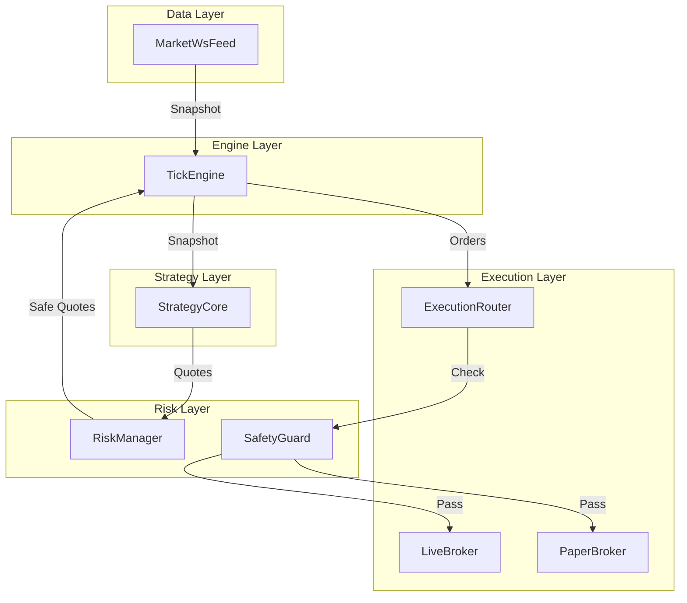

# PMM Project Review & Master Plan (Phase 2)

> **版本**：2026-02-11 Update
> **状态**：基础建设完成（文档/回测/录制），进入架构重构与实盘接入阶段。

---

## 1. 当前进展 (Progress)

| 模块 | 状态 | 说明 |
|------|------|------|
| **文档** | ✅ **Done** | `docs/` 下 5 份文档已重写，去除 AI 味，对齐 Polymarket 实战。 |
| **回测** | ✅ **Done** | 修复 0-fill bug (BBO-join)，修复初始仓位 bug，PnL 逻辑闭环。 |
| **工具** | ✅ **Done** | 新增 `pmm record` 实盘录制工具，打通“录制 → 回放”链路。 |
| **架构** | ⚠️ **ToDo** | `tick_loop.py` 仍是 948 行 God Class，需按分层架构拆解。 |
| **实盘** | ❌ **Missing** | 缺 `LiveBroker`，缺签名/安全层，API Key 管理需规范化。 |

---

## 2. 目标架构设计 (Architecture)

为了支撑多档报价、多市场并发和实盘交易，我们将项目从平铺结构重构为**分层架构**。

### 2.1 目录结构

```
pmm/
├── __init__.py
├── main.py                    # 启动入口 (Env loading -> Setup -> Run)
├── config.py                  # 配置定义 (PMMConfig)
│
├── core/                      # [纯计算层] 无副作用，易测试
│   ├── strategy_core.py       # 信号计算、报价生成 (原 tick_loop 逻辑)
│   ├── pricing.py             # 价格计算工具
│   └── models.py              # 数据结构 (Snapshot, Quote, Order)
│
├── data/                      # [数据层] 负责 I/O
│   ├── market_ws.py           # WebSocket 行情 (L2 Book)
│   ├── http_client.py         # REST Client
│   └── orderbook.py           # Orderbook 数据维护 (去 pandas 化)
│
├── risk/                      # [风控层] 独立于策略
│   ├── circuit_breaker.py     # 熔断器 (价格跳变检测)
│   └── safety_guard.py        # [NEW] 硬风控 (肥手指/额度限制)
│
├── execution/                 # [执行层] 统一接口
│   ├── broker_interface.py    # base class
│   ├── live_broker.py         # [NEW] 实盘交易 (带签名)
│   ├── paper_broker.py        # 模拟交易 (回测用)
│   └── order_manager.py       # 订单管理 (Diff/Deadband)
│
└── engine/                    # [编排层]
    └── tick_engine.py         # 主循环：Data -> Strategy -> Risk -> Execution
```

### 2.2 核心类交互图



---

## 3. 实盘接入与安全设计 (Live Trading Security)

实盘交易不仅仅是调 API，核心是**资金安全**。

### 3.1 安全防护层 (SafetyGuard)

在发出网络请求前，必须经过一层**本地硬风控**：

```python
class SafetyGuard:
    def validate_order(self, order) -> bool:
        # 1. 并没有在允许的 Token 白名单中
        if order.token_id not in ALLOWED_TOKENS: raise SecurityError()
        # 2. 单笔金额过大 (Fat finger)
        if order.size * order.price > MAX_ORDER_VALUE: raise RiskError()
        # 3. 价格极其离谱 (如 < 0.01 或 > 0.99)
        if not (0.01 <= order.price <= 0.99): raise LogicError()
        # 4. 累计日亏损超限
        if self.daily_loss > MAX_DAILY_LOSS: raise CircuitBreakerError()
        return True
```

### 3.2 API Key 管理

1.  **强制 Gitignore**：`.env` 必须在 `.gitignore` 中。
2.  **环境变量分级**：
    *   `api_key` / `api_secret`：仅在 `.env` (及生产环境 Secrets) 中配置。
    *   `PMM_DRY_RUN=true`：默认开启。在此模式下 `LiveBroker` 只打印 log 不发请求。
3.  **启动确认**：
    *   检测到 `EXECUTION_MODE=live` 且 `DRY_RUN=false` 时，启动脚本必须要求用户输入 `START LIVE TRADING` 确认。

---

## 4. 执行计划 (Execution Roadmap)

### Phase 1: 结构重构 (Refactoring)
- [ ] **建立目录**：按 2.1 结构创建文件夹，移动现有的 `pricing.py`, `config.py` 等。
- [ ] **拆解 tick_loop**：
    - 提取 `StrategyCore` (纯逻辑)。
    - 提取 `TickEngine` (主循环)。
    - 提取 `RiskManager` (熔断)。
- [ ] **单元测试**：为 `StrategyCore` 和 `RiskManager` 编写测试 (覆盖率 > 80%)。

### Phase 2: 实盘接入 (Live Integration)
- [ ] **实现 LiveBroker**：基于 `clob_client` 封装，实现 `place_order`, `cancel_order`。
- [ ] **实现 SafetyGuard**：硬编码风控规则，并在 `LiveBroker` 中调用。
- [ ] **配置管理**：完善 `.env` 加载逻辑，实现启动确认流程。
- [ ] **Dry-Run 验证**：在 Dry-Run 模式下跑通全流程，观察 Log 中的“虚拟下单”是否符合预期。

### Phase 3: 策略增强 (Strategy Enhancement)
- [ ] **多档报价**：`StrategyCore` 改为生成 Ladder Quotes (3-5 档)。
- [ ] **Fee 模型**：在回测中加入 Maker/Taker fee 扣除。
- [ ] **OFI 信号增强**：优化 Order Flow Imbalance 的计算和阈值。

---

## 5. 常见问题 (FAQ)

**Q: 为什么不直接在现有代码上加 Live Trading？**
A: `tick_loop.py` 耦合度太高，直接加会导致代码极难维护，且无法为实盘逻辑编写独立测试。重构是为了安全。

**Q: `key` 怎么传给程序？**
A: **严禁**硬编码在代码里。必须通过环境变量 (`os.getenv`) 读取。在服务器上通过 encrypted secrets 注入，在本地通过不提交的 `.env` 文件配置。

**Q: 现在的回测结果可信吗？**
A: 修复了 0-fill 和 BBO-join 后，回测逻辑已经自洽。但回测永远是近似，建议先用小资金实盘 (Live) 跑一段时间验证（"纸上得来终觉浅"）。
