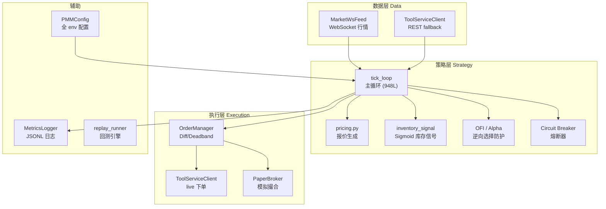
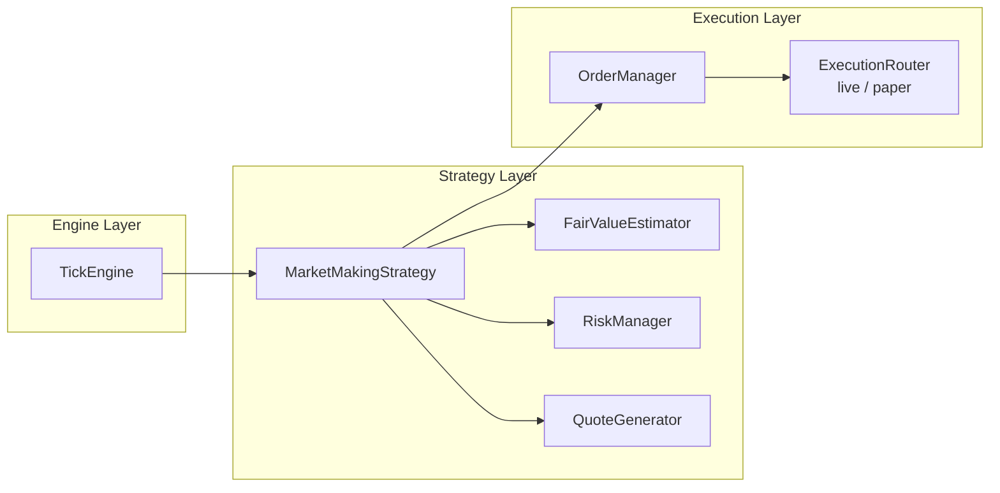

# PMM 做市策略 Code Review

> 对 `pmm/` 模块的**做市业务逻辑**与**技术架构**进行全面审查，给出具体优化建议和「简历项目」拓展方向。

---

## 1. 整体架构总览



| 模块 | 行数 | 职责 |
|------|------|------|
| [tick_loop.py](file:///Users/qiantang/projects/agent/pm_agents/pmm/tick_loop.py) | 948 | 主循环：数据拉取 → 信号计算 → 报价 → 挂撤单 → merge → 指标 |
| [config.py](file:///Users/qiantang/projects/agent/pm_agents/pmm/config.py) | 206 | 所有参数 env 加载 |
| [order_manager.py](file:///Users/qiantang/projects/agent/pm_agents/pmm/order_manager.py) | 128 | 订单 diff + deadband |
| [paper_broker.py](file:///Users/qiantang/projects/agent/pm_agents/pmm/paper_broker.py) | 363 | 纸盘撮合引擎 |
| [market_ws.py](file:///Users/qiantang/projects/agent/pm_agents/pmm/market_ws.py) | 211 | WS 行情 + 本地 L2 book |
| [pricing.py](file:///Users/qiantang/projects/agent/pm_agents/pmm/pricing.py) | 18 | quote 计算 |
| [orderbook.py](file:///Users/qiantang/projects/agent/pm_agents/pmm/orderbook.py) | 66 | orderbook 工具（依赖 pandas） |
| [replay_runner.py](file:///Users/qiantang/projects/agent/pm_agents/pmm/backtest/replay_runner.py) | 496 | 场景回测 |

---

## 2. 业务（做市策略）评审

### 2.1 ✅ 做得好的部分

| 特性 | 评价 |
|------|------|
| **Weighted Mid（微价格）** | 比简单 mid 更好地反映 thin book 上的买卖压力 |
| **Sigmoid 库存信号** | 非线性 skew 在仓位极端时加速去库存，比线性强 |
| **OFI + 参考市场动量阻断** | 对手盘方向防护，降低 adverse selection |
| **动态 spread = fee + profit + vol + inv** | 覆盖了做市盈利的核心成分 |
| **Deadband / Diff** | 避免每 tick 全撤全挂，保护队列优先级 |
| **Circuit breaker** | 异常行情防线，先活下来 |
| **Paper Trading + 回测** | 完整的仿真→验证→调参闭环 |
| **Auto merge 资金回收** | YES/NO → USDC 提高资本效率 |

### 2.2 ⚠️ 关键业务问题与优化建议

#### P0 — 直接影响盈亏

**1. 单档报价 → 多档报价（Multi-Level Quoting）**

当前每侧只挂 1 档。对小盘市场来说：
- **被一口吃穿**的概率极高，一个 taker 就清空你所有的 maker 流动性
- 不利于拿到更分散的成交价格

```diff
# 建议：在 config 里加 quote_levels: int = 3, level_size_decay: float = 0.5
# 第 i 档 price = base_price ± i * level_step
# 第 i 档 size  = base_size * (decay ^ i)
```

**2. Fee 模型缺失**

- `fee_spread_floor = 0.002` 是写死的常量，但 Polymarket 的 maker/taker fee 可能变化
- 没有在 PnL 计算中扣除费用 → **paper 回测偏乐观**
- 建议：在 `_apply_fill` 和 `equity` 计算中加入 fee 扣减

**3. 公允价值过于依赖当前 orderbook**

当前 fair value = weighted mid / simple mid，对小盘市场存在问题：
- 小盘 orderbook 流动性差，mid 容易被少量 size 拉偏
- 没有利用 **last trade price / VWAP / 外部信息** 做校准

建议扩展为 **Fair Value Aggregator**：
```
fair_value = w1 * weighted_mid + w2 * last_trade + w3 * reference_market_mid + w4 * model_prior
```

**4. 缺少事件时间维度**

Polymarket 是事件市场，临近结算时波动率会急剧放大。当前策略没有任何对"距离结算还有多久"的感知：
- 临近结算应大幅扩大 spread 或直接退出
- 反过来，距离结算很远时可以更激进

#### P1 — 风控 & 资本效率

**5. 仓位风控太粗**

- `max_position` 是硬上限，但没有 **方向性 exposure / 净值 drawdown 限制**
- 没有按「单市场已投入资金 / 总资金」的比例做限制
- 建议：加入 `max_exposure_pct`（单市场最大占总资金比例）和 `max_drawdown_pct`（触发强制撤单/减仓）

**6. Circuit Breaker 后恢复策略**

当前 `circuit_breaker_halt_on_trigger = True` 时直接退出。但对连续运行的做市商来说：
- 应有 cooldown 窗口后分阶段恢复
- 恢复时先以更宽 spread 试探性挂单

**7. Self-Trade 防护**

当你同时为 YES 和 NO 做市，bid/ask 有可能交叉导致自己吃自己。当前 `_anchor_quotes_to_book` 有 fallback，但没有**对跨 token 的 self-trade** 检测（YES bid + NO bid > 1.0 意味着你在亏钱做市）。

#### P2 — Alpha / 信息优势

**8. 外部信息源 = AI 最大卖点**

当前 `alpha_reference_token_ids` 只做简单动量。对简历上的 **AI + 量化** 定位来说，这些是最有价值的拓展：

| 信息源 | 用法 | 简历亮点 |
|--------|------|----------|
| **LLM 事件概率估计** | 用 GPT/Claude 读新闻，输出 P(YES)，作为 fair value prior | "AI-driven fair value estimation" |
| **新闻/推特情绪** | sentiment → 调整 skew direction | "NLP sentiment signal for adverse selection" |
| **跨市场 lead-lag** | 关联事件市场的价格变化领先你的市场 | "Cross-market alpha via lead-lag" |
| **链上大单监控** | Polymarket 链上 trade 大额成交 → 提前防守 | "On-chain signal integration" |

---

## 3. 技术架构评审

### 3.1 ⚠️ 核心问题：tick_loop.py 是 God Function

948 行的 `tick_loop()` 承担了所有职责：

```
数据拉取 → 账户快照 → 信号计算 → 报价生成 → 盘口锚定 →
挂撤单 → merge → 指标记录 → 循环控制
```

**问题**：
- 无法独立测试任何子流程
- 新增功能（如多档报价、多市场）要在 948 行里找位置改
- 回测 `replay_runner.py` 大量复制了 `tick_loop.py` 的逻辑（约 300 行重复）

**建议重构为分层架构**：



```python
# 核心接口拆分示意
class MarketMakingStrategy:
    def compute_signals(self, snapshot: MarketSnapshot) -> StrategySignals: ...
    def generate_quotes(self, signals: StrategySignals) -> list[QuoteTarget]: ...
    def should_block_side(self, signals: StrategySignals) -> dict[str, bool]: ...

class TickEngine:
    def __init__(self, strategy, data_feed, executor, risk_mgr): ...
    async def run(self): ...  # 只负责编排，不做计算
```

### 3.2 重复代码

| 位置 | 重复内容 | 建议 |
|------|----------|------|
| `tick_loop.py` 与 `replay_runner.py` | 信号计算 + 报价 + 挂撤单逻辑 ~300L | 抽取 `StrategyCore` |
| `_normalize_levels` | `tick_loop.py`、`orderbook.py`、`paper_broker.py` 各有一份 | 统一到 `orderbook.py` |
| `_to_float` / `_safe_float` | 至少 4 处不同实现 | 统一到 `utils.py` |

### 3.3 性能问题

**1. orderbook.py 依赖 pandas**

```python
def best_bid_ask(orderbook):
    dfs = orderbook_to_df(orderbook)  # 每次调用都创建 DataFrame!
```

每个 tick 对每个 token_id 调用 `best_bid_ask` + `spread`，都会创建 2 个 DataFrame。在 2s tick 周期下不明显，但：
- 如果降到 100ms 级别（目标应该是这个），GC 压力会很大
- `tick_loop.py` 里的 `_best_level` 其实已经用 list 实现了同样的功能

**建议**：去掉 `orderbook.py` 的 pandas 依赖，用纯 list 操作。

**2. 每 tick 全量拉取 open orders**

```python
balance_raw, open_orders_raw, positions_raw = await asyncio.gather(
    get_balance(), get_orders(), get_positions(token_ids),
)
```

对 live 模式，每 tick 3 个 REST 请求。应优先接入 **User WebSocket**（订单/余额推送），本地维护状态。

### 3.4 可观测性

当前只有 `print` + `metrics.jsonl`：
- 没有结构化 logging（`import logging`）
- 没有 log level 区分
- 没有 Prometheus / 告警

> [!IMPORTANT]
> 建议至少替换 `print` 为 `logging.getLogger(__name__)`，并加入 JSON 格式化器，方便后续接 ELK/Grafana。

### 3.5 测试覆盖

当前 `tests/test.py` 只有 674 字节，基本无覆盖。关键需要：

| 优先级 | 测试对象 | 类型 |
|--------|----------|------|
| P0 | `compute_quotes` / `_required_spread` / `_inventory_signal` | 单元测试 |
| P0 | `OrderManager.diff` 各种场景 | 单元测试 |
| P0 | `PaperBroker` 成交 / 资金冻结 / merge/split | 集成测试 |
| P1 | `_anchor_quotes_to_book` 边界条件 | 单元测试 |
| P1 | 完整 tick 策略在 scenario replay 下的表现 | 回归测试 |

---

## 4. 简历项目拓展路线图

> 核心目标：在小盘 Polymarket 市场盈利 + 体现量化/AI 能力

### Phase 1：夯实基础（1-2 周）
- [ ] 重构 `tick_loop.py` → `TickEngine` + `Strategy` + `RiskManager`
- [ ] 加入 fee 模型，修正 paper PnL
- [ ] 多档报价（3-5 档梯度），降低被 taker 一口吃穿
- [ ] 补充核心单元测试（coverage > 80%）
- [ ] 结构化 logging + Prometheus 指标

**简历关键词**：*Event-driven market-making engine, multi-level quoting, risk-aware order management*

### Phase 2：AI Alpha 集成（2-4 周）
- [ ] **LLM Fair Value Estimator**：用大模型读事件描述 + 新闻 → 输出 P(YES)
- [ ] **Fair Value Aggregator**：加权融合 weighted_mid + LLM prior + reference market
- [ ] **Sentiment Signal**：接入新闻/社交媒体的情绪分析
- [ ] 基于历史 metrics 的 **参数自动调优**（Bayesian optimization / grid search）

**简历关键词**：*LLM-augmented fair value estimation, multi-source alpha fusion, automated parameter optimization*

### Phase 3：多市场 & 生产化（4-8 周）
- [ ] 多市场并行做市（每市场独立策略实例 + 全局资金调度）
- [ ] **Market Scanner**：自动扫描适合做市的小盘市场（流动性 / spread / 事件热度）
- [ ] Crash-safe checkpoint（状态落盘 + 恢复）
- [ ] 告警系统（PnL 急变、断线、错误率）
- [ ] 接入 User WS（替代 REST 轮询）

**简历关键词**：*Multi-market portfolio management, autonomous market selection, production-grade fault tolerance*

### Phase 4：差异化竞争力
- [ ] **链上分析**：解析 Polymarket CTF 链上交易，识别 informed flow
- [ ] **事件时间建模**：根据距离结算时间自动调整 risk appetite
- [ ] **Reinforcement Learning agent**：用 paper broker 环境做 RL 训练 → 替代固定参数

**简历关键词**：*On-chain analytics, RL-based dynamic strategy adaptation*

---

## 5. 对「小盘做市盈利」的具体建议

小盘市场的特点：**流动性差、spread 大、被 informed trader 点杀风险高**。

| 策略建议 | 原因 |
|----------|------|
| **更宽 base_spread（0.06-0.10）** | 小盘 spread 本来就大，你不需要和 0.01 的市场竞争 |
| **更小 base_size（2-3）** | 减少单次被吃的敞口 |
| **更高 alpha_ofi_imbalance_threshold** | 小盘 OFI 天然不平衡，阈值太低会频繁 block |
| **开启 enforce_inventory_for_sell** | 小盘不适合裸卖 |
| **用 LLM 做 fair value anchor** | 小盘 orderbook 不可信，模型定价更稳 |
| **筛选到期时间 > 7天的市场** | 太近的结算波动太大 |
| **利用 merge 优势** | 同时做 YES/NO 做市 → 频繁 merge 回收资金 |
