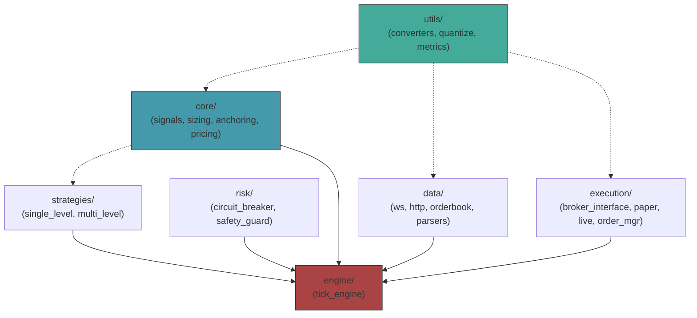

# PMM 项目 Code Review & 结构优化方案

> **日期**: 2026-02-12
> **范围**: `pmm/` 全模块 (23 个 Python 文件, 4602 行)

---

## 1. 现状盘点

### 1.1 文件清单与行数

| 文件 | 行数 | 职责 | 层级归属 |
|------|------|------|----------|
| [tick_loop.py](file:///Users/qiantang/projects/agent/pm_agents/pmm/tick_loop.py) | **1013** | 主循环 + 全部信号/量化/解析函数 | Engine + Strategy (混杂) |
| [replay_runner.py](file:///Users/qiantang/projects/agent/pm_agents/pmm/backtest/replay_runner.py) | 769 | 场景回放 | Backtest |
| [paper_broker.py](file:///Users/qiantang/projects/agent/pm_agents/pmm/paper_broker.py) | 425 | 模拟撮合 | Execution |
| [scenario_generator.py](file:///Users/qiantang/projects/agent/pm_agents/pmm/backtest/scenario_generator.py) | 322 | 场景生成 | Backtest |
| [recorder.py](file:///Users/qiantang/projects/agent/pm_agents/pmm/backtest/recorder.py) | 317 | 实盘录制 | Backtest |
| [plotter.py](file:///Users/qiantang/projects/agent/pm_agents/pmm/backtest/plotter.py) | 315 | 回测绘图 | Backtest |
| [config.py](file:///Users/qiantang/projects/agent/pm_agents/pmm/config.py) | 249 | 配置加载 | Infra |
| [order_manager.py](file:///Users/qiantang/projects/agent/pm_agents/pmm/order_manager.py) | 238 | 订单 Diff / Deadband | Execution |
| [scenario_validator.py](file:///Users/qiantang/projects/agent/pm_agents/pmm/backtest/scenario_validator.py) | 220 | 场景验证 | Backtest |
| [market_ws.py](file:///Users/qiantang/projects/agent/pm_agents/pmm/market_ws.py) | 210 | WebSocket 行情 | Data |
| [http_client.py](file:///Users/qiantang/projects/agent/pm_agents/pmm/http_client.py) | 113 | REST Client | Data |
| [multi_level_v1.py](file:///Users/qiantang/projects/agent/pm_agents/pmm/strategies/multi_level_v1.py) | 109 | 多档策略 | Strategy |
| [single_level_v1.py](file:///Users/qiantang/projects/agent/pm_agents/pmm/strategies/single_level_v1.py) | 80 | 单档策略 | Strategy |
| [orderbook.py](file:///Users/qiantang/projects/agent/pm_agents/pmm/orderbook.py) | 65 | Orderbook 工具 | Data |
| [quantize.py](file:///Users/qiantang/projects/agent/pm_agents/pmm/quantize.py) | 41 | 价格量化 | Utils |
| [strategy_base.py](file:///Users/qiantang/projects/agent/pm_agents/pmm/strategy_base.py) | 40 | 策略基类 + 数据结构 | Strategy |
| [strategy_registry.py](file:///Users/qiantang/projects/agent/pm_agents/pmm/strategy_registry.py) | 20 | 策略注册 | Strategy |
| [pricing.py](file:///Users/qiantang/projects/agent/pm_agents/pmm/pricing.py) | 17 | 报价公式 | Strategy |
| [metrics.py](file:///Users/qiantang/projects/agent/pm_agents/pmm/metrics.py) | 18 | 日志 | Utils |
| [main.py](file:///Users/qiantang/projects/agent/pm_agents/pmm/main.py) | 13 | 入口 | Infra |

### 1.2 ✅ 做得好的部分

| 进展 | 说明 |
|------|------|
| **Strategy Protocol** | `strategy_base.py` 定义了 `MarketMakingStrategy` Protocol + `QuoteTarget` / `StrategyQuoteInput`，策略已可插拔 |
| **多档报价** | `multi_level_v1.py` 实现了梯度报价，`order_manager.py` 实现了 `diff_multi` |
| **回测工具链** | 录制 (`recorder.py`) + 生成 (`scenario_generator.py`) + 验证 (`scenario_validator.py`) + 回放 (`replay_runner.py`) + 绘图 (`plotter.py`) 全链路打通 |
| **BBO-join 撮合** | `paper_broker.py` 支持 trade_flow 驱动的 BBO fill |
| **文档** | 5 份文档已重写，策略/回测/架构有据可查 |

---

## 2. 核心问题

### 2.1 ⚠️ 目录结构扁平

当前 `pmm/` 下 14 个 Python 文件平铺，`strategies/` 和 `backtest/` 虽然分出了子目录，但 **数据层、执行层、风控层全混在根目录**：

```
pmm/
├── config.py          ← Infra
├── http_client.py     ← Data
├── market_ws.py       ← Data
├── orderbook.py       ← Data
├── paper_broker.py    ← Execution
├── order_manager.py   ← Execution
├── tick_loop.py       ← Engine + Strategy (混杂)
├── pricing.py         ← Strategy
├── quantize.py        ← Utils
├── metrics.py         ← Utils
├── strategy_base.py   ← Strategy
├── strategy_registry.py ← Strategy
├── main.py            ← Infra
└── __init__.py
```

**问题**：
- 新人打开 `pmm/` 目录，无法快速判断各文件的层级关系
- 数据层和执行层混在一起，想换数据源或执行方式时不知道改哪里
- 想复用 `orderbook.py` 或 `quantize.py` 到别的项目时，它们依赖关系不清

---

### 2.2 ⚠️ 代码重复 (DRY 违规)

| 函数 | 出现位置 | 说明 |
|------|----------|------|
| `_to_float` | `tick_loop.py`, `order_manager.py`, `market_ws.py`, `paper_broker.py`, `recorder.py`, `scenario_validator.py` | **6 个独立实现**，逻辑完全相同 |
| `_normalize_levels` | `tick_loop.py`, `orderbook.py`, `scenario_validator.py`, `market_ws.py` | **4 个版本**，接口略有差异 |
| `_safe_float` | `tick_loop.py` | 与 `_to_float` 功能相同但名字不同 |

> [!WARNING]
> 如果其中一个 `_to_float` 修复了 edge case（比如处理 `"NaN"` 字符串），其他 5 个不会自动同步。

---

### 2.3 🔴 tick_loop.py 仍是 God Function

`tick_loop()` 函数体从第 325 行到第 1013 行 (**688 行**)，包含：

```
数据拉取 → 账户解析 → 信号计算 → 报价生成 → 盘口锚定 →
量化 → 挂撤单 → merge → 指标记录 → 循环控制
```

**当前已提取到外部的**：
- `strategies/` — 报价生成（`generate_quotes`）
- `order_manager.py` — 订单 Diff
- `pricing.py` — 基础报价公式

**仍留在 tick_loop.py 内的**（应提取）：

| 函数 | 行数 | 建议归属 |
|------|------|----------|
| `_weighted_mid`, `_fair_mid` | 81-100 | `core/signals.py` |
| `_depth_near_mid`, `_order_flow_imbalance` | 103-126 | `core/signals.py` |
| `_realized_vol`, `_momentum` | 129-152 | `core/signals.py` |
| `_inventory_signal` | 165-185 | `core/signals.py` |
| `_required_spread` | 155-161 | `core/signals.py` |
| `_target_sizes` | 188-202 | `core/sizing.py` |
| `_anchor_quotes_to_book` | 205-237 | `core/anchoring.py` |
| `_quantize_quote_pair` / `_quantize_price_dict` / `_quantize_quote_dict` | 240-280 | `utils/quantize.py`（合并现有） |
| `_safe_float`, `_safe_int`, `_normalize_levels`, `_best_level` | 38-77 | `utils/converters.py` |
| `_mid_from_market`, `_parse_partition`, `_parse_account_state` | 23-308 | `data/parsers.py` |
| `_pending_credit_total` | 312-322 | `engine/tick_engine.py`（保留） |

---

### 2.4 ❌ 缺失模块

| 模块 | 状态 | 影响 |
|------|------|------|
| **LiveBroker** | 未实现 | 无法实盘交易 |
| **SafetyGuard** (硬风控) | 未实现 | 实盘无安全防护 |
| **统一工具函数** (`utils/`) | 6 份重复代码 | 维护 bug 风险 |
| **结构化 Logging** | 全局用 `print` | 无法分级/过滤/接告警 |
| **BrokerInterface** (抽象基类) | 未实现 | Paper/Live 接口不统一，`replay_runner` 硬耦合 `PaperBroker` |
| **AccountSnapshot 数据结构** | 未实现 | 账户状态用 raw dict 传递，类型不安全 |

---

## 3. 结构优化方案

### 3.1 目标目录

```
pmm/
├── __init__.py
├── main.py                         # 入口 (不变)
├── config.py                       # 配置 (不变)
│
├── core/                           # 纯计算层 — 无 I/O, 无副作用, 易测试
│   ├── __init__.py
│   ├── strategy_base.py            # ← 移入 (原 pmm/strategy_base.py)
│   ├── strategy_registry.py        # ← 移入 (原 pmm/strategy_registry.py)
│   ├── pricing.py                  # ← 移入 (原 pmm/pricing.py)
│   ├── signals.py                  # [NEW] 从 tick_loop 提取信号函数
│   ├── sizing.py                   # [NEW] 从 tick_loop 提取 _target_sizes
│   └── anchoring.py                # [NEW] 从 tick_loop 提取 _anchor_quotes_to_book
│
├── strategies/                     # 具体策略实现 (不变)
│   ├── __init__.py
│   ├── single_level_v1.py
│   └── multi_level_v1.py
│
├── data/                           # 数据层 — 负责 I/O
│   ├── __init__.py
│   ├── http_client.py              # ← 移入
│   ├── market_ws.py                # ← 移入
│   ├── orderbook.py                # ← 移入 (去 pandas)
│   └── parsers.py                  # [NEW] 从 tick_loop 提取 _parse_account_state 等
│
├── execution/                      # 执行层
│   ├── __init__.py
│   ├── broker_interface.py         # [NEW] 抽象基类
│   ├── paper_broker.py             # ← 移入
│   ├── live_broker.py              # [NEW] 实盘交易
│   └── order_manager.py            # ← 移入
│
├── risk/                           # 风控层 — 独立于策略
│   ├── __init__.py
│   ├── circuit_breaker.py          # [NEW] 从 tick_loop 提取
│   └── safety_guard.py             # [NEW] 硬风控 (Fat finger / 额度 / 白名单)
│
├── engine/                         # 编排层
│   ├── __init__.py
│   └── tick_engine.py              # ← 重构 tick_loop.py (只留编排逻辑)
│
├── utils/                          # 工具层 — 可跨项目复用
│   ├── __init__.py
│   ├── converters.py               # [NEW] _to_float / _safe_int / _normalize_levels
│   ├── quantize.py                 # ← 移入 + 合并 tick_loop 里的量化函数
│   └── metrics.py                  # ← 移入 + 升级为 logging
│
├── backtest/                       # 回测模块 (不变)
│   ├── __init__.py
│   ├── recorder.py
│   ├── replay_runner.py
│   ├── scenario_generator.py
│   ├── scenario_validator.py
│   └── plotter.py
│
└── docs/
    └── ...
```

### 3.2 分层依赖规则



**约束**：
- `utils/` 不依赖任何 `pmm` 模块（可直接拷到其他项目）
- `core/` 只依赖 `utils/` 和 `config`
- `data/` 只依赖 `utils/` 和 `config`
- `execution/` 依赖 `utils/`
- `engine/` 是唯一的"胶水层"，组装所有模块

---

## 4. 缺失模块详细设计

### 4.1 `utils/converters.py` — 消灭 6 份重复代码

```python
"""统一类型转换和数据规范化函数，全项目唯一入口。"""

def to_float(value: Any, default: float = 0.0) -> float:
    try:
        return float(value)
    except Exception:
        return default

def to_int(value: Any, default: int = 0) -> int:
    try:
        return int(value)
    except Exception:
        return default

def normalize_levels(levels: Any) -> list[tuple[float, float]]:
    """将 [{price, size}] 或 [[px, sz]] 统一为 [(px, sz)] 格式。"""
    ...
```

**迁移清单**：
- `tick_loop.py` → 删除 `_safe_float`, `_safe_int`, `_normalize_levels`, `_best_level`
- `order_manager.py` → 删除 `_to_float`
- `paper_broker.py` → 删除 `_to_float`, `_normalize_level`
- `market_ws.py` → 删除 `_to_float`
- `recorder.py` → 删除 `_to_float`
- `scenario_validator.py` → 删除 `_to_float`, `_normalize_levels`
- 上述文件统一 `from pmm.utils.converters import to_float, normalize_levels`

---

### 4.2 `core/signals.py` — 策略信号提取

```python
"""无状态信号计算函数，输入 orderbook / 价格历史，输出信号值。"""

def weighted_mid(orderbook: dict) -> float: ...
def fair_mid(orderbook: dict, mode: str) -> float: ...
def depth_near_mid(orderbook: dict, delta: float) -> dict: ...
def order_flow_imbalance(orderbook: dict, delta: float) -> float: ...
def realized_vol(hist: deque[float]) -> float: ...
def momentum(hist: deque[float], min_points: int) -> float: ...
def inventory_signal(token_id, token_ids, positions, max_pos, k) -> float: ...
def required_spread(config, rv, inv_signal) -> float: ...
```

**收益**：
- 策略函数可独立单元测试（不需要 mock 整个 tick_loop）
- `replay_runner.py` 可直接复用，消除 ~200 行重复

---

### 4.3 `execution/broker_interface.py` — 统一 Broker 接口

```python
from abc import ABC, abstractmethod

class BrokerInterface(ABC):
    @abstractmethod
    async def get_balance(self) -> dict: ...

    @abstractmethod
    async def get_positions(self, token_ids: list[str]) -> dict: ...

    @abstractmethod
    async def get_open_orders(self) -> list[dict]: ...

    @abstractmethod
    async def place_limit_order(self, token_id, price, size, side) -> dict: ...

    @abstractmethod
    async def cancel_order(self, order_id: str) -> dict: ...

    @abstractmethod
    async def cancel_orders(self, order_ids: list[str]) -> dict: ...

    @abstractmethod
    async def merge_pair(self, yes_id, no_id, amount) -> dict: ...
```

**收益**：
- `PaperBroker` 和 `LiveBroker` 实现同一接口
- `tick_engine.py` 不关心底层是模拟还是实盘 ==> 一套引擎代码同时支持 paper / live / replay

---

### 4.4 `execution/live_broker.py` — 实盘交易

```python
class LiveBroker(BrokerInterface):
    def __init__(self, http_client, safety_guard, dry_run=True):
        self.client = http_client
        self.guard = safety_guard
        self.dry_run = dry_run

    async def place_limit_order(self, token_id, price, size, side):
        # Step 1: SafetyGuard 硬风控
        self.guard.validate_order(token_id, price, size, side)

        # Step 2: Dry-run 模式
        if self.dry_run:
            return {"order_id": f"dry_{time.time()}", "status": "simulated"}

        # Step 3: 签名 + 发单
        return await self.client.place_order(...)
```

---

### 4.5 `risk/safety_guard.py` — 发单前硬风控

```python
class SafetyGuard:
    def __init__(self, allowed_tokens, max_order_value, max_position, max_daily_loss):
        ...

    def validate_order(self, token_id, price, size, side) -> None:
        """不通过直接 raise，确保永远无法绕过。"""
        if token_id not in self.allowed_tokens:
            raise SecurityError(f"token {token_id} not whitelisted")
        if size * price > self.max_order_value:
            raise RiskError(f"order value {size*price:.2f} > max {self.max_order_value}")
        if price <= 0.01 or price >= 0.99:
            raise RiskError(f"price {price} out of [0.01, 0.99]")
```

---

### 4.6 `risk/circuit_breaker.py` — 熔断器提取

从 `tick_loop.py` 内联代码提取为独立类：

```python
class CircuitBreaker:
    def __init__(self, threshold, halt_on_trigger):
        ...

    def check(self, mid_history: dict, current_mids: dict) -> CBResult:
        """检测价格异常跳变，返回是否触发及原因。"""
        ...
```

---

### 4.7 `utils/metrics.py` — 结构化日志

```python
import logging
import json

class MetricsLogger:
    def __init__(self, log_file, level=logging.INFO):
        self.logger = logging.getLogger("pmm.metrics")
        # JSON formatter → 方便接 ELK/Grafana
        ...

    def log_tick(self, tick_data: dict):
        self.logger.info(json.dumps(tick_data))
```

---

## 5. 执行计划

### PR 1: 基础设施（行为不变）

| # | 任务 | 预计改动 |
|---|------|----------|
| 1 | 创建 `utils/converters.py`，统一 `to_float` / `normalize_levels` | 新建 1 文件，改 6 文件 |
| 2 | 移动 `quantize.py` → `utils/quantize.py` | git mv + 改 import |
| 3 | 移动 `metrics.py` → `utils/metrics.py` | git mv + 改 import |
| 4 | 创建 `data/` 目录，移入 `http_client.py`, `market_ws.py`, `orderbook.py` | git mv + 改 import |
| 5 | 创建 `core/` 目录，移入 `strategy_base.py`, `strategy_registry.py`, `pricing.py` | git mv + 改 import |
| 6 | 创建 `execution/` 目录，移入 `paper_broker.py`, `order_manager.py` | git mv + 改 import |
| 7 | 全量回归：`pmm_backtest.py run-all` 结果与重构前一致 | 验证 |

### PR 2: tick_loop 拆解（行为不变）

| # | 任务 | 预计改动 |
|---|------|----------|
| 1 | 新建 `core/signals.py`，提取信号函数 | 新建 1 文件，tick_loop 删 ~120 行 |
| 2 | 新建 `core/sizing.py`，提取 `_target_sizes` | 新建 1 文件 |
| 3 | 新建 `core/anchoring.py`，提取 `_anchor_quotes_to_book` | 新建 1 文件 |
| 4 | 新建 `data/parsers.py`，提取解析函数 | 新建 1 文件 |
| 5 | 新建 `risk/circuit_breaker.py` | 新建 1 文件 |
| 6 | 合并量化函数到 `utils/quantize.py` | 改 1 文件 |
| 7 | 重构 `tick_loop.py` → `engine/tick_engine.py` | 从 1013 → ~250 行 |
| 8 | 重构 `replay_runner.py` 复用 `core/signals.py` | 减少 ~200 行重复 |
| 9 | 补充单元测试：`core/signals.py`, `risk/circuit_breaker.py` | 新建测试文件 |

### PR 3: 实盘接入

| # | 任务 | 预计改动 |
|---|------|----------|
| 1 | 新建 `execution/broker_interface.py` | 抽象基类 |
| 2 | 让 `PaperBroker` 实现 `BrokerInterface` | 少量改动 |
| 3 | 新建 `execution/live_broker.py` | 实盘下单 |
| 4 | 新建 `risk/safety_guard.py` | 硬风控 |
| 5 | 配置管理：`.env` 分级, Dry-run 默认开启, 启动确认 | 改 `config.py` + `main.py` |
| 6 | Dry-run 冒烟测试 | 验证 |

---

## 6. 可复用模块标记

以下模块设计为**零耦合**，可直接复制到其他量化项目：

| 模块 | 复用场景 |
|------|----------|
| `utils/converters.py` | 任何需要 safe parsing 的项目 |
| `utils/quantize.py` | 任何有 tick grid 的交易项目 |
| `core/signals.py` | 其他做市/量化策略 |
| `execution/broker_interface.py` | 任何需要 Paper/Live 切换的交易系统 |
| `risk/safety_guard.py` | 任何需要发单前风控的系统 |
| `backtest/scenario_validator.py` | 数据验证，可用于 CI |
