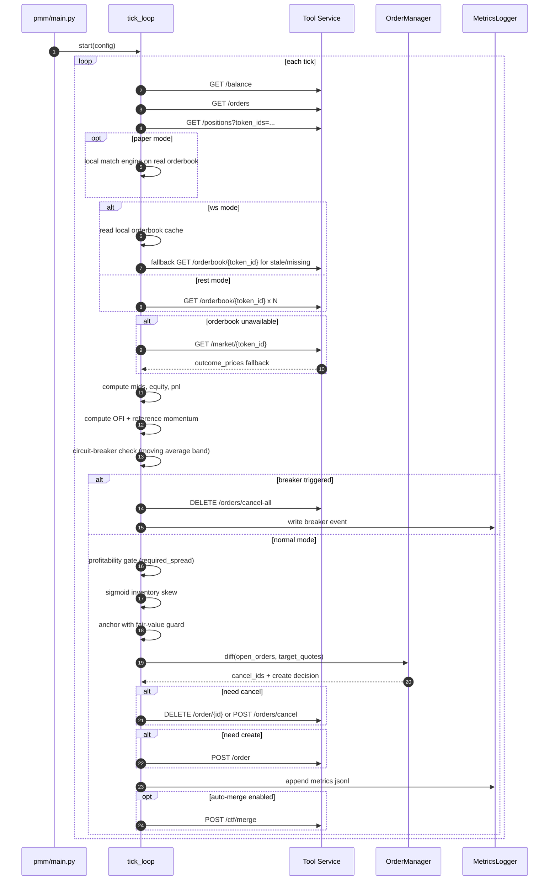

# PMM Main Flow (Current Snapshot)

本文档保留为“主链路速览”。更详细内容请看：
- 策略文档：`pmm/docs/STRATEGY_PLAYBOOK.md`
- 代码走读：`pmm/docs/CODE_IMPLEMENTATION.md`

## Tick 主流程

1. 拉取状态：`balance + orders + positions + orderbook`
  - 执行层可选：
  - `live`：真实下单和真实账户
  - `paper`：本地虚拟账户和本地撮合
  - `orderbook` 支持两种模式：
  - `rest`：每 tick 拉取
  - `ws`：本地盘口缓存，订阅 `market` 频道（含 `detail_level`），缺失/过期时回退 REST
2. 计算 `mid/spread/equity/pnl`
  - `mid` 支持 `PMM_MID_PRICE_MODE`：
  - `weighted`（默认，微观价格近似）
  - `midpoint`（`(best_bid + best_ask)/2`）
3. 计算 Alpha 信号：
- OFI（订单流不平衡，基于盘口近端深度）
- 参考市场动量（`PMM_ALPHA_REFERENCE_TOKEN_IDS`）
4. Circuit Breaker 检查：
- 以近 `window_sec` 的移动均价为基准，若偏离超阈值，触发 `cancel_all` 并停止或暂停
5. 入场盈利性检查：
- 计算 `required_spread = fee + target_profit + vol_risk + inventory_risk`
- 若自然盘口过薄（`natural_spread < min_profitability`）则该侧撤单并休眠
6. 报价计算：
- 非线性库存 skew（sigmoid）
- 动态 spread（非固定 spread）
- 理论价 -> 盘口锚定（`join_epsilon`）
- 公允价值边界保护（`min_edge`），防止无限追单
7. Diffing 执行：
- 撤销无效订单
- 仅在需要时创建新单
8. 写入 `metrics.jsonl`
9. （可选）自动资金回收：
- 按配置周期执行 YES/NO `merge`，把配对仓位释放回 USDC
  - 可启用 `merge pending credit`，在链上确认前给 sizing 一笔临时在途资金

## 时序图（Mermaid）

