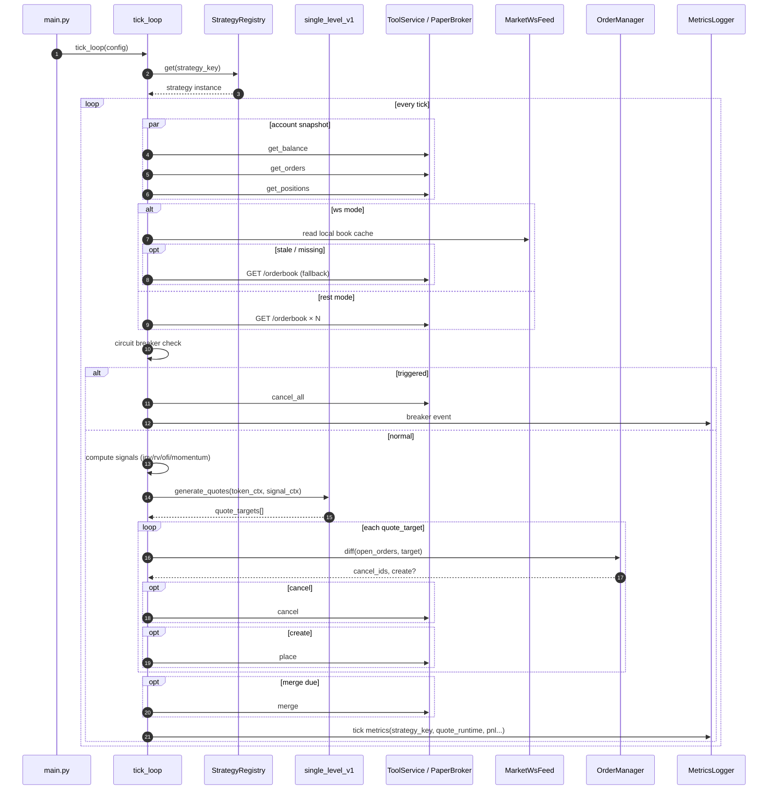

# Main Flow

主循环的时序图和关键路径。更详细的策略逻辑见 [STRATEGY_PLAYBOOK.md](STRATEGY_PLAYBOOK.md)，代码走读见 [CODE_IMPLEMENTATION.md](CODE_IMPLEMENTATION.md)。

## Tick 生命周期

```
┌─────────────────────────────────────────────────────┐
│ 1. Fetch Account State                              │
│    balance + open_orders + positions                 │
│    (live → REST API / paper → local memory)          │
├─────────────────────────────────────────────────────┤
│ 2. Fetch Market Data                                │
│    ws → local L2 cache (fallback REST if stale)      │
│    rest → GET /orderbook/{token_id}                  │
│    → compute mid, spread, book_tops                  │
├─────────────────────────────────────────────────────┤
│ 3. Circuit Breaker                                  │
│    |mid - MA(mid)| / MA(mid) ≥ threshold?            │
│    yes → cancel_all, halt / cooldown                 │
├─────────────────────────────────────────────────────┤
│ 4. Signal Stack (per token)                         │
│    inventory_signal → realized_vol → required_spread │
│    → OFI / momentum → side block decision            │
├─────────────────────────────────────────────────────┤
│ 5. Strategy Routing + Quote Generation              │
│    strategy_key → StrategyRegistry → strategy impl   │
│    single_level_v1: compute → anchor → quantize      │
├─────────────────────────────────────────────────────┤
│ 6. Execution                                        │
│    diff(open_orders, target) → cancel + place        │
├─────────────────────────────────────────────────────┤
│ 7. Auto Merge (periodic)                            │
│    min(yes_pos, no_pos) ≥ threshold → merge → USDC   │
├─────────────────────────────────────────────────────┤
│ 8. Metrics                                          │
│    strategy_key + quote_runtime + pnl/signals        │
│    → append to metrics.jsonl                         │
└─────────────────────────────────────────────────────┘
        │
        ▼ sleep(tick_interval_sec) → repeat
```

## 时序图


